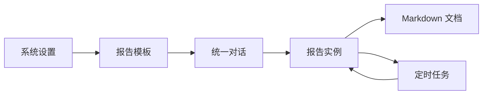

# ReportSystemV2

智能报告系统，一个以**报告生成**为主能力、同时集成**智能问数**与**智能故障**的统一智能助手平台。系统提供统一对话入口，支持从模板设计、参数收集、大纲确认、报告生成，到 Markdown 文档导出的完整链路。

## 1. 项目概览

当前项目围绕四条主线展开：

- `报告模板`：定义参数、章节蓝图、执行链路
- `统一对话`：承接报告生成、智能问数、智能故障三类任务
- `报告实例`：保存确认大纲、生成基线、章节内容和调试信息
- `定时任务`：基于已有报告实例周期性生成新实例和文档

系统对外的典型业务链路是：



## 2. 当前核心能力

### 2.1 报告生成

- 模板匹配
- 参数收集与确认
- 大纲确认
- 章节级内容生成
- Markdown 文档导出

### 2.2 统一对话

- 同一入口支持三类一级能力：
  - `report_generation`
  - `smart_query`
  - `fault_diagnosis`
- 单活任务模型：一个会话同一时刻只有一个活动任务
- 会话历史、消息级 fork、基于报告实例的更新会话

### 2.3 模板双层模型

每个章节节点同时维护两层定义：

- 用户层：`outline.document + outline.blocks[]`
- 系统层：`content.datasets + presentation`

这意味着：

- 用户在模板工作台和大纲确认里主要面向蓝图操作
- 系统在实例生成时主要面向执行链路运行
- 两层在章节节点内显式对应，不是互相替代

### 2.4 定时任务

- 从已有报告实例创建定时任务
- 支持一次性与周期性调度
- 支持把计划执行时间写回实例输入参数
- 支持把计划执行时间写入实例 `report_time`

### 2.5 样例数据与真实查询链路

- 内置独立的电信领域样例分析库 `telecom_demo.db`
- 报告生成中的查询链路已支持实验性 `NL -> QuerySpec -> Ibis -> SQL -> SQLite`

## 3. 技术栈

### 前端

- React 18
- TypeScript
- Vite
- React Router
- TanStack Query

### 后端

- FastAPI
- SQLAlchemy
- Pydantic
- APScheduler
- HTTPX
- Ibis + SQLite

### 数据

- 系统主库：`src/backend/report_system.db`
- 电信样例分析库：`src/backend/telecom_demo.db`

## 4. 仓库结构

```text
ReportSystemV2/
├─ design/                 设计、规格、故事、部署手册
├─ docs/                   方案记录、演示材料等补充文档
├─ src/
│  ├─ backend/             FastAPI、领域服务、路由、数据库、测试
│  └─ frontend/            React + Vite 前端工程
├─ migrate_db.py           数据库迁移脚本
├─ migrate_submitter.py    迁移辅助脚本
└─ README.md               项目总览
```

## 5. 快速启动

### 5.1 环境要求

- Python 3.11+
- Node.js 18+
- npm

### 5.2 安装依赖

后端：

```powershell
python -m pip install -r src/backend/requirements.txt
```

前端：

```powershell
Set-Location src/frontend
npm install
```

### 5.3 构建前端

```powershell
Set-Location src/frontend
npm run build
```

### 5.4 启动服务

在仓库根目录执行：

```powershell
python -m uvicorn src.backend.main:app --host 0.0.0.0 --port 8300
```

默认访问地址：

- 应用首页：[http://127.0.0.1:8300](http://127.0.0.1:8300)
- OpenAPI：[http://127.0.0.1:8300/openapi.json](http://127.0.0.1:8300/openapi.json)

更完整的安装、部署、远程访问和常见问题，请看：

- [design/deployment_guide.md](design/deployment_guide.md)

## 6. 详细文档导航

### 总体与模块设计

- [整体设计](design/design.md)
- [DFX 接口治理](design/design_dfx.md)
- [对话模块设计](design/design_chat.md)
- [模板设计](design/design_template.md)
- [实例与文档设计](design/design_instance.md)
- [定时任务设计](design/design_scheduler.md)
- [API 设计](design/design_api.md)

### 产品与需求

- [规格文档](design/spec.md)
- [用户故事](design/story.md)
- [原始需求与按日演进记录](design/biz_requirement.md)

### 部署与示例

- [安装部署手册与 QA](design/deployment_guide.md)
- [报告示例](design/report_sample.md)
- [电信样例库 ER 说明](src/backend/generated_documents/telecom_demo_schema_er.md)

### 设计与实现过程记录

- [docs/plans/](docs/plans)  
  记录各阶段的设计说明和 implementation plan，适合追溯某次改动为什么这样做。

## 7. 当前实现边界

当前版本已经可用，但还有明确边界：

- 文档导出当前以 Markdown 为主，暂未完成 PDF 导出
- 统一对话模块当前采用单活任务模型，不支持任务栈与挂起恢复
- 定时任务当前只支持“从已有报告实例创建”
- 智能问数与智能故障已经接入统一对话，但仍在持续增强结果展示和证据链

更完整的“已实现规格 / 当前约束 / 待支持特性”，请看：

- [design/spec.md](design/spec.md)

## 8. 开发与验证

### 前端测试

```powershell
Set-Location src/frontend
npm test
```

### 前端构建验证

```powershell
Set-Location src/frontend
npm run build
```

### 后端测试

在仓库根目录执行：

```powershell
$env:PYTHONPATH='src'
python -m unittest discover -s src/backend/tests -p "test_*.py" -t .
```

## 9. 推荐阅读顺序

如果你是第一次接触这个项目，建议按这个顺序阅读：

1. [README.md](README.md)
2. [整体设计](design/design.md)
3. [规格文档](design/spec.md)
4. 根据关注点深入阅读：
   - DFX： [design_dfx.md](design/design_dfx.md)
   - 对话： [design_chat.md](design/design_chat.md)
   - 模板： [design_template.md](design/design_template.md)
   - 实例： [design_instance.md](design/design_instance.md)
   - 调度： [design_scheduler.md](design/design_scheduler.md)
   - 接口： [design_api.md](design/design_api.md)

## 10. 备注

本项目当前采用“文档与代码同步演进”的方式维护：

- `design/` 是当前系统设计与规格基线
- `docs/plans/` 是阶段性设计和实施记录
- 代码实现以主干 `master` 为准

如果你只是想先跑起来，优先看部署手册；如果你是要继续开发，优先看 `design/` 下的设计文档。
