# 智能报告系统设计文档

**版本**: v0.2  
**创建时间**: 2026-02-28  
**状态**: 设计评审中

---

## 目录

1. [系统概述](#1-系统概述)
2. [业务流程](#2-业务流程)
3. [关键概念](#3-关键概念)
4. [数据模型设计](#4-数据模型设计)
5. [系统架构](#5-系统架构)
6. [API 接口设计](#6-api-接口设计)
7. [附录](#7-附录)
8. [修订历史](#8-修订历史)

---

## 1. 系统概述

### 1.1 项目背景

智能报告系统是一个基于大语言模型（LLM）的报告生成平台，支持用户通过对话交互的方式，快速生成专业的分析报告。

### 1.2 系统目标

| 目标 | 指标 |
|------|------|
| 效率提升 | 简单报告 <30 秒，复杂报告 <10 分钟 |
| 交互体验 | 对话式交互，支持局部修改和重新生成 |
| 可追溯性 | 每个结论都有数据支撑，可追溯到原始数据 |
| 灵活输出 | 支持 Word、PDF 等多种格式 |

---

## 2. 业务流程

### 2.1 准备阶段

**1.1 注册报告模板**

用户预先定义报告模板，包括：
- 报告类型、报告场景
- 报告内容参数（输入参数定义）
- 报告大纲（目录结构 + 内容节定义）

### 2.2 运行阶段 - 时序图

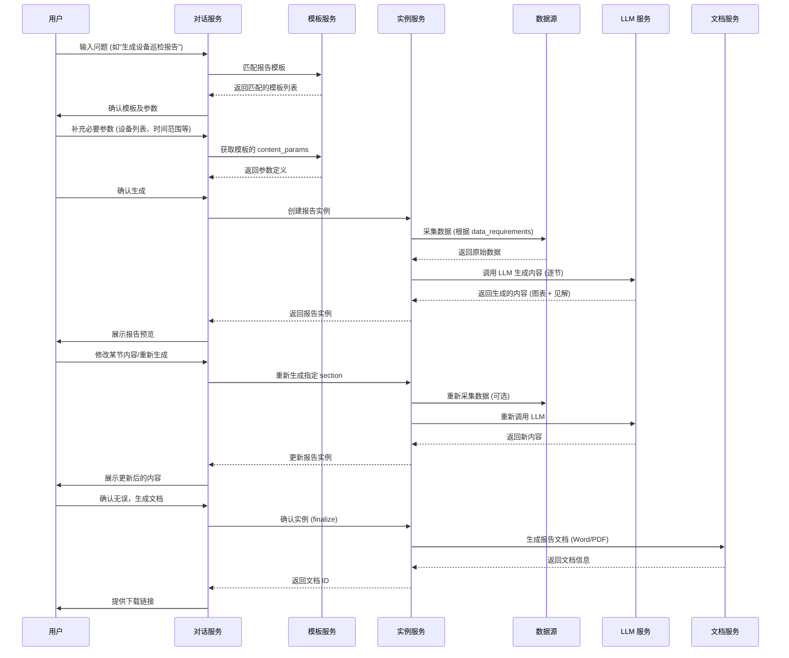

---

## 3. 关键概念

| 概念 | 定义 | 补充说明 |
|------|------|----------|
| **报告模板** | 用户预先定义的报告模板。包括报告类型、报告场景、报告内容参数、报告大纲 | 静态的、可复用的元数据定义 |
| **报告实例** | 在报告模板的基础上，填充报告内容参数后，使用大语言模型技术栈生成报告实例 | 中间态，可编辑、可预览、支持局部重新生成 |
| **报告文档** | 报告实例的物理载体，文档类型可以是 Word、PDF | 最终态，只读、可下载、可分享 |

### 3.1 三者关系

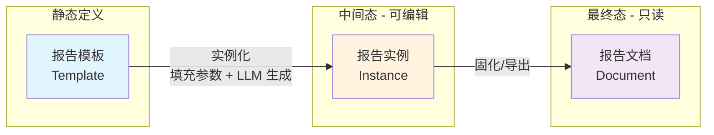

### 3.2 报告实例生命周期

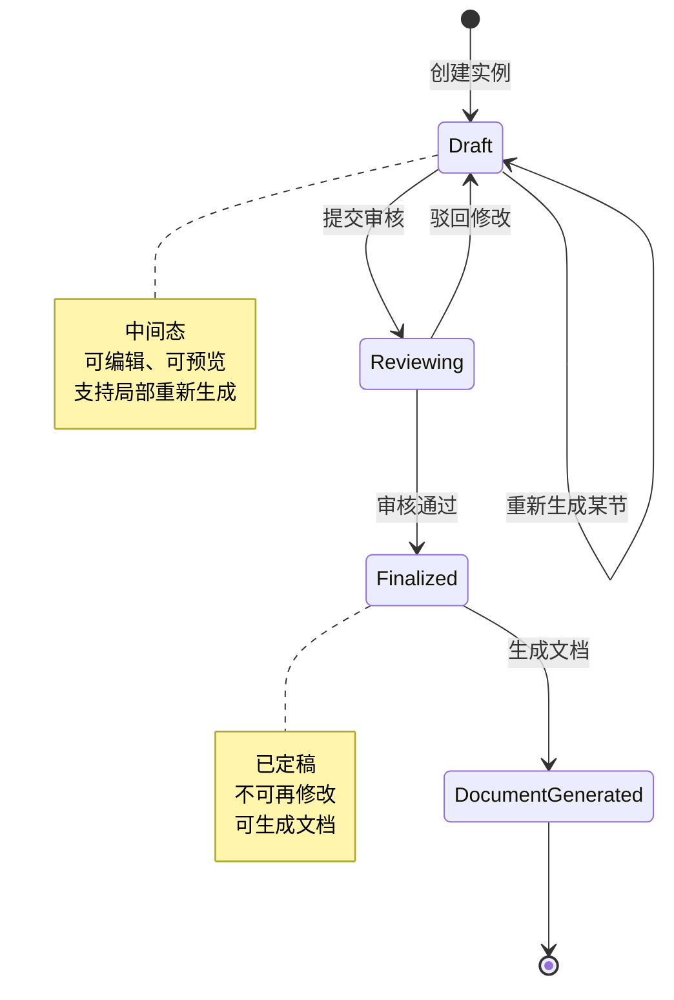

---

## 4. 数据模型设计

### 4.1 报告模板 (Report Template)

```python
@dataclass
class ReportTemplate:
    template_id: str
    name: str
    description: str
    
    report_type: str  # daily/weekly/special/urgent
    scenario: str     # 设备巡检/故障分析/容量评估等
    
    content_params: List[ContentParam]  # 内容参数定义
    outline: List[Catalog]              # 报告大纲
    
    data_sources: List[DataSource]      # 数据源配置
    output_formats: List[str]           # 支持的输出格式
    
    created_at: datetime
    updated_at: datetime
    created_by: str
    version: str
```

#### 4.1.1 内容参数 (ContentParam)

```python
@dataclass
class ContentParam:
    name: str
    label: str
    param_type: str  # text/number/date/select/multi_select
    
    required: bool
    default: Optional[Any]
    description: str
    
    # 取值来源（三选一）
    value_source: Optional[ValueSource]
    
    # 级联依赖
    depends_on: Optional[List[str]]
```

```python
@dataclass
class ValueSource:
    source_type: str  # static/query/api
    
    # 静态列表
    static_options: Optional[List[Dict[str, str]]]
    
    # 数据库查询
    query: Optional[QueryConfig]
    
    # API 调用
    api: Optional[APIConfig]
```

#### 4.1.2 报告大纲 (Outline)

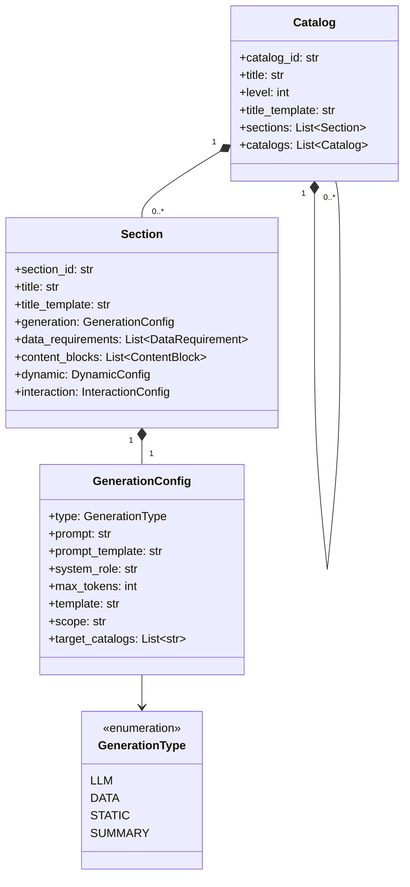

```python
@dataclass
class Catalog:
    """目录节点"""
    catalog_id: str
    title: str
    level: int
    
    sections: List['Section'] = field(default_factory=list)
    catalogs: List['Catalog'] = field(default_factory=list)
    
    title_template: Optional[str] = None
```

```python
@dataclass
class Section:
    """内容节节点 - 必须隶属于某个 Catalog"""
    section_id: str
    generation: GenerationConfig
    
    title: Optional[str] = None
    title_template: Optional[str] = None
    
    data_requirements: List[DataRequirement] = field(default_factory=list)
    content_blocks: List[ContentBlock] = field(default_factory=list)
    
    dynamic: Optional[DynamicConfig] = None
    interaction: Optional[InteractionConfig] = None
```

```python
class GenerationType(Enum):
    LLM = "llm"       # LLM 生成
    DATA = "data"     # 数据驱动
    STATIC = "static" # 静态内容
    SUMMARY = "summary"  # 对同级目录内容的总结
```

```python
@dataclass
class GenerationConfig:
    type: GenerationType
    
    # LLM 类型字段
    prompt: Optional[str] = None
    prompt_template: Optional[str] = None
    system_role: Optional[str] = None
    max_tokens: Optional[int] = None
    temperature: Optional[float] = 0.7
    
    # Data 类型字段
    template: Optional[str] = None
    
    # Summary 类型字段
    scope: Optional[str] = None  # sibling_catalogs/current_catalog/all/custom
    target_catalogs: Optional[List[str]] = None
    summary_style: Optional[str] = None  # concise/detailed/executive
```

### 4.2 报告实例 (Report Instance)

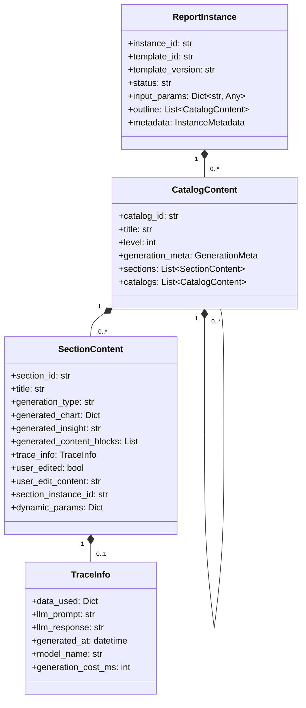

```python
@dataclass
class ReportInstance:
    instance_id: str
    template_id: str
    template_version: str
    status: str  # draft/reviewing/finalized
    
    input_params: Dict[str, Any]
    outline: List[CatalogContent]  # 与模板结构对应，内联生成内容
    
    metadata: InstanceMetadata
```

```python
@dataclass
class CatalogContent:
    """目录内容（内联生成内容）"""
    catalog_id: str
    title: str
    level: int
    
    generation_meta: Optional[GenerationMeta] = None
    
    sections: List['SectionContent'] = field(default_factory=list)
    catalogs: List['CatalogContent'] = field(default_factory=list)
```

```python
@dataclass
class SectionContent:
    """内容节（内联生成内容）"""
    section_id: str
    title: str
    generation_type: str
    
    # 生成内容
    generated_chart: Optional[Dict[str, Any]] = None  # ECharts DSL
    generated_insight: Optional[str] = None
    generated_content_blocks: List[Dict[str, Any]] = field(default_factory=list)
    
    # 溯源信息
    trace_info: Optional[TraceInfo] = None
    
    # 用户编辑状态
    user_edited: bool = False
    user_edit_content: Optional[str] = None
    regenerate_count: int = 0
    
    # 动态生成相关
    section_instance_id: Optional[str] = None
    dynamic_params: Optional[Dict[str, Any]] = None
```

```python
@dataclass
class TraceInfo:
    """溯源信息"""
    data_used: Dict[str, Any]
    llm_prompt: Optional[str] = None
    llm_response: Optional[str] = None
    generated_at: Optional[datetime] = None
    model_name: Optional[str] = None
    generation_cost_ms: Optional[int] = None
```

### 4.3 报告文档 (Report Document)

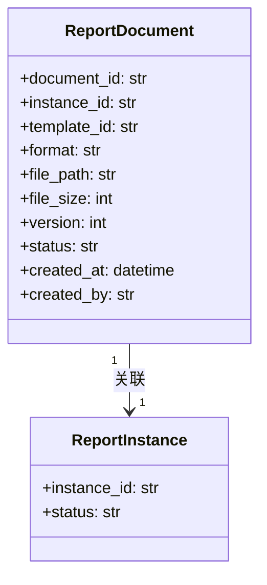

```python
@dataclass
class ReportDocument:
    document_id: str
    instance_id: str
    template_id: str
    
    format: str  # word/pdf/markdown
    hofs_path: str  # HOFS 分布式文件存储路径
    file_size: int
    
    version: int
    status: str  # generating/ready/failed
    
    created_at: datetime
    created_by: str
```

### 4.4 定时任务 (Scheduled Task)

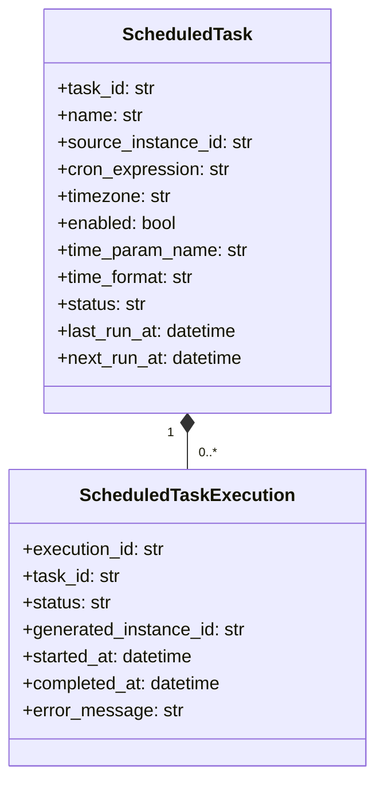

```python
@dataclass
class ScheduledTask:
    """定时任务配置"""
    task_id: str
    name: str
    description: str
    
    # 关联的源实例（任意状态均可）
    source_instance_id: str
    template_id: str  # 冗余字段，方便查询
    
    # 定时配置
    cron_expression: str  # 如 "0 8 * * *" (每天 8 点)
    timezone: str = "Asia/Shanghai"
    enabled: bool = True
    
    # 参数更新规则（仅时间参数）
    time_param_name: str  # 如 "inspection_date"
    time_format: str = "%Y-%m-%d"
    
    # 元数据
    created_at: datetime
    updated_at: datetime
    created_by: str
    last_run_at: Optional[datetime] = None
    next_run_at: Optional[datetime] = None
    status: str = "active"  # active/paused/stopped
    
    # 统计信息
    total_runs: int = 0
    success_runs: int = 0
    failed_runs: int = 0
```

```python
@dataclass
class ScheduledTaskExecution:
    """定时任务执行记录"""
    execution_id: str
    task_id: str
    
    # 执行结果
    status: str  # success/failed
    generated_instance_id: Optional[str] = None
    
    # 执行详情
    started_at: datetime
    completed_at: Optional[datetime] = None
    error_message: Optional[str] = None
    
    # 使用的参数
    input_params_used: Dict[str, Any] = field(default_factory=dict)
```

---

## 5. 定时任务设计

### 5.1 定时任务执行流程

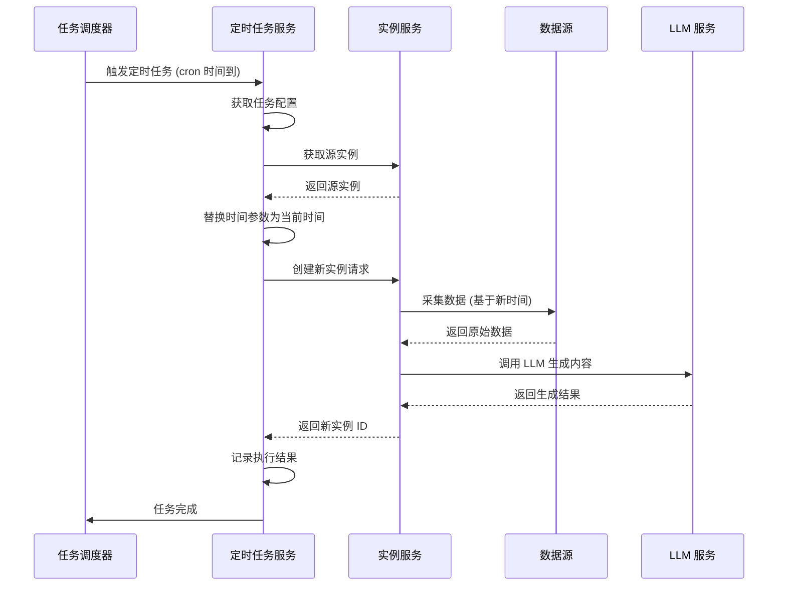

### 5.2 定时任务设计说明

**核心设计原则**:
- 定时任务是独立的功能模块，不与报告生成流程强耦合
- 任意状态的报告实例都可以作为定时任务的源实例
- 每次执行生成**新的报告实例**，不覆盖原实例
- 仅替换时间参数，其他参数保持不变

**执行逻辑**:
1. 到达 cron 指定时间时触发任务
2. 获取源实例的 `input_params`
3. 将 `time_param_name` 指定的参数替换为当前时间
4. 基于新参数创建新的报告实例
5. 调用 LLM 生成完整报告内容
6. 记录执行结果（成功/失败）

**约束条件**:
- 执行记录保留 1 年
- 任务执行失败不自动重试
- 不考虑并发执行（任务时间到即执行）
- 暂不自动生成报告文档，需手动触发

---

## 6. 系统架构

### 6.1 整体架构图

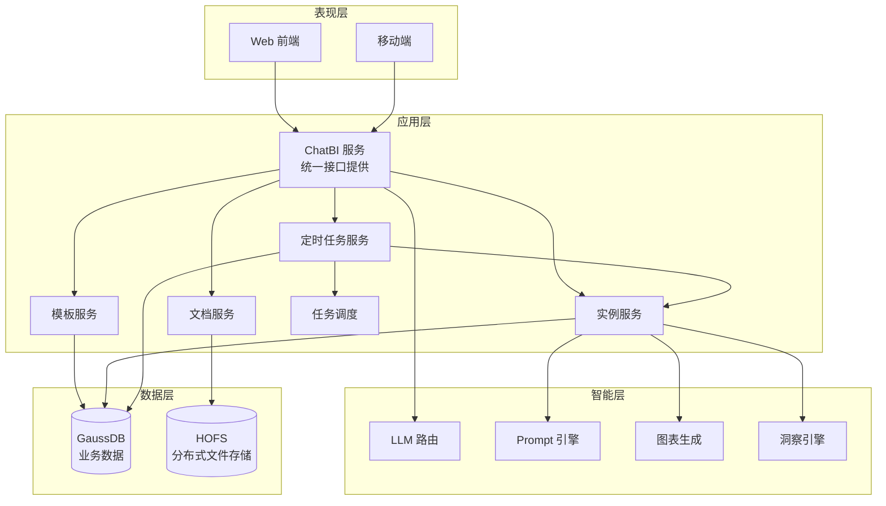

### 6.2 架构说明

**ChatBI 服务**:
- 作为统一的服务入口，直接对外提供所有 REST API 接口
- 整合了 API 网关的路由、认证、限流等功能
- 接口前缀：`/rest/dte/chatbi/`

**服务调用关系**:
- Web/移动端 → ChatBI 服务 → 各业务服务（模板/实例/文档/定时任务）
- ChatBI 服务 → LLM 路由（智能层）
- 各业务服务 → 数据层（GaussDB/HOFS）

### 6.3 报告生成流程

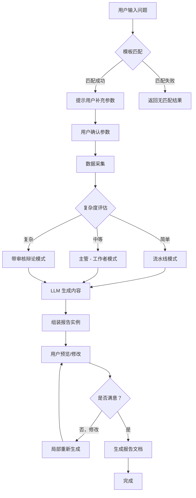

---

## 7. API 接口设计

### 7.1 核心 API 时序图

#### 生成报告实例

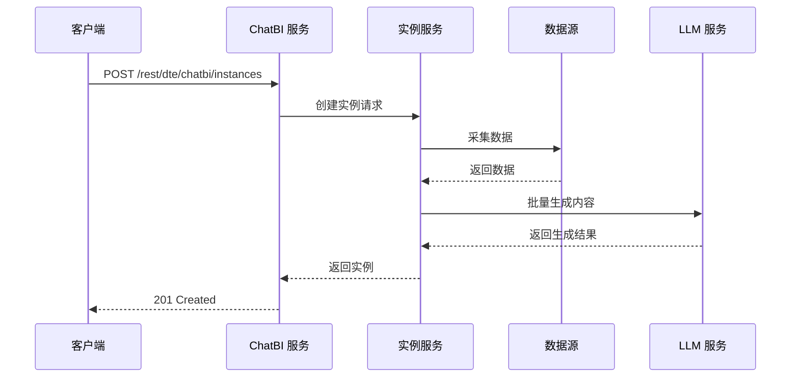

#### 重新生成某节

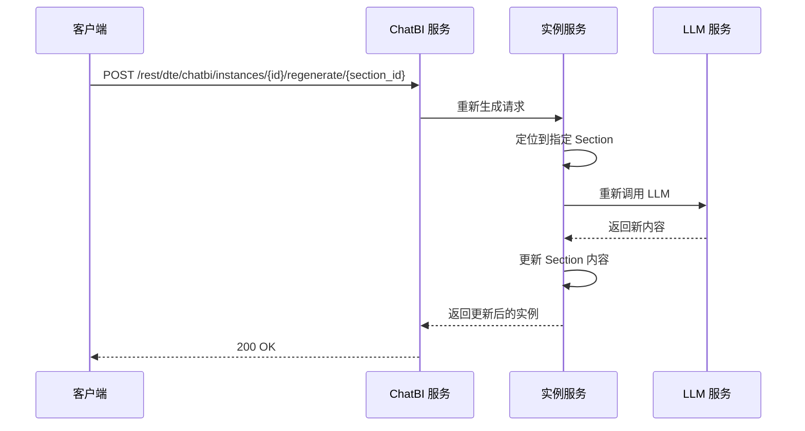

#### 生成报告文档

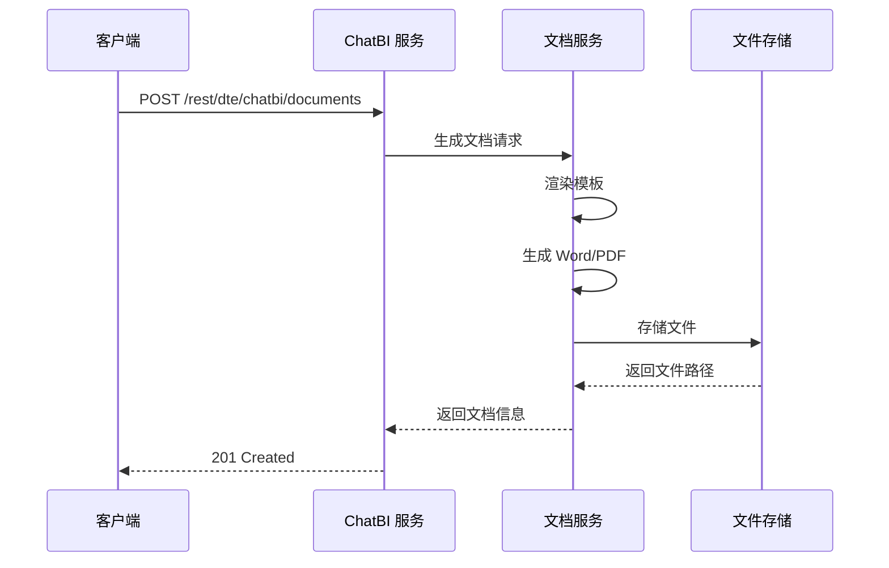

### 7.2 报告模板管理

```
POST   /rest/dte/chatbi/templates              # 创建报告模板
GET    /rest/dte/chatbi/templates              # 列出报告模板
GET    /rest/dte/chatbi/templates/{id}         # 获取模板详情
PUT    /rest/dte/chatbi/templates/{id}         # 更新模板
DELETE /rest/dte/chatbi/templates/{id}         # 删除模板
POST   /rest/dte/chatbi/templates/{id}/clone   # 克隆模板
```

### 7.3 对话交互

```
POST   /rest/dte/chatbi/chat                   # 发送对话消息
GET    /rest/dte/chatbi/chat/{session_id}      # 获取对话历史
DELETE /rest/dte/chatbi/chat/{session_id}      # 结束对话会话
```

### 7.4 报告实例管理

```
POST   /rest/dte/chatbi/instances              # 生成报告实例
GET    /rest/dte/chatbi/instances/{id}         # 获取实例详情
PUT    /rest/dte/chatbi/instances/{id}         # 更新实例
POST   /rest/dte/chatbi/instances/{id}/regenerate/{section_id}  # 重新生成某节
POST   /rest/dte/chatbi/instances/{id}/finalize  # 确认实例，准备生成文档
```

### 7.5 报告文档管理

```
POST   /rest/dte/chatbi/documents              # 生成报告文档
GET    /rest/dte/chatbi/documents/{id}         # 获取文档信息
GET    /rest/dte/chatbi/documents/{id}/download  # 下载文档
DELETE /rest/dte/chatbi/documents/{id}         # 删除文档
GET    /rest/dte/chatbi/instances/{id}/documents  # 列出实例关联的所有文档
```

### 7.6 数据源管理

```
POST   /rest/dte/chatbi/data-sources           # 注册数据源
GET    /rest/dte/chatbi/data-sources           # 列出数据源
GET    /rest/dte/chatbi/data-sources/{id}      # 获取数据源详情
PUT    /rest/dte/chatbi/data-sources/{id}      # 更新数据源
DELETE /rest/dte/chatbi/data-sources/{id}      # 删除数据源
POST   /rest/dte/chatbi/data-sources/{id}/test  # 测试连接
```

### 7.7 定时任务管理

```
POST   /rest/dte/chatbi/scheduled-tasks              # 创建定时任务
GET    /rest/dte/chatbi/scheduled-tasks              # 列出定时任务
GET    /rest/dte/chatbi/scheduled-tasks/{id}         # 获取任务详情
PUT    /rest/dte/chatbi/scheduled-tasks/{id}         # 更新任务
DELETE /rest/dte/chatbi/scheduled-tasks/{id}         # 删除任务
POST   /rest/dte/chatbi/scheduled-tasks/{id}/pause   # 暂停任务
POST   /rest/dte/chatbi/scheduled-tasks/{id}/resume  # 恢复任务
POST   /rest/dte/chatbi/scheduled-tasks/{id}/run-now # 立即执行一次

# 查看任务生成的报告实例
GET    /rest/dte/chatbi/scheduled-tasks/{id}/instances  # 查看任务生成的实例列表

# 任务执行记录
GET    /rest/dte/chatbi/scheduled-tasks/{id}/executions  # 查看执行历史
```

---

## 8. 附录

### 8.1 报告模板示例

详见 `template_example.json`

### 8.2 报告实例示例

详见 `instance_example.json`

### 8.3 报告文档样例

详见 `report_sample.md`

---

## 9. 修订历史

| 版本 | 日期 | 作者 | 变更说明 |
|------|------|------|----------|
| v0.1 | 2026-02-28 | - | 初始设计文档 |
| v0.2 | 2026-02-28 | - | 补充 mermaid 时序图、架构图、数据模型图 |
| v0.3 | 2026-02-28 | - | 修复 mermaid 代码块闭合问题，统一 API 前缀为/rest/dte/chatbi，数据库改为 GaussDB |
| v0.4 | 2026-02-28 | - | 新增定时任务功能设计（数据模型、API 接口、执行流程） |
| v0.5 | 2026-02-28 | - | 报告文档存储改为 HOFS 分布式文件存储系统，移除 Redis 缓存设计 |
| v0.6 | 2026-02-28 | - | 移除独立 API 网关，由 ChatBI 服务统一提供接口，更新时序图参与者 |
