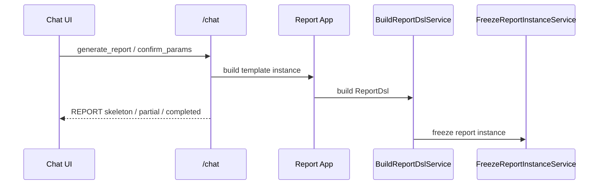

# 关键时序图

> 权威来源：
> - [运行时流程与状态机](../report_system/03-运行时流程与状态机.md)
> - [文档生成与导出架构](../report_system/06-文档生成与导出架构.md)

## 1. 报告生成



## 2. 文档生成

```mermaid
sequenceDiagram
    participant UI as Report UI
    participant API as /reports/{reportId}/document-generations
    participant App as ExportReportService
    participant EXP as Java Exporter
    participant PDF as PDF Converter

    UI->>API: request word/ppt/pdf
    API->>App: create export jobs
    App->>EXP: export word/ppt
    App->>PDF: derive pdf
    App-->>UI: jobs + documents

说明：

- `jobs` 用于表示本次生成请求的执行状态
- `documents` 用于回传当前已经可下载的文档产物，包括复用旧产物的场景
```
