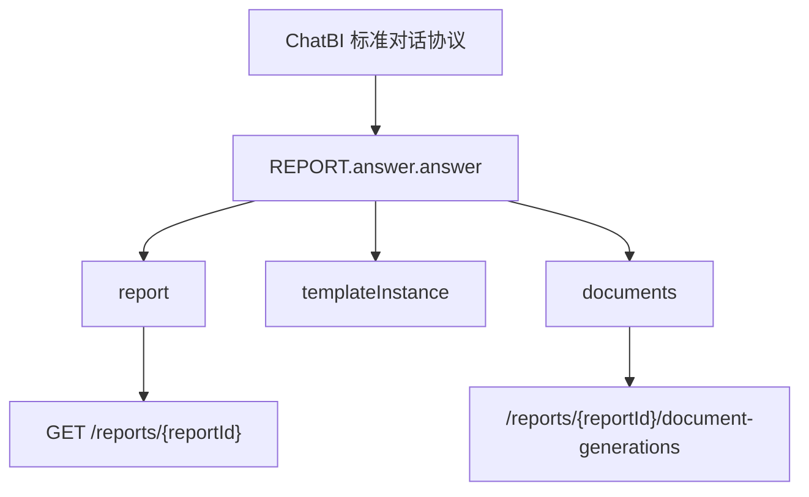

# ChatBI 报告能力扩展设计

> 本文档以 `chatbi_优化建议版.md` 为协议基线，说明报告系统如何在严格对齐 ChatBI 外层协议的前提下扩展报告能力。

## 1. 对齐原则

- 不改 ChatBI 外层请求体字段名
- 不改 ChatBI 外层响应体字段名
- `POST /rest/chatbi/v1/chat` 继续作为统一入口
- 仅在 `Answer.answerType = REPORT` 的 `answer.answer` 内扩展报告专属结构
- 报告只扩展业务主体与模板实例信息，不平行发明第二套对话协议

## 2. 严格对齐字段

以下字段必须与 ChatBI 保持一致：

- `conversationId`
- `chatId`
- `question`
- `instruction`
- `reply`
- `attachments`
- `histories`
- `status`
- `steps`
- `ask`
- `answer`
- `errors`

其中：

- `instruction` 正式支持 `generate_report`
- `ask.type` 统一使用 `fill_params | confirm_params`
- 流式事件继续使用 `step_delta | status | ask | answer | error | done`

## 3. 报告请求体

### 3.1 生成报告请求

```json
{
  "conversationId": "conv_001",
  "chatId": "chat_001",
  "question": "帮我生成总部巡检日报",
  "instruction": "generate_report"
}
```

### 3.2 补参与确认

```json
{
  "conversationId": "conv_001",
  "chatId": "chat_002",
  "instruction": "generate_report",
  "reply": {
    "type": "confirm_params",
    "parameters": {
      "report_date": "2026-04-15",
      "scope": "HQ"
    }
  }
}
```

## 4. REPORT 结果扩展

### 4.1 ChatBI 原基线

ChatBI 只要求：

```json
{
  "answerType": "REPORT",
  "answer": {}
}
```

### 4.2 报告系统扩展结构

报告系统将 `answer.answer` 扩展为：

```json
{
  "reportId": "rpt_001",
  "status": "running",
  "report": {},
  "templateInstance": {},
  "documents": [],
  "generationProgress": {}
}
```

字段说明：

| 字段 | 类型 | 必填 | 说明 |
| --- | --- | --- | --- |
| `reportId` | string | 是 | 报告 ID |
| `status` | string | 是 | 报告生成状态：`running`、`completed`、`failed` |
| `report` | object | 是 | 正式 `ReportDsl` |
| `templateInstance` | object | 是 | 内部模板实例快照，用于二次诉求编辑 |
| `documents` | array | 否 | 已生成文档列表 |
| `generationProgress` | object | 否 | 流式生成中的进度信息 |

### 4.3 templateInstance 扩展

这是报告系统相对 ChatBI 的关键新增能力。

```json
{
  "id": "ti_001",
  "conversationId": "conv_001",
  "catalogs": [
    {
      "id": "catalog_1",
      "name": "运行概览",
      "sections": [
        {
          "id": "section_1",
          "title": "总体态势",
          "requirementInstance": {},
          "skeletonStatus": {
            "ui": "not_broken"
          }
        }
      ]
    }
  ]
}
```

说明：

- UI 只看到 `not_broken | broken`
- 系统内部三态不透出给前台
- 槽位值修改不改变骨架可用度

## 5. 报告详情接口扩展

报告详情接口不属于 ChatBI 原生对话协议，但必须延续同一份 `REPORT` 结果体语义。

### 5.1 接口

```text
GET /rest/chatbi/v1/reports/{reportId}
```

### 5.2 返回体

```json
{
  "reportId": "rpt_001",
  "status": "completed",
  "answerType": "REPORT",
  "answer": {
    "reportId": "rpt_001",
    "status": "completed",
    "report": {},
    "templateInstance": {},
    "documents": []
  }
}
```

设计要点：

- 返回体继续使用 `REPORT` 语义
- 与对话流式生成完成后的 `answer` 结构保持一致
- 区别仅在于：
  - 对话接口：流式返回生成中的报告
  - 报告详情：一次性返回已完成报告

## 6. 文档生成接口扩展

文档生成不是 ChatBI 原协议能力，因此在 `reports` 资源下扩展。

### 6.1 接口

```text
POST /rest/chatbi/v1/reports/{reportId}/document-generations
```

### 6.2 请求体

```json
{
  "formats": ["word", "ppt", "pdf"],
  "pdfSource": "word",
  "regenerateIfExists": false,
  "theme": "default",
  "strictValidation": true
}
```

### 6.3 响应体

```json
{
  "reportId": "rpt_001",
  "jobs": [
    {
      "jobId": "job_word_001",
      "format": "word",
      "status": "queued"
    },
    {
      "jobId": "job_pdf_001",
      "format": "pdf",
      "status": "blocked_by_dependency",
      "dependsOn": "job_word_001"
    }
  ]
}
```

## 7. 能力边界图



## 8. 扩展清单

相对 ChatBI 原生协议，本轮新增：

- `REPORT.answer.answer.report`
- `REPORT.answer.answer.templateInstance`
- `REPORT.answer.answer.documents`
- `REPORT.answer.answer.generationProgress`
- `GET /reports/{reportId}`
- `POST /reports/{reportId}/document-generations`

但保持不变的外层协议包括：

- `ChatRequest`
- `ChatResponse`
- `ChatStreamEvent`
- `Ask`
- `Reply`
- `Step`
