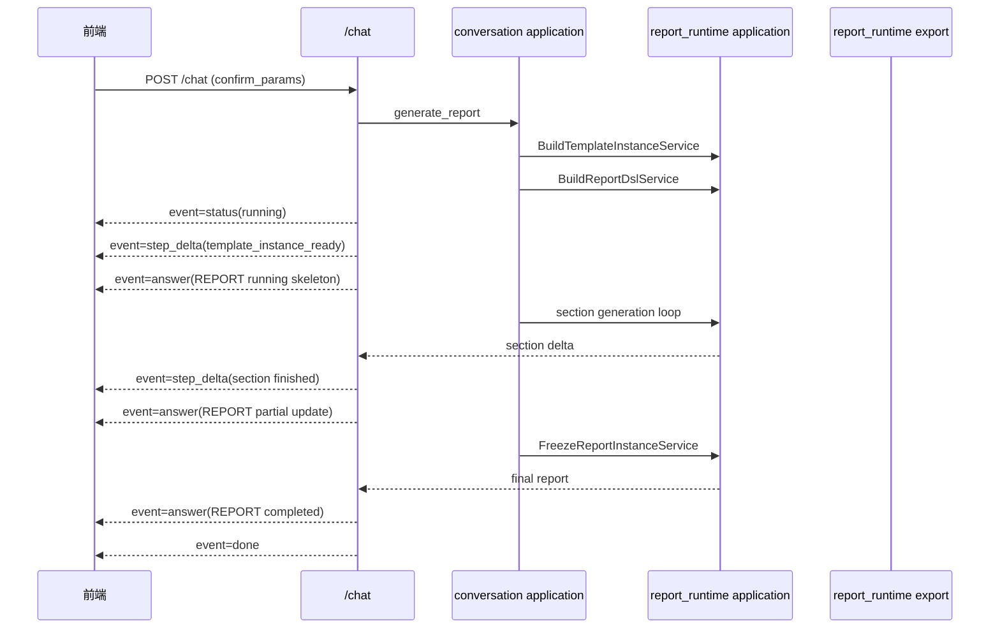
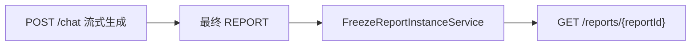

# ChatBI 报告流式对齐设计

> 本文档说明报告系统如何按照 ChatBI 的流式事件模型，在参数确认后流式返回“正在生成中的报告”。

## 1. 目标

在 `POST /rest/chatbi/v1/chat` 中，当：

- `instruction = generate_report`
- 参数已完整确认

系统不再只返回“报告已生成”摘要，而是按 ChatBI 的 SSE 事件模型流式返回：

- 步骤增量
- 报告生成进度
- 报告 DSL 增量
- 最终完整 `REPORT`

## 2. 主时序



## 3. 事件模型

继续沿用 ChatBI 事件类型：

- `status`
- `step_delta`
- `ask`
- `answer`
- `error`
- `done`

### 3.1 首个状态事件

```json
{
  "conversationId": "conv_001",
  "chatId": "chat_003",
  "eventType": "status",
  "status": "running",
  "sequence": 1
}
```

### 3.2 首个报告骨架事件

```json
{
  "conversationId": "conv_001",
  "chatId": "chat_003",
  "eventType": "answer",
  "sequence": 2,
  "answer": {
    "answerType": "REPORT",
    "answer": {
      "reportId": "rpt_001",
      "status": "running",
      "report": {
        "basicInfo": {},
        "catalogs": [],
        "layout": {}
      },
      "templateInstance": {
        "id": "ti_001",
        "catalogs": []
      },
      "generationProgress": {
        "totalSections": 8,
        "completedSections": 0
      }
    }
  }
}
```

### 3.3 局部章节完成事件

```json
{
  "conversationId": "conv_001",
  "chatId": "chat_003",
  "eventType": "answer",
  "sequence": 6,
  "answer": {
    "answerType": "REPORT",
    "answer": {
      "reportId": "rpt_001",
      "status": "running",
      "report": {
        "catalogs": [
          {
            "id": "catalog_1",
            "sections": [
              {
                "id": "section_1",
                "components": []
              }
            ]
          }
        ]
      },
      "generationProgress": {
        "totalSections": 8,
        "completedSections": 1
      }
    }
  }
}
```

### 3.4 最终完成事件

```json
{
  "conversationId": "conv_001",
  "chatId": "chat_003",
  "eventType": "answer",
  "sequence": 20,
  "answer": {
    "answerType": "REPORT",
    "answer": {
      "reportId": "rpt_001",
      "status": "completed",
      "report": {},
      "templateInstance": {},
      "documents": []
    }
  }
}
```

## 4. 交互规则

- 在 `/chat` SSE 事件中，`answer.answer.report` 始终表示当前时刻可见的 `ReportDsl`
- 在 `/chat` SSE 事件中，`answer.answer.templateInstance` 也持续可见，用于后续二次诉求编辑
- `documents` 只有在文档已生成时才出现
- `done` 只表示本轮流式结束，不额外携带业务主体

## 5. 与报告详情的关系



说明：

- 对话流式完成时返回的最终 `REPORT.answer.answer`
- 与报告详情接口中的 `answer`
- 结构必须完全一致

## 6. 设计约束

- 流式事件不发明新的 `report_delta` 类型，仍复用 ChatBI 的 `answer`
- 前端按 `sequence` 去重和排序
- 后端负责把章节增量映射成合法的部分 `ReportDsl`
- 若中途失败，最后发 `error`，不再发 `done`
