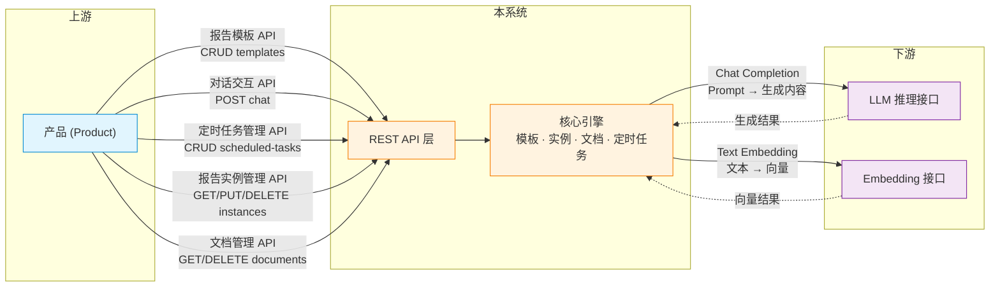
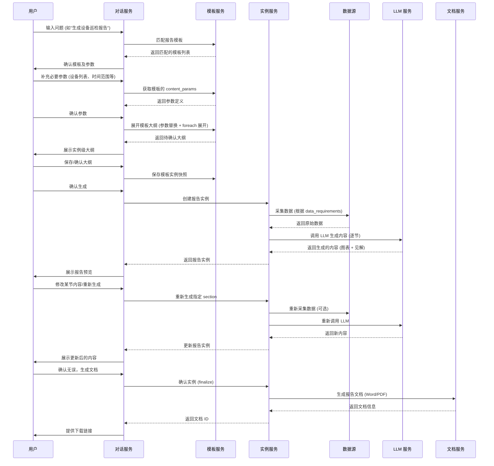
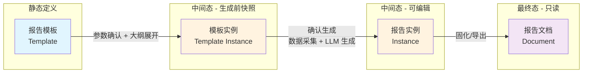
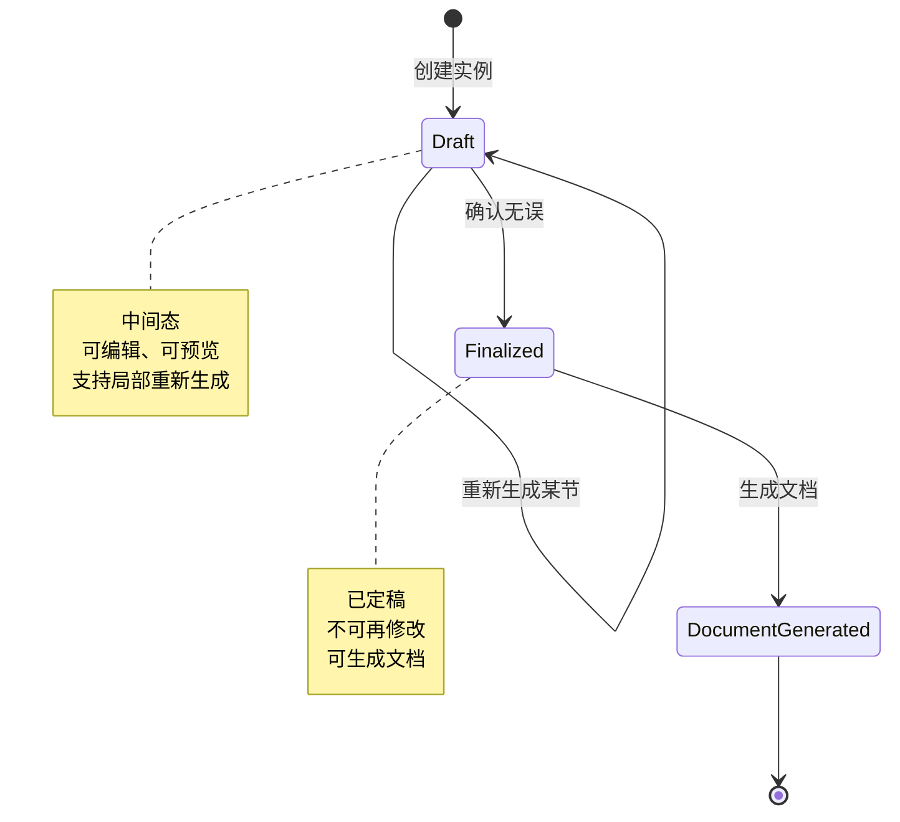
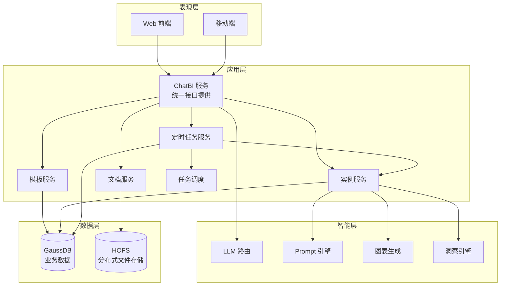
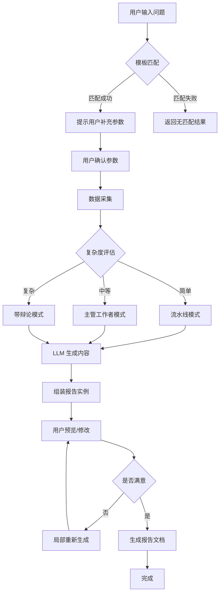

**版本**: v1.2
**最后更新**: 2026-03-19
**状态**: 已归档 (同步代码实现)

---

## 目录

0. [上下文](#0-上下文)
1. [系统概述](#1-系统概述)
2. [业务流程](#2-业务流程)
3. [关键概念](#3-关键概念)
4. [系统架构](#4-系统架构)
5. [模块设计文档索引](#5-模块设计文档索引)
6. [修订历史](#6-修订历史)

---

## 0. 上下文

本系统在整体业务架构中定位为**"平台"**层，负责报告生成的通用逻辑编排与实例管理。其上下游关系如下：

| 角色 | 定义 | 职责边界 |
|------|------|----------|
| **产品 (Product)** | 上游集成方 | 面向最终用户，提供业务场景化的报告服务。通过调用本系统 API 完成报告模板、对话生成、定时任务配置、报告实例管理及文档下载 |
| **平台 (Platform)** | 本系统 | 报告模板定义、对话式报告生成、定时任务调度、数据采集编排、LLM 生成逻辑调度、实例生命周期管理及文档导出 |
| **推理系统 (Reasoning System)** | 下游能力提供方 | 提供大语言模型 (LLM) 推理接口、Embedding 向量化接口等 AI 原子能力 |

### 0.1 边界接口交互

> **说明**：报告实例的**创建**不直接暴露为独立 API——它在对话交互流程或定时任务执行流程中自动产生。对话式流程在真正创建报告实例之前，会先落一份“模板实例”中间快照，用于记录参数确认后、报告实例生成前的大纲状态。

---

## 1. 系统概述

### 1.1 项目背景

智能报告系统是一个基于大语言模型（LLM）的报告生成平台，支持用户通过对话交互的方式，快速生成专业的分析报告。

### 1.2 系统目标

| 目标 | 指标 |
|------|------|
| 效率提升 | 简单报告 <30 秒，复杂报告 <10 分钟 |
| 交互体验 | 对话式交互，支持局部修改和重新生成 |
| 可追溯性 | 每个结论都有数据支撑，可追溯到原始数据 |
| 灵活输出 | 支持 Word、PDF 等多种格式 |

---

## 2. 业务流程

### 2.1 准备阶段

**1.1 注册报告模板**

用户预先定义报告模板，包括：
- 报告类型、报告场景
- 报告内容参数（输入参数定义）
- 报告大纲（目录结构 + 内容节定义）

### 2.2 运行阶段 - 时序图

---

## 3. 关键概念

| 概念 | 定义 | 补充说明 |
|------|------|----------|
| **报告模板** | 用户预先定义的报告模板。包括报告类型、报告场景、报告内容参数、报告大纲 | 静态的、可复用的元数据定义 |
| **模板实例** | 对话式生成流程中，在大纲确认阶段保存下来的模板级快照。包含模板、已确认参数和实例级大纲 | 追加式历史记录，位于模板与报告实例之间，只作用于当前生成过程；`outline_saved` 快照还可继续 fork 回对话助手 |
| **报告实例** | 在报告模板的基础上，填充报告内容参数后，使用大语言模型技术栈生成报告实例 | 中间态，可编辑、可预览、支持局部重新生成 |
| **报告文档** | 报告实例的物理载体，文档类型可以是 Word、PDF | 最终态，只读、可下载、可分享 |

### 3.1 四者关系

### 3.2 报告实例生命周期

---

## 4. 系统架构

### 4.1 整体架构图

### 4.2 架构说明

**ChatBI 服务 (轻量化实现)**:
- 作为统一的服务入口，直接对外提供所有 REST API 接口
- 整合了 API 网关的路由、认证、限流等功能
- 接口前缀：`/api/` (开发环境) / `/rest/dte/chatbi/` (生产环境映射)

**前端表现层 (UI/UX)**:
- **对话助手 (Chat Assistant)**: 系统默认启动页。采用沉浸式对话布局，重点突出 AI 协作能力。聊天主区左侧增加可折叠会话栏，用于浏览历史会话；进入 `/chat` 时保持欢迎语空态，不自动恢复最近会话，也不预创建会话，只有首条真实用户消息发送后才创建会话，并以该首条消息生成会话标题。历史消息与模板实例都支持 fork 新会话分支，用于在原有参数/大纲基础上继续生成。
- **表格化管理 (Table-based Management)**: 模板、实例、文档模块采用标准的二维表格形式，提供高效的数据导览与批量/单体操作。

**服务调用关系**:
- Web/移动端 → ChatBI 服务 → 各业务服务（模板/实例/文档/定时任务）
- ChatBI 服务 → LLM 路由（智能层）
- 各业务服务 → 数据层（GaussDB/HOFS）

### 4.3 报告生成流程

---

## 5. 模块设计文档索引

本系统的详细模块设计已拆分为独立文档，便于各模块独立演进和细化。

| 模块 | 文档 | 说明 |
|------|------|------|
| 报告模板 | [design_template.md](design_template.md) | 模板数据模型、内容参数、大纲结构 |
| 报告实例与文档 | [design_instance.md](design_instance.md) | 实例数据模型、溯源信息、文档数据模型 |
| 定时任务 | [design_scheduler.md](design_scheduler.md) | 定时任务数据模型、执行流程、设计原则 |
| API 接口 | [design_api.md](design_api.md) | 全量 REST API 定义与核心时序图 |

---

## 6. 修订历史

| 版本 | 日期 | 作者 | 变更说明 |
|------|------|------|----------|
| v0.1 | 2026-02-28 | - | 初始设计文档 |
| v0.2 | 2026-02-28 | - | 补充 mermaid 时序图、架构图、数据模型图 |
| v0.3 | 2026-02-28 | - | 修复 mermaid 代码块闭合问题，统一 API 前缀为/rest/dte/chatbi，数据库改为 GaussDB |
| v0.4 | 2026-02-28 | - | 新增定时任务功能设计（数据模型、API 接口、执行流程） |
| v0.5 | 2026-02-28 | - | 报告文档存储改为 HOFS 分布式文件存储系统，移除 Redis 缓存设计 |
| v0.6 | 2026-02-28 | - | 移除独立 API 网关，由 ChatBI 服务统一提供接口，更新时序图参与者 |
| v0.7 | 2026-02-28 | - | 移除报告审核流程（当前无需审核），修复报告生成流程 mermaid 语法错误 |
| v0.8 | 2026-03-02 | Antigravity | 新增上下文章节与边界交互图；细化定时任务模块（用户隔离、执行模式、自动文档生成） |
| v0.9 | 2026-03-02 | Antigravity | 修正上下文交互图：增加定时任务管理与报告实例管理 API，移除独立的报告生成 API |
| v1.0 | 2026-03-02 | Antigravity | 按总-分结构拆分为总设计文档 + 4 个模块设计文档 |
| v1.1 | 2026-03-04 | Antigravity | 同步 UI 重构：默认沉浸式对话 + 表格化列表；修正 API 前缀为 /api/ |

