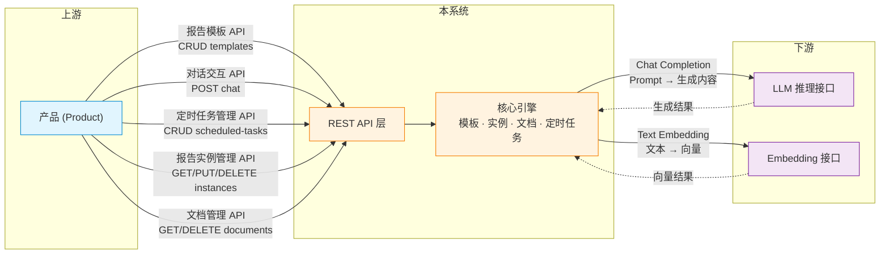
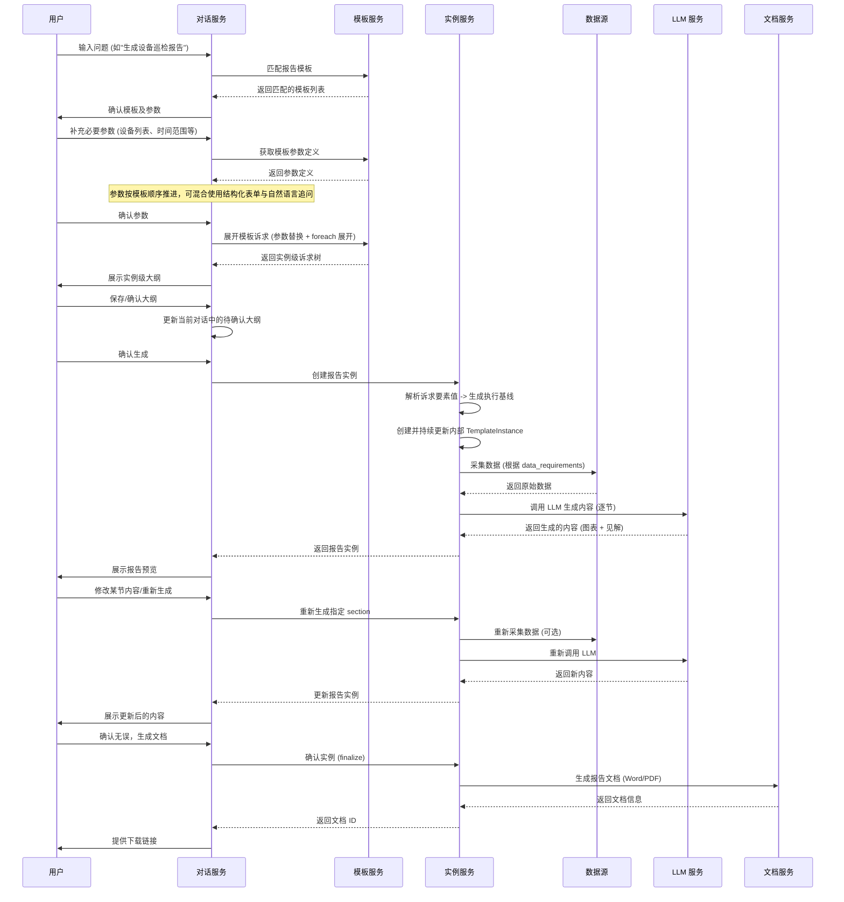
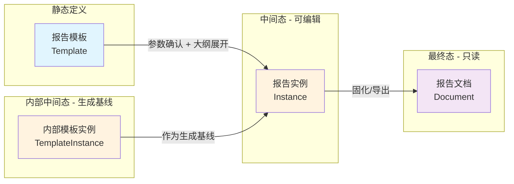
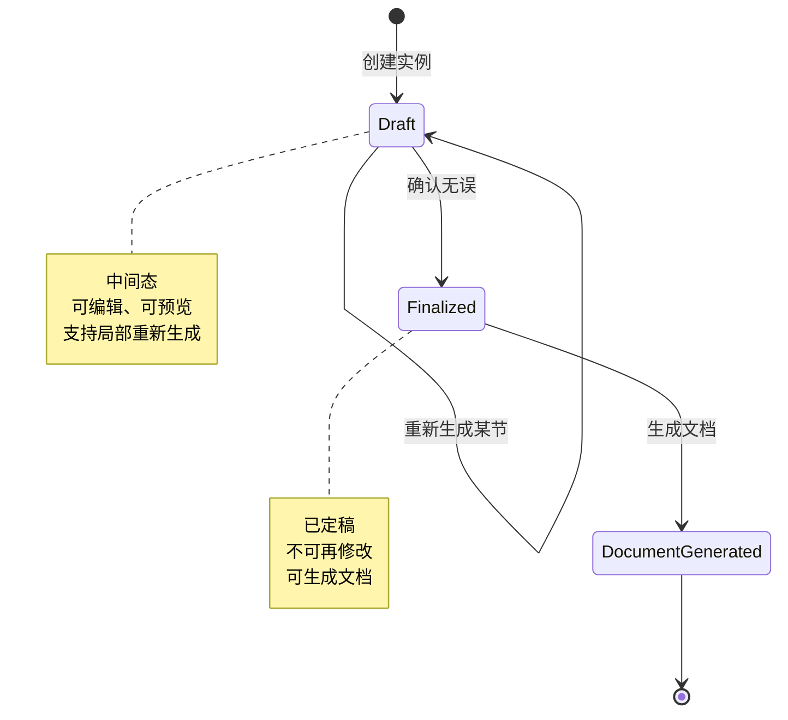
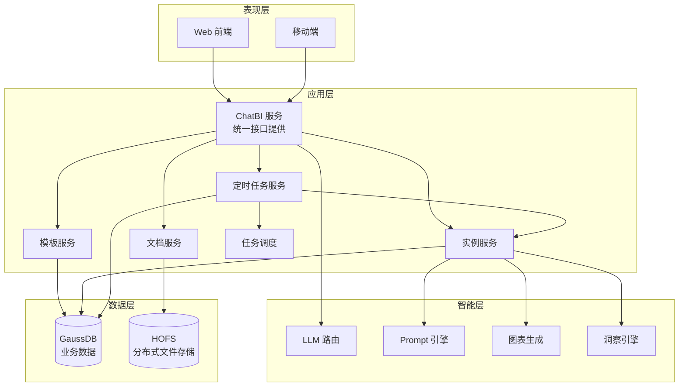
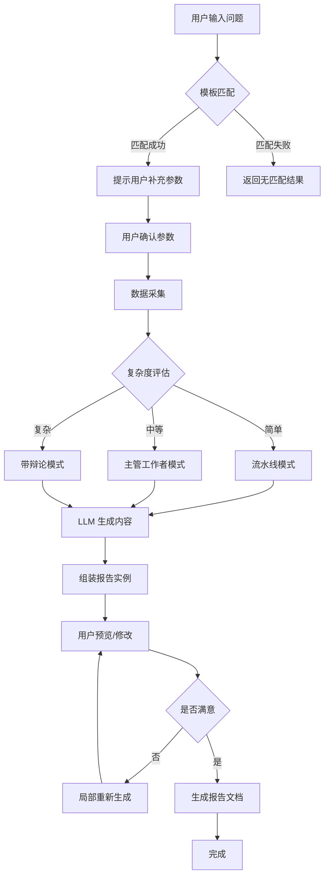

**版本**: v1.6
**最后更新**: 2026-03-31
**状态**: 已归档 (同步代码实现)


---

## 目录

0. [上下文](#0-上下文)
1. [系统概述](#1-系统概述)
2. [业务流程](#2-业务流程)
3. [关键概念](#3-关键概念)
4. [系统架构](#4-系统架构)
5. [模块设计文档索引](#5-模块设计文档索引)
6. [修订历史](#6-修订历史)

---

## 0. 上下文

本系统在整体业务架构中定位为**"平台"**层，负责报告生成的通用逻辑编排与实例管理。其上下游关系如下：

| 角色 | 定义 | 职责边界 |
|------|------|----------|
| **产品 (Product)** | 上游集成方 | 面向最终用户，提供业务场景化的报告服务。通过调用本系统 API 完成报告模板、对话生成、定时任务配置、报告实例管理及文档下载 |
| **平台 (Platform)** | 本系统 | 报告模板定义、对话式报告生成、定时任务调度、数据采集编排、LLM 生成逻辑调度、实例生命周期管理及文档导出 |
| **推理系统 (Reasoning System)** | 下游能力提供方 | 提供大语言模型 (LLM) 推理接口、Embedding 向量化接口等 AI 原子能力 |

### 0.1 边界接口交互



> **说明**：报告实例的**创建**不直接暴露为独立 API——它在对话交互流程或定时任务执行流程中自动产生。系统内部仍保留 `TemplateInstance` 作为核心运行模型（模板定义 + 运行态聚合），并在报告制作全程持续维护；它已内化为报告实例的一部分，不再作为用户可单独感知的模块出现。

---

## 1. 系统概述

### 1.1 项目背景

智能报告系统是一个以**报告生成**为主能力、同时集成**智能问数**与**智能故障**的统一智能助手平台。系统对外提供统一对话入口，内部根据任务类型分别进入报告生成、问数分析或故障诊断流程。

### 1.2 系统目标

| 目标 | 指标 |
|------|------|
| 效率提升 | 简单报告 <30 秒，复杂报告 <10 分钟 |
| 交互体验 | 对话式交互，支持局部修改和重新生成 |
| 可追溯性 | 每个结论都有数据支撑，可追溯到原始数据 |
| 灵活输出 | 支持 Word、PDF 等多种格式 |
| 接口治理 | 对外接口具备稳定错误语义、容量边界与长期可维护性 |

### 1.3 统一对话入口

系统当前采用**统一对话模块**承接三类一级能力：

- `report_generation`：制作报告
- `smart_query`：智能问数
- `fault_diagnosis`：智能故障

统一对话模块遵循以下运行原则：

- 一个 `ChatSession` 同时只有一个 `active_task`
- 每轮输入先做能力识别，再决定续写当前任务还是切换任务
- 报告任务内部仍保留完整状态机；问数与故障采用轻量多轮
- 若当前任务已有实质进度，切换前必须先通过聊天内确认卡片确认
- 当报告流程正在等待 `interaction_mode=chat` 的参数时，普通自然语言优先作为参数答案处理；只有显式表达切换意图时，才进入任务切换确认

---

## 2. 业务流程

### 2.1 准备阶段

**1.1 注册报告模板**

用户预先定义报告模板，包括：
- 报告类型、报告场景
- 报告参数定义（结构化输入参数）
- 参数追问模式（`form | chat`）
- 报告章节结构
- 面向用户的章节诉求（`outline requirement + items[]`）
- 面向系统的执行链路（`content / datasets / presentation`）

### 2.2 统一对话模块运行策略

统一对话模块在运行时遵循“单活任务”策略：

1. 用户进入 `/chat` 时保持欢迎语空态，不自动恢复最近会话，也不预创建会话
2. 首条真实用户消息发送后才创建 `ChatSession`
3. 若当前为报告生成任务，则先匹配模板，再进入参数收集、大纲确认、生成实例
4. 若当前为智能问数或智能故障，则采用轻量追问和结构化结果回复
5. 历史会话支持恢复、删除、消息级 fork；报告实例支持基于内部生成基线发起“更新”会话

### 2.2 运行阶段 - 时序图



---

## 3. 关键概念

### 3.0 术语统一说明

本系统后续统一使用“诉求”术语替代早期文档中的“诉求”表述。

文档侧重说明：

- 总体设计文档优先定义业务概念边界，强调“用户到底想获取什么信息”
- 模块设计文档负责把这些业务概念映射到现有结构字段、阶段名和接口动作上
- 因此，总体文档优先使用“诉求 / 诉求要素 / 诉求实例”，模块文档则允许在兼容说明中继续出现 `outline / outline_instance / review_outline`

统一口径如下：

- **诉求**
  - 表示用户希望系统获取并表达的一段信息意图
  - 用户在确认阶段看到和修改的核心对象，本质上不是最终报告正文，也不是单纯的生成草稿
  - “生成报告”只是满足诉求的一种手段

- **诉求层**
  - 指模板章节中面向用户的一层定义
  - 回答“用户到底想知道什么、按什么口径知道”

- **诉求要素**
  - 指构成一段诉求的结构化成分
  - 可以是对象、条件、范围、指标、维度、阈值、排序方式或表达偏好
  - 它不等于模板参数，但模板参数可以为诉求要素赋值

- **诉求实例**
  - 指在参数替换、局部变量展开和上下文绑定后形成的具体诉求表达
  - 它是执行层生成前的直接输入

- **执行层**
  - 指系统为满足诉求而实际采取的查询、聚合、推理和生成链路
  - 回答“系统怎么做”

术语关系总结：

- 诉求层：定义“要什么”
- 执行层：定义“怎么做”
- 诉求要素：构成“要什么”的结构化成分
- 参数：系统在交互过程中向用户收集的输入项

为兼容现有实现和接口，本阶段文档允许在个别位置保留旧名：

- `outline`
- `outline_instance`
- `review_outline`

但它们在业务语义上统一按“诉求 / 诉求实例”理解。

| 概念 | 定义 | 补充说明 |
|------|------|----------|
| **报告模板** | 用户预先定义的报告模板。包括模板类型、场景、结构化参数、章节树，以及章节诉求/执行链路双层定义 | 静态的、可复用的元数据定义；同一章节节点同时承载用户诉求与系统执行链路 |
| **对话会话** | 用户与系统之间的历史对话容器。内部持久化消息流、上下文状态、来源信息与关联实例 | 进入 `/chat` 时默认空态；首条真实消息才创建会话；支持历史恢复、消息级 fork 与实例更新恢复 |
| **活动任务** | 对话会话中当前唯一活跃的任务上下文，包括能力类型、阶段、进度状态与上下文载荷 | v1 采用单活任务模型，不支持任务栈；报告生成、智能问数、智能故障三类能力共用统一路由 |
| **内部模板实例** | 系统内部维护的运行态聚合。包含模板继承信息、已确认参数、实例级诉求树、解析视图与生成产物 | 非用户感知对象；每个新报告实例对应唯一一份内部模板实例，用于“更新”与“Fork”能力 |
| **报告实例** | 在报告模板的基础上，填充报告内容参数后，使用大语言模型技术栈生成报告实例 | 中间态，可编辑、可预览、支持局部重新生成；内部绑定一份生成基线 |
| **报告时间** | 用于表达业务口径上的报告所属时间 | 与 `created_at` 分离；典型由定时任务把计划执行时间映射进实例 `report_time` |
| **报告文档** | 报告实例的物理载体，文档类型可以是 Word、PDF | 最终态，只读、可下载、可分享 |

### 3.1 四者关系



### 3.2 报告实例生命周期



---

## 4. 系统架构

### 4.1 整体架构图



### 4.2 架构说明

**ChatBI 服务 (轻量化实现)**:
- 作为统一的服务入口，直接对外提供所有 REST API 接口
- 整合了 API 网关的路由、认证、限流等功能
- 业务接口前缀：`/rest/chatbi/v1/`
- 开发/运维接口前缀：`/rest/dev/`

**前端表现层 (UI/UX)**:
- **对话助手 (Chat Assistant)**: 系统默认启动页。采用沉浸式对话布局，重点突出 AI 协作能力。聊天主区左侧增加可折叠会话栏，用于浏览历史会话；进入 `/chat` 时保持欢迎语空态，不自动恢复最近会话，也不预创建会话，只有首条真实用户消息发送后才创建会话，并以该首条消息生成会话标题。历史消息支持 fork 新会话分支；报告实例则可基于其内部确认大纲发起“更新”或基于来源消息发起“Fork”。
- **表格化管理 (Table-based Management)**: 模板、实例、文档模块采用标准的二维表格形式，提供高效的数据导览与批量/单体操作。

**模板双层模型**:
- 模板章节节点统一采用“双层共存”模式：
  - `outline`：面向用户的章节诉求定义，采用 `requirement + items[]`
  - `execution chain`：面向系统的执行链路，采用 `content / datasets / presentation`
- 两层不冲突，并通过同章节节点以及 `{@item_id}` 显式绑定：
  - `{param_id}`：模板级参数
  - `{$var}`：`foreach` 局部变量
  - `{@item_id}`：章节诉求要素
- 对话助手的大纲确认阶段优先操作实例级诉求树；确认生成时再把诉求要素值注入执行链路，形成实例级执行基线。


**服务调用关系**:
- Web/移动端 → ChatBI 服务 → 各业务服务（模板/实例/文档/定时任务）
- ChatBI 服务 → LLM 路由（智能层）
- 各业务服务 → 数据层（GaussDB/HOFS）

### 4.4 后台代码组织（DDD 重构后）

后台实现当前按 bounded context 拆分为 4 个核心上下文：

- `template_catalog`
  - 负责 `ReportTemplate` 定义、参数/章节/诉求规范、模板导出、模板匹配输入准备
- `report_runtime`
  - 负责 `ReportInstance` 生命周期、实例级诉求树、确认大纲、生成基线、章节生成、文档导出
- `conversation`
  - 负责 `ChatSession`、统一任务路由、消息历史、fork/update 恢复、报告任务在对话中的推进
- `scheduling`
  - 负责 `ScheduledTask`、`ScheduledTaskExecution`、run-now、定时任务到报告实例的运行编排

当前代码目录固定为：

```text
src/backend/
├─ contexts/
│  ├─ template_catalog/
│  ├─ report_runtime/
│  ├─ conversation/
│  └─ scheduling/
├─ infrastructure/
│  ├─ persistence / ai / query / documents / settings
├─ shared/kernel/
└─ routers/
```

约束规则：

- `routers/` 只负责 HTTP 接口层：请求解析、DTO 转换、application use case 调用、错误映射
- `domain / application` 不直接依赖 `FastAPI / SQLAlchemy / OpenAI / 文件系统`
- 技术组件（AI 网关、查询引擎、文档存储、ORM 持久化）统一下沉到 infrastructure adapters
- `conversation` 上下文的对话推进、fork/update、参数推进与大纲确认已通过 application service + infrastructure gateways 装配，`chat` router 不再保留兼容 shim
- `conversation` 上下文的会话摘要、上下文快照、参数追问、回复生成与 fork helper 已迁入上下文本地基础设施模块，根级 `chat_*_service.py / context_state_service.py / param_dialog_service.py` 已进一步收敛
- `report_runtime` 上下文的实例创建、定时执行创建、章节重生成、文档导出技术拼装已完全在 context-local modules 内完成；旧 `application/domain/infrastructure/reporting` 双轨桥接层已移除
- `report_runtime` 的确认大纲、执行基线、文档生成、章节生成 helper 与内容生成器已迁入 context-local infrastructure，根级 `outline_review_service.py / template_v2_renderer.py / template_instance_service.py / document_service.py / report_generation_service.py` 已清理
- `conversation` 的能力路由与问数/故障能力 helper 已迁入 context-local infrastructure，根级 `chat_capability_service.py` 已清理
- `template_catalog` 上下文的模板 schema 校验与语义索引逻辑已迁入 context-local infrastructure，`system_settings` 和 `conversation` 不再直接引用根级 `template_*_service`
- `src/backend` 根目录不再保留 `application/`、`domain/` 双轨目录，也不再承载技术源码；技术入口统一收敛为 `contexts/*`、`infrastructure/*`、`shared/kernel`、`routers/*`
- `TemplateInstance` 作为核心领域模型贯穿“参数收集 -> 诉求确认 -> 生成 -> 更新”；底层仍复用 `template_instances` 表

### 4.3 报告生成流程



---

## 5. 模块设计文档索引

本系统的详细模块设计已拆分为独立文档，便于各模块独立演进和细化。

| 模块 | 文档 | 说明 |
|------|------|------|
| DFX 接口治理 | [design_dfx.md](design_dfx.md) | 统一异常响应、错误码、接口规格、容量上限与数据保留策略 |
| 对话模块 | [design_chat.md](design_chat.md) | 统一对话、能力路由、会话历史、参数追问与 fork/update 语义 |
| 报告模板 | [design_template.md](design_template.md) | 模板数据模型、内容参数、大纲结构 |
| 报告实例与文档 | [design_instance.md](design_instance.md) | 实例数据模型、溯源信息、文档数据模型 |
| 定时任务 | [design_scheduler.md](design_scheduler.md) | 定时任务数据模型、执行流程、设计原则 |
| API 接口 | [design_api.md](design_api.md) | 全量 REST API 定义与核心时序图 |
| 设计实现索引 | [implementation/index.md](implementation/index.md) | 当前后端代码的实现分层、模块边界、表定义与外部接口用法 |

---

## 6. 修订历史

| 版本 | 日期 | 作者 | 变更说明 |
|------|------|------|----------|
| v0.1 | 2026-02-28 | - | 初始设计文档 |
| v0.2 | 2026-02-28 | - | 补充 mermaid 时序图、架构图、数据模型图 |
| v0.3 | 2026-02-28 | - | 修复 mermaid 代码块闭合问题，统一 API 前缀为/rest/dte/chatbi，数据库改为 GaussDB |
| v0.4 | 2026-02-28 | - | 新增定时任务功能设计（数据模型、API 接口、执行流程） |
| v0.5 | 2026-02-28 | - | 报告文档存储改为 HOFS 分布式文件存储系统，移除 Redis 缓存设计 |
| v0.6 | 2026-02-28 | - | 移除独立 API 网关，由 ChatBI 服务统一提供接口，更新时序图参与者 |
| v0.7 | 2026-02-28 | - | 移除报告审核流程（当前无需审核），修复报告生成流程 mermaid 语法错误 |
| v0.8 | 2026-03-02 | Antigravity | 新增上下文章节与边界交互图；细化定时任务模块（用户隔离、执行模式、自动文档生成） |
| v0.9 | 2026-03-02 | Antigravity | 修正上下文交互图：增加定时任务管理与报告实例管理 API，移除独立的报告生成 API |
| v1.0 | 2026-03-02 | Antigravity | 按总-分结构拆分为总设计文档 + 4 个模块设计文档 |
| v1.1 | 2026-03-04 | Antigravity | 同步 UI 重构：默认沉浸式对话 + 表格化列表；修正 API 前缀为 /rest/chatbi/v1/ |
| v1.3 | 2026-03-20 | Antigravity | 用户侧移除独立模板实例模块；模板实例内化为报告实例生成基线，新增报告实例“更新/Fork/查看确认大纲”语义 |
| v1.4 | 2026-03-30 | Antigravity | 对齐最新版 ReportTemplate：模板章节升级为“诉求 + 执行链路”双层模型；对话大纲确认改为实例级诉求树，并在确认生成时解析为执行基线 |
| v1.5 | 2026-03-31 | Antigravity | 统一对话模块扩展到报告生成/智能问数/智能故障；模板参数支持 `interaction_mode=form|chat`；定时任务新增双时间模型与“从已有实例创建”语义 |
| v1.6 | 2026-03-31 | Antigravity | 新增 DFX 接口治理专题文档，统一异常响应、错误码、分页/排序、限流、容量上限与数据保留策略，并记录定时任务时间语义重构为后续专题 |
| v1.7 | 2026-04-01 | Codex | 新增 `design/implementation/` 后端实现文档组，补齐 4 个 bounded context、共享基础设施、数据库表定义总览，以及外部接口与用法说明 |


