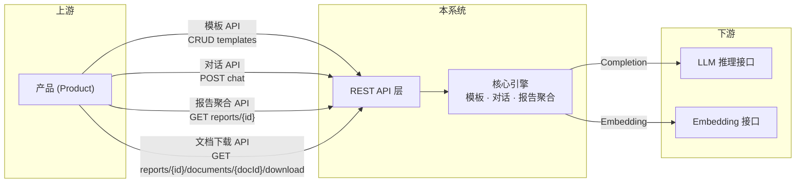
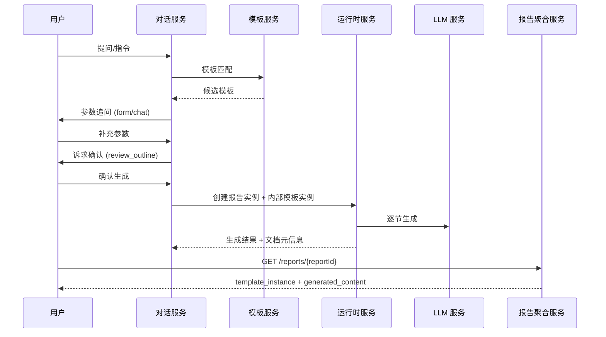
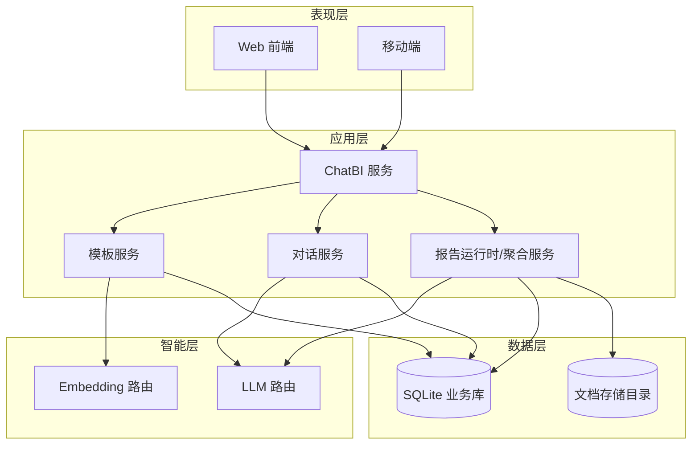

**版本**: v1.8
**最后更新**: 2026-04-17
**状态**: 已归档 (同步当前公开实现)

---

## 目录

0. [上下文](#0-上下文)
1. [系统概述](#1-系统概述)
2. [业务流程](#2-业务流程)
3. [关键概念](#3-关键概念)
4. [系统架构](#4-系统架构)
5. [模块设计文档索引](#5-模块设计文档索引)
6. [修订历史](#6-修订历史)

---

## 0. 上下文

本系统在整体业务架构中定位为**平台编排层**，负责模板管理、统一对话编排与报告聚合视图输出。其上下游关系如下：

| 角色 | 定义 | 职责边界 |
|------|------|----------|
| 产品 (Product) | 上游集成方 | 面向最终用户，调用平台接口完成模板管理、对话生成与报告查看/下载 |
| 平台 (Platform) | 本系统 | 模板定义、统一对话、报告生成编排、报告聚合与文档下载 |
| 推理系统 (Reasoning System) | 下游能力提供方 | 提供 Completion / Embedding 等 AI 原子能力 |

### 0.1 边界接口交互

公开业务面当前仅保留：

- `/rest/chatbi/v1/templates/*`
- `/rest/chatbi/v1/chat*`
- `/rest/chatbi/v1/reports/*`
- `/rest/chatbi/v1/parameter-options/resolve`

---

## 1. 系统概述

### 1.1 项目背景

智能报告系统是一个以**报告生成**为主能力、同时集成**智能问数**与**智能故障**的统一智能助手平台。系统通过统一对话入口完成能力路由，并通过报告聚合接口输出最终可消费结果。

### 1.2 系统目标

| 目标 | 指标 |
|------|------|
| 效率提升 | 简单报告 <30 秒，复杂报告 <10 分钟 |
| 交互体验 | 对话式交互，支持参数追问、诉求确认和继续生成 |
| 可追溯性 | 结果可追溯到模板、参数、诉求与生成链路 |
| 输出一致性 | 报告聚合视图和文档下载路径统一 |
| 接口治理 | 对外接口具备稳定错误语义、容量边界与长期可维护性 |

### 1.3 统一对话入口

系统采用统一对话模块承接三类一级能力：

- `report_generation`
- `smart_query`
- `fault_diagnosis`

运行原则：

- 一个 `ChatSession` 同时只有一个 `active_task`
- 每轮输入先做能力识别，再决定续写当前任务还是切换任务
- 报告流程等待 `interaction_mode=chat` 参数时，普通自然语言优先作为参数答案
- 显式切换能力前需确认，避免中断已推进任务

---

## 2. 业务流程

### 2.1 准备阶段

用户先定义报告模板，模板章节采用双层结构：

- 诉求层：`outline.requirement + outline.items[]`
- 执行层：`content.datasets + presentation`

### 2.2 运行阶段

---

## 3. 关键概念

### 3.0 术语统一说明

本系统统一使用“诉求”术语替代早期“蓝图”表述。

- 诉求：用户希望系统获取并表达的信息意图
- 诉求要素：构成诉求的结构化成分
- 诉求实例：参数替换和上下文绑定后的具体表达
- 执行层：系统为满足诉求采取的查询、推理和渲染链路

兼容字段名仍可能出现：

- `outline`
- `outline_instance`
- `review_outline`

这些名称仅用于兼容，不改变其“诉求”业务语义。

### 3.1 核心对象

| 概念 | 定义 | 补充说明 |
|------|------|----------|
| 报告模板 | 静态模板定义，包含参数与章节双层结构 | 当前采用 `id/category/name/description/parameters/sections` |
| 对话会话 | 用户对话容器 | 会话与消息拆表，消息按 `session_id + seq_no` 组装 |
| 内部模板实例 | 运行时核心聚合 | 持续维护参数、诉求确认结果、解析视图与生成内容 |
| 报告实例 | 报告产物记录 | 由对话确认生成流程驱动创建 |
| 报告聚合视图 | 对外报告读取模型 | `template_instance + generated_content` |
| 报告文档 | 报告从属资源 | 仅通过 report-scoped 下载路径暴露 |

---

## 4. 系统架构

### 4.1 整体架构图

### 4.2 后台代码组织

当前后端按 bounded context 拆分为：

- `template_catalog`
- `conversation`
- `report_runtime`
- `infrastructure` / `shared/kernel` / `routers`

说明：

- 公开路由当前未挂载 `tasks` router
- `scheduling` 相关模型和代码属于历史实现/后续专题，不属于当前公开业务面

---

## 5. 模块设计文档索引

| 模块 | 文档 | 说明 |
|------|------|------|
| DFX 接口治理 | [design_dfx.md](design_dfx.md) | 异常响应、错误码、限流、容量与保留策略 |
| 对话模块 | [design_chat.md](design_chat.md) | 统一对话、能力路由、会话历史、参数追问 |
| 报告模板 | [design_template.md](design_template.md) | 模板结构、诉求/执行双层模型、动态参数协议 |
| 报告实例与文档 | [design_instance.md](design_instance.md) | 内部模板实例、报告实例与文档聚合 |
| API 接口 | [design_api.md](design_api.md) | 当前公开 REST API 定义 |
| 设计实现索引 | [implementation/index.md](implementation/index.md) | 当前代码实现落点与时序链路 |
| 定时任务专题 | [design_scheduler.md](design_scheduler.md) | 非公开专题，作为后续恢复/重构参考 |

---

## 6. 修订历史

| 版本 | 日期 | 作者 | 变更说明 |
|------|------|------|----------|
| v1.8 | 2026-04-17 | Codex | 全面按当前公开实现刷新总文档：去除任务模块公开口径，公开面收敛为 templates/chat/reports/parameter-options，统一诉求术语与报告聚合视图说明 |
