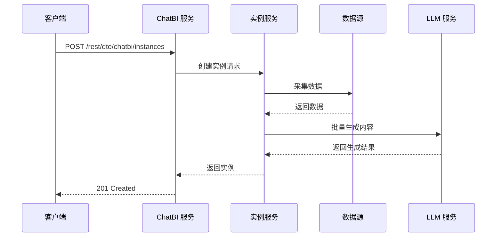
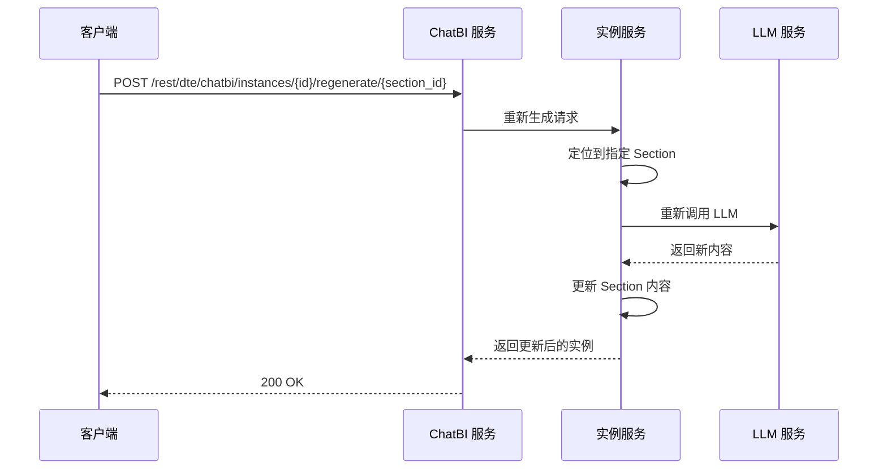
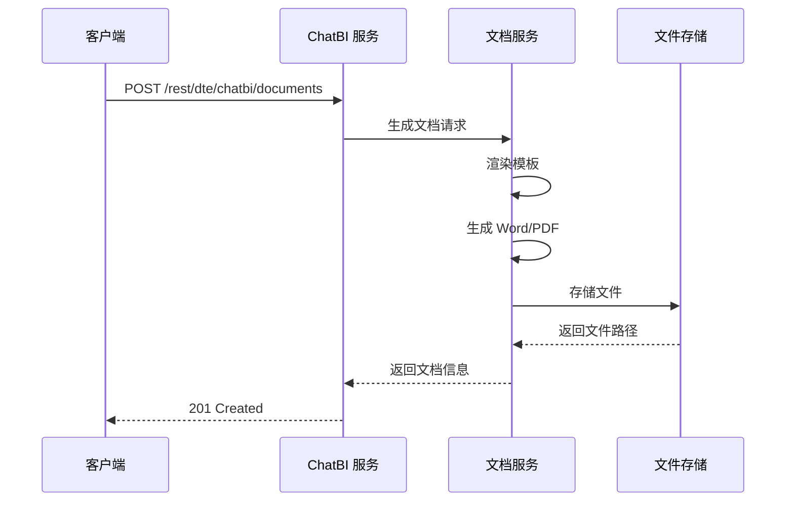

# API 接口设计

> 本文档是 [总设计文档 (design.md)](design.md) 的子文档，详细描述全量 REST API 接口定义与核心时序图。

---

## 1. 核心 API 时序图

### 1.1 生成报告实例



### 1.2 重新生成某节



### 1.3 生成报告文档



---

## 2. 报告模板

```
POST   /api/templates              # 创建报告模板
GET    /api/templates              # 列出报告模板
GET    /api/templates/{id}         # 获取模板详情
PUT    /api/templates/{id}         # 更新模板
DELETE /api/templates/{id}         # 删除模板
POST   /api/templates/{id}/clone   # 克隆模板
```

> 模板主结构以 `parameters / sections` 为准；每个 `section` 节点同时支持：
> - `outline.document + outline.blocks[]`：面向用户的章节蓝图
> - `content.datasets + presentation`：面向系统的执行链路
>
> 兼容字段 `content_params / outline` 仍可读取，但保存后统一按新版结构维护。
>
> `parameters[]` 额外支持：
> - `interaction_mode = form | chat`
>
> 该字段只影响对话收参方式，不改变模板渲染和实例结构。

> 后台实现中，`/api/templates` 路由当前只承担接口层职责；模板领域规则位于 `template_catalog` bounded context。

---

## 3. 对话交互

```
GET    /api/chat                   # 列出对话历史会话摘要
POST   /api/chat                   # 发送对话消息
POST   /api/chat/forks             # 基于消息或内部生成基线 fork 新会话
GET    /api/chat/{session_id}      # 获取单个会话历史
DELETE /api/chat/{session_id}      # 删除对话会话
```

> 聊天页进入 `/chat` 时保持空态，不自动恢复最近会话，也不预创建会话。只有首条真实用户消息发送后才创建 `ChatSession`，并以该首条用户消息生成会话标题。
>
> `POST /api/chat` 当前额外支持：
> - `preferred_capability`
> - `selected_template_id`
> - `param_id / param_value / param_values`
> - `command`
> - `target_param_id`
> - `outline_override`
>
> 对话生成链路在“大纲确认”阶段只更新当前对话上下文；真正点击“确认生成”后，系统会在创建 `ReportInstance` 的同时生成一份内部 `generation_baseline` 快照。
>
> `POST /api/chat/forks` 支持两类来源：
> - `session_message`：基于某条历史消息 fork 新会话。消息锚点使用稳定 `message_id`，用户消息 fork 会同时把该消息内容回填到输入框。
> - `template_instance`：内部使用的生成基线来源，用于从报告实例恢复到 `review_outline` 阶段。
>
> 聊天消息和会话摘要额外返回：
> - `message_id`

> 后台实现中，`/api/chat` 路由当前只承担接口层职责；统一任务路由、报告推进、fork/update 恢复位于 `conversation` bounded context。
> - `fork_meta`
>
> 当会话来源是报告实例更新时，`fork_meta.source_kind = update_from_instance`，聊天页应展示“更新来源”文案，而不是“Fork 来源”。
>
> 当报告流程正在等待 `interaction_mode=chat` 的参数时，下一轮普通自然语言输入优先按“当前参数答案”处理；只有显式表达切换意图时，才会返回 `confirm_task_switch`。

### 3.1 报告生成对话中的大纲确认

`POST /api/chat` 在报告生成能力下，会经历：

- 模板匹配
- 必填参数收集
- 大纲确认
- 确认生成

其中 `review_outline` action 当前返回的是**实例级蓝图树**，而不是简单标题列表。节点除基础结构外，还会带：

- `display_text`
- `outline_instance`
- `execution_bindings`
- `ai_generated`
- `node_kind`

前端展示时只使用可视化树信息；内部执行链路字段不会直接暴露为 JSON 编辑入口。

---

## 4. 报告实例管理

```
POST   /api/instances              # 生成报告实例
GET    /api/instances              # 列出报告实例 (新增)
GET    /api/instances/{id}         # 获取实例详情
GET    /api/instances/{id}/baseline      # 获取确认大纲/生成基线
POST   /api/instances/{id}/update-chat   # 基于生成基线恢复对话
GET    /api/instances/{id}/fork-sources  # 获取来源对话里的可 fork 消息节点
POST   /api/instances/{id}/fork-chat     # 基于指定消息节点 fork 新对话
PUT    /api/instances/{id}         # 更新实例
POST   /api/instances/{id}/regenerate/{section_id}  # 重新生成某节
POST   /api/instances/{id}/finalize  # 确认实例，准备生成文档
```

> `GET /api/instances`、`GET /api/instances/{id}` 额外返回能力标识：
> - `has_generation_baseline`
> - `supports_update_chat`
> - `supports_fork_chat`
> - `report_time`
> - `report_time_source`
>
> 对于历史数据，若实例没有内部生成基线，则这些能力标识为 `false`。

> `GET /api/instances/{id}/baseline` 返回用户可查看的“确认大纲/生成基线”视图数据；其内部快照除实例级蓝图树外，还包含已解析的执行基线，用于后续生成与章节重生成，但前端默认只展示可视化大纲。
>
> `POST /api/instances/{id}/update-chat` 返回完整 `ChatSessionDetail`，而不是仅返回 `session_id`。返回会话的可见消息固定为 1 条 `assistant/review_outline`，并附带隐藏 `context_state`，用于直接继续大纲确认。
>
> 前端约定的交互流程为：实例列表点击“更新”先进入 `/instances/{id}?intent=update` 进行基线预览，用户显式点击“继续到对话助手修改”后才调用 `update-chat` 并跳转 `/chat?session_id=...`。

---

## 5. 报告文档管理

```
POST   /api/documents              # 生成报告文档
GET    /api/documents              # 列出报告文档记录 (兼容历史)
GET    /api/documents/{id}         # 获取文档信息
GET    /api/documents/{id}/download  # 下载文档
DELETE /api/documents/{id}         # 删除文档
GET    /api/instances/{id}/documents  # 列出实例关联的所有文档
```

---

## 6. 数据源管理

```
POST   /api/data-sources           # 注册数据源
GET    /api/data-sources           # 列出数据源
GET    /api/data-sources/{id}      # 获取数据源详情
PUT    /api/data-sources/{id}      # 更新数据源
DELETE /api/data-sources/{id}      # 删除数据源
POST   /api/data-sources/{id}/test  # 测试连接
```

---

## 7. 定时任务管理

```
POST   /api/scheduled-tasks              # 创建定时任务
GET    /api/scheduled-tasks              # 列出定时任务
GET    /api/scheduled-tasks/{id}         # 获取任务详情
PUT    /api/scheduled-tasks/{id}         # 更新任务
DELETE /api/scheduled-tasks/{id}         # 删除任务
POST   /api/scheduled-tasks/{id}/pause   # 暂停任务
POST   /api/scheduled-tasks/{id}/resume  # 恢复任务
POST   /api/scheduled-tasks/{id}/run-now # 立即执行一次

# 查看任务生成的报告实例
GET    /api/scheduled-tasks/{id}/instances  # 查看任务生成的实例列表

# 任务执行记录
GET    /api/scheduled-tasks/{id}/executions  # 查看执行历史
```

> 定时任务创建/更新额外支持：
> - `time_param_name`
> - `time_format`
> - `use_schedule_time_as_report_time`
> - `source_instance_id`
> - `schedule_type`
> - `auto_generate_doc`
>
> 当开启 `use_schedule_time_as_report_time` 时，定时执行生成的新实例会写入：
> - `report_time`
> - `report_time_source = scheduled_execution`
>
> 当前产品入口固定为“从已有报告实例创建定时任务”；前端不再要求用户手工填写 `template_id`，而是从选中的 `source_instance_id` 自动带出。


---

## 8. 待细化内容

> 以下内容将在后续迭代中逐步细化：

- [ ] 各接口的请求/响应 Body 详细字段定义
- [ ] WebSocket/SSE 实时推送接口（报告生成进度）

---

## 9. DFX 接口治理基线

> 本章节给出当前 API 的统一治理基线；详细规则以 [design_dfx.md](design_dfx.md) 为准。

### 9.1 统一错误响应契约

当前对外错误响应统一收敛到以下结构：

```json
{
  "error": {
    "code": "CHAT_SESSION_NOT_FOUND",
    "category": "not_found",
    "message": "会话不存在。",
    "details": {},
    "retryable": false,
    "request_id": "req_xxx"
  }
}
```

错误类别固定为：

- `validation_error`
- `not_found`
- `conflict`
- `state_invalid`
- `quota_exceeded`
- `rate_limited`
- `upstream_error`
- `service_unavailable`
- `internal_error`

### 9.2 列表接口查询参数规范

所有列表接口统一设计为支持：

- `page`
- `page_size`
- `sort_by`
- `sort_order`

默认 `page_size = 20`，最大 `page_size = 100`。

### 9.3 接口族分级限流

| 接口族 | 规格 |
|--------|------|
| 读接口 | `120 req/min/user` |
| 普通写接口 | `30 req/min/user` |
| 重计算接口 | `10 req/min/user` |
| 下载接口 | `30 req/min/user` |

### 9.4 容量与对象上限

当前统一规格约束：

- 通用 JSON 请求体：`1 MB`
- 模板总 JSON：`512 KB`
- 模板参数数：`<= 50`
- 模板章节总节点数：`<= 200`
- 单章节蓝图区块数：`<= 20`
- 单章节 datasets 数：`<= 10`
- 实例 `input_params` JSON：`<= 128 KB`
- 实例章节数：`<= 300`
- 单章节内容：`<= 64 KB`
- 单实例总 JSON：`<= 5 MB`
- Markdown 文档文件：`<= 5 MB`

### 9.5 数据保留策略

首版采用整体长期保留：

- 模板、实例、文档、会话历史、定时任务、任务执行记录默认不自动删除
- 通过调试摘要、预览截断、样本行限制控制存储膨胀

### 9.6 定时任务时间语义专题

当前 `time_param_name + report_time` 只能表达基础时间联动。关于“任务执行时间 / 报告时间 / 报告数据时间范围”的完整关系，已记录为后续专题，后续会独立引入 `time_slots`、`data_time_start`、`data_time_end` 设计。
