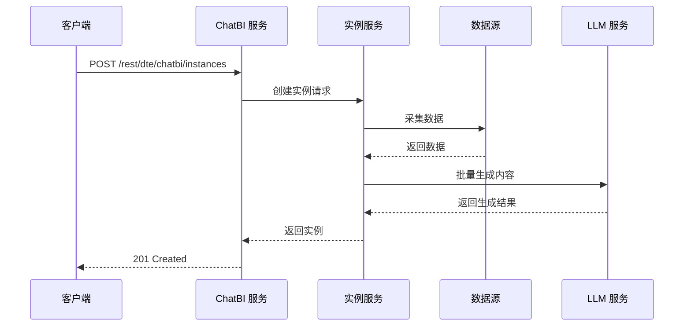
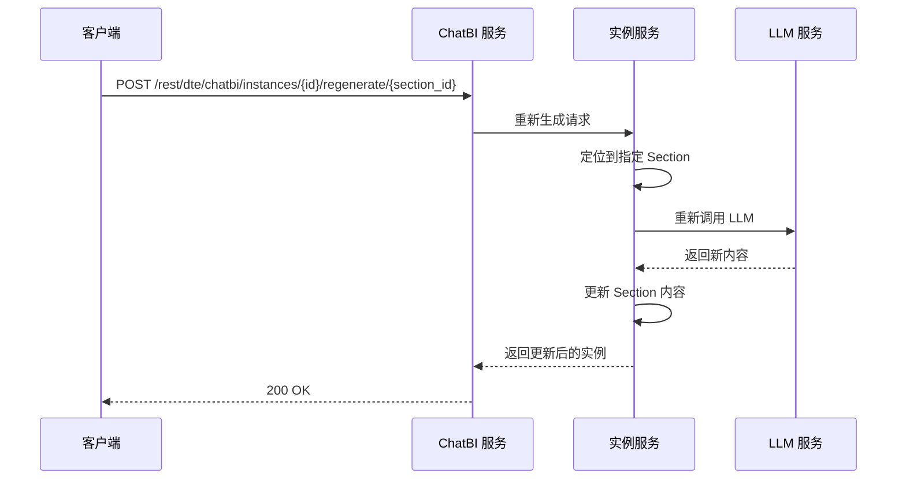
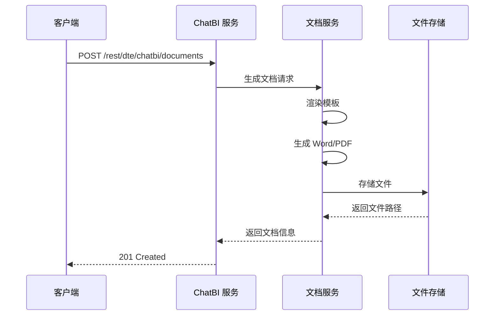

# API 接口设计

> 本文档是 [总设计文档 (design.md)](design.md) 的子文档，详细描述全量 REST API 接口定义与核心时序图。

---

## 1. 核心 API 时序图

### 1.1 生成报告实例



### 1.2 重新生成某节



### 1.3 生成报告文档



---

## 2. 报告模板

```
POST   /api/templates              # 创建报告模板
GET    /api/templates              # 列出报告模板
GET    /api/templates/{id}         # 获取模板详情
PUT    /api/templates/{id}         # 更新模板
DELETE /api/templates/{id}         # 删除模板
POST   /api/templates/{id}/clone   # 克隆模板
```

---

## 3. 对话交互

```
GET    /api/chat                   # 列出对话历史会话摘要
POST   /api/chat                   # 发送对话消息
POST   /api/chat/forks             # 基于消息或内部生成基线 fork 新会话
GET    /api/chat/{session_id}      # 获取单个会话历史
DELETE /api/chat/{session_id}      # 删除对话会话
```

> 聊天页进入 `/chat` 时保持空态，不自动恢复最近会话，也不预创建会话。只有首条真实用户消息发送后才创建 `ChatSession`，并以该首条用户消息生成会话标题。
>
> 对话生成链路在“大纲确认”阶段只更新当前对话上下文；真正点击“确认生成”后，系统会在创建 `ReportInstance` 的同时生成一份内部 `generation_baseline` 快照。
>
> `POST /api/chat/forks` 支持两类来源：
> - `session_message`：基于某条历史消息 fork 新会话。消息锚点使用稳定 `message_id`，用户消息 fork 会同时把该消息内容回填到输入框。
> - `template_instance`：内部使用的生成基线来源，用于从报告实例恢复到 `review_outline` 阶段。
>
> 聊天消息和会话摘要额外返回：
> - `message_id`
> - `fork_meta`
>
> 当会话来源是报告实例更新时，`fork_meta.source_kind = update_from_instance`，聊天页应展示“更新来源”文案，而不是“Fork 来源”。

---

## 4. 报告实例管理

```
POST   /api/instances              # 生成报告实例
GET    /api/instances              # 列出报告实例 (新增)
GET    /api/instances/{id}         # 获取实例详情
GET    /api/instances/{id}/baseline      # 获取确认大纲/生成基线
POST   /api/instances/{id}/update-chat   # 基于生成基线恢复对话
GET    /api/instances/{id}/fork-sources  # 获取来源对话里的可 fork 消息节点
POST   /api/instances/{id}/fork-chat     # 基于指定消息节点 fork 新对话
PUT    /api/instances/{id}         # 更新实例
POST   /api/instances/{id}/regenerate/{section_id}  # 重新生成某节
POST   /api/instances/{id}/finalize  # 确认实例，准备生成文档
```

> `GET /api/instances`、`GET /api/instances/{id}` 额外返回能力标识：
> - `has_generation_baseline`
> - `supports_update_chat`
> - `supports_fork_chat`
>
> 对于历史数据，若实例没有内部生成基线，则这些能力标识为 `false`。
>
> `POST /api/instances/{id}/update-chat` 返回完整 `ChatSessionDetail`，而不是仅返回 `session_id`。返回会话的可见消息固定为 1 条 `assistant/review_outline`，并附带隐藏 `context_state`，用于直接继续大纲确认。
>
> 前端约定的交互流程为：实例列表点击“更新”先进入 `/instances/{id}?intent=update` 进行基线预览，用户显式点击“继续到对话助手修改”后才调用 `update-chat` 并跳转 `/chat?session_id=...`。

---

## 5. 报告文档管理

```
POST   /api/documents              # 生成报告文档
GET    /api/documents              # 列出报告文档记录 (兼容历史)
GET    /api/documents/{id}         # 获取文档信息
GET    /api/documents/{id}/download  # 下载文档
DELETE /api/documents/{id}         # 删除文档
GET    /api/instances/{id}/documents  # 列出实例关联的所有文档
```

---

## 6. 数据源管理

```
POST   /api/data-sources           # 注册数据源
GET    /api/data-sources           # 列出数据源
GET    /api/data-sources/{id}      # 获取数据源详情
PUT    /api/data-sources/{id}      # 更新数据源
DELETE /api/data-sources/{id}      # 删除数据源
POST   /api/data-sources/{id}/test  # 测试连接
```

---

## 7. 定时任务管理

```
POST   /api/scheduled-tasks              # 创建定时任务
GET    /api/scheduled-tasks              # 列出定时任务
GET    /api/scheduled-tasks/{id}         # 获取任务详情
PUT    /api/scheduled-tasks/{id}         # 更新任务
DELETE /api/scheduled-tasks/{id}         # 删除任务
POST   /api/scheduled-tasks/{id}/pause   # 暂停任务
POST   /api/scheduled-tasks/{id}/resume  # 恢复任务
POST   /api/scheduled-tasks/{id}/run-now # 立即执行一次

# 查看任务生成的报告实例
GET    /api/scheduled-tasks/{id}/instances  # 查看任务生成的实例列表

# 任务执行记录
GET    /api/scheduled-tasks/{id}/executions  # 查看执行历史
```


---

## 8. 待细化内容

> 以下内容将在后续迭代中逐步细化：

- [ ] 各接口的请求/响应 Body 详细字段定义
- [ ] 分页、排序、过滤的通用查询参数规范
- [ ] 错误码与异常响应格式统一规范
- [ ] WebSocket/SSE 实时推送接口（报告生成进度）
