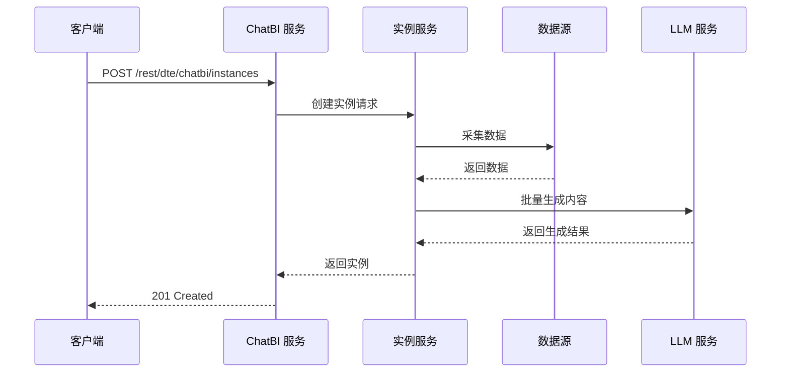
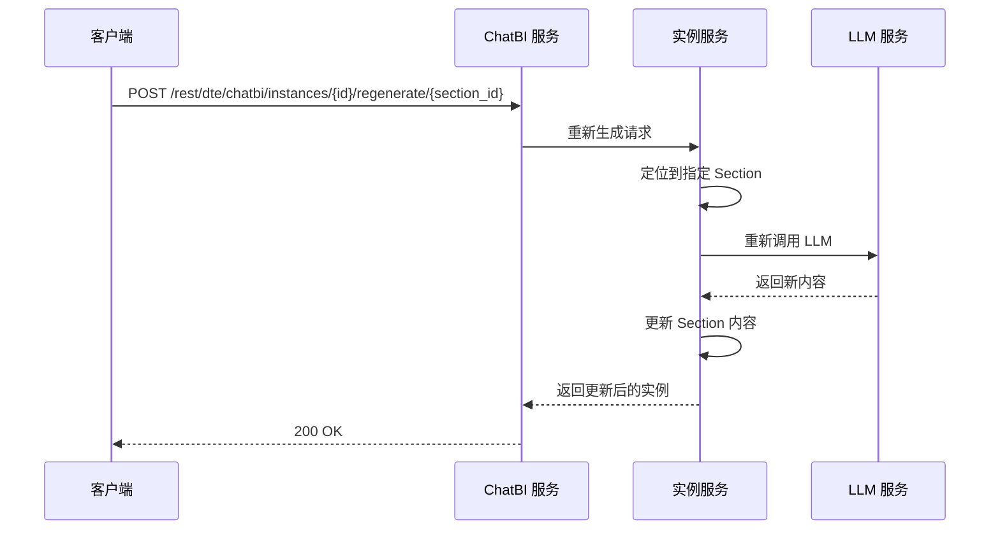
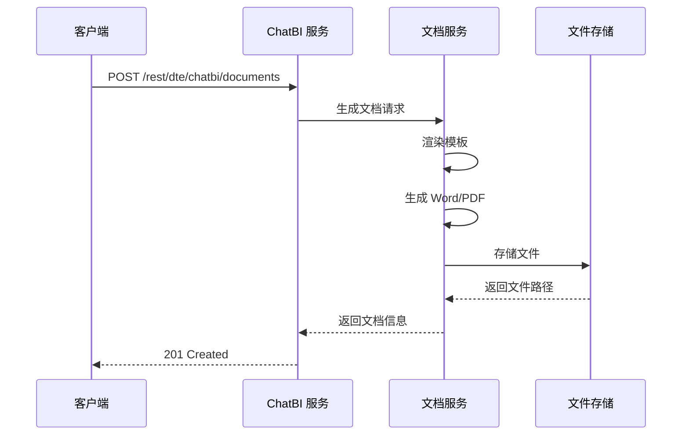

# API 接口设计

> 本文档是 [总设计文档 (design.md)](design.md) 的子文档，详细描述全量 REST API 接口定义与核心时序图。

---

## 1. 核心 API 时序图

### 1.1 生成报告实例



### 1.2 重新生成某节



### 1.3 生成报告文档



---

## 2. 报告模板管理

```
POST   /rest/dte/chatbi/templates              # 创建报告模板
GET    /rest/dte/chatbi/templates              # 列出报告模板
GET    /rest/dte/chatbi/templates/{id}         # 获取模板详情
PUT    /rest/dte/chatbi/templates/{id}         # 更新模板
DELETE /rest/dte/chatbi/templates/{id}         # 删除模板
POST   /rest/dte/chatbi/templates/{id}/clone   # 克隆模板
```

---

## 3. 对话交互

```
POST   /rest/dte/chatbi/chat                   # 发送对话消息
GET    /rest/dte/chatbi/chat/{session_id}      # 获取对话历史
DELETE /rest/dte/chatbi/chat/{session_id}      # 结束对话会话
```

---

## 4. 报告实例管理

```
POST   /rest/dte/chatbi/instances              # 生成报告实例
GET    /rest/dte/chatbi/instances/{id}         # 获取实例详情
PUT    /rest/dte/chatbi/instances/{id}         # 更新实例
POST   /rest/dte/chatbi/instances/{id}/regenerate/{section_id}  # 重新生成某节
POST   /rest/dte/chatbi/instances/{id}/finalize  # 确认实例，准备生成文档
```

---

## 5. 报告文档管理

```
POST   /rest/dte/chatbi/documents              # 生成报告文档
GET    /rest/dte/chatbi/documents/{id}         # 获取文档信息
GET    /rest/dte/chatbi/documents/{id}/download  # 下载文档
DELETE /rest/dte/chatbi/documents/{id}         # 删除文档
GET    /rest/dte/chatbi/instances/{id}/documents  # 列出实例关联的所有文档
```

---

## 6. 数据源管理

```
POST   /rest/dte/chatbi/data-sources           # 注册数据源
GET    /rest/dte/chatbi/data-sources           # 列出数据源
GET    /rest/dte/chatbi/data-sources/{id}      # 获取数据源详情
PUT    /rest/dte/chatbi/data-sources/{id}      # 更新数据源
DELETE /rest/dte/chatbi/data-sources/{id}      # 删除数据源
POST   /rest/dte/chatbi/data-sources/{id}/test  # 测试连接
```

---

## 7. 定时任务管理

```
POST   /rest/dte/chatbi/scheduled-tasks              # 创建定时任务
GET    /rest/dte/chatbi/scheduled-tasks              # 列出定时任务
GET    /rest/dte/chatbi/scheduled-tasks/{id}         # 获取任务详情
PUT    /rest/dte/chatbi/scheduled-tasks/{id}         # 更新任务
DELETE /rest/dte/chatbi/scheduled-tasks/{id}         # 删除任务
POST   /rest/dte/chatbi/scheduled-tasks/{id}/pause   # 暂停任务
POST   /rest/dte/chatbi/scheduled-tasks/{id}/resume  # 恢复任务
POST   /rest/dte/chatbi/scheduled-tasks/{id}/run-now # 立即执行一次

# 查看任务生成的报告实例
GET    /rest/dte/chatbi/scheduled-tasks/{id}/instances  # 查看任务生成的实例列表

# 任务执行记录
GET    /rest/dte/chatbi/scheduled-tasks/{id}/executions  # 查看执行历史
```

---

## 8. 待细化内容

> 以下内容将在后续迭代中逐步细化：

- [ ] 各接口的请求/响应 Body 详细字段定义
- [ ] 分页、排序、过滤的通用查询参数规范
- [ ] 错误码与异常响应格式统一规范
- [ ] WebSocket/SSE 实时推送接口（报告生成进度）
