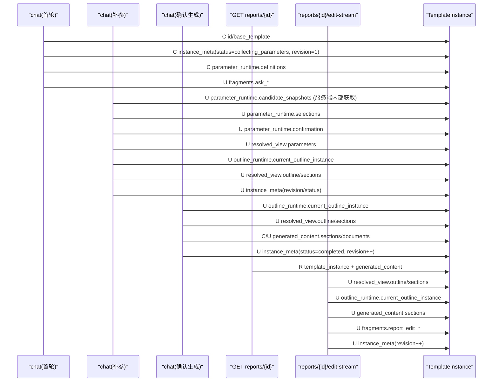

原来你帮我设计的这版接口串烧，你觉得还有什么地方可以优化一下：

# 对话制报告接口串联案例（最新口径）

> 本文档用于串联“通过统一对话流式接口制作报告”的完整业务流程。
> 口径以本次需求描述为准，允许与当前已实现接口存在差异，作为后续重构基线。
>
> 实现状态（2026-04-16）：
> - `POST /rest/chatbi/v1/chat` 已支持新契约字段，并支持可选 SSE 骨架返回（`Accept: text/event-stream`）。
> - `GET /rest/chatbi/v1/reports/{reportId}` 已落地。
> - `POST /rest/chatbi/v1/reports/{reportId}/edit-stream` 暂未实现（待后续专题）。

------

## 1. 目标与边界

- 对话入口统一使用一个流式接口，且全流程始终使用同一个 `/chat` 接口。

- 通过 `instruction` 区分意图：

  - `generate_report`：智能报告
  - `smart_query`：智能问数
  
- 本文只展开 `generate_report` 主流程。

- 报告详情返回“模板实例（Template Instance）+ 生成内容”。

- 编辑模板实例中的 `outline` 诉求时，调用“编辑报告”流式接口（SSE）。

### 1.1 命名约定（本文件统一口径）

- `conversation`：一个会话（长生命周期上下文）
- `chat`：一轮对话（一次请求与对应流式响应）

字段命名统一：

- `conversationId`：会话标识
- `chatId`：一轮对话标识

本文件不再使用其它会话命名。

------

## 2. 核心对象（目标契约）

### 2.1 ReportTemplate（模板）

```
{
  "id": "tpl_ops_daily_v1",
  "name": "运维日报模板",
  "category": "ops_daily",
  "description": "面向运维中心的日报模板",
  "parameters": [],
  "sections": []
}
```

### 2.2 TemplateInstance（模板实例，继承模板并扩展）

> 设计要求：模板实例是模板的扩展，不是平行孤立结构。

```
{
  "id": "ti_20260415_0001",
  "schema_version": "ti.v1.0",
  "base_template": {
    "id": "tpl_ops_daily_v1",
    "name": "运维日报模板",
    "category": "ops_daily",
    "description": "面向运维中心的日报模板",
    "parameters": [],
    "sections": []
  },
  "instance_meta": {
    "status": "draft|collecting_parameters|ready_for_confirmation|confirmed|generating|completed|failed",
    "revision": 3,
    "created_at": "2026-04-15T09:00:00+08:00",
    "updated_at": "2026-04-15T09:05:00+08:00"
  },
  "runtime_state": {
    "parameter_runtime": {
      "definitions": [],
      "candidate_snapshots": [],
      "selections": [],
      "confirmation": {
        "missing_param_ids": [],
        "confirmed": false
      }
    },
    "outline_runtime": {
      "current_outline_instance": []
    }
  },
  "resolved_view": {
    "parameters": {},
    "outline": [],
    "sections": []
  },
  "generated_content": {},
  "fragments": {}
}
```

------

## 3. 统一对话流式接口（SSE）

## 3.1 请求

```
POST /rest/chatbi/v1/chat
{
  "conversationId": "conv_001",
  "chatId": "chat_001",
  "instruction": "generate_report",
  "question": "帮我生成今天总部网络运行日报，重点看告警、可用性和工单闭环。"
}
```

## 3.2 SSE 事件数据（统一骨架）

```
{
  "conversationId": "conv_001",
  "chatId": "chat_001",
  "status": "running|waiting_user|finished|failed|aborted",
  "steps": [],
  "delta": [],
  "answer": null,
  "ask": null
}
```

字段约束：

- `steps`：推理步骤（用于 UI 渲染）。
- `delta`：报告内容增量变更（用于报告增量渲染）。
- `status`：当前对话状态。
- `ask`：任务中间状态（追问/确认），按 `mode` 分型。
- `answer`：任务结果状态（完成/失败结果），按 `answerType` 分型。
- `ask` 与 `answer` 互斥，不会同时出现。

## 3.3 steps 的“全量响应 delta”规则

- 全量视图：嵌套树结构（UI 可还原完整推理树）。
- 增量事件：扁平 step 列表，用 `parentStepId` 关联父节点。
- 每一步都包含：
  - `startTime`
  - `endTime`
  - `costTime`
  - `contentType`
  - `content`

step 增量示例：

```
{
  "stepId": "s3",
  "parentStepId": "s1",
  "name": "参数追问决策",
  "startTime": "2026-04-15T09:00:02.120+08:00",
  "endTime": "2026-04-15T09:00:02.310+08:00",
  "costTime": 190,
  "contentType": "json",
  "content": {
    "nextMode": "form",
    "missingParams": ["report_date", "scope", "focus_metrics"]
  }
}
```

## 3.4 delta 的结构定义（报告内容增量）

`delta` 与 `steps` 区别：

- `steps`：执行进度
- `delta`：报告内容的具体变更

`delta` 项结构：

```
{
  "action": "init_report|add_catalog|add_section",
  "category": "string",
  "title": "string",
  "description": "string",
  "catalogs": [],
  "sections": [],
  "parent_catalog": "string|null"
}
```

说明：

- `parent_catalog` 为空表示挂到根 catalog。
- `add_catalog` / `add_section` 通过 `parent_catalog` 指定父级。

------

## 4. 端到端案例（完整接口调用链）

场景：用户制作“总部网络运行日报”。

### 4.0 外部接口如何影响模板实例（总览）

| 外部接口                                              | 主要影响的模板实例字段                                       | 说明                                                         |
| ----------------------------------------------------- | ------------------------------------------------------------ | ------------------------------------------------------------ |
| `POST /rest/chatbi/v1/chat`（首轮匹配）               | `base_template`, `runtime_state.parameter_runtime.definitions`, `instance_meta.status`, `instance_meta.revision`, `fragments.*` | 选中模板并初始化实例草稿，输出追问片段                       |
| `POST /rest/chatbi/v1/chat`（补参与确认）             | `runtime_state.parameter_runtime.candidate_snapshots`, `runtime_state.parameter_runtime.selections`, `runtime_state.parameter_runtime.confirmation`, `resolved_view.parameters`, `instance_meta.status/revision` | 服务端内部先获取外部候选值并写入实例，再以统一枚举参数形式返回给 UI |
| `POST /rest/chatbi/v1/chat`（确认生成）               | `resolved_view.outline`, `resolved_view.sections`, `runtime_state.outline_runtime.current_outline_instance`, `generated_content`, `instance_meta.status/revision` | 确认后完成诉求实例化，再生成内容                             |
| `GET /rest/chatbi/v1/reports/{reportId}`              | 只读返回 `template_instance`（全量或片段）+ `generated_content` | 不改写实例，仅查询当前最新状态                               |
| `POST /rest/chatbi/v1/reports/{reportId}/edit-stream` | `resolved_view.outline`, `resolved_view.sections`, `runtime_state.outline_runtime.current_outline_instance`, `generated_content.sections`, `fragments.report_edit_*`, `instance_meta.revision` | 编辑诉求后重算实例并重生成受影响章节                         |

### 步骤 1：首轮自然语言输入，系统匹配模板并开始追问

请求：

`POST /rest/chatbi/v1/chat`（`instruction=generate_report`）

关键 SSE 片段（最终状态 `waiting_user`）：

```json
{
  "conversationId": "conv_001",
  "chatId": "chat_001",
  "status": "waiting_user",
  "steps": [
    { "stepId": "s1", "parentStepId": null, "name": "意图识别", "contentType": "text", "content": "识别为智能报告" },
    { "stepId": "s2", "parentStepId": null, "name": "模板匹配", "contentType": "json", "content": { "templateId": "tpl_ops_daily_v1", "score": 0.93 } }
  ],
  "delta": [],
  "answer": null,
  "ask": {
    "mode": "form",
    "title": "请填写参数",
    "type": "fill_params",
    "parameters": [
      { "id": "report_date", "label": "报告日期", "inputType": "date", "required": true },
      {
        "id": "scope",
        "label": "范围",
        "inputType": "enum",
        "required": true,
        "options": [
          { "label": "总部", "value": "HQ" },
          { "label": "华东", "value": "EAST_CHINA" },
          { "label": "华南", "value": "SOUTH_CHINA" }
        ]
      }
    ]
  }
}
```

### 步骤 2：多轮补参（表单 + 自然语言混合）

第二轮请求（用户提交部分参数）：

```
{
  "conversationId": "conv_001",
  "chatId": "chat_002",
  "instruction": "generate_report",
  "question": "先用今天，总部范围。",
  "reply": {
    "type": "fill_params",
    "parameters": {
      "report_date": "2026-04-15",
      "scope": "HQ"
    }
  }
}
```

若还有缺失参数，SSE 继续 `waiting_user`，`ask.mode=chat` 或 `form`（由参数配置决定）。

当追问参数来自外部数据源时，这是服务端内部行为：

- 服务端在本轮 `/chat` 处理中获取候选值
- 写入 `runtime_state.parameter_runtime.candidate_snapshots[*]`
- 对外统一按普通枚举参数返回
- UI 不感知“静态枚举”和“动态来源枚举”的差别

当参数完整后，SSE 返回“统一确认表单”：

```json
{
  "status": "waiting_user",
  "ask": {
    "mode": "form",
    "type": "confirm",
    "parameters": [
      {
        "id": "report_date",
        "label": "报告日期",
        "inputType": "date",
        "value": "2026-04-15"
      },
      {
        "id": "scope",
        "label": "范围",
        "inputType": "enum",
        "value": "hq",
        "display": "总部",
        "options": [
          { "label": "总部", "value": "HQ" },
          { "label": "华东", "value": "EAST_CHINA" },
          { "label": "华南", "value": "SOUTH_CHINA" }
        ]
      }
    ]
  }
}
```

这一轮结束后，模板实例至少发生以下刷新：

- `runtime_state.parameter_runtime.selections` 更新为当前选择快照
- `runtime_state.parameter_runtime.confirmation.confirmed=true`
- `resolved_view.parameters` 刷新为最终 `display/value/query`
- `instance_meta.status=ready_for_confirmation`
- `instance_meta.revision += 1`

请求：

```
{
  "conversationId": "conv_001",
  "chatId": "chat_003",
  "instruction": "generate_report",
  "question": "确认开始生成",
  "reply": {
    "type": "final_confirm",
    "parameters": {
      "report_date": "2026-04-15",
      "scope": "hq",
      "focus_metrics": [
        "alarm_count",
        "availability",
        "ticket_closure_rate"
      ]
    }
  },
  "command": {
    "name": "confirm_generate_report"
  }
}
```

SSE 过程：

- `status=running`：生成中，持续输出步骤（数据准备、章节生成、汇总）。
- `status=finished`：完成并返回实例标识。

该阶段内部会先刷新模板实例，再生成成品：

- 先刷新：
  - `runtime_state.outline_runtime.current_outline_instance`
  - `resolved_view.outline`
  - `resolved_view.sections`
- 再刷新：
  - `generated_content.sections`
  - `generated_content.documents`
- 最终：
  - `instance_meta.status=finished`
  - `instance_meta.revision += 1`

完成片段示例：

```json
{
  "status": "finished",
  "steps": [
    { "stepId": "s11", "parentStepId": null, "name": "生成报告骨架", "contentType": "text", "content": "已初始化报告结构" }
  ],
  "delta": [
    {
      "action": "init_report",
      "category": "ops_daily",
      "title": "总部网络运行日报",
      "description": "2026-04-15",
      "catalogs": [],
      "sections": [],
      "parent_catalog": null
    },
    {
      "action": "add_catalog",
      "category": "overview",
      "title": "运行总览",
      "description": "全局态势",
      "catalogs": [
        {
          "catalog_id": "cat_overview"
        }
      ],
      "sections": [],
      "parent_catalog": null
    },
    {
      "action": "add_section",
      "category": "overview",
      "title": "告警总览",
      "description": "重点指标摘要",
      "catalogs": [],
      "sections": [
        {
          "section_id": "sec_alarm_overview"
        }
      ],
      "parent_catalog": "cat_overview"
    }
  ],
  "answer": {
    "answerType": "report_ready",
    "reportId": "rpt_20260415_001",
    "templateInstanceId": "ti_20260415_0001",
    "summary": "报告已生成，共 8 个章节。"
  }
}
```

### 步骤 4：查询报告详情（含模板实例 + 生成内容）

`GET /rest/chatbi/v1/reports/rpt_20260415_001`

响应示例：

```json
{
  "reportId": "rpt_20260415_001",
  "status": "completed",
  "template_instance": {
    "id": "ti_20260415_0001",
    "instance_meta": {
      "status": "",
      "revision": 6
    },
    "base_template": {
      "id": "tpl_ops_daily_v1",
      "name": "运维日报模板",
      "category": "ops_daily",
      "description": "面向运维中心的日报模板"
    },
    "resolved_view": {
      "parameters": {
        "report_date": { "display": "2026-04-15", "value": "2026-04-15", "query": "2026-04-15" },
        "scope": { "display": "总部", "value": "hq", "query": "HEADQUARTER" },
        "focus_metrics": {
          "display": ["告警量", "可用性", "闭环率"],
          "value": ["alarm_count", "availability", "ticket_closure_rate"],
          "query": ["ALARM_COUNT", "AVAILABILITY", "TICKET_CLOSURE_RATE"]
        }
      },
      "outline": [
        { "node_id": "n1", "rendered_requirement": "总结总部今日告警态势..." }
      ],
      "sections": []
    }
  },
  "generated_content": {
    "sections": [
      { "node_id": "n1", "title": "告警总览", "content": "..." }
    ],
    "documents": [
      { "format": "md", "download_url": "/rest/chatbi/v1/documents/doc_001/download" }
    ]
  }
}
```

### 步骤 5：用户编辑模板实例大纲诉求，流式更新报告

`POST /rest/chatbi/v1/reports/rpt_20260415_001/edit-stream`

请求示例：

```json
{
  "instruction": "generate_report",
  "editMode": "outline_requirement",
  "patches": [
    {
      "node_id": "n1",
      "operation": "replace",
      "path": "template_instance.resolved_view.outline[0].requirement",
      "value": "总结总部今日告警态势，并按严重级别给出处置优先级建议。"
    }
  ]
}
```

SSE 完成片段：

```json
{
  "status": "finished",
  "delta": [
    {
      "action": "add_section",
      "category": "overview",
      "title": "告警总览（更新）",
      "description": "根据新诉求重生成",
      "catalogs": [],
      "sections": [
        {
          "section_id": "sec_alarm_overview"
        }
      ],
      "parent_catalog": "cat_overview"
    }
  ],
  "answer": {
    "answerType": "report_updated",
    "report_id": "rpt_20260415_001",
    "updated_nodes": ["n1"],
    "message": "已根据诉求变更完成章节重生成。"
  },
  "ask": null
}
```

这一接口对模板实例的影响：

- 更新 `resolved_view.outline` 指定节点诉求
- 同步刷新 `runtime_state.outline_runtime.current_outline_instance` 对应节点
- 重算 `resolved_view.sections` 受影响章节
- 重生成 `generated_content.sections` 的受影响节点
- 更新 `fragments.report_edit_outline_panel`
- `instance_meta.revision += 1`

---

## 5. 前端识别意图（本轮先落 UI 识别）

- 聊天输入发送时必须显式带 `instruction`。
- 最小规则：
  - 用户走“智能报告”入口 -> `instruction=generate_report`
  - 用户走“智能问数”入口 -> `instruction=smart_query`
- 前端先完成意图分流与字段透传，后端再按此路由到不同工作流。

---

## 6. 本文定义的接口清单（目标态）

- `POST /rest/chatbi/v1/chat`
  - 统一对话流式接口（报告/问数共用）
  - 首轮匹配、参数追问、参数确认、报告生成都由该接口承载
- `GET /rest/chatbi/v1/reports/{reportId}`
  - 查询报告详情（返回模板实例 + 生成内容）
- `POST /rest/chatbi/v1/reports/{reportId}/edit-stream`
  - 编辑报告（诉求变更）并流式返回重生成过程

---

## 7. 验收要点（针对本流程）

- 首轮自然语言输入后，能命中模板并触发按参数配置的 `ask.mode` 追问。
- 参数多轮补齐后，必须进入一次性“参数确认表单”。
- 确认生成时，请求体能携带“参数定义 + 可选值 + 确认值”。
- 任一时刻 `ask` 与 `answer` 互斥，不会同时出现。
- 确认生成后，SSE 能持续输出 `steps/status/delta/ask/answer`。
- 报告详情必须同时包含：
  - 模板实例（继承模板 + 扩展实例信息）
  - 生成内容
- 编辑 `outline` 诉求时，必须走 SSE 接口返回重生成过程与结果。

---

## 8. 模板实例字段生命周期图

说明：

- 横轴是流程步骤（对应外部接口调用顺序）。
- 纵轴是模板实例核心字段。
- 标记含义：
  - `C` = Create（首次建立）
  - `U` = Update（刷新）
  - `R` = Read（只读返回，不改写）
  - `-` = 无变化

| 字段                                                     | 步骤1 首轮对话匹配模板       | 步骤2 补参/追问（含服务端候选值获取）   | 步骤3 确认生成             | 步骤4 查询详情 | 步骤5 编辑诉求      |
| -------------------------------------------------------- | ---------------------------- | --------------------------------------- | -------------------------- | -------------- | ------------------- |
| `id`                                                     | C                            | -                                       | -                          | R              | R                   |
| `base_template`                                          | C                            | -                                       | -                          | R              | R                   |
| `instance_meta.status`                                   | C（`collecting_parameters`） | U（`ready_for_confirmation/confirmed`） | U（`generating/finished`） | R              | U                   |
| `instance_meta.revision`                                 | C                            | U                                       | U                          | R              | U                   |
| `runtime_state.parameter_runtime.definitions`            | C                            | -                                       | -                          | R              | R                   |
| `runtime_state.parameter_runtime.candidate_snapshots`    | -                            | U                                       | -                          | R              | R                   |
| `runtime_state.parameter_runtime.selections`             | -                            | U                                       | -                          | R              | U（如编辑涉及参数） |
| `runtime_state.parameter_runtime.confirmation`           | C（默认未确认）              | U（确认完成）                           | -                          | R              | U（如回退重选）     |
| `runtime_state.outline_runtime.current_outline_instance` | -                            | U（参数变化触发重算）                   | U（确认生成前重算）        | R              | U                   |
| `resolved_view.parameters`                               | -                            | U                                       | -                          | R              | U（如参数变化）     |
| `resolved_view.outline`                                  | -                            | U                                       | U                          | R              | U                   |
| `resolved_view.sections`                                 | -                            | U                                       | U                          | R              | U                   |
| `generated_content.sections`                             | -                            | -                                       | C/U                        | R              | U（受影响章节）     |
| `generated_content.documents`                            | -                            | -                                       | C/U                        | R              | U（按策略重产）     |
| `fragments.*`                                            | C/U                          | U                                       | U                          | R（按需返回）  | U                   |

### 8.1 时序视图（按字段分组）


