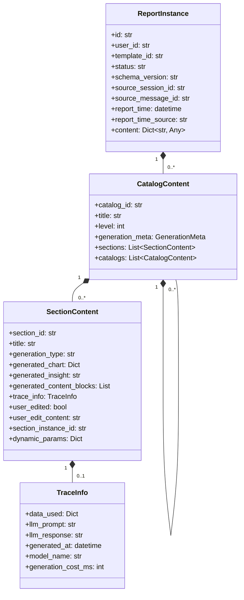
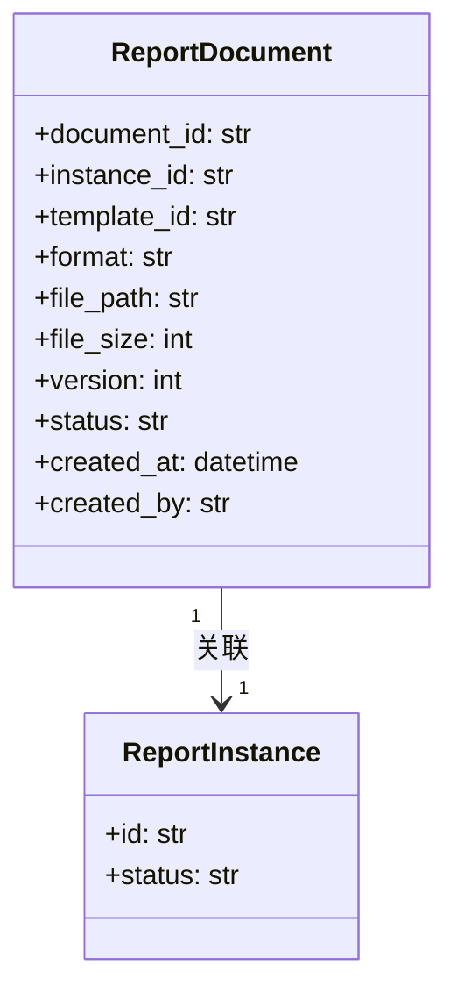

# 报告实例与文档模块设计

> 本文档是 [总设计文档 (design.md)](design.md) 的子文档，详细描述报告实例和报告文档的数据模型设计。

> 术语使用约定：实例模块重点描述持久化结构与恢复语义，因此会同时出现“诉求”业务术语与 `outline_snapshot / outline_instance` 等兼容字段名；字段名不改变其业务语义解释。

---

## 1. 内部模板实例 (TemplateInstance)

`TemplateInstance` 仍然存在，但它已经从用户侧模块退回为**内部核心运行模型**。它不再作为独立页面或独立术语暴露给用户，而是贯穿 `ReportInstance` 的制作流程被持续维护，用于支持：

- 从报告实例重新打开一轮“更新”对话
- 查看该实例生成时所确认的大纲与参数
- 基于来源会话节点继续 `Fork` 对话分支

> 代码层统一使用 `TemplateInstance` 命名；底层持久化仍落在 `template_instances`（`tbl_template_instances`）表。

在当前版本中，这份内部模型同时保存两类信息：

- **实例级诉求树**
  - 用户确认后的章节句式、诉求要素值和结构
- **执行基线**
  - 用诉求要素值解析后的执行层内容（例如 `resolved_content`）

### 1.1 数据结构

```python
@dataclass
class TemplateInstance:
    id: str
    template_id: str
    report_instance_id: str
    session_id: str
    capture_stage: str  # outline_saved / outline_confirmed / generation_baseline(兼容值)
    schema_version: str
    content: Dict[str, Any]
    created_at: datetime
    created_by: str
```

### 1.2 生命周期说明

- `prepare_outline_review`：进入大纲确认，并创建/更新当前会话对应的模板实例
- `edit_outline`：更新待确认大纲时，同步更新同一份模板实例
- `confirm_outline_generation`：生成报告实例时，将当前模板实例绑定到 `report_instance_id` 并升级为可执行完成态
  - 先保留用户确认后的实例级诉求树
  - 再把诉求值解析进执行链路，形成实例级执行基线
- `ReportInstance -> update-chat`：基于内部生成基线恢复到 `outline_review` 阶段继续修改（用户侧先在实例详情预览确认大纲，再显式进入对话）

> `TemplateInstance` 不是追加式历史记录。对每个新 `ReportInstance`，系统维护一份对应的模板实例聚合，并在生成与重生成链路持续更新其运行态。

### 1.3 模板实例内容

`TemplateInstance` 作为内部聚合对象，详细内容统一进入 `content`，由 `schema_version` 定义整体结构。

推荐 `content` 至少包含：

- `input_params_snapshot`
- `outline_snapshot`
- `warnings`

其中 `outline_snapshot` 中的章节节点当前至少包含：

- `node_id / title / description / level / children`
- `display_text`
- `outline_instance`
- `execution_bindings`
- 内部扩展：
  - `content`
  - `resolved_content`
  - `section_kind / source_kind`

这样处理的目的：

- 避免把内部概念拆成过多顶层字段
- 便于后续基线结构独立演进
- 更符合它“系统内部快照对象”的定位

说明：

- 结构字段名当前仍保留 `outline_snapshot / outline_instance`
- 但业务语义统一按“诉求树 / 诉求实例”理解

### 1.4 与对话分支的关系

- `generation_baseline` 内部模板实例可以作为“更新会话”的来源
- 报告实例的 `Fork` 入口则基于其来源对话中的消息节点发起分支
- 恢复/分支后生成新的 `ChatSession`，并记录来源信息
- 基于内部模板实例恢复时，聊天页会恢复：
  - `matched_template_id`
  - 参数快照
  - 待确认大纲
  - 大纲 warnings
- 该恢复会话继续走对话式流程，但不会修改原始报告实例

> 更新会话与 Fork 会话语义分离：
> - 更新会话：`source_kind = update_from_instance`，只注入一个可见 `review_outline` 节点（不回放原会话前后消息）
> - Fork 会话：沿用消息锚点分支语义，保留分支上下文链

---

## 2. 报告实例 (ReportInstance)

### 2.1 类图



### 2.2 数据结构

```python
@dataclass
class ReportInstance:
    id: str
    user_id: str
    template_id: str
    status: str  # draft/reviewing/finalized
    schema_version: str
    source_session_id: Optional[str] = None
    source_message_id: Optional[str] = None
    report_time: Optional[datetime] = None
    report_time_source: str = ""
    content: Dict[str, Any]
```

`ReportInstance` 的详细结构不再拆散到表顶层，而是统一进入 `content`。推荐至少包含：

- `input_params`
- `outline`
- 生成结果
- 调试/溯源信息
- 用户编辑痕迹

```python
@dataclass
class CatalogContent:
    """目录内容（内联生成内容）"""
    catalog_id: str
    title: str
    level: int
    
    generation_meta: Optional[GenerationMeta] = None
    
    sections: List['SectionContent'] = field(default_factory=list)
    catalogs: List['CatalogContent'] = field(default_factory=list)
```

```python
@dataclass
class SectionContent:
    """内容节（内联生成内容）"""
    section_id: str
    title: str
    generation_type: str
    
    # 生成内容
    generated_chart: Optional[Dict[str, Any]] = None  # ECharts DSL
    generated_insight: Optional[str] = None
    generated_content_blocks: List[Dict[str, Any]] = field(default_factory=list)
    
    # 溯源信息
    trace_info: Optional[TraceInfo] = None
    
    # 用户编辑状态
    user_edited: bool = False
    user_edit_content: Optional[str] = None
    regenerate_count: int = 0
    
    # 动态生成相关
    section_instance_id: Optional[str] = None
    dynamic_params: Optional[Dict[str, Any]] = None
```

```python
@dataclass
class TraceInfo:
    """溯源信息"""
    data_used: Dict[str, Any]
    llm_prompt: Optional[str] = None
    llm_response: Optional[str] = None
    generated_at: Optional[datetime] = None
    model_name: Optional[str] = None
    generation_cost_ms: Optional[int] = None
```

---

## 3. 报告时间语义

报告实例支持业务时间字段：

- `report_time`
  - 业务口径上的报告时间（可为空）
- `report_time_source`
  - 报告时间来源标识（可为空）

### 3.1 设计原则

- `report_time` 是业务语义时间，不替代系统审计时间 `created_at`
- 前端展示应区分“报告时间”和“创建时间”
- `report_time_source` 仅用于解释来源，不参与权限或生命周期判断

### 3.2 当前公开实现边界

- 当前公开业务面不包含定时任务模块
- `report_time` 仍作为兼容字段保留在实例模型中
- 具体来源策略由生成链路写入，不在本模块文档扩展调度语义

---

## 4. 生成基线查看、更新与分支

围绕内部 `generation_baseline`，报告实例当前支持三类延伸能力：

1. `查看确认大纲`
   - 读取内部确认诉求树与参数快照
2. `更新`
   - 先在实例详情页预览确认大纲
   - 再显式进入对话助手继续修改
3. `Fork`
   - 基于来源对话中的可见消息节点继续分支

### 4.1 能力标识

实例列表与详情当前额外返回：

- `has_generation_baseline`
- `supports_update_chat`
- `supports_fork_chat`

对历史实例，如果没有内部生成基线，则这些能力自动为 `false`。

### 4.2 报告归属与来源锚点

报告实例现在直接表达业务归属和来源，不再依赖会话反向挂载：

- `user_id`
  - 报告归属用户
  - 作为用户隔离主键
- `source_session_id`
  - 来源会话
- `source_message_id`
  - 来源消息锚点
  - 固定记录生成前最后一条可见用户消息

这意味着：

- 一个会话可以产出多份报告
- 会话本身不再保存单个 `instance_id`
- 报告是否来自会话，应由实例自身字段回答

### 4.3 与 update-chat / fork 的关系

实例恢复与分支统一采用以下优先级：

1. 优先使用 `ReportInstance.source_session_id`
2. 若为空，回退 `TemplateInstance.session_id`

这样可以同时满足：

- 新数据使用显式来源锚点
- 历史数据继续兼容 baseline 恢复链路

---

## 5. 报告文档 (ReportDocument)

### 5.1 类图



### 5.2 数据结构

```python
@dataclass
class ReportDocument:
    document_id: str
    instance_id: str
    template_id: str
    
    format: str  # word/pdf/markdown
    file_path: str  # 文档存储路径
    file_size: int
    
    version: int
    status: str  # generating/ready/failed
    
    created_at: datetime
    created_by: str

    # 文档本轮不单独保存 user_id
    # 用户归属通过 instance_id -> ReportInstance.user_id 间接判断

```

---

## 附录

- 报告实例示例请参见 `instance_example.json`
- 报告文档样例请参见 `report_sample.md`
- 内部模板实例用于承接“模板 -> 实例”的生成基线，不承担报告内容重生成职责

## 实现文档

当前版本的核心技术实现说明见：

- [implementation/report_runtime.md](implementation/report_runtime.md)
- [implementation/database_schema.md](implementation/database_schema.md)
