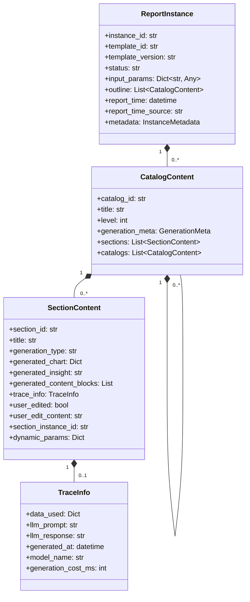
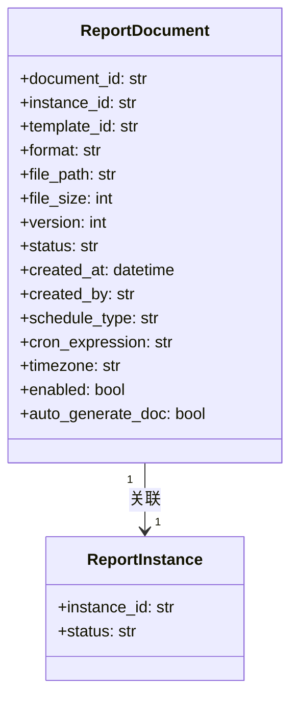

# 报告实例与文档模块设计

> 本文档是 [总设计文档 (design.md)](design.md) 的子文档，详细描述报告实例和报告文档的数据模型设计。

---

## 1. 内部模板实例 (TemplateInstance)

`TemplateInstance` 仍然存在，但它已经从用户侧模块退回为**内部生成基线快照**。它不再作为独立页面或独立术语暴露给用户，而是作为 `ReportInstance` 的生成前基线被内部保存，用于支持：

- 从报告实例重新打开一轮“更新”对话
- 查看该实例生成时所确认的大纲与参数
- 基于来源会话节点继续 `Fork` 对话分支

> 代码层当前统一使用 `GenerationBaseline` 指代这一内部概念；只有基础设施持久化层仍直接感知 `template_instances` 表。

在当前版本中，这份内部快照同时保存两类信息：

- **实例级蓝图树**
  - 用户确认后的章节句式、块值和结构
- **执行基线**
  - 用蓝图区块值解析后的执行层内容（例如 `resolved_content`）

### 1.1 数据结构

```python
@dataclass
class TemplateInstance:
    template_instance_id: str
    template_id: str
    template_version: str
    session_id: str
    capture_stage: str  # generation_baseline

    input_params_snapshot: Dict[str, Any]
    outline_snapshot: List[Dict[str, Any]]  # confirmed outline blueprint + resolved execution baseline
    warnings: List[str]

    report_instance_id: str
    created_at: datetime
    created_by: str
```

### 1.2 生命周期说明

- `prepare_outline_review`：仅进入大纲确认，不落模板实例
- `edit_outline`：只更新当前对话上下文中的待确认大纲
- `confirm_outline_generation`：生成报告实例时，同时创建其唯一的 `generation_baseline` 快照
  - 先保留用户确认后的实例级蓝图树
  - 再把蓝图值解析进执行链路，形成实例级执行基线
- `ReportInstance -> update-chat`：基于内部生成基线恢复到 `outline_review` 阶段继续修改（用户侧先在实例详情预览确认大纲，再显式进入对话）

> `TemplateInstance` 现在不再是追加式历史记录。对每个新 `ReportInstance`，系统只保留一份对应的内部生成基线。

### 1.3 基线快照内容

`outline_snapshot` 中的章节节点当前至少包含：

- `node_id / title / description / level / children`
- `display_text`
- `outline_instance`
- `execution_bindings`
- 内部扩展：
  - `content`
  - `resolved_content`
  - `section_kind / source_kind`

其中：

- `content` 保留原始执行层定义，便于后续从实例回到对话继续修改
- `resolved_content` 保留解析后的执行层定义，便于实例生成与章节重生成复用

### 1.4 与对话分支的关系

- `generation_baseline` 内部模板实例可以作为“更新会话”的来源
- 报告实例的 `Fork` 入口则基于其来源对话中的消息节点发起分支
- 恢复/分支后生成新的 `ChatSession`，并记录来源信息
- 基于内部模板实例恢复时，聊天页会恢复：
  - `matched_template_id`
  - 参数快照
  - 待确认大纲
  - 大纲 warnings
- 该恢复会话继续走对话式流程，但不会修改原始报告实例

> 更新会话与 Fork 会话语义分离：
> - 更新会话：`source_kind = update_from_instance`，只注入一个可见 `review_outline` 节点（不回放原会话前后消息）
> - Fork 会话：沿用消息锚点分支语义，保留分支上下文链

---

## 2. 报告实例 (ReportInstance)

### 2.1 类图



### 2.2 数据结构

```python
@dataclass
class ReportInstance:
    instance_id: str
    template_id: str
    template_version: str
    status: str  # draft/reviewing/finalized
    
    input_params: Dict[str, Any]
    outline: List[CatalogContent]  # 与模板结构对应，内联生成内容
    report_time: Optional[datetime] = None
    report_time_source: str = ""
    
    metadata: InstanceMetadata
```

```python
@dataclass
class CatalogContent:
    """目录内容（内联生成内容）"""
    catalog_id: str
    title: str
    level: int
    
    generation_meta: Optional[GenerationMeta] = None
    
    sections: List['SectionContent'] = field(default_factory=list)
    catalogs: List['CatalogContent'] = field(default_factory=list)
```

```python
@dataclass
class SectionContent:
    """内容节（内联生成内容）"""
    section_id: str
    title: str
    generation_type: str
    
    # 生成内容
    generated_chart: Optional[Dict[str, Any]] = None  # ECharts DSL
    generated_insight: Optional[str] = None
    generated_content_blocks: List[Dict[str, Any]] = field(default_factory=list)
    
    # 溯源信息
    trace_info: Optional[TraceInfo] = None
    
    # 用户编辑状态
    user_edited: bool = False
    user_edit_content: Optional[str] = None
    regenerate_count: int = 0
    
    # 动态生成相关
    section_instance_id: Optional[str] = None
    dynamic_params: Optional[Dict[str, Any]] = None
```

```python
@dataclass
class TraceInfo:
    """溯源信息"""
    data_used: Dict[str, Any]
    llm_prompt: Optional[str] = None
    llm_response: Optional[str] = None
    generated_at: Optional[datetime] = None
    model_name: Optional[str] = None
    generation_cost_ms: Optional[int] = None
```

---

## 3. 报告实例的双时间模型

报告实例当前同时保留：

- `created_at`
  - 真实创建/执行时间
  - 用于审计、排序和系统日志
- `report_time`
  - 业务口径上的报告时间
  - 当前主要由定时任务在执行时写入

### 3.1 设计原则

- 不伪造 `created_at`
- 不让 `report_time` 覆盖审计时间
- 前端优先展示 `report_time` 为“报告时间”，同时保留 `created_at` 为“创建时间”
- `report_time_source` 当前固定使用 `scheduled_execution`

### 3.2 对调度链路的影响

定时任务执行时会统一计算：

- `actual_run_time`
- `scheduled_time`

若任务配置了：

- `time_param_name`
  - 则把 `scheduled_time` 格式化后写入实例输入参数
- `use_schedule_time_as_report_time = true`
  - 则把 `scheduled_time` 写入实例 `report_time`

---

## 4. 生成基线查看、更新与分支

围绕内部 `generation_baseline`，报告实例当前支持三类延伸能力：

1. `查看确认大纲`
   - 读取内部确认蓝图树与参数快照
2. `更新`
   - 先在实例详情页预览确认大纲
   - 再显式进入对话助手继续修改
3. `Fork`
   - 基于来源对话中的可见消息节点继续分支

### 4.1 能力标识

实例列表与详情当前额外返回：

- `has_generation_baseline`
- `supports_update_chat`
- `supports_fork_chat`

对历史实例，如果没有内部生成基线，则这些能力自动为 `false`。

---

## 5. 报告文档 (ReportDocument)

### 5.1 类图



### 5.2 数据结构

```python
@dataclass
class ReportDocument:
    document_id: str
    instance_id: str
    template_id: str
    
    format: str  # word/pdf/markdown
    file_path: str  # 文档存储路径
    file_size: int
    
    version: int
    status: str  # generating/ready/failed
    
    created_at: datetime
    created_by: str

```

---

## 附录

- 报告实例示例请参见 `instance_example.json`
- 报告文档样例请参见 `report_sample.md`
- 内部模板实例用于承接“模板 -> 实例”的生成基线，不承担报告内容重生成职责
