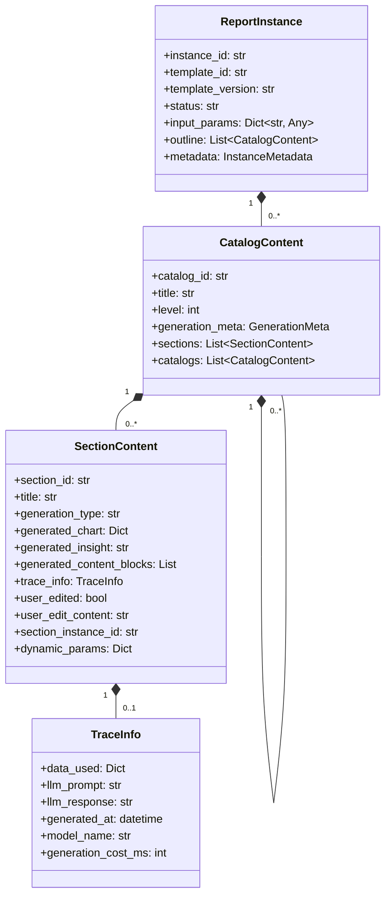
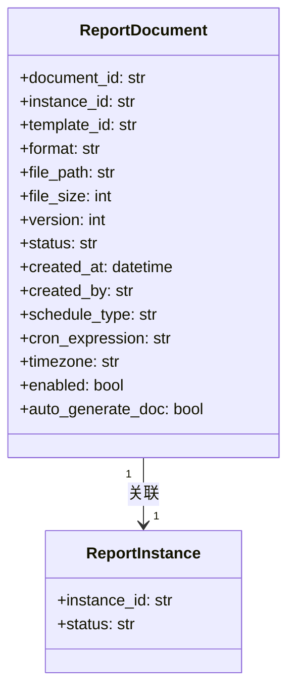

# 报告实例与文档模块设计

> 本文档是 [总设计文档 (design.md)](design.md) 的子文档，详细描述报告实例和报告文档的数据模型设计。

---

## 1. 报告实例 (ReportInstance)

### 1.1 类图



### 1.2 数据结构

```python
@dataclass
class ReportInstance:
    instance_id: str
    template_id: str
    template_version: str
    status: str  # draft/reviewing/finalized
    
    input_params: Dict[str, Any]
    outline: List[CatalogContent]  # 与模板结构对应，内联生成内容
    
    metadata: InstanceMetadata
```

```python
@dataclass
class CatalogContent:
    """目录内容（内联生成内容）"""
    catalog_id: str
    title: str
    level: int
    
    generation_meta: Optional[GenerationMeta] = None
    
    sections: List['SectionContent'] = field(default_factory=list)
    catalogs: List['CatalogContent'] = field(default_factory=list)
```

```python
@dataclass
class SectionContent:
    """内容节（内联生成内容）"""
    section_id: str
    title: str
    generation_type: str
    
    # 生成内容
    generated_chart: Optional[Dict[str, Any]] = None  # ECharts DSL
    generated_insight: Optional[str] = None
    generated_content_blocks: List[Dict[str, Any]] = field(default_factory=list)
    
    # 溯源信息
    trace_info: Optional[TraceInfo] = None
    
    # 用户编辑状态
    user_edited: bool = False
    user_edit_content: Optional[str] = None
    regenerate_count: int = 0
    
    # 动态生成相关
    section_instance_id: Optional[str] = None
    dynamic_params: Optional[Dict[str, Any]] = None
```

```python
@dataclass
class TraceInfo:
    """溯源信息"""
    data_used: Dict[str, Any]
    llm_prompt: Optional[str] = None
    llm_response: Optional[str] = None
    generated_at: Optional[datetime] = None
    model_name: Optional[str] = None
    generation_cost_ms: Optional[int] = None
```

---

## 2. 报告文档 (ReportDocument)

### 2.1 类图



### 2.2 数据结构

```python
@dataclass
class ReportDocument:
    document_id: str
    instance_id: str
    template_id: str
    
    format: str  # word/pdf/markdown
    file_path: str  # 文档存储路径
    file_size: int
    
    version: int
    status: str  # generating/ready/failed
    
    created_at: datetime
    created_by: str

```

---

## 附录

- 报告实例示例请参见 `instance_example.json`
- 报告文档样例请参见 `report_sample.md`
