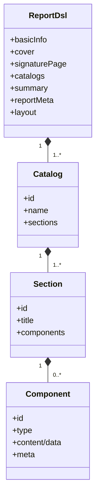

# 报告实例与文档模块设计

> 本文档是 [总设计文档 (design.md)](design.md) 的子文档，描述模板实例、Report DSL、报告实例和报告文档的数据模型设计。

> 术语使用约定：实例模块重点描述持久化结构与恢复语义，因此会同时出现“诉求”业务术语与 `outline_snapshot / outline_instance` 等兼容字段名；字段名不改变其业务语义解释。

---

## 1. 内部模板实例 (TemplateInstance)

`TemplateInstance` 是**内部核心运行模型**。它不作为独立公开资源暴露，但在以下场景中是关键对象：

- 参数收集后的诉求确认
- 报告生成前的运行时基线
- 报告详情页二次编辑诉求
- 从历史报告恢复更新会话

目标态原则：

- 模板实例主体采用 `catalog -> section`
- application 层支持平铺 delta 输入输出
- 槽位值修改不影响模板诉求骨架可用度

### 1.1 数据结构

```python
@dataclass
class TemplateInstance:
    id: str
    template_id: str
    report_instance_id: Optional[str]
    conversation_id: str
    capture_stage: str
    schema_version: str
    content: Dict[str, Any]
    created_at: datetime
    created_by: str
```

### 1.2 内容结构

`TemplateInstance.content` 统一由 `schema_version` 定义整体结构，推荐至少包含：

- `input_params_snapshot`
- `catalogs`
- `delta_views`
- `binding_status`
- `warnings`

其中 `catalogs` 中的章节节点当前至少包含：

- `catalog_id / name / sections`
- `section_id / title / description`
- `requirement_instance`
- `execution_bindings`
- `skeleton_status`

说明：

- `catalogs` 是持久化主体
- `delta_views` 是平铺交互视图，不是持久化真相
- 内部可短期兼容 `outline_snapshot / outline_instance`
- 目标态业务语义统一按 `catalog -> section` 理解

### 1.3 模板诉求骨架状态

系统内部三态：

- `reusable`
- `conditionally_reusable`
- `broken`

UI 只暴露二态：

- `not_broken`
- `broken`

判定规则：

- 修改槽位值：仍为 `reusable`
- 保留结构化诉求，但局部自由化：`conditionally_reusable`
- 关键结构断裂、无法可靠复用：`broken`

### 1.4 与对话恢复的关系

- 报告详情返回 `templateInstance`
- 用户可在前台对 `templateInstance` 二次编辑诉求
- 再经对话接口进入更新会话
- 恢复后的新会话只注入一个可继续编辑的 `review_outline` 节点，不回放原历史

---

## 2. Report DSL

`Report DSL` 是正式领域模型，定义在 `report_runtime.domain`，是报告实例的主体。

### 2.1 主结构

```python
@dataclass
class ReportDsl:
    basicInfo: Dict[str, Any]
    cover: Dict[str, Any]
    signaturePage: Dict[str, Any]
    catalogs: List[Dict[str, Any]]
    summary: Dict[str, Any]
    reportMeta: Dict[str, Any]
    layout: Dict[str, Any]
```

主结构语义：

- `catalogs -> sections -> components` 是正式主轴
- `reportMeta` 统一承接生成证据、补充信息、问题与状态
- 同一份 `Report DSL` 驱动 Markdown / Word / PPT / PDF

### 2.2 目录与组件关系



---

## 3. 报告实例 (ReportInstance)

### 3.1 数据结构

```python
@dataclass
class ReportInstance:
    id: str
    user_id: str
    template_id: str
    status: str
    schema_version: str
    source_conversation_id: Optional[str] = None
    source_chat_id: Optional[str] = None
    report_time: Optional[datetime] = None
    report_time_source: str = ""
    content: Dict[str, Any] = field(default_factory=dict)
```

### 3.2 内容结构

`ReportInstance.content` 不再以“生成内容拼装体”为主体，而统一进入：

- `dsl`
- `source_meta`
- `runtime_meta`

推荐结构：

```json
{
  "dsl": { "...": "正式 Report DSL" },
  "source_meta": {
    "template_id": "tpl_xxx",
    "template_instance_id": "ti_xxx",
    "source_conversation_id": "conv_xxx",
    "source_chat_id": "chat_xxx"
  },
  "runtime_meta": {
    "warnings": [],
    "template_skeleton_status": "reusable"
  }
}
```

设计原则：

- `ReportInstance` 的领域主体是 `Report DSL`
- 不再把 `generated_content` 作为正式对外模型
- 详情接口返回 `report + templateInstance + documents`

### 3.3 报告归属与来源锚点

报告实例直接表达业务归属和来源：

- `user_id`
- `source_conversation_id`
- `source_chat_id`

规则：

- `source_chat_id` 固定记录生成前最后一条可见用户消息
- 不记录内部空消息
- 一个会话可以产出多份报告

---

## 4. 报告时间语义

报告实例支持业务时间字段：

- `report_time`
- `report_time_source`

设计原则：

- `report_time` 是业务语义时间，不替代系统审计时间 `created_at`
- 前端展示应区分“报告时间”和“创建时间”
- `report_time_source` 仅用于解释来源，不参与权限或生命周期判断

---

## 5. 报告文档 (ReportDocument)

`ReportDocument` 是报告实例的从属资源，服务于下载、归档和版本追踪。

推荐关键字段：

- `id`
- `report_instance_id`
- `artifact_kind`
- `source_format`
- `generation_mode`
- `mime_type`
- `file_path`
- `file_size`
- `status`
- `export_job_id`
- `created_at`

说明：

- `artifact_kind` 支持 `markdown / word / ppt / pdf`
- `pdf` 首版通过 `word | ppt -> pdf` 派生生成
- 文档下载必须走 report-scoped 路径

---

## 6. 生成基线查看、更新与分支

围绕内部模板实例和正式报告实例，当前支持三类延伸能力：

1. `查看诉求`
   - 读取 `templateInstance`
2. `更新`
   - 基于 `templateInstance` 二次编辑后重新进入对话
3. `Fork`
   - 基于来源对话中的可见消息节点继续分支

### 6.1 能力标识

实例列表与详情可返回：

- `supports_update_chat`
- `supports_fork_chat`

是否可用由来源锚点和模板实例是否存在共同决定。

### 6.2 优先级

实例恢复与分支统一采用以下优先级：

1. 优先使用 `ReportInstance.source_conversation_id`
2. 若为空，回退 `TemplateInstance.conversation_id`

这样可以同时满足：

- 新数据使用显式来源锚点
- 历史数据继续兼容模板实例恢复链路
