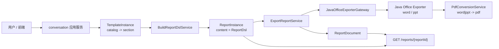
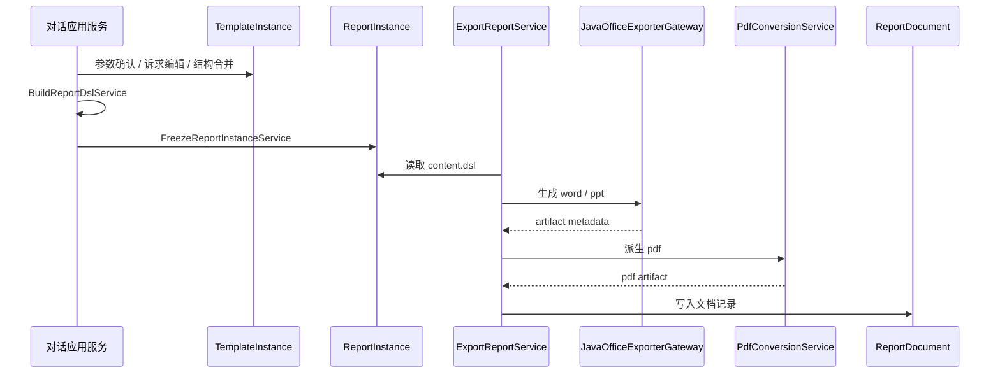

# 报告 DSL 与文档闭环设计

> 本文档描述报告系统从 `TemplateInstance` 到 `ReportDsl`，再到 `word / ppt / pdf / markdown` 文档产物的目标态设计。

## 1. 目标

本轮设计要解决 4 个核心问题：

- `ReportDsl` 要成为正式领域模型，而不是导出阶段临时拼装结果
- `ReportInstance` 要以 `catalog -> section -> component` 为主体持久化正式结构
- 对话流式生成、报告详情查看、报告二次编辑、文档生成需要共享同一份 `ReportDsl`
- 文档导出链路需要复用外部 `Java + Apache POI` 能力，但业务编排仍由 Python 主服务掌控

## 2. 总体架构



设计原则：

- `TemplateInstance` 负责运行态、恢复、继续编辑
- `ReportInstance` 负责冻结后的正式报告产物
- `ReportDsl` 是 `ReportInstance` 的主体
- 文档生成是 application 能力，不是基础设施脚本
- Java 导出器是基础设施适配器，不掌握业务主数据

## 3. 核心领域模型

### 3.1 ReportTemplate

模板定义统一为：

```text
catalogs -> sections
```

说明：

- `catalog` 表示章节目录，是业务概念，不得丢失
- `section` 表示可生成、可编辑、可复用的内容节
- `component` 不属于模板层正式主轴，只在报告 DSL 中成为运行结果

### 3.2 TemplateInstance

`TemplateInstance` 是 `report_runtime.domain` 的核心模型，建议主体结构为：

```json
{
  "conversationId": "conv_xxx",
  "templateId": "tpl_xxx",
  "catalogs": [
    {
      "id": "catalog_1",
      "name": "运行概览",
      "sections": [
        {
          "id": "section_1",
          "title": "总体态势",
          "requirementInstance": {},
          "executionBindings": [],
          "skeletonStatus": "reusable"
        }
      ]
    }
  ],
  "deltaViews": {},
  "warnings": []
}
```

关键约束：

- 主体保存树状 `catalogs -> sections`
- application 层支持平铺 delta 输入输出
- 槽位值修改不影响诉求骨架可用度

### 3.3 模板诉求骨架状态

系统内部三态：

- `reusable`
- `conditionally_reusable`
- `broken`

UI 侧二态：

- `not_broken`
- `broken`

判定规则：

- 修改槽位值：仍为 `reusable`
- 保留结构化诉求，但局部自由化：`conditionally_reusable`
- 关键结构断裂、无法可靠复用：`broken`

### 3.4 ReportDsl

`ReportDsl` 是正式领域模型，建议定义在 `report_runtime.domain`。主体结构如下：

```json
{
  "basicInfo": {},
  "cover": {},
  "signaturePage": {},
  "catalogs": [
    {
      "id": "catalog_1",
      "name": "运行概览",
      "sections": [
        {
          "id": "section_1",
          "title": "总体态势",
          "components": []
        }
      ]
    }
  ],
  "summary": {},
  "reportMeta": {},
  "layout": {}
}
```

关键约束：

- 结构以 `catalog -> section -> component` 为主
- `reportMeta` 统一承接生成证据、补充信息、问题与状态
- 同一份 `ReportDsl` 同时服务 `markdown / word / ppt / pdf`

### 3.5 ReportInstance

`ReportInstance` 的领域主体是 `ReportDsl`，建议持久化形态为：

```json
{
  "dsl": { "...": "正式 ReportDsl" },
  "sourceMeta": {
    "templateId": "tpl_xxx",
    "templateInstanceId": "ti_xxx",
    "sourceConversationId": "conv_xxx",
    "sourceChatId": "chat_xxx"
  },
  "runtimeMeta": {
    "warnings": [],
    "skeletonStatus": "reusable"
  }
}
```

## 4. 关键应用能力

### 4.1 BuildTemplateInstanceService

职责：

- 接收完整树结构与可选 delta
- 合并编辑结果
- 评估 `skeletonStatus`
- 输出标准化 `TemplateInstance`

### 4.2 BuildReportDslService

职责：

- 从 `TemplateInstance` 构建正式 `ReportDsl`
- 填充 `basicInfo / catalogs / summary / reportMeta / layout`
- 校验 schema 与语义

### 4.3 FreezeReportInstanceService

职责：

- 冻结 `TemplateInstance`
- 生成 `ReportInstance`
- 将 `ReportDsl` 持久化为实例主体

### 4.4 ExportReportService

职责：

- 读取 `ReportInstance.content.dsl`
- 调用 Java 导出器生成 `word / ppt`
- 触发 `pdf` 派生转换
- 登记 `ReportDocument`

## 5. 命名统一

本轮目标态统一使用：

- `conversationId`
- `chatId`
- `sourceConversationId`
- `sourceChatId`

不再在设计层长期保留旧命名。

## 6. 文档生成链路



## 7. 设计边界

- `ReportDsl` 是领域模型，不下沉到基础设施层
- 文档生成是 application 能力，不直接暴露给基础设施层脚本
- Java 导出器只做渲染与导出，不写业务数据库
- `pdf` 首版走派生链，不做原生 PDF DSL 渲染

## 8. 文档索引

配套文档：

- [ChatBI 报告扩展对齐](chatbi/chatbi_report_extension.md)
- [ChatBI 报告流式对齐](chatbi/chatbi_report_stream_alignment.md)
- [报告 DSL 导出实现设计](implementation/report_dsl_export.md)
