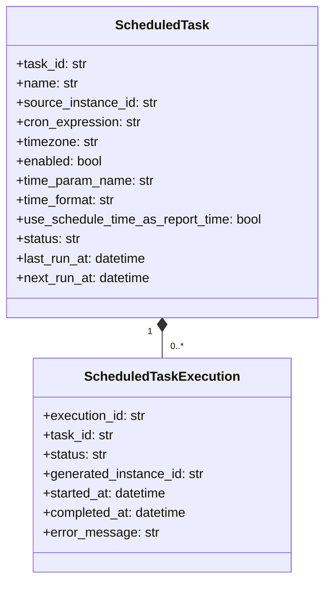
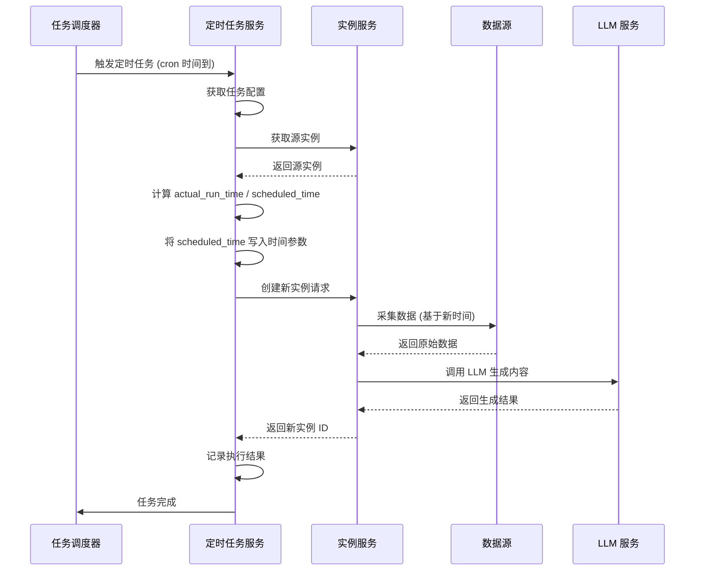

# 定时任务模块设计

> 本文档是 [总设计文档 (design.md)](design.md) 的子文档，详细描述定时任务的数据模型与执行流程设计。

---

## 1. 数据模型

### 1.1 类图



### 1.2 数据结构

```python
@dataclass
class ScheduledTask:
    """定时任务配置"""
    task_id: str
    name: str
    description: str
    
    # 关联的源实例（任意状态均可）
    source_instance_id: str
    template_id: str  # 冗余字段，方便查询
    
    # 定时配置
    cron_expression: str  # 如 "0 8 * * *" (每天 8 点)
    timezone: str = "Asia/Shanghai"
    enabled: bool = True
    
    # 参数更新规则（仅时间参数）
    time_param_name: str  # 如 "inspection_date"
    time_format: str = "%Y-%m-%d"
    use_schedule_time_as_report_time: bool = False
    
    # 元数据
    created_at: datetime
    updated_at: datetime
    created_by: str
    last_run_at: Optional[datetime] = None
    next_run_at: Optional[datetime] = None
    status: str = "active"  # active/paused/stopped
    
    # 统计信息
    total_runs: int = 0
    success_runs: int = 0
    failed_runs: int = 0
```

```python
@dataclass
class ScheduledTaskExecution:
    """定时任务执行记录"""
    execution_id: str
    task_id: str
    
    # 执行结果
    status: str  # success/failed
    generated_instance_id: Optional[str] = None
    
    # 执行详情
    started_at: datetime
    completed_at: Optional[datetime] = None
    error_message: Optional[str] = None
    
    # 使用的参数
    input_params_used: Dict[str, Any] = field(default_factory=dict)
```

---

## 2. 执行流程



---

## 3. 设计说明

### 3.1 核心设计原则

- 定时任务是独立的功能模块，不与报告生成流程强耦合
- 任意状态的报告实例都可以作为定时任务的源实例
- 每次执行生成**新的报告实例**，不覆盖原实例
- 仅替换时间参数，其他参数保持不变
- 报告实例保留双时间模型：
  - `created_at` 表示真实执行时间
  - `report_time` 表示业务报告时间

### 3.2 执行逻辑

1. 到达 cron 指定时间时触发任务
2. 获取源实例的 `input_params`
3. 统一计算两套时间：
   - `actual_run_time`：真实执行时间
   - `scheduled_time`：计划执行时间
4. 将 `time_param_name` 指定的参数替换为 `scheduled_time`
5. 若 `use_schedule_time_as_report_time=true`，则把 `scheduled_time` 写入新实例的 `report_time`
6. 基于新参数创建新的报告实例
7. 调用 LLM 生成完整报告内容
8. 记录执行结果（成功/失败）

### 3.3 约束条件

- 执行记录保留 1 年
- 任务执行失败不自动重试
- 不考虑并发执行（任务时间到即执行）
- 支持按任务配置自动生成 Markdown 文档

---

## 4. 待细化内容

> 以下内容将在后续迭代中逐步细化：

- [ ] 用户隔离的具体实现机制（行级安全 vs 应用层过滤）
- [ ] 一次性任务与周期性任务的状态机差异
- [ ] 自动生成文档的异步回调与失败处理
- [ ] 配额校验的并发安全性设计
