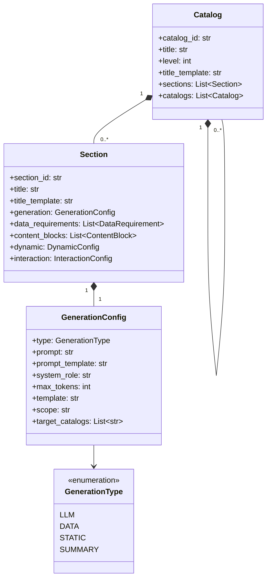

# 报告模板模块设计

> 本文档是 [总设计文档 (design.md)](design.md) 的子文档，详细描述报告模板的数据模型设计。

---

## 1. 报告模板 (ReportTemplate)

```python
@dataclass
class ReportTemplate:
    template_id: str
    name: str
    description: str
    
    report_type: str  # daily/weekly/special/urgent
    scenario: str     # 设备巡检/故障分析/容量评估等
    
    content_params: List[ContentParam]  # 内容参数定义
    outline: List[Catalog]              # 报告大纲
    
    data_sources: List[DataSource]      # 数据源配置
    output_formats: List[str]           # 支持的输出格式
    
    created_at: datetime
    updated_at: datetime
    created_by: str
    version: str
```

---

## 2. 内容参数 (ContentParam)

```python
@dataclass
class ContentParam:
    name: str
    label: str
    param_type: str  # text/number/date/select/multi_select
    
    required: bool
    default: Optional[Any]
    description: str
    
    # 取值来源（三选一）
    value_source: Optional[ValueSource]
    
    # 级联依赖
    depends_on: Optional[List[str]]
```

```python
@dataclass
class ValueSource:
    source_type: str  # static/query/api
    
    # 静态列表
    static_options: Optional[List[Dict[str, str]]]
    
    # 数据库查询
    query: Optional[QueryConfig]
    
    # API 调用
    api: Optional[APIConfig]
```

---

## 3. 报告大纲 (Outline)

### 3.1 类图



### 3.2 数据结构

```python
@dataclass
class Catalog:
    """目录节点"""
    catalog_id: str
    title: str
    level: int
    
    sections: List['Section'] = field(default_factory=list)
    catalogs: List['Catalog'] = field(default_factory=list)
    
    title_template: Optional[str] = None
```

```python
@dataclass
class Section:
    """内容节节点 - 必须隶属于某个 Catalog"""
    section_id: str
    generation: GenerationConfig
    
    title: Optional[str] = None
    title_template: Optional[str] = None
    
    data_requirements: List[DataRequirement] = field(default_factory=list)
    content_blocks: List[ContentBlock] = field(default_factory=list)
    
    dynamic: Optional[DynamicConfig] = None
    interaction: Optional[InteractionConfig] = None
```

```python
class GenerationType(Enum):
    LLM = "llm"       # LLM 生成
    DATA = "data"     # 数据驱动
    STATIC = "static" # 静态内容
    SUMMARY = "summary"  # 对同级目录内容的总结
```

```python
@dataclass
class GenerationConfig:
    type: GenerationType
    
    # LLM 类型字段
    prompt: Optional[str] = None
    prompt_template: Optional[str] = None
    system_role: Optional[str] = None
    max_tokens: Optional[int] = None
    temperature: Optional[float] = 0.7
    
    # Data 类型字段
    template: Optional[str] = None
    
    # Summary 类型字段
    scope: Optional[str] = None  # sibling_catalogs/current_catalog/all/custom
    target_catalogs: Optional[List[str]] = None
    summary_style: Optional[str] = None  # concise/detailed/executive
```

---

## 附录

详细的模板 JSON 示例请参见 `template_example.json`。
