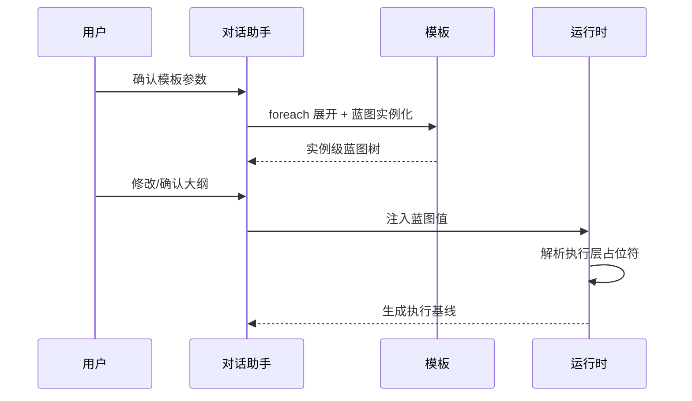

# 报告模板模块设计

> 本文档是 [总设计文档 (design.md)](design.md) 的子文档，描述报告模板在当前版本下的数据模型、章节双层结构与配置原则。

---

## 1. 模板定位

报告模板承担两类职责：

- 面向用户表达“这份报告想分析什么”
- 面向系统表达“这份报告如何查询、如何渲染、如何生成内容”

因此，模板章节节点采用**双层共存**模型：

- **蓝图层 (`outline`)**
  - 面向用户
  - 使用 `document + blocks[]` 描述章节意图与表达句式
- **执行层 (`content / datasets / presentation`)**
  - 面向系统
  - 描述数据准备、内容生成和展示方式

两层不是二选一关系，而是同属于同一个章节节点。

---

## 2. 报告模板 (ReportTemplate)

```python
@dataclass
class ReportTemplate:
    template_id: str
    name: str
    description: str

    report_type: str
    scenario: str
    type: str
    scene: str

    parameters: List[TemplateParameter]
    sections: List[TemplateSection]

    match_keywords: List[str]
    output_formats: List[str]
    schema_version: str

    created_at: datetime
    updated_at: datetime
    created_by: str
    version: str
```

### 2.1 顶层字段说明

| 字段 | 作用 |
|------|------|
| `name / description` | 模板名称与说明 |
| `report_type / scenario` | 兼容原有模板匹配与业务归类 |
| `type / scene` | 对齐新版模板规范，用于更直接的类型/场景表达 |
| `parameters` | 模板级结构化参数 |
| `sections` | 章节树，节点内同时包含蓝图层和执行层 |
| `match_keywords` | 模板匹配增强关键词 |
| `schema_version` | 当前模板结构版本，当前以 `v2.0` 为主 |

> 旧版 `content_params / outline` 仍保留兼容入口，但保存后统一按 `parameters / sections` 维护。

---

## 3. 模板参数 (TemplateParameter)

```python
@dataclass
class TemplateParameter:
    id: str
    label: str
    input_type: str  # free_text / date / enum / dynamic
    interaction_mode: str  # form / chat
    required: bool
    multi: bool

    description: str
    default: Optional[Any]

    options: Optional[List[str]]
    source: Optional[str]
```

### 3.1 参数设计原则

- 参数是模板级输入，不属于单个章节
- 所有 `required` 参数都必须在对话中显式确认
- 参数支持结构化控件映射：
  - `free_text` -> 文本输入
  - `date` -> 日期控件
  - `enum` -> 单选/多选固定候选
  - `dynamic` -> 由 `source` 提供候选
- 参数收集方式支持：
  - `interaction_mode=form` -> 结构化表单追问
  - `interaction_mode=chat` -> 自然语言追问
- `form` 与 `chat` 可在同一模板中按参数顺序混排
- `multi=true` 主要用于：
  - `foreach` 展开
  - 多对象比较/统计类模板

---

## 4. 章节双层模型 (TemplateSection)

```python
@dataclass
class TemplateSection:
    title: str
    description: str

    foreach: Optional[ForeachConfig]
    outline: Optional[OutlineBlueprint]

    content: Optional[SectionContent]
    subsections: List["TemplateSection"]
```

### 4.1 章节层职责拆分

| 层 | 字段 | 面向对象 | 作用 |
|----|------|----------|------|
| 蓝图层 | `outline` | 用户/对话助手 | 组织章节意图、确认大纲、补齐章节级变量 |
| 执行层 | `content` | 系统运行时 | 查询数据、调用 AI、渲染 Markdown |
| 结构层 | `subsections / foreach` | 两者共享 | 控制章节树与实例化展开 |

### 4.2 变量命名空间

模板运行时统一支持三类占位符：

- `{param_id}`：模板级参数
- `{$var}`：`foreach` 局部变量
- `{@block_id}`：当前章节蓝图区块

其中 `{@block_id}` 不仅能出现在蓝图文稿中，也能出现在执行层文本字段里，例如：

- `section.title`
- `section.description`
- `datasets[].source.query`
- `datasets[].source.description`
- `datasets[].source.prompt`
- `presentation.template`

---

## 5. 蓝图层 (OutlineBlueprint)

```python
@dataclass
class OutlineBlueprint:
    document: str
    blocks: List[OutlineBlock]
```

```python
@dataclass
class OutlineBlock:
    id: str
    type: str
    hint: str
    default: Optional[str]

    # 系统扩展字段
    param_id: Optional[str]
    options: Optional[List[str]]
    source: Optional[str]
    widget: Optional[str]
    multi: Optional[bool]
```

### 5.1 蓝图区块类型

当前系统对齐最新版模板语义，并补充必要的系统扩展配置，常见类型包括：

- `indicator`
- `time_range`
- `scope`
- `threshold`
- `operator`
- `enum_select`
- `number`
- `boolean`
- `free_text`
- `param_ref`

### 5.2 蓝图层设计原则

- `document` 是用户在大纲确认中直接感知的章节句式
- `blocks[]` 是章节级意图变量，不等同于模板全局参数
- `param_ref` 用于把模板参数直接映射为章节蓝图值
- 蓝图区块支持默认值、候选项、动态来源和控件语义

### 5.3 作用域规则

- `{param_id}`：全模板可见
- `{$var}`：当前 `foreach` 节点及其子树可见
- `{@block_id}`：当前章节及其子树可见
- 不允许同一路径上的蓝图区块 `id` 重名覆盖

---

## 6. 执行层 (SectionContent)

```python
@dataclass
class SectionContent:
    datasets: List[SectionDataset]
    presentation: Dict[str, Any]
```

```python
@dataclass
class SectionDataset:
    id: str
    depends_on: List[str]
    source: DatasetSource
```

### 6.1 `source.kind`

当前执行层支持：

- `sql`
- `nl2sql`
- `ai_synthesis`

### 6.2 `presentation.type`

当前展示方式支持：

- `text`
- `value`
- `simple_table`
- `chart`
- `composite_table`

### 6.3 执行层设计原则

- 执行层负责“怎么查、怎么生成、怎么展示”
- 执行层允许显式引用蓝图区块 `{@block_id}`
- 执行层本身不直接暴露给普通使用者编辑；在模板工作台中作为章节详情的独立页签维护

---

## 7. 双层映射关系

### 7.1 映射基线

映射关系采用“同章节节点双层共存 + 块级显式绑定”：

- 一个章节节点同时持有 `outline` 与 `content`
- 执行层通过 `{@block_id}` 显式引用蓝图区块
- 运行时对章节蓝图求值后，再解析执行层

### 7.2 对话生成时序



### 7.3 结果形态

在实例生成时，系统内部会形成两份相关快照：

- `confirmed_outline_blueprint`
  - 用户确认后的实例级蓝图树
- `resolved_execution_baseline`
  - 用蓝图值解析后的执行层基线

这两份快照共同构成报告实例的生成基线。

---

## 8. 模板工作台配置原则

模板编辑页按四个工作域组织：

- 基础信息
- 参数定义
- 章节工作台
- 结构预览

其中“章节工作台”内部按章节详情页签拆分为：

- `蓝图`
- `执行链路`
- `同步状态`

结构预览支持三个视图：

- `蓝图预览`
- `执行预览`
- `模板 JSON`

> JSON 预览是排查与迁移入口，不再作为主编辑方式。

---

## 9. 校验规则

模板保存前，前后端共同执行以下关键校验：

- 参数 `id` 唯一
- `enum` 至少有一个选项
- `dynamic` 必须配置 `source`
- `date` 不允许 `multi=true`
- `{@block_id}` 必须能在当前章节或祖先章节解析
- `param_ref` 必须绑定已有模板参数
- `foreach` 禁止嵌套
- `content` 与 `subsections` 互斥
- `datasets.depends_on` 必须无环

---

## 附录

- 模板设计现在以 `parameters / sections` 为主结构
- 旧版 `content_params / outline` 仅保留兼容加载入口
- 单模板导出 JSON 默认导出可迁移定义，不导出运行期系统字段
