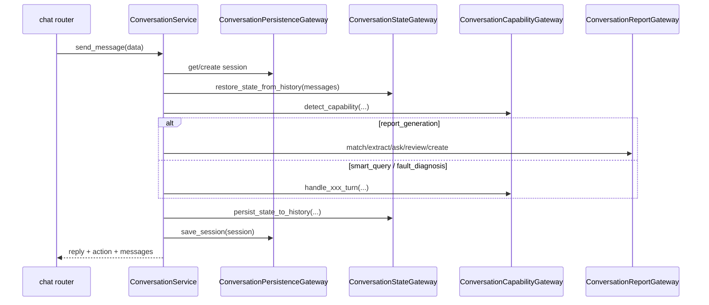

# 统一对话模块设计实现

## 1. 模块定位

`conversation` 负责统一对话入口下的会话生命周期、消息历史、单活任务路由、报告任务推进，以及会话 fork / 报告实例 update-chat 恢复。

它是用户交互的编排上下文，不直接拥有模板或报告实例主数据，但会调用 `template_catalog` 和 `report_runtime`。

## 2. 代码落点

- `E:/code/codex_projects/ReportSystemV2/src/backend/contexts/conversation/application/services.py`
- `E:/code/codex_projects/ReportSystemV2/src/backend/contexts/conversation/application/errors.py`
- `E:/code/codex_projects/ReportSystemV2/src/backend/contexts/conversation/infrastructure/gateways.py`
- `E:/code/codex_projects/ReportSystemV2/src/backend/contexts/conversation/infrastructure/capabilities.py`
- `E:/code/codex_projects/ReportSystemV2/src/backend/contexts/conversation/infrastructure/flow.py`
- `E:/code/codex_projects/ReportSystemV2/src/backend/contexts/conversation/infrastructure/parameters.py`
- `E:/code/codex_projects/ReportSystemV2/src/backend/contexts/conversation/infrastructure/forks.py`
- `E:/code/codex_projects/ReportSystemV2/src/backend/contexts/conversation/infrastructure/responses.py`
- `E:/code/codex_projects/ReportSystemV2/src/backend/contexts/conversation/infrastructure/state.py`
- `E:/code/codex_projects/ReportSystemV2/src/backend/contexts/conversation/infrastructure/sessions.py`
- `E:/code/codex_projects/ReportSystemV2/src/backend/routers/chat.py`

## 3. 核心领域概念

当前对话领域的核心概念没有完全 dataclass 化，仍主要以会话消息历史和 `ContextState` JSON 形态表达，但语义已经固定：

- `ChatSession`
  - 持久化容器，保存消息流、标题、当前关联模板/实例、fork 来源信息
- `ActiveTask`
  - 当前唯一活动任务，能力值固定为 `report_generation | smart_query | fault_diagnosis`
- `PendingSwitch`
  - 当用户中途切任务时的待确认状态
- `ReportConversationState`
  - 报告任务在对话中的推进状态：模板匹配、参数收集、大纲确认、生成完成

## 4. 分层职责

### domain

- 当前 `conversation/domain` 目录仍较轻，真正规则主要体现在 application + context-local infrastructure helper 中
- 业务语义已经固定为单活任务和显式任务切换，但尚未抽成完整 domain model

### application

- `ConversationService` 是对话上下文唯一公开应用服务
- 它编排：
  - 会话加载/创建
  - 历史消息与上下文恢复
  - 能力识别与显式切换确认
  - 报告任务推进
  - smart query / fault diagnosis 转发
  - fork / update-chat / 来源恢复

### infrastructure

- `ConversationPersistenceGateway`
  - 与 `chat_sessions`、模板记录、生成基线、实例记录交互
- `ConversationStateGateway`
  - 负责 `ContextState` 的恢复、压缩、持久化
- `ConversationCapabilityGateway`
  - 负责能力识别、问数、故障诊断、通用对话回复
- `ConversationReportGateway`
  - 负责报告流相关 helper：模板匹配、参数抽取、缺失参数、确认大纲、实例创建、基线捕获
- `ConversationForkGateway`
  - 负责消息级 fork 和从生成基线恢复更新会话

### router

- `chat.py` 只暴露：
  - `GET /api/chat`
  - `POST /api/chat`
  - `GET /api/chat/{session_id}`
  - `DELETE /api/chat/{session_id}`
  - `POST /api/chat/forks`

## 5. 核心实现链路

### 5.1 发送消息主链路

### 5.2 报告任务在对话中的推进

固定按下面规则推进：

1. 匹配模板
2. 按参数顺序收集参数
3. `interaction_mode=form` 返回结构化面板
4. `interaction_mode=chat` 返回自然语言追问
5. 参数完备后生成待确认大纲
6. 用户编辑大纲并确认生成
7. 调用 `report_runtime` 创建实例和 Markdown 文档

### 5.3 fork / update-chat

- 消息级 fork：从 `ChatSession.messages` 中按 `message_id` 构造新会话分支
- 报告实例 update-chat：先从 `template_instances` 读取内部生成基线，再恢复成只包含 `review_outline` 的更新会话

## 6. 依赖与被依赖关系

### 对外依赖

- `template_catalog`：模板匹配与模板读取
- `report_runtime`：确认大纲、实例创建、文档生成、生成基线恢复
- `infrastructure.ai.openai_compat`：自然语言对话、参数抽取、问数、故障诊断
- `infrastructure.settings.system_settings`：Provider 配置读取

### 被谁依赖

- `chat` router
- `instances` router 的 update/fork 会话创建逻辑通过该上下文恢复会话

## 7. 关联表引用

本模块主要维护：

- [chat_sessions](database_schema.md#chat_sessions)

并读取：

- [report_templates](database_schema.md#report_templates)
- [template_instances](database_schema.md#template_instances)
- [report_instances](database_schema.md#report_instances)

## 8. 可替换技术组件

### 业务规格

- 单活任务模型
- 显式能力切换确认
- `interaction_mode=form|chat` 混排收参
- 大纲确认后的实例创建和更新会话语义

### 可替换 adapter

- 对话回复生成器可替换
- 参数抽取器可替换
- fork / state persistence helper 可替换成其他存储/序列化方案
- 只要 `ConversationService` 的入参与出参行为保持不变，HTTP API 和业务规格不受影响

