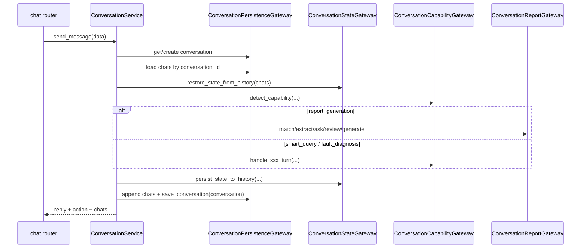

# 统一对话模块设计实现

## 1. 模块定位

`conversation` 负责统一对话入口下的会话生命周期、消息历史、单活任务路由、报告任务推进，以及会话 fork / 更新恢复。

它是用户交互的编排上下文，不直接拥有模板或报告实例主数据，但会调用 `template_catalog` 和 `report_runtime`。

## 2. 代码落点

- `E:/code/codex_projects/ReportSystemV2/src/backend/contexts/conversation/application/services.py`
- `E:/code/codex_projects/ReportSystemV2/src/backend/contexts/conversation/application/errors.py`
- `E:/code/codex_projects/ReportSystemV2/src/backend/contexts/conversation/infrastructure/gateways.py`
- `E:/code/codex_projects/ReportSystemV2/src/backend/contexts/conversation/infrastructure/capabilities.py`
- `E:/code/codex_projects/ReportSystemV2/src/backend/contexts/conversation/infrastructure/flow.py`
- `E:/code/codex_projects/ReportSystemV2/src/backend/contexts/conversation/infrastructure/parameters.py`
- `E:/code/codex_projects/ReportSystemV2/src/backend/contexts/conversation/infrastructure/forks.py`
- `E:/code/codex_projects/ReportSystemV2/src/backend/contexts/conversation/infrastructure/responses.py`
- `E:/code/codex_projects/ReportSystemV2/src/backend/contexts/conversation/infrastructure/state.py`
- `E:/code/codex_projects/ReportSystemV2/src/backend/contexts/conversation/infrastructure/sessions.py`
- `E:/code/codex_projects/ReportSystemV2/src/backend/routers/chat.py`

## 3. 核心领域概念

目标模型下，对话领域的核心概念收敛为“会话容器 + 消息流水 + 隐藏 context_state 消息”三部分：

- `Conversation`
  - 持久化容器，保存标题、所属用户、fork 来源信息和状态
- `Chat`
  - 独立消息流水，保存可见消息和隐藏 `context_state`
- `ActiveTask`
  - 当前唯一活动任务，能力值固定为 `report_generation | smart_query | fault_diagnosis`
- `PendingSwitch`
  - 当用户中途切任务时的待确认状态
- `ReportConversationState`
  - 报告任务在对话中的推进状态：模板匹配、参数收集、诉求确认、流式生成

## 4. 分层职责

### domain

- 对话领域对象统一使用 `Conversation / Chat` 语义
- 单活任务和显式任务切换是不可下沉的领域约束

### application

- `ConversationService` 是对话上下文的应用入口
- 它编排：
  - 会话加载/创建
  - 历史消息与上下文恢复
  - 能力识别与显式切换确认
  - 报告任务推进
  - smart query / fault diagnosis 转发
  - fork / 更新恢复

### infrastructure

- `ConversationPersistenceGateway`
  - 与 `tbl_chat_sessions`、`tbl_chat_messages`、模板记录、实例记录交互
- `ConversationStateGateway`
  - 负责 `ContextState` 的恢复、压缩、持久化
- `ConversationCapabilityGateway`
  - 负责能力识别、问数、故障诊断、通用对话回复
- `ConversationReportGateway`
  - 负责模板匹配、参数抽取、诉求确认、模板实例构建、报告 DSL 冻结触发
- `ConversationForkGateway`
  - 负责消息级 fork 和从模板实例恢复更新会话

### router

- `chat.py` 暴露：
  - `GET /rest/chatbi/v1/chat`
  - `POST /rest/chatbi/v1/chat`
  - `GET /rest/chatbi/v1/chat/{conversationId}`
  - `DELETE /rest/chatbi/v1/chat/{conversationId}`
  - `POST /rest/chatbi/v1/chat/forks`

## 5. 核心实现链路

### 5.1 发送消息主链路

### 5.2 报告任务推进

固定按下面规则推进：

1. 匹配模板
2. 按参数顺序收集参数
3. 构建 `TemplateInstance`
4. 用户确认诉求
5. 触发 `BuildReportDslService`
6. 进入流式 `REPORT` 生成
7. 完成后冻结 `ReportInstance`

### 5.3 fork / 更新恢复

- 消息级 fork：从 `tbl_chat_messages` 中按 `chat_id` 构造新会话分支
- 基于模板实例恢复：优先使用 `ReportInstance.source_conversation_id`，并在需要时回退 `TemplateInstance.conversation_id`

## 6. 依赖与被依赖关系

### 对外依赖

- `template_catalog`：模板匹配与模板读取
- `report_runtime`：模板实例构建、Report DSL 冻结、文档生成
- `infrastructure.ai.openai_compat`：自然语言对话、参数抽取、问数、故障诊断
- `infrastructure.settings.system_settings`：Provider 配置读取

### 被谁依赖

- `chat` router
- 报告详情页在需要恢复更新会话时，通过 `chat/forks` 进入该上下文

## 7. 关联表引用

本模块主要维护并读取：

- [database_schema.md](database_schema.md)

## 8. 可替换技术组件

### 业务规格

- 单活任务模型
- 显式能力切换确认
- `interaction_mode=form|chat` 混排收参
- 诉求确认后的流式报告生成

### 可替换 adapter

- 对话回复生成器可替换
- 参数抽取器可替换
- fork / state persistence helper 可替换
- 只要 `ConversationService` 的入参与出参行为保持不变，HTTP API 和业务规格不受影响
