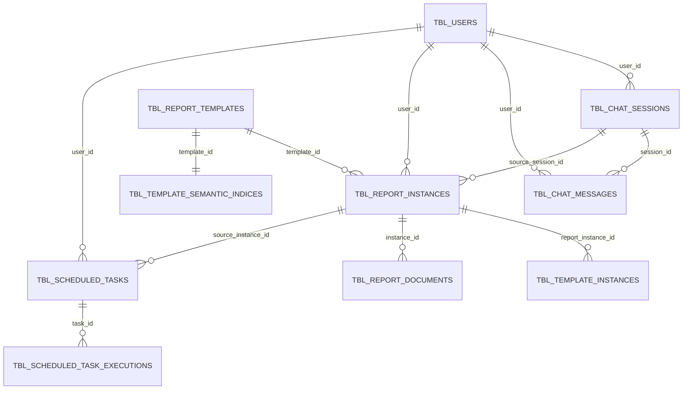

# 业务数据库表定义

## 1. 说明

本篇集中维护当前业务库表的目标设计定义，用于设计评审、接口设计、DAO/repository 实现约束和后续迁移规划。

表定义来源：

- [models.py](/E:/code/codex_projects/ReportSystemV2/src/backend/infrastructure/persistence/models.py)
- [2026-04-10-conversation-user-isolation-refactor-design.md](/E:/code/codex_projects/ReportSystemV2/docs/plans/2026-04-10-conversation-user-isolation-refactor-design.md)

当前存储实现：

- 数据库：`SQLite`
- ORM：`SQLAlchemy`

说明：

- 本文表达的是下一轮目标库表基线，不等价于当前代码已完成落表
- 当前代码中的实际表名仍然是无前缀形式，例如 `report_templates`
- 本文中的建表 SQL 采用目标规范表名，即统一使用 `tbl_` 前缀

## 2. 建表规范

统一规范如下：

1. 建表语句统一使用 `CREATE TABLE IF NOT EXISTS`
2. 表名统一使用 `tbl_` 前缀
3. 索引语句统一使用 `CREATE INDEX IF NOT EXISTS` 或 `CREATE UNIQUE INDEX IF NOT EXISTS`
4. 主键在 `CREATE TABLE` 语句中显式声明
5. 各表主键字段统一命名为 `id`
6. 外键字段保留语义化命名，例如 `user_id`、`template_id`、`instance_id`
7. 当前阶段以应用层维护关联关系为主，本文先定义逻辑关联，不强制落物理外键
8. JSON 结构字段在 SQLite 中使用 `JSON` 类型表达设计语义
9. 用户隔离统一以 `user_id` 作为业务隔离键；用户身份来自请求头 `X-User-Id`

## 2.1 数据库范式与受控反范式化

本系统的数据表设计以 `1NF ~ 3NF` 为主约束，并对 `4NF` 做补充说明。

### 1NF

要求字段取值具备原子性，避免把“一组对象关系”伪装成多个并列列。

在本系统中的体现：

- 会话与消息拆表，不再把完整消息流长期内嵌为会话主结构
- 用户、会话、消息、实例、任务等主对象各自独立建模

### 2NF

要求非主属性完整依赖于主键，而不是只依赖联合主键的一部分。

在本系统中的体现：

- 当前主表统一采用单字段主键 `id`
- 像 `tbl_report_instances.user_id`、`template_id` 这类字段都直接依赖实例主键

### 3NF

要求非主属性不通过其他非主属性形成传递依赖。

在本系统中的体现：

- 文档不直接保存用户归属，而通过 `instance_id -> report_instance.user_id` 间接判断
- 模板实例不把用户侧可见信息扩散为新的业务主对象

### 4NF（补充）

4NF 主要约束多值依赖，避免把多个相互独立的一对多集合塞进同一主表。

在本系统中的体现：

- 消息流水独立成表
- 定时任务执行记录独立成表
- 文档记录独立成表

### 受控反范式化：`schema_version + content`

模板、报告实例、模板实例三类对象采用受控反范式化：

- 表顶层只保留检索、过滤、排序、归属和审计需要的元字段
- 详细结构统一写入 `content`
- `content` 的整体结构由 `schema_version` 定义

这样设计是有意为之，而不是随意堆放 JSON。适用对象仅限：

- `tbl_report_templates`
- `tbl_report_instances`
- `tbl_template_instances`

原因：

- 这三类对象都属于“整体版本化结构”
- 结构演进频繁，且内部层级深
- 若把详细结构拆成大量顶层列，会导致表结构频繁震荡，并引入双份真相

## 3. ER 图



说明：

- 上图表达的是逻辑关联关系，不代表当前 SQLite 库已经落了外键约束
- `tbl_system_settings`、`tbl_feedbacks` 当前独立存在，不参与核心关系链
- `tbl_report_documents` 本轮不单独带 `user_id`，通过 `instance_id -> tbl_report_instances.user_id` 间接归属

## 3.1 业务概念说明

从业务视角看，这组表主要对应 5 类核心概念：

1. 用户
- 由 `tbl_users` 表示
- 是用户隔离的根概念
- 会话、消息、报告实例、定时任务都直接归属于某个用户

2. 对话
- 由 `tbl_chat_sessions + tbl_chat_messages` 共同表示
- `tbl_chat_sessions` 表示会话容器
- `tbl_chat_messages` 表示消息流水
- 一个会话下可以有多条消息，消息既包含用户可见消息，也包含隐藏的 `context_state`

3. 模板
- 由 `tbl_report_templates` 表示
- 是报告生成的结构定义和执行定义来源
- 表顶层只保留模板元字段，详细结构统一进入 `content`
- `tbl_template_semantic_indices` 是模板的语义索引附属概念，用于模板匹配，不单独面向用户

4. 报告
- 由 `tbl_report_instances` 表示
- 是用户在某次对话或某次调度中产生的业务产物
- 报告实例直接记录：
  - 归属哪个用户
  - 基于哪个模板生成
  - 若来自对话，则来自哪个会话、哪条消息
- 报告实例的详细内容统一进入 `content`
- `tbl_template_instances` 是报告生成时保留下来的内部生成基线快照
- 模板实例的详细快照统一进入 `content`
- `tbl_report_documents` 是报告实例导出的文档记录

5. 调度
- 由 `tbl_scheduled_tasks + tbl_scheduled_task_executions` 表示
- 定时任务本质上是“基于既有报告实例或模板的自动生成规则”
- 每次执行会产生一条执行记录，成功时可进一步产出新的报告实例

这些业务概念之间的关联逻辑可以概括为：

- 用户是最上层归属概念
- 用户拥有会话、消息、报告实例和定时任务
- 会话承载对话过程，消息承载对话内容
- 报告实例是用户产物之一，可以来源于会话中的某次消息触发，也可以来源于定时任务执行
- 模板定义“报告该怎么生成”，报告实例定义“某次实际生成的结果”
- 生成基线快照是报告实例的内部恢复依据，不是独立业务产物
- 文档是报告实例的导出物，不是独立于报告存在的业务对象
- 定时任务以报告实例或模板为输入，执行后继续产生新的报告实例，从而形成“实例 -> 调度 -> 新实例”的链路

因此，从业务建模上应坚持以下原则：

- 不把报告实例反向挂到会话上
- 不把消息内嵌成会话的一个 JSON 大字段
- 不把文档当成独立归属对象
- 不把生成基线快照当成用户侧主对象
- 对模板、实例、基线三类整体对象，优先使用 `schema_version + content` 管理整体结构

## 4. 表清单

| 规范表名 | 当前实现表名 | 主要维护模块 | 用途 |
|------|------|------|------|
| `tbl_users` | `users` | `identity mirror` | 用户镜像主表 |
| `tbl_report_templates` | `report_templates` | `template_catalog` | 模板主数据 |
| `tbl_report_instances` | `report_instances` | `report_runtime` | 用户可见的报告实例 |
| `tbl_template_instances` | `template_instances` | `report_runtime` | 内部生成基线快照 |
| `tbl_report_documents` | `report_documents` | `report_runtime` | 文档元数据 |
| `tbl_scheduled_tasks` | `scheduled_tasks` | `scheduling` | 定时任务定义 |
| `tbl_scheduled_task_executions` | `scheduled_task_executions` | `scheduling` | 定时任务执行记录 |
| `tbl_chat_sessions` | `chat_sessions` | `conversation` | 会话容器 |
| `tbl_chat_messages` | `chat_messages` | `conversation` | 消息流水 |
| `tbl_system_settings` | `system_settings` | `infrastructure/settings` | Provider 与系统设置 |
| `tbl_template_semantic_indices` | `template_semantic_indices` | `template_catalog` | 模板语义索引 |
| `tbl_feedbacks` | `feedbacks` | `feedback` | 用户反馈 |

## 5. 表详细定义

### 5.1 `tbl_users`

用途：保存外部身份系统的用户镜像，为业务表提供统一 `user_id` 归属和用户隔离根。

当前实现表名：暂无

| 字段名 | 类型 | 非空 | 默认值 | 说明 |
|------|------|------|------|------|
| `id` | `TEXT` | 是 | 无 | 用户主键，直接使用外部用户 ID |
| `display_name` | `TEXT` | 否 | `''` | 展示名 |
| `status` | `TEXT` | 否 | `'active'` | 用户状态 |
| `profile_json` | `JSON` | 否 | `{}` | 外部身份镜像扩展信息 |
| `created_at` | `DATETIME` | 否 | `CURRENT_TIMESTAMP` | 创建时间 |
| `updated_at` | `DATETIME` | 否 | `CURRENT_TIMESTAMP` | 更新时间 |
| `last_seen_at` | `DATETIME` | 否 | `CURRENT_TIMESTAMP` | 最近访问时间 |

```sql
CREATE TABLE IF NOT EXISTS tbl_users (
    id TEXT PRIMARY KEY,
    display_name TEXT DEFAULT '',
    status TEXT DEFAULT 'active',
    profile_json JSON DEFAULT '{}',
    created_at DATETIME DEFAULT CURRENT_TIMESTAMP,
    updated_at DATETIME DEFAULT CURRENT_TIMESTAMP,
    last_seen_at DATETIME DEFAULT CURRENT_TIMESTAMP
);

CREATE INDEX IF NOT EXISTS idx_tbl_users_status
ON tbl_users(status);

CREATE INDEX IF NOT EXISTS idx_tbl_users_last_seen_at
ON tbl_users(last_seen_at);
```

### 5.2 `tbl_report_templates`

用途：保存报告模板主定义。

当前实现表名：`report_templates`

| 字段名 | 类型 | 非空 | 默认值 | 说明 |
|------|------|------|------|------|
| `id` | `TEXT` | 是 | UUID | 模板主键 |
| `name` | `TEXT` | 是 | 无 | 模板名称 |
| `description` | `TEXT` | 否 | `''` | 模板说明 |
| `report_type` | `TEXT` | 否 | `'daily'` | 报告业务类型 |
| `template_type` | `TEXT` | 否 | `''` | 模板分类（对外契约字段名为 `category`） |
| `scene` | `TEXT` | 否 | `''` | 旧字段，已不在模板正式契约中使用 |
| `schema_version` | `TEXT` | 否 | `''` | `content` 的整体结构版本 |
| `created_at` | `DATETIME` | 否 | `CURRENT_TIMESTAMP` | 创建时间 |
| `updated_at` | `DATETIME` | 否 | `CURRENT_TIMESTAMP` | 更新时间 |
| `created_by` | `TEXT` | 否 | `'system'` | 创建人 |
| `content` | `JSON` | 否 | `{}` | 模板完整定义载荷，统一承载 `parameters / sections / match_keywords / output_formats` 等详细结构 |

```sql
CREATE TABLE IF NOT EXISTS tbl_report_templates (
    id TEXT PRIMARY KEY,
    name TEXT NOT NULL,
    description TEXT DEFAULT '',
    report_type TEXT DEFAULT 'daily',
    template_type TEXT DEFAULT '',
    scene TEXT DEFAULT '',
    schema_version TEXT DEFAULT '',
    created_at DATETIME DEFAULT CURRENT_TIMESTAMP,
    updated_at DATETIME DEFAULT CURRENT_TIMESTAMP,
    created_by TEXT DEFAULT 'system',
    content JSON DEFAULT '{}'
);

CREATE INDEX IF NOT EXISTS idx_tbl_report_templates_report_type
ON tbl_report_templates(report_type);

CREATE INDEX IF NOT EXISTS idx_tbl_report_templates_scene
ON tbl_report_templates(scene);

CREATE INDEX IF NOT EXISTS idx_tbl_report_templates_template_type
ON tbl_report_templates(template_type);

CREATE INDEX IF NOT EXISTS idx_tbl_report_templates_updated_at
ON tbl_report_templates(updated_at);
```

### 5.3 `tbl_report_instances`

用途：保存用户可见的报告实例，并直接表达报告归属用户与来源对话锚点。

当前实现表名：`report_instances`

| 字段名 | 类型 | 非空 | 默认值 | 说明 |
|------|------|------|------|------|
| `id` | `TEXT` | 是 | UUID | 实例主键 |
| `user_id` | `TEXT` | 是 | 无 | 所属用户 |
| `template_id` | `TEXT` | 是 | 无 | 来源模板 ID |
| `status` | `TEXT` | 否 | `'draft'` | 实例状态 |
| `schema_version` | `TEXT` | 否 | `''` | `content` 的整体结构版本 |
| `source_session_id` | `TEXT` | 否 | `NULL` | 来源会话 ID |
| `source_message_id` | `TEXT` | 否 | `NULL` | 来源消息锚点，固定记录生成前最后一条可见用户消息 |
| `report_time` | `DATETIME` | 否 | `NULL` | 业务报告时间 |
| `report_time_source` | `TEXT` | 否 | `''` | 报告时间来源 |
| `created_at` | `DATETIME` | 否 | `CURRENT_TIMESTAMP` | 创建时间 |
| `updated_at` | `DATETIME` | 否 | `CURRENT_TIMESTAMP` | 更新时间 |
| `created_by` | `TEXT` | 否 | `'system'` | 创建人 |
| `content` | `JSON` | 否 | `{}` | 报告实例完整载荷，统一承载 `input_params / outline / generation traces / user edits` 等详细结构 |

```sql
CREATE TABLE IF NOT EXISTS tbl_report_instances (
    id TEXT PRIMARY KEY,
    user_id TEXT NOT NULL,
    template_id TEXT NOT NULL,
    status TEXT DEFAULT 'draft',
    schema_version TEXT DEFAULT '',
    source_session_id TEXT NULL,
    source_message_id TEXT NULL,
    report_time DATETIME NULL,
    report_time_source TEXT DEFAULT '',
    created_at DATETIME DEFAULT CURRENT_TIMESTAMP,
    updated_at DATETIME DEFAULT CURRENT_TIMESTAMP,
    created_by TEXT DEFAULT 'system',
    content JSON DEFAULT '{}'
);

CREATE INDEX IF NOT EXISTS idx_tbl_report_instances_user_id
ON tbl_report_instances(user_id);

CREATE INDEX IF NOT EXISTS idx_tbl_report_instances_template_id
ON tbl_report_instances(template_id);

CREATE INDEX IF NOT EXISTS idx_tbl_report_instances_source_session_id
ON tbl_report_instances(source_session_id);

CREATE INDEX IF NOT EXISTS idx_tbl_report_instances_source_message_id
ON tbl_report_instances(source_message_id);

CREATE INDEX IF NOT EXISTS idx_tbl_report_instances_status
ON tbl_report_instances(status);

CREATE INDEX IF NOT EXISTS idx_tbl_report_instances_report_time
ON tbl_report_instances(report_time);

CREATE INDEX IF NOT EXISTS idx_tbl_report_instances_updated_at
ON tbl_report_instances(updated_at);
```

### 5.4 `tbl_template_instances`

用途：保存内部生成基线快照。

关联策略说明：

- `tbl_template_instances.report_instance_id -> tbl_report_instances.id`
- 外键放在 `template_instances` 一侧，而不是 `report_instances` 一侧
- 原因是 `TemplateInstance` 属于内部依附对象，`ReportInstance` 属于用户主对象
- 这样可以避免把内部快照 ID 暴露为实例主表字段

当前实现表名：`template_instances`

| 字段名 | 类型 | 非空 | 默认值 | 说明 |
|------|------|------|------|------|
| `id` | `TEXT` | 是 | UUID | 基线快照主键 |
| `template_id` | `TEXT` | 是 | 无 | 来源模板 ID |
| `report_instance_id` | `TEXT` | 否 | `NULL` | 关联实例 ID，设计上要求同一实例最多一份内部生成基线 |
| `session_id` | `TEXT` | 否 | `''` | 来源会话 ID，仅用于 baseline 恢复与历史兼容回退 |
| `capture_stage` | `TEXT` | 否 | `'outline_saved'` | 捕获阶段 |
| `schema_version` | `TEXT` | 否 | `''` | `content` 的整体结构版本 |
| `created_at` | `DATETIME` | 否 | `CURRENT_TIMESTAMP` | 创建时间 |
| `created_by` | `TEXT` | 否 | `'system'` | 创建人 |
| `content` | `JSON` | 否 | `{}` | 基线完整快照，统一承载 `input_params_snapshot / outline_snapshot / warnings` 等详细结构 |

```sql
CREATE TABLE IF NOT EXISTS tbl_template_instances (
    id TEXT PRIMARY KEY,
    template_id TEXT NOT NULL,
    report_instance_id TEXT NULL,
    session_id TEXT DEFAULT '',
    capture_stage TEXT DEFAULT 'outline_saved',
    schema_version TEXT DEFAULT '',
    created_at DATETIME DEFAULT CURRENT_TIMESTAMP,
    created_by TEXT DEFAULT 'system',
    content JSON DEFAULT '{}'
);

CREATE INDEX IF NOT EXISTS idx_tbl_template_instances_template_id
ON tbl_template_instances(template_id);

CREATE INDEX IF NOT EXISTS idx_tbl_template_instances_session_id
ON tbl_template_instances(session_id);

CREATE UNIQUE INDEX IF NOT EXISTS uk_tbl_template_instances_report_instance_id
ON tbl_template_instances(report_instance_id);

CREATE INDEX IF NOT EXISTS idx_tbl_template_instances_created_at
ON tbl_template_instances(created_at);
```

### 5.5 `tbl_report_documents`

用途：保存文档元数据。

当前实现表名：`report_documents`

| 字段名 | 类型 | 非空 | 默认值 | 说明 |
|------|------|------|------|------|
| `id` | `TEXT` | 是 | UUID | 文档主键 |
| `instance_id` | `TEXT` | 是 | 无 | 所属实例 ID |
| `template_id` | `TEXT` | 否 | `''` | 来源模板 ID |
| `format` | `TEXT` | 否 | `'md'` | 文档格式 |
| `file_path` | `TEXT` | 否 | `''` | 文件路径 |
| `file_size` | `INTEGER` | 否 | `0` | 文件大小（字节） |
| `version` | `INTEGER` | 否 | `1` | 版本号 |
| `status` | `TEXT` | 否 | `'ready'` | 文档状态 |
| `created_at` | `DATETIME` | 否 | `CURRENT_TIMESTAMP` | 创建时间 |
| `created_by` | `TEXT` | 否 | `'system'` | 创建人 |

```sql
CREATE TABLE IF NOT EXISTS tbl_report_documents (
    id TEXT PRIMARY KEY,
    instance_id TEXT NOT NULL,
    template_id TEXT DEFAULT '',
    format TEXT DEFAULT 'md',
    file_path TEXT DEFAULT '',
    file_size INTEGER DEFAULT 0,
    version INTEGER DEFAULT 1,
    status TEXT DEFAULT 'ready',
    created_at DATETIME DEFAULT CURRENT_TIMESTAMP,
    created_by TEXT DEFAULT 'system'
);

CREATE INDEX IF NOT EXISTS idx_tbl_report_documents_instance_id
ON tbl_report_documents(instance_id);

CREATE INDEX IF NOT EXISTS idx_tbl_report_documents_template_id
ON tbl_report_documents(template_id);

CREATE INDEX IF NOT EXISTS idx_tbl_report_documents_format
ON tbl_report_documents(format);

CREATE UNIQUE INDEX IF NOT EXISTS uk_tbl_report_documents_instance_format_version
ON tbl_report_documents(instance_id, format, version);
```

### 5.6 `tbl_scheduled_tasks`

用途：保存定时任务定义。

当前实现表名：`scheduled_tasks`

| 字段名 | 类型 | 非空 | 默认值 | 说明 |
|------|------|------|------|------|
| `id` | `TEXT` | 是 | UUID | 任务主键 |
| `user_id` | `TEXT` | 是 | 无 | 所属用户 |
| `name` | `TEXT` | 是 | 无 | 任务名称 |
| `description` | `TEXT` | 否 | `''` | 任务说明 |
| `source_instance_id` | `TEXT` | 否 | `''` | 来源实例 ID |
| `template_id` | `TEXT` | 否 | `''` | 模板 ID |
| `schedule_type` | `TEXT` | 否 | `'recurring'` | 调度类型 |
| `cron_expression` | `TEXT` | 否 | `''` | cron 表达式 |
| `timezone` | `TEXT` | 否 | `'Asia/Shanghai'` | 时区 |
| `enabled` | `BOOLEAN` | 否 | `1` | 是否启用 |
| `auto_generate_doc` | `BOOLEAN` | 否 | `1` | 是否自动出文档 |
| `time_param_name` | `TEXT` | 否 | `'date'` | 时间参数名 |
| `time_format` | `TEXT` | 否 | `'%Y-%m-%d'` | 时间格式 |
| `use_schedule_time_as_report_time` | `BOOLEAN` | 否 | `0` | 是否使用调度时间作为报告时间 |
| `created_at` | `DATETIME` | 否 | `CURRENT_TIMESTAMP` | 创建时间 |
| `updated_at` | `DATETIME` | 否 | `CURRENT_TIMESTAMP` | 更新时间 |
| `last_run_at` | `DATETIME` | 否 | `NULL` | 最近执行时间 |
| `next_run_at` | `DATETIME` | 否 | `NULL` | 下次执行时间 |
| `status` | `TEXT` | 否 | `'active'` | 任务状态 |
| `total_runs` | `INTEGER` | 否 | `0` | 总执行次数 |
| `success_runs` | `INTEGER` | 否 | `0` | 成功次数 |
| `failed_runs` | `INTEGER` | 否 | `0` | 失败次数 |

```sql
CREATE TABLE IF NOT EXISTS tbl_scheduled_tasks (
    id TEXT PRIMARY KEY,
    user_id TEXT NOT NULL,
    name TEXT NOT NULL,
    description TEXT DEFAULT '',
    source_instance_id TEXT DEFAULT '',
    template_id TEXT DEFAULT '',
    schedule_type TEXT DEFAULT 'recurring',
    cron_expression TEXT DEFAULT '',
    timezone TEXT DEFAULT 'Asia/Shanghai',
    enabled BOOLEAN DEFAULT 1,
    auto_generate_doc BOOLEAN DEFAULT 1,
    time_param_name TEXT DEFAULT 'date',
    time_format TEXT DEFAULT '%Y-%m-%d',
    use_schedule_time_as_report_time BOOLEAN DEFAULT 0,
    created_at DATETIME DEFAULT CURRENT_TIMESTAMP,
    updated_at DATETIME DEFAULT CURRENT_TIMESTAMP,
    last_run_at DATETIME NULL,
    next_run_at DATETIME NULL,
    status TEXT DEFAULT 'active',
    total_runs INTEGER DEFAULT 0,
    success_runs INTEGER DEFAULT 0,
    failed_runs INTEGER DEFAULT 0
);

CREATE INDEX IF NOT EXISTS idx_tbl_scheduled_tasks_user_id
ON tbl_scheduled_tasks(user_id);

CREATE INDEX IF NOT EXISTS idx_tbl_scheduled_tasks_source_instance_id
ON tbl_scheduled_tasks(source_instance_id);

CREATE INDEX IF NOT EXISTS idx_tbl_scheduled_tasks_template_id
ON tbl_scheduled_tasks(template_id);

CREATE INDEX IF NOT EXISTS idx_tbl_scheduled_tasks_enabled_status
ON tbl_scheduled_tasks(enabled, status);

CREATE INDEX IF NOT EXISTS idx_tbl_scheduled_tasks_next_run_at
ON tbl_scheduled_tasks(next_run_at);
```

### 5.7 `tbl_scheduled_task_executions`

用途：保存定时任务执行记录。

当前实现表名：`scheduled_task_executions`

| 字段名 | 类型 | 非空 | 默认值 | 说明 |
|------|------|------|------|------|
| `id` | `TEXT` | 是 | UUID | 执行记录主键 |
| `task_id` | `TEXT` | 是 | 无 | 所属任务 ID |
| `status` | `TEXT` | 否 | `'success'` | 执行状态 |
| `generated_instance_id` | `TEXT` | 否 | `NULL` | 生成的实例 ID |
| `started_at` | `DATETIME` | 否 | `CURRENT_TIMESTAMP` | 开始时间 |
| `completed_at` | `DATETIME` | 否 | `NULL` | 完成时间 |
| `error_message` | `TEXT` | 否 | `NULL` | 错误信息 |
| `input_params_used` | `JSON` | 否 | `{}` | 本次执行使用的参数 |

```sql
CREATE TABLE IF NOT EXISTS tbl_scheduled_task_executions (
    id TEXT PRIMARY KEY,
    task_id TEXT NOT NULL,
    status TEXT DEFAULT 'success',
    generated_instance_id TEXT NULL,
    started_at DATETIME DEFAULT CURRENT_TIMESTAMP,
    completed_at DATETIME NULL,
    error_message TEXT NULL,
    input_params_used JSON DEFAULT '{}'
);

CREATE INDEX IF NOT EXISTS idx_tbl_scheduled_task_executions_task_id
ON tbl_scheduled_task_executions(task_id);

CREATE INDEX IF NOT EXISTS idx_tbl_scheduled_task_executions_status
ON tbl_scheduled_task_executions(status);

CREATE INDEX IF NOT EXISTS idx_tbl_scheduled_task_executions_started_at
ON tbl_scheduled_task_executions(started_at);

CREATE INDEX IF NOT EXISTS idx_tbl_scheduled_task_executions_generated_instance_id
ON tbl_scheduled_task_executions(generated_instance_id);
```

### 5.8 `tbl_chat_sessions`

用途：保存统一对话会话容器，不再内嵌消息历史和实例反向关联。

当前实现表名：`chat_sessions`

| 字段名 | 类型 | 非空 | 默认值 | 说明 |
|------|------|------|------|------|
| `id` | `TEXT` | 是 | UUID | 会话主键 |
| `user_id` | `TEXT` | 是 | 无 | 所属用户 |
| `title` | `TEXT` | 否 | `''` | 会话标题 |
| `fork_meta` | `JSON` | 否 | `{}` | fork / update 来源信息 |
| `status` | `TEXT` | 否 | `'active'` | 会话状态 |
| `created_at` | `DATETIME` | 否 | `CURRENT_TIMESTAMP` | 创建时间 |
| `updated_at` | `DATETIME` | 否 | `CURRENT_TIMESTAMP` | 更新时间 |

```sql
CREATE TABLE IF NOT EXISTS tbl_chat_sessions (
    id TEXT PRIMARY KEY,
    user_id TEXT NOT NULL,
    title TEXT DEFAULT '',
    fork_meta JSON DEFAULT '{}',
    status TEXT DEFAULT 'active',
    created_at DATETIME DEFAULT CURRENT_TIMESTAMP,
    updated_at DATETIME DEFAULT CURRENT_TIMESTAMP
);

CREATE INDEX IF NOT EXISTS idx_tbl_chat_sessions_user_id
ON tbl_chat_sessions(user_id);

CREATE INDEX IF NOT EXISTS idx_tbl_chat_sessions_updated_at
ON tbl_chat_sessions(updated_at);
```

### 5.9 `tbl_chat_messages`

用途：保存统一对话消息流水。

当前实现表名：暂无

| 字段名 | 类型 | 非空 | 默认值 | 说明 |
|------|------|------|------|------|
| `id` | `TEXT` | 是 | UUID/历史 message_id | 消息主键，沿用现有稳定 `message_id` 语义 |
| `session_id` | `TEXT` | 是 | 无 | 所属会话 ID |
| `user_id` | `TEXT` | 是 | 无 | 所属用户 |
| `role` | `TEXT` | 是 | 无 | `user / assistant / system` |
| `content` | `TEXT` | 否 | `''` | 消息文本内容 |
| `action` | `JSON` | 否 | `NULL` | 结构化动作载荷 |
| `meta` | `JSON` | 否 | `{}` | 扩展元信息，含隐藏 `context_state` |
| `seq_no` | `INTEGER` | 是 | 无 | 会话内顺序号 |
| `created_at` | `DATETIME` | 否 | `CURRENT_TIMESTAMP` | 创建时间 |

```sql
CREATE TABLE IF NOT EXISTS tbl_chat_messages (
    id TEXT PRIMARY KEY,
    session_id TEXT NOT NULL,
    user_id TEXT NOT NULL,
    role TEXT NOT NULL,
    content TEXT DEFAULT '',
    action JSON NULL,
    meta JSON DEFAULT '{}',
    seq_no INTEGER NOT NULL,
    created_at DATETIME DEFAULT CURRENT_TIMESTAMP
);

CREATE UNIQUE INDEX IF NOT EXISTS uk_tbl_chat_messages_session_seq_no
ON tbl_chat_messages(session_id, seq_no);

CREATE INDEX IF NOT EXISTS idx_tbl_chat_messages_user_id_created_at
ON tbl_chat_messages(user_id, created_at);

CREATE INDEX IF NOT EXISTS idx_tbl_chat_messages_session_id_created_at
ON tbl_chat_messages(session_id, created_at);

CREATE INDEX IF NOT EXISTS idx_tbl_chat_messages_session_id
ON tbl_chat_messages(session_id);
```

### 5.10 `tbl_system_settings`

用途：保存系统级 Completion / Embedding provider 配置。

当前实现表名：`system_settings`

| 字段名 | 类型 | 非空 | 默认值 | 说明 |
|------|------|------|------|------|
| `id` | `TEXT` | 是 | `'global'` | 设置主键，当前固定全局单例 |
| `completion_config` | `JSON` | 否 | `{}` | Completion provider 配置 |
| `embedding_config` | `JSON` | 否 | `{}` | Embedding provider 配置 |
| `created_at` | `DATETIME` | 否 | `CURRENT_TIMESTAMP` | 创建时间 |
| `updated_at` | `DATETIME` | 否 | `CURRENT_TIMESTAMP` | 更新时间 |

```sql
CREATE TABLE IF NOT EXISTS tbl_system_settings (
    id TEXT PRIMARY KEY DEFAULT 'global',
    completion_config JSON DEFAULT '{}',
    embedding_config JSON DEFAULT '{}',
    created_at DATETIME DEFAULT CURRENT_TIMESTAMP,
    updated_at DATETIME DEFAULT CURRENT_TIMESTAMP
);
```

### 5.11 `tbl_template_semantic_indices`

用途：保存模板语义索引文本和 embedding 向量。

当前实现表名：`template_semantic_indices`

| 字段名 | 类型 | 非空 | 默认值 | 说明 |
|------|------|------|------|------|
| `id` | `TEXT` | 是 | UUID | 语义索引主键 |
| `template_id` | `TEXT` | 是 | 无 | 模板 ID，唯一关联到模板表 |
| `semantic_text` | `TEXT` | 否 | `''` | 用于向量化的语义文本 |
| `embedding_vector` | `JSON` | 否 | `[]` | 向量结果 |
| `embedding_model` | `TEXT` | 否 | `''` | 向量模型名 |
| `status` | `TEXT` | 否 | `'stale'` | 索引状态 |
| `error_message` | `TEXT` | 否 | `NULL` | 错误信息 |
| `updated_at` | `DATETIME` | 否 | `CURRENT_TIMESTAMP` | 更新时间 |

```sql
CREATE TABLE IF NOT EXISTS tbl_template_semantic_indices (
    id TEXT PRIMARY KEY,
    template_id TEXT NOT NULL,
    semantic_text TEXT DEFAULT '',
    embedding_vector JSON DEFAULT '[]',
    embedding_model TEXT DEFAULT '',
    status TEXT DEFAULT 'stale',
    error_message TEXT NULL,
    updated_at DATETIME DEFAULT CURRENT_TIMESTAMP
);

CREATE INDEX IF NOT EXISTS idx_tbl_template_semantic_indices_status
ON tbl_template_semantic_indices(status);

CREATE INDEX IF NOT EXISTS idx_tbl_template_semantic_indices_updated_at
ON tbl_template_semantic_indices(updated_at);

CREATE UNIQUE INDEX IF NOT EXISTS uk_tbl_template_semantic_indices_template_id
ON tbl_template_semantic_indices(template_id);
```

### 5.12 `tbl_feedbacks`

用途：保存用户反馈。

当前实现表名：`feedbacks`

| 字段名 | 类型 | 非空 | 默认值 | 说明 |
|------|------|------|------|------|
| `id` | `TEXT` | 是 | UUID | 反馈主键 |
| `user_ip` | `TEXT` | 否 | `NULL` | 提交来源 IP |
| `submitter` | `TEXT` | 否 | `NULL` | 提交人标识 |
| `content` | `TEXT` | 是 | 无 | 反馈内容 |
| `priority` | `TEXT` | 否 | `'medium'` | 优先级 |
| `images` | `JSON` | 否 | `[]` | 附件图片列表 |
| `created_at` | `DATETIME` | 否 | `CURRENT_TIMESTAMP` | 创建时间 |

```sql
CREATE TABLE IF NOT EXISTS tbl_feedbacks (
    id TEXT PRIMARY KEY,
    user_ip TEXT NULL,
    submitter TEXT NULL,
    content TEXT NOT NULL,
    priority TEXT DEFAULT 'medium',
    images JSON DEFAULT '[]',
    created_at DATETIME DEFAULT CURRENT_TIMESTAMP
);

CREATE INDEX IF NOT EXISTS idx_tbl_feedbacks_priority
ON tbl_feedbacks(priority);

CREATE INDEX IF NOT EXISTS idx_tbl_feedbacks_created_at
ON tbl_feedbacks(created_at);
```

## 6. 关系与实施说明

1. 当前实现中，ORM 没有显式声明外键，关联关系主要由应用层和 repository 层维护。
2. 本文表达的是目标库表设计基线，可用于后续数据库迁移和表结构收敛。
3. 用户隔离对象的强约束范围为：
   - `tbl_chat_sessions`
   - `tbl_chat_messages`
   - `tbl_report_instances`
   - `tbl_scheduled_tasks`
   - 后续新增的 `tbl_report_materials`
4. `tbl_report_documents` 与 `tbl_template_instances` 本轮不单独增加 `user_id`，通过实例间接归属。
5. 如后续正式切换到 `tbl_*` 命名，需要补一份迁移设计，至少覆盖：
   - 旧表到新表的重命名或重建策略
   - 现存数据搬迁方案
   - 应用层 repository/SQL/初始化逻辑的同步切换
   - 回滚策略
