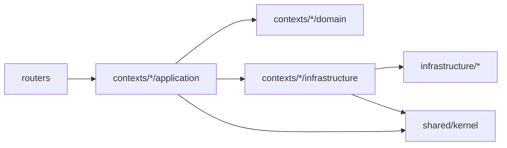

# 后端设计实现文档索引

## 1. 文档定位

`design/implementation/` 这一组文档面向当前主干代码实现，重点解释后端模块的真实技术实现、代码落点、主调用链和可替换边界。

这组文档和现有 `design/*.md` 的分工是：

- `design_*.md`：偏业务设计、交互规则、接口规格、演进约束
- `implementation/*.md`：偏代码结构、模块边界、实现链路、表定义、外部依赖接口用法

换句话说，`design/*.md` 回答“系统应该怎么工作”，`design/implementation/*.md` 回答“当前代码是怎么落地的”。

## 2. 后端实现总览

当前后端按 DDD 的 bounded context 组织，固定分为四个核心上下文和一组共享基础设施：

- `template_catalog`
- `conversation`
- `report_runtime`
- `scheduling`
- `infrastructure`
- `shared/kernel`
- `routers`

主分层关系如下：

约束是：

- `routers` 只做 HTTP 解析、DTO 转换、use case 调用和错误映射
- `domain` 和 `application` 不直接依赖 `FastAPI / SQLAlchemy / OpenAI / filesystem`
- `contexts/*/infrastructure` 承接上下文本地适配逻辑
- `src/backend/infrastructure/*` 提供跨上下文复用的技术组件，例如 AI 网关、持久化、查询引擎、系统设置读取

## 3. 阅读顺序

建议按下面顺序阅读：

1. [数据库表定义总览](database_schema.md)
2. [模板目录模块实现](template_catalog.md)
3. [统一对话模块实现](conversation.md)
4. [报告运行时模块实现](report_runtime.md)
5. [定时任务模块实现](scheduling.md)
6. [核心运行时序图](runtime_sequences.md)
7. [共享基础设施与 supporting 模块](infrastructure_and_supporting.md)
8. [外部接口与用法](external_interfaces.md)

## 4. 文档索引

| 文档 | 说明 |
|------|------|
| [template_catalog.md](template_catalog.md) | 模板目录模块实现、schema 校验、语义索引与模板匹配 |
| [conversation.md](conversation.md) | 会话、能力路由、报告任务推进、fork/update-chat 的实现 |
| [report_runtime.md](report_runtime.md) | 报告实例、确认大纲、生成基线、章节生成、文档导出 |
| [scheduling.md](scheduling.md) | 定时任务、run-now、执行记录与实例生成编排 |
| [runtime_sequences.md](runtime_sequences.md) | 对话确认生成、定时任务 run-now、报告实例 update-chat 的关键时序图 |
| [infrastructure_and_supporting.md](infrastructure_and_supporting.md) | 持久化、AI、查询、settings、demo、routers、依赖装配 |
| [database_schema.md](database_schema.md) | 当前全部业务表定义、字段语义与典型读写链路 |
| [external_interfaces.md](external_interfaces.md) | 外部 HTTP 接口、外部依赖型技术边界及调用方式 |

## 5. 当前代码边界说明

- 本组文档以 `master` 当前实现为准。
- 旧的 `src/backend/application`、`src/backend/domain` 双轨目录已经移除，不再作为实现说明对象。
- `src/backend/infrastructure/reporting/` 当前不承载生产逻辑，不在本组文档中作为主链路模块说明。
- 运行产物目录（例如 `report_system.db`、`generated_documents/`）不作为 bounded context 说明主体，只在相关技术边界章节提及。

