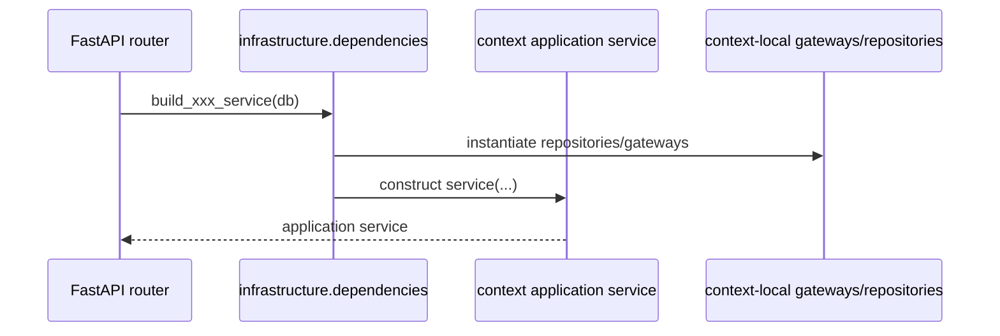

# 共享基础设施与 supporting 模块设计实现

## 1. 模块定位

本篇说明不属于单一 bounded context 的共享技术组件，以及未纳入 bounded context 但仍属于后端功能面的 supporting module。

当前主要包括：

- persistence
- ai
- query
- settings
- demo
- dependencies
- routers
- shared/kernel
- feedback / design download 这类 supporting router

## 2. 代码落点

### 共享基础设施

- `E:/code/codex_projects/ReportSystemV2/src/backend/infrastructure/persistence/*`
- `E:/code/codex_projects/ReportSystemV2/src/backend/infrastructure/ai/*`
- `E:/code/codex_projects/ReportSystemV2/src/backend/infrastructure/query/*`
- `E:/code/codex_projects/ReportSystemV2/src/backend/infrastructure/settings/*`
- `E:/code/codex_projects/ReportSystemV2/src/backend/infrastructure/demo/*`
- `E:/code/codex_projects/ReportSystemV2/src/backend/infrastructure/dependencies.py`

### 共享内核

- `E:/code/codex_projects/ReportSystemV2/src/backend/shared/kernel/errors.py`

### HTTP supporting routers

- `E:/code/codex_projects/ReportSystemV2/src/backend/routers/system_settings.py`
- `E:/code/codex_projects/ReportSystemV2/src/backend/routers/feedback.py`
- `E:/code/codex_projects/ReportSystemV2/src/backend/routers/design.py`
- `E:/code/codex_projects/ReportSystemV2/src/backend/main.py`

## 3. 核心技术组件

### persistence

- `database.py`
  - SQLAlchemy `Base`、engine、session factory、`get_db()`
- `models.py`
  - 业务 ORM 定义的唯一来源

### ai

- `openai_compat.py`
  - 统一封装 OpenAI-compatible `/chat/completions` 与 `/embeddings`
  - 负责 HTTP 调用、超时、格式校验和错误语义转换

### query

- `engine.py`
  - 实验性 `NL -> QuerySpec -> Ibis -> SQL -> SQLite`
  - 同时支持 `legacy` 和 `ibis_planner` 两条策略
- `section_evidence.py`
  - 章节证据查询和 Ibis 执行边界
- `benchmark.py`
  - 查询 benchmark 报表
- `benchmarks/query_cases.json`
  - 离线 benchmark 数据集

### settings

- `system_settings.py`
  - 系统设置读写
  - 构建 Completion / Embedding provider config
  - 对应 `system_settings` 表

### demo

- `telecom.py`
  - 电信样例 SQLite 数据库生成、schema registry、connection helper
- `dynamic_sources.py`
  - 模拟动态枚举/联动来源

### dependencies

- `dependencies.py`
  - 把 4 个 bounded context 的 service 装配成 FastAPI router 可用的依赖

### shared/kernel

- `errors.py`
  - `DomainError / ApplicationError / ValidationError / NotFoundError / ConflictError / UpstreamError`

## 4. 分层职责

- `infrastructure/*` 只承载技术能力，不表达业务规格
- `dependencies.py` 只负责装配，不实现业务决策
- `routers/*` 只做 HTTP 入口和错误映射，不直接处理 ORM 细节
- supporting router 不纳入 4 个 bounded context，但仍需要遵守“router 不直接写业务规则”的原则

## 5. 核心实现链路

### 5.1 依赖装配

### 5.2 系统设置与模板索引

- `system_settings.py` router 负责读写 provider 配置、连通性测试、触发模板索引重建
- 实际向量重建逻辑仍由 `template_catalog.infrastructure.indexing` 执行

### 5.3 feedback 和 design

- `feedback.py`
  - 负责用户意见上报与 Markdown 聚合
- `design.py`
  - 负责 `design/` 文档读取与打包下载

这两类属于 supporting 功能，不进入 4 个核心 bounded context。

## 6. 依赖与被依赖关系

### 对外依赖

- `httpx`
- `SQLAlchemy`
- `sqlite3`
- `ibis`
- 本地文件系统

### 被谁依赖

- 4 个 bounded context 的 infrastructure 层
- 部分 supporting routers

## 7. 关联表引用

本篇主要涉及：

- [system_settings](database_schema.md#system_settings)
- [feedbacks](database_schema.md#feedbacks)
- [template_semantic_indices](database_schema.md#template_semantic_indices)

其余业务表的主维护权归 4 个 bounded context 文档说明。

## 8. 可替换技术组件

### 业务规格

- 错误语义与路由层 HTTP 映射规则
- 配置项结构
- benchmark 数据格式和查询策略名

### 可替换 adapter

- 数据库可替换为其他 SQL/NoSQL 存储
- AI 网关可替换为其他 OpenAI-compatible 实现
- 查询链路可替换为非 Ibis 方案
- 样例数据可替换为其他演示库
- 文档读取、反馈聚合和文件落盘都属于纯技术适配层

