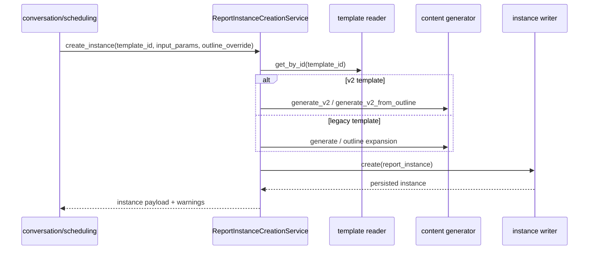

# 报告运行时模块设计实现

## 1. 模块定位

`report_runtime` 负责报告实例生命周期、实例级大纲确认、模板实例维护、章节生成、实例更新、文档导出。它是系统里最核心的“执行上下文”。

当前代码里，`TemplateInstance` 已作为核心领域模型，贯穿“参数收集 -> 诉求确认 -> 生成 -> 更新”全流程，并持续更新同一份实例状态。

## 2. 代码落点

- `E:/code/codex_projects/ReportSystemV2/src/backend/contexts/report_runtime/domain/models.py`
- `E:/code/codex_projects/ReportSystemV2/src/backend/contexts/report_runtime/domain/services.py`
- `E:/code/codex_projects/ReportSystemV2/src/backend/contexts/report_runtime/application/services.py`
- `E:/code/codex_projects/ReportSystemV2/src/backend/contexts/report_runtime/application/creation.py`
- `E:/code/codex_projects/ReportSystemV2/src/backend/contexts/report_runtime/infrastructure/repositories.py`
- `E:/code/codex_projects/ReportSystemV2/src/backend/contexts/report_runtime/infrastructure/gateways.py`
- `E:/code/codex_projects/ReportSystemV2/src/backend/contexts/report_runtime/infrastructure/outline.py`
- `E:/code/codex_projects/ReportSystemV2/src/backend/contexts/report_runtime/infrastructure/rendering.py`
- `E:/code/codex_projects/ReportSystemV2/src/backend/contexts/report_runtime/infrastructure/generation.py`
- `E:/code/codex_projects/ReportSystemV2/src/backend/contexts/report_runtime/infrastructure/baselines.py`
- `E:/code/codex_projects/ReportSystemV2/src/backend/contexts/report_runtime/infrastructure/documents.py`
- `E:/code/codex_projects/ReportSystemV2/src/backend/routers/instances.py`
- `E:/code/codex_projects/ReportSystemV2/src/backend/routers/documents.py`
- `E:/code/codex_projects/ReportSystemV2/src/backend/routers/reports.py`

## 3. 核心领域概念

- `ReportInstance`
  - 用户可感知的报告实例，保存输入参数、章节结果、状态、`report_time`
- `TemplateInstance`
  - 报告制作过程中的核心聚合对象，组合 `base_template` 与实例运行态（`runtime_state / resolved_view / generated_content / fragments`）
  - 对外仍兼容 `generation baseline` 查询语义
- `ExecutionBaseline`
  - 当前未独立 dataclass 化，仍以内嵌 JSON 形式进入 `outline_snapshot` 和实例内容，但业务上已经存在
- `OutlineReviewTree`
  - 当前由 `outline.py` 生成的树形节点 JSON 表达，承接实例级大纲确认

## 4. 分层职责

### domain

- `ReportInstance`、`TemplateInstance` 作为核心领域模型
- `OutlineExpansionService`
  - 负责旧 `outline` 结构的参数替换、repeat 展开和 warning 产出
- `is_v2_template()`
  - 负责模板判型，决定实例生成走旧 outline 还是 v2 sections/outline requirement 链路

### application

- `ReportRuntimeService`
  - 实例 CRUD、baseline 查询、章节重生成、finalize、报告聚合视图（`template_instance + generated_content`）
- `ReportDocumentService`
  - 文档创建、列表、下载、删除
- `ReportInstanceCreationService`
  - 统一实例创建入口，封装旧模板和 v2 模板两条内容生成路径
- `ScheduledReportRunService`
  - 定时任务场景下的实例创建编排

### infrastructure

- `repositories.py`
  - `report_instances`、`template_instances`、`report_documents`、模板读仓储的 ORM 映射
- `gateways.py`
  - application 组合入口，统一把技术错误转换成 `ValidationError / UpstreamError`
- `outline.py`
  - 实例级大纲树构建、merge、诉求退化与执行基线解析
- `rendering.py`
  - 执行链路和样例数据查询编排
- `generation.py`
  - OpenAI 内容生成器、章节生成、v2 诉求驱动生成
- `baselines.py`
  - 模板实例的捕获、持续更新和兼容查询序列化
- `documents.py`
  - Markdown 文档落盘、版本号递增、下载路径解析

### router

- `instances.py`：实例列表、详情、更新、baseline、更新会话、fork 来源
- `documents.py`：文档创建、下载、删除
- `reports.py`：聚合报告视图 `GET /rest/chatbi/v1/reports/{report_id}`
- `template_instances` 不再作为公开路由；模板实例仅作为内部聚合状态承载报告生成基线

## 5. 核心实现链路

### 5.1 创建报告实例

### 5.2 大纲确认与执行基线

1. `conversation` 生成待确认大纲树
2. 用户在对话中修改大纲
3. `merge_outline_override()` 合并用户改动
4. `resolve_outline_execution_baseline()` 把大纲节点解析为实例级执行基线
5. 创建实例后，`capture_generation_baseline()` 不再“删旧建新”，而是更新同一模板实例记录并绑定 `report_instance_id`

### 5.3 章节重生成

- 旧模板：复用 legacy 单节生成逻辑
- v2 模板：优先用 `outline_node` 和诉求上下文重建该节
- 所有技术异常统一在 gateway 层收敛为 `ValidationError / UpstreamError`

### 5.4 文档导出

- `documents.py` 当前只支持 Markdown
- 每次导出都根据 `instance_id + format` 自动递增版本号
- 物理文件写盘后写入 `report_documents`
- 下载时由 `resolve_download()` 同时校验数据库记录和物理文件是否存在

## 6. 依赖与被依赖关系

### 对外依赖

- `template_catalog`：读取模板定义
- `infrastructure.ai.openai_compat`：章节生成和诉求扩展相关 LLM 调用
- `infrastructure.query.*`：结构化查询与证据查询
- `infrastructure.demo.*`：样例 SQLite 数据
- `shared/kernel/errors.py`

### 被谁依赖

- `conversation`：大纲确认、实例创建、更新会话
- `scheduling`：run-now 和调度执行创建实例/文档
- `instances` / `documents` / `template_instances` routers

## 7. 关联表引用

本模块主要维护：

- [report_instances](database_schema.md#report_instances)
- [template_instances](database_schema.md#template_instances)
- [report_documents](database_schema.md#report_documents)

并读取：

- [report_templates](database_schema.md#report_templates)

## 8. 可替换技术组件

### 业务规格

- 模板双层模型：诉求确认在前，执行链路解析在后
- `TemplateInstance` 作为模板扩展聚合（组合 `base_template` + 运行时状态），并在全流程持续维护
- 章节重生成和文档导出生命周期

### 可替换 adapter

- 内容生成器可替换成其他 LLM/provider
- 查询引擎可替换成其他 SQL / Ibis / 向量检索方案
- 文档渲染器和文件存储可替换成对象存储、其他格式渲染器
- 只要 `ReportRuntimeService`、`ReportDocumentService` 和 `ReportInstanceCreationService` 的行为契约不变，业务规格不需要改
