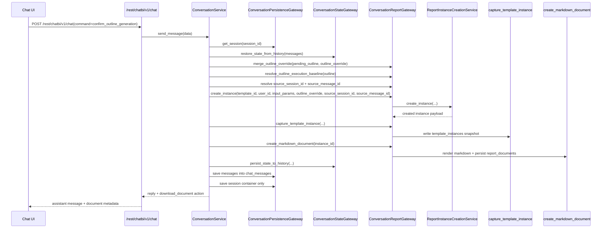
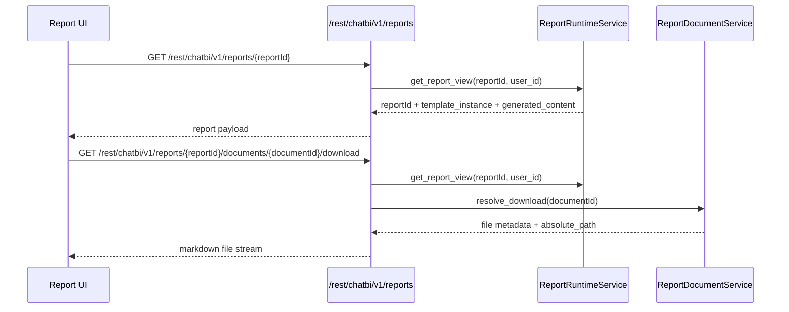
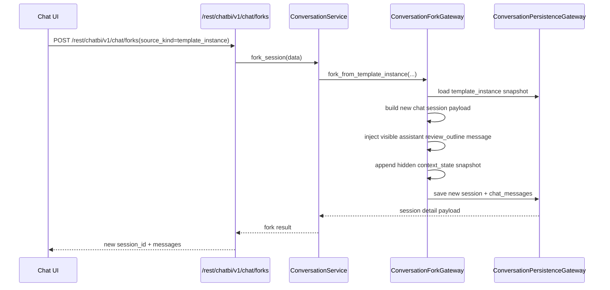

# 核心运行时序图

## 1. 说明

本篇集中放当前后端公开主链路的关键时序图，帮助在阅读代码时快速建立调用链全貌。

当前覆盖三条主链路：

- 对话确认生成
- 报告聚合读取与文档下载
- 基于模板实例来源的会话恢复

---

## 2. 对话确认生成

适用场景：用户在统一对话中完成模板匹配、参数补充和诉求确认后，点击“确认生成”。

关键点：

- 对话模块不直接写 `report_instances` 或 `report_documents`，统一经 `ConversationReportGateway` 转入 `report_runtime`
- 诉求编辑结果先解析成执行基线，再创建实例
- 生成成功后会同步固化内部模板实例与 Markdown 文档

---

## 3. 报告聚合读取与文档下载

适用场景：前端在报告页查看聚合结果，并下载指定文档。

关键点：

- 报告读取统一走 `reports` 聚合接口，不再暴露 `instances` 公开接口
- 文档下载路径必须带 `reportId + documentId`，不再走独立 `/documents/*`

---

## 4. 基于模板实例来源的会话恢复

适用场景：用户希望从某份历史生成基线继续对话修改。

关键点：

- 当前公开恢复入口统一走 `POST /chat/forks`
- 恢复会话不回放完整历史，只注入可继续编辑的诉求确认节点与隐藏上下文快照

---

## 5. 阅读建议

建议和以下文档配合阅读：

- [conversation.md](conversation.md)
- [report_runtime.md](report_runtime.md)
- [database_schema.md](database_schema.md)
- [external_interfaces.md](external_interfaces.md)
