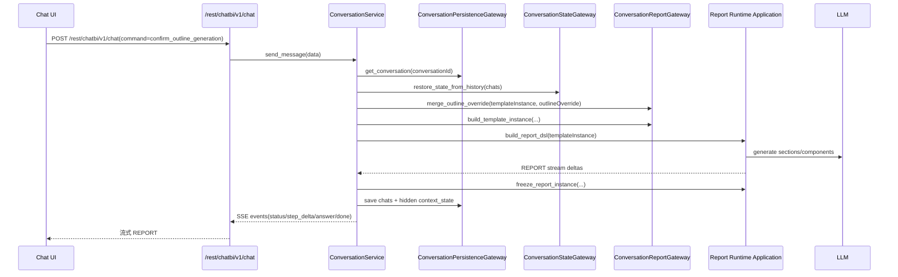
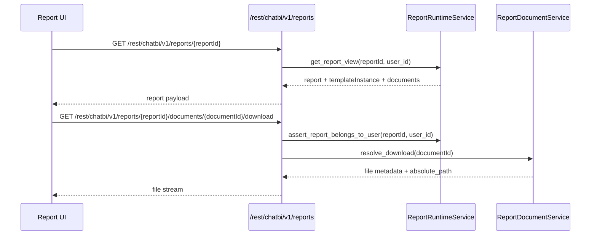
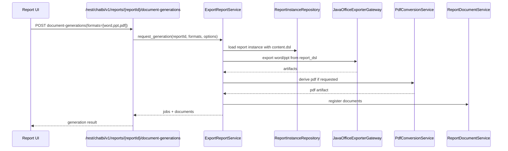
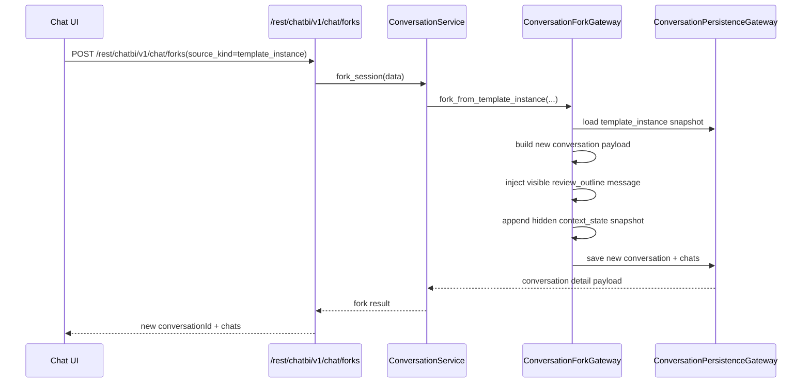

# 核心运行时序图

## 1. 说明

本篇集中放目标态关键时序图，帮助在阅读代码和设计文档时快速建立调用链全貌。

当前覆盖三条主链路：

- 对话确认生成并流式返回报告
- 报告聚合读取与文档下载
- 基于模板实例来源的会话恢复

---

## 2. 对话确认生成并流式返回报告

适用场景：用户在统一对话中完成模板匹配、参数补充和诉求确认后，点击“确认生成”。

关键点：

- `/chat` 在确认生成后按 ChatBI 事件模型流式返回 `REPORT`
- `REPORT` 中同时携带 `report + templateInstance + documents`
- 报告实例冻结晚于首个流式报告骨架返回

---

## 3. 报告聚合读取与文档下载

适用场景：前端在报告页查看聚合结果，并下载指定文档。

关键点：

- 报告读取统一走 `reports` 聚合接口
- 文档下载路径必须带 `reportId + documentId`
- 详情接口返回正式报告和模板实例，用于支持再次编辑诉求

---

## 4. 文档生成

适用场景：用户在报告详情页请求生成 Word / PPT / PDF。

---

## 5. 基于模板实例来源的会话恢复

适用场景：用户希望从某份历史报告的模板实例继续编辑诉求。

---

## 6. 阅读建议

建议和以下文档配合阅读：

- [conversation.md](conversation.md)
- [report_runtime.md](report_runtime.md)
- [database_schema.md](database_schema.md)
- [external_interfaces.md](external_interfaces.md)
