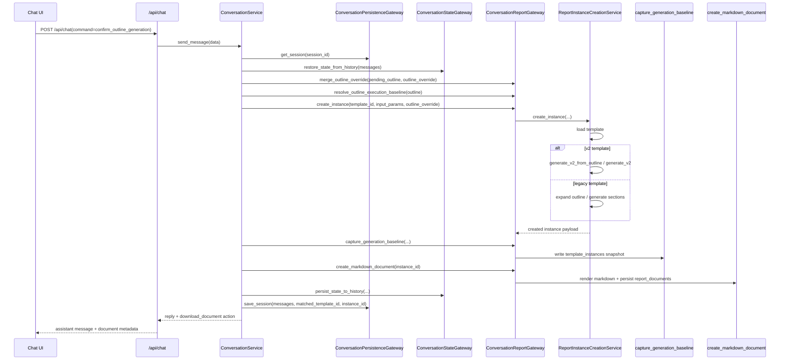
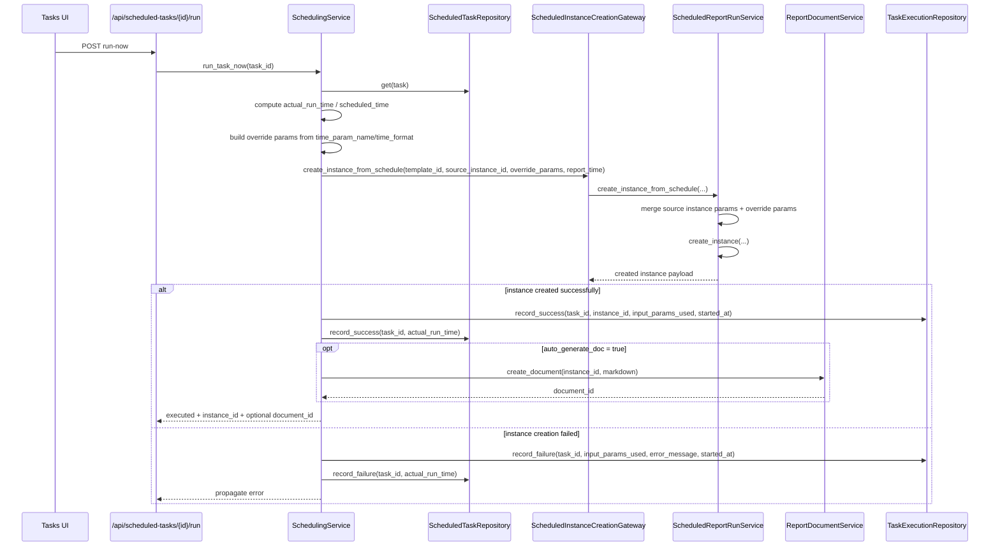
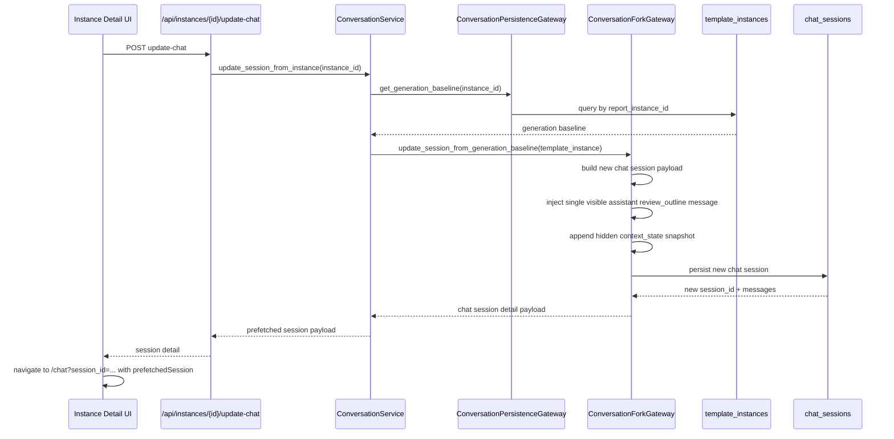

# 核心运行时序图

## 1. 说明

本篇集中放当前后端最关键的运行时序图，帮助在阅读代码时先建立调用链全貌，再进入各 bounded context 的实现细节。

当前先覆盖三条主链路：

- 对话确认生成
- 定时任务 run-now
- 报告实例 update-chat

---

## 2. 对话确认生成

适用场景：用户在统一对话中完成模板匹配、参数补充和大纲确认后，点击“确认生成”。

关键点：

- 对话模块不直接写 `report_instances` 或 `report_documents` 表，而是通过 `ConversationReportGateway` 进入 `report_runtime`
- 生成前的大纲编辑结果先被解析成实例级执行基线，再创建实例
- 生成成功后会同时固化 `template_instances` 内部快照和 Markdown 文档

---

## 3. 定时任务 run-now

适用场景：用户在定时任务页手动点击“立即执行”。

关键点：

- `scheduling` 自己不生成报告内容，只负责任务规则、时间映射和执行记录
- `scheduled_time` 当前在 `run-now` 场景下等于 `actual_run_time`
- `report_time` 是否写入实例，取决于 `use_schedule_time_as_report_time`

---

## 4. 报告实例 update-chat

适用场景：用户在报告实例页点击“更新”，希望基于确认大纲恢复到对话助手继续修改。

关键点：

- `update-chat` 不回放原始整段对话，只恢复一个可继续编辑的大纲确认节点
- 恢复依据是 `template_instances` 中的内部生成基线，而不是当前实例正文反推
- 前端拿到的是完整 `ChatSessionDetail`，这样跳转 `/chat` 后可以立即渲染，不必再等待二次拉取

---

## 5. 阅读建议

建议和以下文档配合阅读：

- [conversation.md](conversation.md)
- [report_runtime.md](report_runtime.md)
- [scheduling.md](scheduling.md)
- [database_schema.md](database_schema.md)
- [external_interfaces.md](external_interfaces.md)
