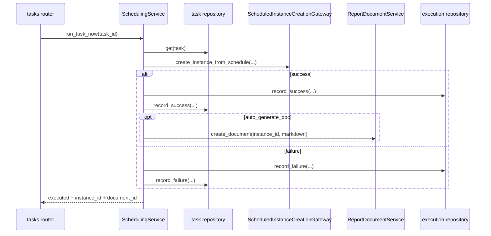

# 定时任务模块设计实现

## 1. 模块定位

`scheduling` 负责从已有报告实例创建定时任务、run-now 执行、任务状态迁移、执行记录落库，以及把计划执行时间映射到实例输入参数和 `report_time`。

它自身不拥有报告生成逻辑，而是通过 `report_runtime` 提供的实例创建与文档生成入口来完成实际工作。

## 2. 代码落点

- `E:/code/codex_projects/ReportSystemV2/src/backend/contexts/scheduling/domain/models.py`
- `E:/code/codex_projects/ReportSystemV2/src/backend/contexts/scheduling/application/services.py`
- `E:/code/codex_projects/ReportSystemV2/src/backend/contexts/scheduling/infrastructure/repositories.py`
- `E:/code/codex_projects/ReportSystemV2/src/backend/routers/tasks.py`

## 3. 核心领域概念

- `ScheduledTask`
  - 任务定义，包含源实例、模板、调度方式、cron、时间参数映射、是否自动生成文档等
- `TaskExecution`
  - 单次执行记录，保存开始/完成时间、生成实例 ID、错误信息、实际使用参数
- `TimeParameterBinding`
  - 当前代码里没有独立 dataclass，仍由 `time_param_name / time_format / use_schedule_time_as_report_time` 三个字段共同表达

## 4. 分层职责

### domain

- `ScheduledTask`、`TaskExecution` 作为轻量领域模型
- 任务数上限仍在 application 层控制，而非单独聚合根方法

### application

- `SchedulingService` 负责：
  - 创建任务
  - 列表/详情
  - 更新/删除
  - pause/resume
  - run-now
  - 执行记录列表
- 任务上限：
  - 每用户最多 5 个 active task
  - 全局最多 100 个 active task

### infrastructure

- `repositories.py`
  - 负责 `scheduled_tasks` 与 `scheduled_task_executions` 的 ORM 映射
- 通过依赖装配注入：
  - `ScheduledInstanceCreationGateway`
  - `ReportDocumentService`
  - `Clock`

### router

- `tasks.py` 负责定时任务的 HTTP 接口层

## 5. 核心实现链路

### 5.1 从实例创建任务

1. 前端在任务页选择已有 `source_instance_id`
2. router 调用 `SchedulingService.create_task()`
3. service 校验用户上限和全局上限
4. repository 写入 `scheduled_tasks`

### 5.2 run-now

### 5.3 时间映射

当前实现仍采用简单模型：

- `scheduled_time = actual_run_time`（run-now 场景）
- 若配置了 `time_param_name`，则按 `time_format` 写入实例输入参数
- 若 `use_schedule_time_as_report_time = true`，则把 `scheduled_time` 写入实例 `report_time`

更复杂的“任务执行时间 vs 报告数据时间”模型当前仅记录在设计文档中，尚未进入实现。

## 6. 依赖与被依赖关系

### 对外依赖

- `report_runtime`：实例创建、文档创建
- `shared/kernel/errors.py`

### 被谁依赖

- `tasks` router
- 前端定时任务管理页面

## 7. 关联表引用

本模块主要维护：

- [scheduled_tasks](database_schema.md#scheduled_tasks)
- [scheduled_task_executions](database_schema.md#scheduled_task_executions)

并读取：

- [report_instances](database_schema.md#report_instances)
- [report_documents](database_schema.md#report_documents)

## 8. 可替换技术组件

### 业务规格

- 必须从已有报告实例创建任务
- run-now 创建实例后可选自动生成 Markdown
- 任务数量上限与状态迁移规则
- 简单双时间模型：真实执行时间和 `report_time`

### 可替换 adapter

- 任务持久化仓储可替换
- 当前没有独立 scheduler engine；未来可替换为 APScheduler、外部调度平台或队列系统
- 文档生成与实例创建仍通过 port 注入，不与任务规则耦合

