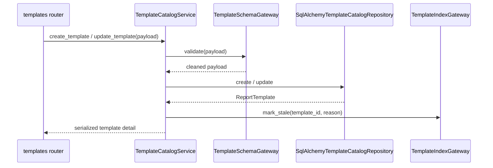
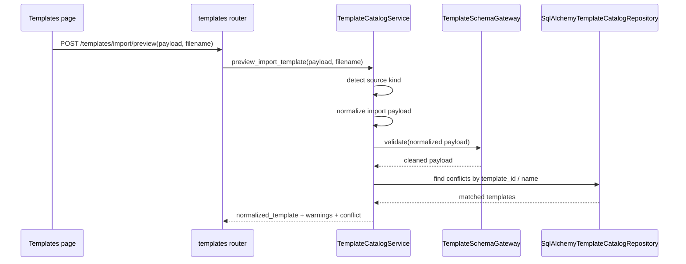
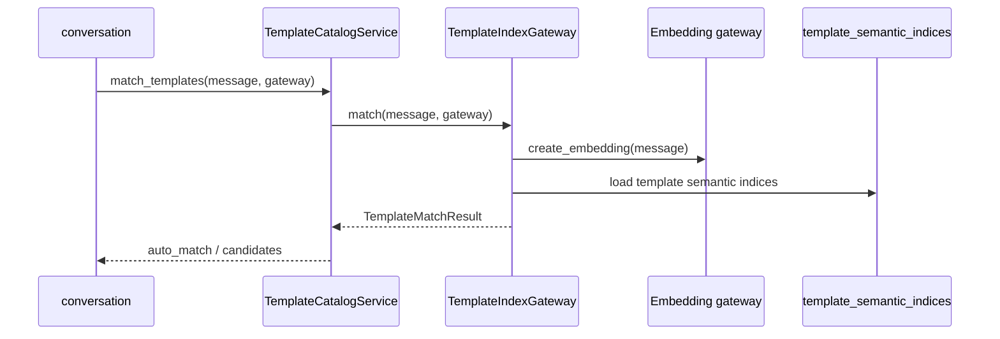

# 模板目录模块设计实现

## 1. 模块定位

`template_catalog` 负责报告模板定义的持久化、结构校验、语义索引状态维护，以及模板匹配输入准备。它是整个系统的模板主数据上下文。

它回答三个问题：

- 模板如何被创建、更新、导出和删除
- 模板如何被导入预解析、归一化并在保存前进入编辑工作台
- 模板载荷如何按 schema 校验和归一化
- 模板如何参与语义匹配

## 2. 代码落点

- `E:/code/codex_projects/ReportSystemV2/src/backend/contexts/template_catalog/domain/models.py`
- `E:/code/codex_projects/ReportSystemV2/src/backend/contexts/template_catalog/application/services.py`
- `E:/code/codex_projects/ReportSystemV2/src/backend/contexts/template_catalog/infrastructure/repositories.py`
- `E:/code/codex_projects/ReportSystemV2/src/backend/contexts/template_catalog/infrastructure/schema.py`
- `E:/code/codex_projects/ReportSystemV2/src/backend/contexts/template_catalog/infrastructure/indexing.py`
- `E:/code/codex_projects/ReportSystemV2/src/backend/routers/templates.py`

## 3. 核心领域概念

- `ReportTemplate`
  - 模板主对象，承载名称、描述、参数、章节、蓝图、执行链路等静态定义
- `TemplateMatchResult`
  - 模板匹配结果，区分自动命中和候选列表两种输出模式
- `OutlineBlueprint`
  - 业务上属于模板章节定义的一部分；当前代码中仍以内嵌 JSON 结构存在于 `parameters / sections / outline` 中，而不是独立 dataclass

## 4. 分层职责

### domain

- 用轻量 dataclass 表达 `ReportTemplate`
- 不关心 SQLAlchemy、JSON schema 库、Embedding 接口

### application

- `TemplateCatalogService` 负责模板 CRUD、导出、导入预解析、序列化、匹配调用装配
- 把 schema 校验错误转成 `ValidationError`
- 在模板变更后标记语义索引为 stale

### infrastructure

- `SqlAlchemyTemplateCatalogRepository`
  - 负责 `report_templates` ORM 与领域对象转换
- `TemplateSchemaGateway`
  - 调用 `schema.py` 做模板 payload 校验与清洗
- `TemplateIndexGateway`
  - 调用 `indexing.py` 处理模板语义索引状态和匹配逻辑

### router

- `templates.py` 只负责 HTTP 层：请求解析、异常到 `HTTPException` 的映射、导出下载响应

## 5. 核心实现链路

### 5.1 模板创建 / 更新

### 5.2 模板导入预解析

### 5.3 模板匹配

## 6. 依赖与被依赖关系

### 对外依赖

- `shared/kernel/errors.py`
- `infrastructure.persistence.models` 对应的 SQLAlchemy ORM
- `OpenAICompatGateway` 作为匹配阶段 embedding 向量来源

### 被谁依赖

- `conversation`：模板匹配、模板读取、参数定义读取
- `report_runtime`：实例创建时读取模板定义
- `system_settings`：重建模板语义索引

## 7. 关联表引用

本模块主要维护以下表：

- [report_templates](database_schema.md#report_templates)
- [template_semantic_indices](database_schema.md#template_semantic_indices)

## 8. 可替换技术组件

### 业务规格

- 模板的参数/章节/蓝图/执行链路双层结构
- 参数映射与诉求要素映射同构（`value_mode + value_mapping`），仅 `enum/dynamic` 生效
- `param_ref` 必须继承参数 `display/value/query`，不允许局部覆写 `query` 映射
- 导出时不携带系统字段
- 导入预解析不直接入库，必须回到模板工作台由用户确认保存
- 模板更新后语义索引必须标记 stale
- 动态参数候选项协议固定为 `items[].label/value/query`，缺失或类型非法按 `PARAM_SOURCE_RESPONSE_INVALID` 处理
- `report_template_schema_v2.json` 与 `template_catalog` 校验器必须同步维护上述参数映射约束

### 可替换 adapter

- SQLAlchemy repository 可以替换为别的持久化实现
- `schema.py` 当前采用 JSON-schema 风格校验，后续可替换为别的校验器
- `indexing.py` 当前依赖 embedding 检索，后续可替换为向量库或其他模板召回策略，只要保留 `match()` 与索引状态协议

