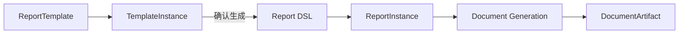

# 01. 统一总览

## 1. 业务目标

报告系统要解决的是：围绕用户的报告诉求，在统一对话中完成模板匹配、参数收集、诉求确认、报告生成、文档生成和下载。

正式主线只有一条：

`ReportTemplate -> TemplateInstance -> Report DSL -> ReportInstance -> DocumentArtifact`

## 2. 统一术语

| 术语 | 定义 |
|---|---|
| `ReportTemplate` | 静态模板资产，定义参数、目录、章节诉求和生成编排骨架 |
| `TemplateInstance` | 某次对话中的模板运行态实例，承载参数值、诉求实例、绑定状态和局部编辑 delta |
| `Report DSL` | 冻结后的正式报告表达，是导出 Word/PPT/PDF/Markdown 的唯一事实源 |
| `ReportInstance` | 与用户、来源模板实例、来源对话锚点关联的正式报告资源；其主体内容是持久化的 `Report DSL` |
| `DocumentArtifact` | 由 `Report DSL` 派生的文档产物，如 `word`、`ppt`、`pdf`、`markdown` |
| `conversationId` | 会话容器标识 |
| `chatId` | 单轮对话消息标识 |

## 3. 分层原则

1. 领域层定义 `ReportTemplate`、`TemplateInstance`、`Report DSL` 等正式模型。
2. 应用层负责：
   - 模板实例构建
   - 平铺 delta 与树状结构合并
   - `TemplateInstance -> Report DSL`
   - 文档生成编排
3. 基础设施层只负责仓储、外部数据源访问、Java 文档导出适配和 PDF 转换。

## 4. 统一结构原则

### 4.1 模板与模板实例

模板与模板实例统一采用：

- `structureType`
- `flow`: `catalogs -> catalog.subCatalogs -> catalog.sections`
- `paged`: `chapters -> slides -> sections`

不再把“目录”丢失成单纯的 `sections/subsections` 树。

补充规则：

- 静态模板不再声明 `order`
- 模板中的目录、子目录、章节、分页章节和页面顺序由数组位置定义
- 运行态实例或冻结后的正式报告，如需稳定排序，可保留物化后的顺序信息

### 4.2 报告 DSL 与报告实例

报告正式内容统一采用：

- `catalogs`
- `catalog.subCatalogs`
- `catalog.sections`
- `section.components`

当前业务 profile 补充约束：

- 当前 Report DSL 正式目录 profile 仍为：`catalogs -> (subCatalogs)* -> sections -> components`
- paged 模板结构先作为模板与实例态契约引入，Report DSL/PPT 映射后续实现

### 4.3 参数作用域

参数采用“按层级定义、向下继承可见”的规则：

- 模板根部参数：全局可见
- 某个 `catalog` 定义的参数：对该目录及其全部后代可见
- 某个 `section` 定义的参数：仅对该章节可见

硬规则：

- 参数 `id` 在同一份模板内必须全局唯一
- 某个节点可以使用“自己定义的参数 + 全部父节点参数 + 全局参数”
- 仅服务于某个小章节的参数，应定义在该章节
- 作用范围更大的参数，应定义在更高层目录或模板根部

### 4.4 模板骨架状态

系统内部三态：

- `reusable`
- `conditionally_reusable`
- `broken`

UI 只暴露二态：

- `not_broken`
- `broken`

硬规则：

- 修改槽位值不会破坏模板诉求骨架
- 只有结构化诉求骨架被改坏，才会降级到 `conditionally_reusable` 或 `broken`

## 5. 总体流程

## 6. 文档生成正式口径

- 生成报告：得到 `Report DSL`
- 生成文档：从 `Report DSL` 派生 `word/ppt/pdf/markdown`
- `pdf` 首版不是原生渲染，而是从 `word` 或 `ppt` 派生转换

## 7. 统一接口口径

- 对话接口负责驱动报告生成过程
- 报告接口负责获取冻结后的报告资源与文档产物
- 文档格式放在请求体，不放在 URL 中
- 模板相关接口直接返回正式模板对象，而不是额外包一层 `content`

## 8. 与 BI Engine 的前后台边界

- ReportSystem 负责模板资产、统一对话、报告冻结、文档生成和持久化，是报告业务后台。
- BI Engine 负责前端报告组件渲染和本地可视化编辑，是 Report DSL 的权威前端消费引擎。
- ReportSystem 前端直接消费正式 `Report DSL`，不得自行实现另一套图表、表格或组合表格渲染规则。
- 报告详情页以 BI Engine 真实预览为主；对话生成过程中使用同一渲染内核展示增量报告。
- BI Designer 作为按报告进入的本地编辑工作台接入；当前只允许本地编辑、撤销、预览和导出 DSL JSON，不写回冻结后的 `ReportInstance`。
- 同一报告的预览、编辑和 DSL JSON 下载必须使用同一个规范化后的本地 store。paged 报告的封面、总目录、章节目录和封底属于前端派生虚拟页面，不写回正式 `Report DSL`。
- flow 与 paged 预览都必须提供只读大纲导航；flow 大纲反映目录树，paged 大纲反映虚拟页面与正式内容页顺序。
- BI Engine 保持独立仓库演进，ReportSystem 通过固定提交的 Git 子模块显式升级。

## 9. 对话工作台与演示模板

- `/chat` 是面向报告生成的主工作台，不再使用普通内容页的大标题、说明区和卡片堆叠布局。
- 工作台由业务导航、会话列表、对话流和可收起的报告区域组成；报告区域在生成到首个可渲染 delta 后自动展开。
- 报告区域统一使用 BI Engine 预览；正式报告生成完成后，可以切换到 BI Designer 做本地编辑、重置和 DSL JSON 下载。
- 本地编辑不写回冻结后的 `ReportInstance`；存在未导出修改时，切换会话或报告必须提示用户确认。
- 为便于前端集成验证，可以提供独立的前端 demo 模板 fixture。demo 模板直接模拟生成正式 Report DSL，只用于演示和回归，不进入后台模板仓储，也不改变正式 `/chat` 状态机。

## 10. 业务页面视觉约束

- `/chat`、模板、报告和系统设置使用统一的浅色业务壳层：左侧窄图标栏、白色内容面、浅灰分隔线和蓝色交互主色。
- 模板列表和报告列表优先使用适合扫描的紧凑行列表，不使用营销式大卡片、装饰性渐变或大圆角。
- 业务页顶部只保留单行工具栏，承载页面名、数量或状态和主要操作；不重复展示大标题、英文 eyebrow 和说明段落。
- 报告设计器仍使用独立工作台布局，优先为 BI Designer 画布提供空间。
