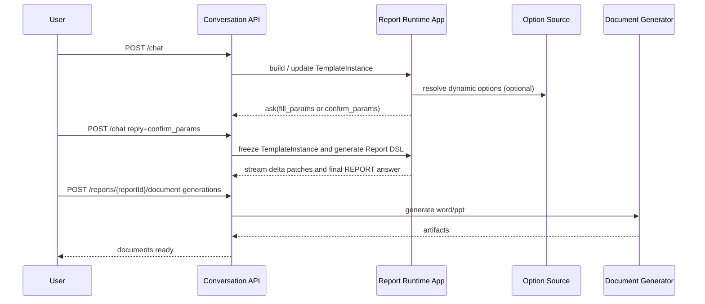

# 03. 运行时流程与状态机

## 1. 总体阶段

统一对话中的报告生成分为四个阶段：

1. 模板识别与参数收集
2. 模板实例构建与诉求确认
3. `TemplateInstance -> Report DSL`
4. 报告冻结与文档生成

## 2. TemplateInstance 的形成过程

### 2.1 参数收集

- 参数统一写入各层级 `TemplateInstance.parameters`
- 参数实际取值统一写入参数对象的 `values`
- 动态参数候选项统一写入参数对象的 `options`
- 参数补齐/确认聚合态统一写入 `TemplateInstance.parameterConfirmation`

### 2.2 诉求实例化

系统使用模板中的：

- `parameters`
- `catalogs`
- `catalog.parameters`
- `catalog.subCatalogs`
- `section.outline.requirement`
- `section.outline.items`
- `section.parameters`
- `section.content`

生成运行态 `TemplateInstance`：

- `parameters`
- `catalogs`
- `catalog.subCatalogs`
- `section.outline`
- `section.content`
- `section.runtimeContext`

补充规则：

- 参数或诉求项若未显式赋值，先回填其 `defaultValue`
- 回填后的“已生效值”统一写入对应对象的 `values`
- 多值场景继续保存三元组数组，不在实例层提前拼装 SQL
- `outline.renderedRequirement` 用 `label` 语义生成，可将多值按 `、` 连接
- 目录标题 `catalog.title` 若声明了参数槽位，在实例构建时先按参数 `label` 值渲染为 `renderedTitle`；章节不再定义标题。
- `section.content` 在实例态必须保留实例化后的内容结构视图；`composite_table` 至少落到 `parts[]`，并在 `part.runtimeContext` 记录最小运行态。
- 模板中的目录、子目录、章节顺序由数组位置定义；若运行态需要稳定排序，可在实例化后物化 `order`

参数作用域规则：

- 节点可见参数集合 = 自身定义参数 + 全部父级目录参数 + 模板根参数
- 参数 `id` 在模板内全局唯一，因此不同层级的 `parameters` 仍可在统一键空间中稳定引用
- 仅服务于某个章节的参数，应定义在该章节；作用于整个目录分支的参数，应定义在目录上

### 2.4 多层目录与 `foreach`

`foreach` 可以出现在目录或章节上。

展开规则：

1. 先按父层级从上到下展开。
2. 若某个目录声明 `foreach`，则该目录的每个展开实例都会携带自己的 `foreachContext`。
3. 该目录下的全部 `subCatalogs` 和 `sections` 都在该上下文中继续展开。
4. 若内层节点也声明 `foreach`，则以内层参数在当前父上下文中的可见值继续展开。

结果要求：

- 内层目录及其下章节必须跟随父目录实例一并复制展开
- 每个展开后的目录标题，都要在当前上下文中完成参数渲染；章节直接使用诉求进入生成链路。
- 若 `foreach` 展开导致同一模板节点生成多个实例，实例层可补充物化后的 `order`，但不得反向写回模板定义

### 2.3 前台修改与骨架状态

前台可修改完整 `TemplateInstance` 树；模板实例只持久化最新状态，不记录变更轨迹。

后台处理规则：

- 只改槽位值：对应 `section.skeletonStatus` 保持 `reusable`
- 改坏结构化诉求骨架：对应 section 降级到 `conditionally_reusable` 或 `broken`
- UI 如需展示整体状态，应由服务端基于所有 section 聚合，不单独持久化顶层状态

## 3. TemplateInstance -> Report DSL

### 3.1 应用层职责

`TemplateInstance -> Report DSL` 是应用层正式能力，不是基础设施适配工作。

应用层需要完成：

1. 读取模板实例树状主体
2. 解释 `runtimeContext.bindings` 与数据集定义
3. 为每个 section 生成内容组件
4. 组装正式 `Report DSL`
5. 用 `report-dsl.schema.json` 校验结果
6. 将校验通过的 DSL 冻结到 `ReportInstance`

### 3.2 模板各组成部分的应用方式

| 模板组成 | 运行时作用 | 在 Report DSL 中的落点 |
|---|---|---|
| `parameters` | 以统一参数模型收集报告全局参数输入、候选项、实际取值和确认态 | `basicInfo.parameters` |
| `catalog.parameters`、`section.parameters` | 以统一参数模型收集章节可见输入与章节本地输入 | 章节本地参数进入 `reportMeta[sectionId].parameters`；父级参数通过 `outline.items[].sourceParameterId` 关联 |
| `catalogs`、`catalog.subCatalogs` | 决定正式目录层级 | `catalogs`、`subCatalogs` |
| `section.outline.requirement + section.outline.items` | 以统一诉求模型承载章节诉求骨架与实例化结果 | `reportMeta[sectionId].outline`；`question` 继续独立保留 |
| `section.content.datasets` | 决定数据获取与加工 | 组件数据、`reportMeta[sectionId].additionalInfos` |
| `section.content.presentation` | 决定段落、表格、图表、markdown 等组件布局 | `section.components` |
| `section.content.presentation.blocks[].parts[].runtimeContext` | 保存复合表各子表的最小运行态 | 用于编译 `CompositeTable.tables[]` 与补充执行证据 |

多值落位规则：

- `parameters[*].values`：保存参数三元组数组
- `outline.items[*].values`：保存章节诉求项三元组数组
- `runtimeContext.bindings[].multiValueQueryMode`：声明多值如何组合，默认按 `in`
- `runtimeContext.bindings[].resolvedQuery`：保存最终对执行层可用的查询表达式

### 3.3 字段映射边界

`TemplateInstance -> Report DSL` 必须是“冻结输出”，不能把运行态字段原样搬进 DSL。

| TemplateInstance 字段 | 进入 Report DSL 的方式 | 备注 |
|---|---|---|
| `catalogs[].id/title/renderedTitle/subCatalogs/sections[].id` | 结构映射到 `catalogs -> (subCatalogs)* -> sections` | 保留正式目录树与目录展示标题，章节只保留标识和诉求 |
| `parameters` | 写入 `basicInfo.parameters` | 保留全局参数完整定义与当前取值 |
| `sections[].parameters` | 写入 `reportMeta[sectionId].parameters` | 只保留章节本地参数，不重复父 catalog 参数和全局参数 |
| `sections[].outline.requirement` | 写入 `reportMeta[sectionId].outline.requirement` | 保留原始诉求模板文本 |
| `sections[].outline.renderedRequirement` | 写入 `reportMeta[sectionId].outline.renderedRequirement` | 保留实例化后的章节诉求文本 |
| `sections[].outline.renderedRequirement` / 章节生成口径 | 写入 `reportMeta[sectionId].question` | `question` 与 `outline.renderedRequirement` 并存且允许不同值 |
| `章节生成结果状态` | 写入 `reportMeta[sectionId].status` | 必须使用 `report-dsl.schema.json` 中的 `Running/Success/Aborted/Failed` |
| `sections[].outline.items[].values[*].value` | 写入 `reportMeta[sectionId].outline.items[*].value[]` | 仅保留三元组中的 `value` 标量数组 |
| `sections[].runtimeContext.bindings[].resolvedQuery` | 写入 `reportMeta[sectionId].additionalInfos` 中的 `SQL` 类信息 | 仅保留冻结后的执行证据 |

| `warnings` | 仅在需要时进入 `reportMeta` 或实例资源元数据 | 不直接变成章节组件 |

硬规则：

- `Report DSL` 中不得出现实例态 `parameters`、实例态 `outline`、section 运行时上下文这类运行态对象
- 进入 `Report DSL` 的参数与大纲配置，必须是冻结后的结构化编辑视图，而不是模板实例对象的原样透传

多层目录下的 `reportMeta` 规则：

- `reportMeta` 仍按 `sectionId` 挂载，不按目录路径拼接 key
- 为避免多层目录下 key 冲突，`section.id` 在单份模板内必须全局唯一
- 章节位于哪条目录路径，由 `catalogs -> subCatalogs -> sections` 的正式树结构表达，不再在 `reportMeta` key 中重复编码
- 若运行态或流式进度需要显示当前目录位置，应额外返回 `catalogPath` 之类的上下文信息，而不是改写 DSL key 规则

### 3.4 `presentation.blocks -> components` 映射

模板呈现块不是最终 DSL 组件本身，应用层需要把它们编译成 `report-dsl.schema.json` 允许的正式组件对象。

| `presentation.blocks[].type` | 目标组件类型 | 说明 |
|---|---|---|
| `paragraph` | `text` 或 `markdown` | 优先用 `text` 承载纯文本段落；需要富文本结构时用 `markdown` |
| `bullet` | `markdown` | 首版统一转为 markdown 列表 |
| `kpi` | `text` 或 `table` | 若是单值指标卡可用 `text`；若是成组指标表格则转 `table` |
| `table` | `table` | 直接映射 |
| `chart` | `chart` | 直接映射 |
| `markdown` | `markdown` | 直接映射 |
| `composite_table` | `compositeTable` | 由多个顺序 `part` 编译为一个复合表组件 |

补充规则：

- `datasetId` 决定组件的数据来源，但最终 DSL 组件只保存该组件实际需要的 `dataProperties`
- `presentation.blocks` 中的标题、说明、布局意图，需要在编译时映射到组件标题、布局和附加属性，不能把模板块对象原样塞进 DSL
- 普通 `table` block 编译为 DSL `TableComponent`，其中 `datasetId -> dataProperties.sourceId`，`properties.mergeColumns -> dataProperties.mergeColumns`
- `PresentationProperty` 当前仅定义 `mergeColumns`，且仅对普通 `table` block 生效；`columns` 使用源数据列 key，至少两个且不重复
- `composite_table` block 继续挂在 `section.content.presentation.blocks[]`，不新增 section 专属内容类型
- 一个 `composite_table` block 最终编译为一个 DSL `CompositeTable`
- `CompositeTable.tables[]` 的顺序必须与模板 `parts[]` 的顺序一致
- `TemplateInstance.section.content.presentation.blocks[]` 必须保留实例化后的 `composite_table` 结构；二次编辑与重新生成都从这里读取 `parts[]`

`composite_table -> CompositeTable` 规则：

- block 级字段：
  - `block.id -> CompositeTable.id`
  - `block.title -> CompositeTable.dataProperties.title`
- `query part`
  - 与普通表格一致，基于 `datasetId` 生成一个 `TableComponent`
  - 基础信息也按 `query part` 处理，只是结果通常是一行普通表格数据
  - `tableLayout` 仅作为该子表的布局约束，不改变其“普通表格”语义；其中 `mergeColumns` 透传到子表 `dataProperties.mergeColumns`
  - 实例态通过 `part.runtimeContext.status/resolvedDatasetId/resolvedQuery/warnings` 保留最小运行态
- `summary part`
  - 输入来自 `summarySpec.partIds` 所引用的前序 `query part`
  - `summarySpec.rows` 定义固定总结行
  - 运行时生成一张无表头二维表：
    - 左列固定为 `rows[].title`
    - 右列为模型填写的结论内容
  - 模型不得增删行，也不得新增列
  - 实例态通过 `part.runtimeContext.status/resolvedPartIds/prompt/warnings` 保留最小运行态
- 一个 `part` 对应 `CompositeTable.tables[]` 中的一张子表
- 不允许在 `part` 内再嵌套 group；需要多个检查分区时，直接拆成多个顺序 `part`

### 3.5 `reportMeta.additionalInfos` 类型约定

`reportMeta[sectionId].additionalInfos[*].type` 必须使用 DSL 既有枚举，不得自造新值。首版映射建议固定如下：

| 来源 | `additionalInfos[*].type` |
|---|---|
| `runtimeContext.bindings[].resolvedQuery` | `SQL` |
| 外部 API 请求证据 | `API` |
| 章节生成提示词或关键提示摘要 | `Prompt` |
| 章节/报告摘要补充材料 | `Summary` |
| 检索到的知识片段、规则片段 | `Knowledge` |

### 3.6 `basicInfo / summary / layout` 来源约定

`Report DSL` 的这些顶层字段不能靠导出器猜，必须在应用层冻结时给出。

`basicInfo` 建议来源：

| 字段 | 来源 |
|---|---|
| `basicInfo.id` | 报告实例 id 或其等价冻结报告 id |
| `basicInfo.schemaVersion` | 固定取 `report-dsl.schema.json` 约定版本 |
| `basicInfo.mode` | 生成中取 `draft`，冻结完成取 `published` |
| `basicInfo.status` | 取 DSL 状态枚举：`Running / Success / Aborted / Failed` |
| `basicInfo.name` | 模板名称与关键参数组合生成的正式报告名 |
| `basicInfo.subTitle` | 典型取报告日期、统计周期或对象范围 |
| `basicInfo.description` | 模板描述或实例化后的报告描述 |
| `basicInfo.templateId/templateName` | 来自 `ReportTemplate` |
| `basicInfo.version` | 报告 DSL 版本或实例版本 |
| `basicInfo.createDate/modifyDate` | 报告实例创建/更新时间 |
| `basicInfo.creator/modifier` | 生成主体，首版默认系统服务标识 |
| `basicInfo.parameters` | 来自 `TemplateInstance.parameters`，保留全局参数完整定义与当前取值 |

资源状态与 DSL 状态映射建议固定为：

| 资源层状态 | `basicInfo.mode` | `basicInfo.status` |
|---|---|---|
| `generating` | `draft` | `Running` |
| `available` | `published` | `Success` 或 `Aborted` |
| `failed` | `draft` 或 `published` | `Failed` |

补充规则：

- 若报告已经冻结出可阅读结果，即使是“中止后保留部分内容”，资源层仍可为 `available`，此时 DSL 状态应为 `Aborted`
- 只有当报告资源不可用或冻结失败时，资源层才应为 `failed`

`summary` 建议来源：

- `section.summary`：来自各章节生成结果
- 顶层 `summary`：基于章节总结再聚合生成
- 若尚未完成汇总，生成中状态可暂不填顶层 `summary`

`cover` 建议来源：

- 首选：模板约定的封面策略或系统默认封面模板
- 字段来源：
  - `title`：优先取 `basicInfo.name`
  - `author`：优先取 `basicInfo.creator` 或系统展示名
  - `date`：优先取 `basicInfo.createDate`
  - `layoutTemplate/image/contents`：来自模板封面配置或系统默认值
- 若模板未声明封面策略，首版可只生成最小封面对象或直接省略 `cover`

`signaturePage` 建议来源：

- 默认不强制生成
- 仅当模板或业务场景明确要求签署页时生成
- 字段来源：
  - `title`：模板约定或系统默认“签署页”
  - `signers`：来自业务配置、模板约定或外部流程注入
  - `layoutTemplate`：来自模板签署页配置或系统默认值
- 若没有签署场景，不应生成空的 `signaturePage`

`layout` 建议来源：

- 首选：模板或系统默认布局策略
- 次选：按 `presentation.blocks` 编译结果自动生成
- 约束：必须满足 `report-dsl.schema.json` 的正式布局结构，不能把模板 presentation 原样塞入 `layout`

### 3.7 顶层可选对象的状态约束

`Report DSL` 虽然允许 `cover`、`signaturePage`、`summary`、`reportMeta` 等可选对象缺失，但不同生成状态下应遵循统一规则：

| 对象 | `generating` | `available` | `failed` |
|---|---|---|---|
| `basicInfo` | 必须存在 | 必须存在 | 必须存在 |
| `catalogs` | 必须存在，可为部分完成内容 | 必须存在 | 必须存在，可为部分冻结内容 |
| `layout` | 必须存在 | 必须存在 | 必须存在 |
| `summary` | 可缺失 | 建议存在；若尚未成功汇总可缺失 | 可缺失 |
| `cover` | 可缺失 | 可缺失；仅在封面策略启用时存在 | 可缺失 |
| `signaturePage` | 可缺失 | 可缺失；仅在签署场景启用时存在 | 可缺失 |
| `reportMeta` | 建议存在，至少覆盖已开始生成的 section | 建议存在，覆盖全部已生成 section | 建议存在，覆盖失败前已执行 section |

补充规则：

- 无论状态如何，只要返回 `report`，该对象都必须满足 `report-dsl.schema.json`
- `failed` 状态允许返回“部分可读、但冻结失败”的合法 DSL；若完全没有可返回报告，则接口层应返回 `answer = null` 或错误事件，而不是返回非法 DSL

## 4. LLM 交互点

### 4.1 模板匹配

输入：用户问题、会话上下文、模板摘要

输出：候选模板或无模板结论

提示词骨架：

```text
你是报告模板匹配器。
任务：根据用户问题，从候选模板中选择最合适的一份。
要求：只根据模板用途、参数要求、目录结构进行判断；若都不适合，返回 none。
输出：模板 id、置信度、理由。
```

### 4.2 诉求补全与确认文案

输入：模板定义、已收集参数、用户补充表达

输出：`TemplateInstance.outline`

提示词骨架：

```text
你是报告诉求整理器。
任务：把用户输入和模板槽位合并成结构化诉求实例。
要求：保留目录层级，不新增模板不存在的章节；槽位值要转换成 `label/value/query` 三元组语义；未显式赋值时要先使用默认值。
输出：catalog -> section -> outline。
```

### 4.3 报告内容生成

输入：章节诉求、数据结果、模板呈现约束

输出：章节组件内容

提示词骨架：

```text
你是报告内容生成器。
任务：基于章节诉求与数据结果生成正式报告组件内容。
要求：只输出目标 section 对应的组件；需要摘要时同时给出 section summary；禁止改动目录结构。
输出：components、summary、reportMeta 补充信息。

进度统计规则：

- 正式进度主指标仍按 section 统计，因为真正的生成任务最小执行单元是 section
- 多层目录场景下，可额外返回目录级辅助进度：`totalCatalogs/completedCatalogs/currentCatalogPath`
- `currentCatalogPath` 使用目录 id 数组表达当前目录上下文，不直接拼接成人类文案
```

## 5. 状态机

### 5.1 对话轮状态

- `waiting_user`
- `running`
- `finished`
- `failed`

### 5.2 模板实例状态

- `draft`
- `collecting_parameters`
- `ready_for_confirmation`
- `confirmed`
- `generating`
- `completed`
- `failed`

### 5.3 报告状态

- `generating`
- `available`
- `failed`

### 5.4 文档生成状态

- `queued`
- `running`
- `ready`
- `failed`

## 6. 时序总览



## 7. 流式增量规则

`/chat` 生成报告时，流式响应分成三层语义：

- `steps`：执行进度
- `delta`：报告内容 patch
- `answer`：最终完整 `REPORT`

`delta` 的正式行为：

1. `delta` 只出现在流式 `ChatStreamEvent` 顶层，不进入 `ChatResponse` 完成态，也不进入 `GET /reports/{reportId}`。
2. 不新增 SSE 事件类型；是否处于生成中由事件顶层 `status=running` 判断。
3. `delta` 可附着在任意事件上，但只有内容变化时才返回。
4. 当前正式支持三类动作：
   - `init_report`
   - `add_catalog`
   - `add_section`
5. `parentCatalogId` 是稳定父目录标识；`parentCatalog` 是目录索引路径辅助信息。
6. `delta` 不做持久化，也不要求在 `TemplateInstance`、`ReportInstance` 中回放保存。
