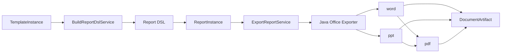

# 06. 文档生成与导出架构

## 1. 正式闭环



## 2. 职责边界

### 2.1 应用层

- `BuildReportDslService`
- `FreezeReportInstanceService`
- `ExportReportService`

职责：

- 生成正式 `Report DSL`
- 冻结报告实例
- 发起文档生成
- 记录产物与任务状态

### 2.2 基础设施层

- `JavaOfficeExporterGateway`
- `PdfConverterGateway`
- 文档存储适配器

职责：

- 接收 `Report DSL` 并生成 `word/ppt`
- 将 `word/ppt` 派生转换为 `pdf`
- 上传产物并回传存储键

## 3. 生成顺序

1. `TemplateInstance` 确认完成
2. 应用层构建 `Report DSL`
3. `Report DSL` 校验通过后写入 `ReportInstance`
4. 发起文档生成任务
5. Java 导出器生成 `word/ppt`
6. 根据 `pdfSource` 派生生成 `pdf`
7. 产物登记到 `tbl_report_documents`

## 4. 统一原则

- 所有文档格式都从同一份 `Report DSL` 出发
- 不再允许从旧 `outline_content` 或其他中间结构直接拼文档
- `pdf` 首版是派生产物，不参与主报告生成状态机

## 5. Java 导出器协议

请求：

```json
{
  "requestId": "req_export_001",
  "reportId": "rpt_001",
  "dslSchemaVersion": "1.0.0",
  "reportDsl": {},
  "options": {
    "theme": "default",
    "strictValidation": true
  }
}
```

响应：

```json
{
  "status": "success",
  "artifact": {
    "fileName": "network-daily.docx",
    "storageKey": "artifacts/2026/04/18/network-daily.docx",
    "contentType": "application/vnd.openxmlformats-officedocument.wordprocessingml.document"
  },
  "warnings": []
}
```
