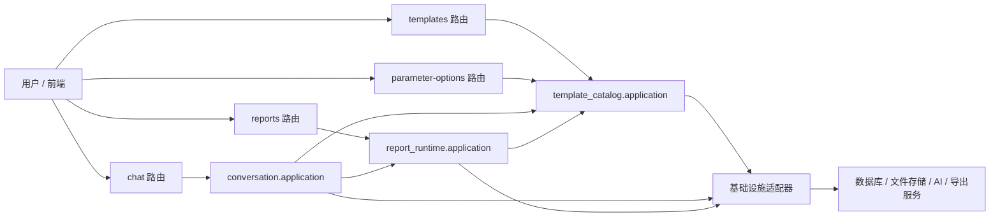
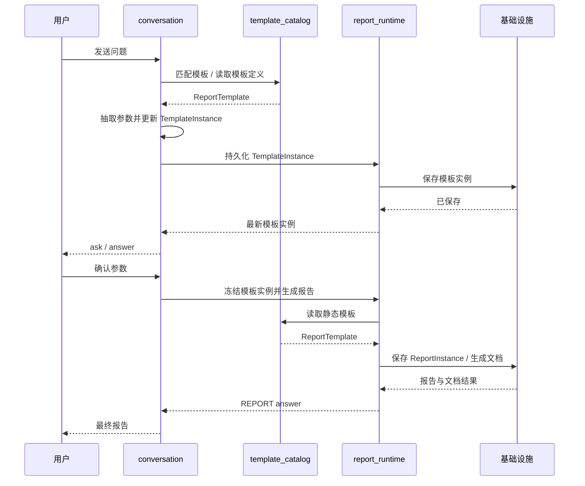

# 总体实现架构

## 1. 目标结构

后端按 DDD 分为 3 个主上下文和 1 组支撑基础设施：

- `contexts/template_catalog`
- `contexts/conversation`
- `contexts/report_runtime`
- `infrastructure/{persistence,ai,query,documents,settings}`

外层接口层固定为：

- `routers/templates.py`
- `routers/chat.py`
- `routers/reports.py`
- `routers/parameter_options.py`
- `routers/{design,feedback,system_settings}.py`

## 2. 依赖方向

- `conversation -> template_catalog`
- `conversation -> report_runtime`
- `report_runtime -> template_catalog`
- `template_catalog`、`conversation`、`report_runtime` 都只能通过 port 访问基础设施

禁止：

- router 直接操作 ORM 模型
- application 层直接使用 `Session`
- 基础设施反向定义领域对象

## 3. 核心实现闭环

1. `templates` 维护静态 `ReportTemplate`
2. `chat` 识别模板并创建或更新 `TemplateInstance`
3. `chat` 在参数完备后确认 `TemplateInstance`
4. `report_runtime` 将 `TemplateInstance` 冻结为 `Report DSL`
5. `reports` 返回 `ReportInstance` 聚合视图并驱动文档导出

## 4. Application Service 总览

### 4.1 `template_catalog`

- `TemplateCatalogService`
  - 负责模板的校验、创建、更新、删除、详情读取、列表摘要、导出和导入预览
  - 保证输入输出都对齐正式 `ReportTemplate`
  - 不负责运行态模板实例和报告生成
- `ParameterOptionService`
  - 负责动态参数开放数据源调用、body size 限制、超时约束和响应归一化
  - 不负责模板本体读写

### 4.2 `conversation`

- `ConversationService`
  - 负责 `/chat` 主流程、会话容器和聊天流水读写
  - 负责模板匹配、参数抽取、模板实例创建/更新、`ask/answer` 构造和确认后触发报告生成
  - 不直接持久化 `ReportInstance`，而是通过 `report_runtime` 完成冻结和生成

### 4.3 `report_runtime`

- `ReportRuntimeService`
  - 负责持久化模板实例、将模板实例冻结为 `Report DSL`、创建报告实例、读取报告聚合视图、触发文档生成
  - 负责把 `TemplateInstance` 与 `ReportInstance`、文档产物和导出任务统一封装成 `/reports` 视图
  - 不负责会话级别的参数追问和模板匹配
- `ReportDocumentService`
  - 负责 report-scoped 文档下载解析
  - 保持下载能力只依附于 `ReportInstance`

## 5. 代码重建策略

- 删除旧 `instances`、`scheduled_tasks` 公开路由和关联上下文
- 删除模板 `sections` 根结构，统一为 `catalogs -> (subCatalogs)* -> sections`
- 删除运行态里 `outline_content / generated_content / resolved_view` 等历史中间定义
- 删除任何把旧结构“映射/兜底”为新结构的逻辑

## 6. 验收基线

- `/chat` 和 `/reports/{reportId}` 返回的报告载荷结构等价
- `TemplateInstance` 只在 `/chat` 的 `ask/answer` 和 `/reports` 的聚合结果中出现
- 文档生成只接受 `Report DSL`
- 数据库只有新表结构，没有历史兼容迁移
