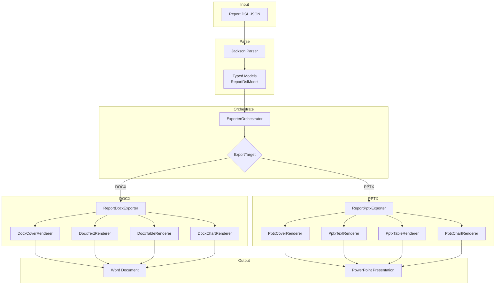
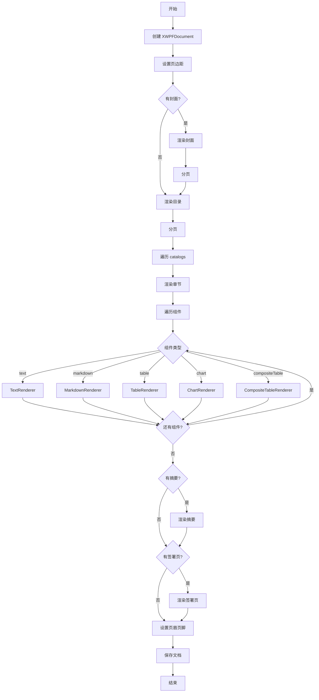
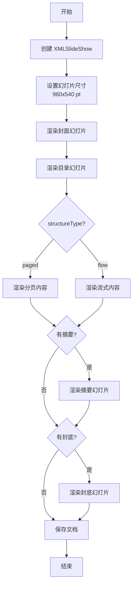

# Report DSL 到 Office 文档转换实现

## 1. 概述

本文档描述 Java Office Exporter 如何将 Report DSL JSON 转换为完整的 Word (.docx) 和 PowerPoint (.pptx) 文档。核心关注点是从 DSL 数据结构到 Apache POI 对象的完整转换流程。

## 2. 架构总览

### 2.1 转换流程



### 2.2 核心组件职责

| 组件 | 职责 | 输入 | 输出 |
|------|------|------|------|
| `ExportPayload` | HTTP 请求载体 | JSON | 结构化请求 |
| `ReportDslModel` | DSL 根模型 | JSON | 类型化对象树 |
| `ExporterOrchestrator` | 导出编排 | DSL + Target | 调用具体导出器 |
| `ReportDocxExporter` | Word 导出主流程 | DSL | XWPFDocument |
| `ReportPptxExporter` | PPT 导出主流程 | DSL | XMLSlideShow |
| `*Renderer` | 组件级渲染 | Component | POI 对象 |

## 3. 数据模型映射

### 3.1 Report DSL 结构

```
ReportDslModel
├── basicInfo: ReportBasicInfo
├── structureType: "flow" | "paged"
├── cover: ReportCover
├── backCover: BackCoverConfig
├── signaturePage: ReportSignaturePage
├── catalogs: List<ReportCatalog>        # flow 模式
│   └── sections: List<ReportSection>
│       └── components: List<ReportComponent>
├── content: List<ReportPagedContentItem> # paged 模式
│   ├── ReportSlide
│   └── ReportSlideSection
├── summary: ReportSummary
└── reportMeta: Map<String, ReportGenerateMeta>
```

### 3.2 组件类型体系

```java
// 基类：多态反序列化
@JsonTypeInfo(use = Id.NAME, property = "type")
@JsonSubTypes({
    @Type(value = TextComponent.class, name = "text"),
    @Type(value = MarkdownComponent.class, name = "markdown"),
    @Type(value = TableComponent.class, name = "table"),
    @Type(value = ChartComponent.class, name = "chart"),
    @Type(value = CompositeTableComponent.class, name = "compositeTable")
})
public abstract class ReportComponent {
    public String id;
    public String type;
    public Map<String, Object> layout;
    public Map<String, Object> basicProperties;
    public Map<String, Object> advanceProperties;
    public List<Map<String, Object>> interactions;
}

// 具体组件
public class TextComponent extends ReportComponent {
    public TextDataProperties dataProperties;
}

public class TableComponent extends ReportComponent {
    public TableDataProperties dataProperties;
}

public class ChartComponent extends ReportComponent {
    public ChartDataProperties dataProperties;
    public Map<String, Object> options;
}
```

### 3.3 关键数据属性

#### TableDataProperties

```java
public class TableDataProperties {
    public String dataType;           // "static" | "datasource" | "api"
    public String sourceId;
    public String title;
    public List<ReportColumn> columns;
    public List<Map<String, Object>> data;
    public List<MergeColumnInfo> mergeColumns;
    public List<MergeRowInfo> mergeRows;
    public Boolean hasMerge;
}

public class ReportColumn {
    public String key;
    public String title;
    public String type;      // "dimension" | "measure"
    public Object width;
    public Boolean sortable;
    public Boolean filterable;
    public String align;
    public List<ReportColumn> children;
}
```

#### ChartDataProperties

```java
public class ChartDataProperties {
    public String dataType;
    public String sourceId;
    public String title;
    public List<ReportColumn> columns;
    public List<Map<String, Object>> data;
    public List<Map<String, Object>> series;
    public List<String> axisGroup;
    public Object xAxis;
    public Object yAxis;
}
```

## 4. Word 文档生成流程

### 4.1 整体结构



### 4.2 封面渲染 (DocxCoverRenderer)

```java
public static void renderCover(XWPFDocument doc, ReportCover cover, 
                               ReportBasicInfo basicInfo, ThemeTokens theme) {
    // 1. 创建封面段落（垂直居中）
    for (int i = 0; i < 6; i++) doc.createParagraph();
    
    // 2. 渲染标题
    String title = cover.title != null ? cover.title : basicInfo.title;
    addCenteredTitle(doc, title, theme.titleSizePt(), theme.primary());
    
    // 3. 渲染副标题
    if (basicInfo.subTitle != null) {
        addCenteredText(doc, basicInfo.subTitle, theme.heading2SizePt());
    }
    
    // 4. 渲染作者和日期
    if (cover.author != null) addCenteredText(doc, cover.author);
    if (cover.date != null) addCenteredText(doc, cover.date);
    
    // 5. 渲染封面内容项
    if (cover.contents != null) {
        for (ReportCoverContent item : cover.contents) {
            addCenteredText(doc, item.content);
        }
    }
}
```

**POI 对象映射：**

| DSL 字段 | POI 对象 | 样式 |
|---------|---------|------|
| `cover.title` | `XWPFParagraph` + `XWPFRun` | 居中，22pt，主色，粗体 |
| `cover.author` | `XWPFParagraph` + `XWPFRun` | 居中，11pt，次色 |
| `cover.date` | `XWPFParagraph` + `XWPFRun` | 居中，11pt，次色 |

### 4.3 目录渲染

```java
private void renderTableOfContents(XWPFDocument doc, ReportDslModel dsl, ThemeTokens theme) {
    addHeading(doc, "目录", 1, theme);
    renderTocEntries(doc, dsl.catalogs, 0, theme);
}

private void renderTocEntries(XWPFDocument doc, List<ReportCatalog> catalogs, 
                              int indent, ThemeTokens theme) {
    for (ReportCatalog catalog : catalogs) {
        String prefix = "    ".repeat(indent);
        addParagraph(doc, prefix + catalog.resolvedTitle(), theme.fontPrimary());
        
        // 渲染章节标题
        if (catalog.sections != null) {
            for (ReportSection section : catalog.sections) {
                String secPrefix = "    ".repeat(indent + 1);
                addParagraph(doc, secPrefix + section.title, theme.fontSecondary());
            }
        }
        
        // 递归渲染子目录
        renderTocEntries(doc, catalog.subCatalogs, indent + 1, theme);
    }
}
```

**POI 对象映射：**

| 层级 | POI 对象 | 样式 |
|------|---------|------|
| 目录标题 | `XWPFParagraph` (Heading1) | 16pt，主色，粗体 |
| 一级目录 | `XWPFParagraph` | 11pt，无缩进 |
| 二级目录 | `XWPFParagraph` | 11pt，缩进 4 空格 |
| 章节 | `XWPFParagraph` | 9pt，次色，缩进 8 空格 |

### 4.4 章节渲染

```java
private void renderSection(XWPFDocument doc, ReportSection section, 
                          int depth, ThemeTokens theme) {
    // 1. 渲染章节标题
    if (section.title != null) {
        int headingLevel = Math.min(depth + 1, 3);
        addHeading(doc, section.title, headingLevel, theme);
    }
    
    // 2. 渲染章节摘要
    if (section.summary != null && section.summary.overview != null) {
        XWPFParagraph p = doc.createParagraph();
        XWPFRun run = p.createRun();
        run.setText(section.summary.overview);
        run.setItalic(true);
        run.setColor(theme.secondary());
    }
    
    // 3. 遍历渲染组件
    if (section.components != null) {
        for (ReportComponent component : section.components) {
            renderComponent(doc, component, theme);
        }
    }
}
```

**标题层级映射：**

| depth | headingLevel | POI 样式 | 字号 |
|-------|--------------|---------|------|
| 1 | 2 | Heading2 | 14pt |
| 2 | 3 | Heading3 | 12pt |
| 3+ | 3 | Heading3 | 12pt |

### 4.5 组件分发

```java
private void renderComponent(XWPFDocument doc, ReportComponent component, ThemeTokens theme) {
    switch (component) {
        case TextComponent text -> 
            DocxTextRenderer.renderText(doc, text.dataProperties, theme);
        case MarkdownComponent md -> 
            DocxTextRenderer.renderMarkdown(doc, md.dataProperties, theme);
        case TableComponent table -> 
            DocxTableRenderer.renderTable(doc, table.dataProperties, theme);
        case ChartComponent chart -> 
            DocxChartRenderer.renderChart(doc, chart.dataProperties, theme);
        case CompositeTableComponent composite -> {
            if (composite.tables != null) {
                for (TableComponent subTable : composite.tables) {
                    DocxTableRenderer.renderTable(doc, subTable.dataProperties, theme);
                }
            }
        }
        default -> { }
    }
}
```

### 4.6 文本组件渲染 (DocxTextRenderer)

```java
public static void renderText(XWPFDocument doc, TextDataProperties dataProps, ThemeTokens theme) {
    // 1. 渲染标题
    if (dataProps.title != null && !dataProps.title.isEmpty()) {
        ReportDocxExporter.addParagraph(doc, dataProps.title, 
            theme.fontPrimary(), theme.bodySizePt(), true, theme.primary());
    }
    
    // 2. 渲染内容（支持换行）
    if (dataProps.content != null && !dataProps.content.isEmpty()) {
        ReportDocxExporter.addParagraph(doc, dataProps.content, 
            theme.fontPrimary(), theme.bodySizePt(), false, null);
    }
}
```

**POI 对象映射：**

| DSL 字段 | POI 对象 | 处理逻辑 |
|---------|---------|---------|
| `dataProperties.title` | `XWPFParagraph` + `XWPFRun` | 粗体，主色 |
| `dataProperties.content` | 多个 `XWPFParagraph` | 按 `\n` 分割，每行一段 |

### 4.7 Markdown 渲染 (DocxTextRenderer)

```java
public static void renderMarkdown(XWPFDocument doc, MarkdownDataProperties dataProps, ThemeTokens theme) {
    String[] lines = dataProps.content.split("\n");
    for (String line : lines) {
        String trimmed = line.trim();
        if (trimmed.isEmpty()) continue;
        
        if (trimmed.startsWith("# ")) {
            ReportDocxExporter.addHeading(doc, trimmed.substring(2), 1, theme);
        } else if (trimmed.startsWith("## ")) {
            ReportDocxExporter.addHeading(doc, trimmed.substring(3), 2, theme);
        } else if (trimmed.startsWith("### ")) {
            ReportDocxExporter.addHeading(doc, trimmed.substring(4), 3, theme);
        } else if (trimmed.startsWith("- ") || trimmed.startsWith("* ")) {
            renderListItem(doc, trimmed.substring(2), theme);
        } else {
            renderRichLine(doc, trimmed, theme);  // 支持 **粗体** 和 *斜体*
        }
    }
}
```

**Markdown 语法支持：**

| 语法 | POI 对象 | 样式 |
|------|---------|------|
| `# 标题` | `XWPFParagraph` (Heading1) | 16pt，主色，粗体 |
| `## 标题` | `XWPFParagraph` (Heading2) | 14pt，主色，粗体 |
| `### 标题` | `XWPFParagraph` (Heading3) | 12pt，主色，粗体 |
| `- 列表` | `XWPFParagraph` + `• ` 前缀 | 缩进 480 twips |
| `**粗体**` | `XWPFRun` (setBold) | 粗体 |
| `*斜体*` | `XWPFRun` (setItalic) | 斜体 |

### 4.8 表格渲染 (DocxTableRenderer)

```java
public static void renderTable(XWPFDocument doc, TableDataProperties dataProps, ThemeTokens theme) {
    // 1. 渲染表格标题
    if (dataProps.title != null) {
        ReportDocxExporter.addParagraph(doc, dataProps.title, ...);
    }
    
    // 2. 推断列定义（如果没有显式定义）
    List<ReportColumn> columns = dataProps.columns != null ? dataProps.columns : inferColumns(dataProps.data);
    
    // 3. 创建表格
    int colCount = columns.size();
    int rowCount = dataProps.data.size() + 1;  // +1 for header
    XWPFTable table = doc.createTable(rowCount, colCount);
    table.setWidth("100%");
    
    // 4. 渲染表头
    styleTableHeader(table, 0, theme);
    for (int c = 0; c < colCount; c++) {
        String colTitle = columns.get(c).title != null ? columns.get(c).title : columns.get(c).key;
        setCellText(table.getRow(0).getCell(c), colTitle, theme.fontPrimary(), 
                   theme.tableHeaderSizePt(), true, "FFFFFF");
    }
    
    // 5. 渲染数据行
    for (int r = 0; r < dataProps.data.size(); r++) {
        Map<String, Object> row = dataProps.data.get(r);
        XWPFTableRow tableRow = table.getRow(r + 1);
        for (int c = 0; c < colCount; c++) {
            String key = columns.get(c).key;
            Object val = row.get(key);
            String cellText = val == null ? "" : val.toString();
            setCellText(tableRow.getCell(c), cellText, ...);
            
            // 交替行背景色
            if (r % 2 == 1) {
                setCellBackground(tableRow.getCell(c), theme.tableAltRowBg());
            }
        }
    }
}
```

**POI 对象映射：**

| DSL 字段 | POI 对象 | 样式 |
|---------|---------|------|
| `dataProperties.title` | `XWPFParagraph` | 表格上方，粗体 |
| `dataProperties.columns` | `XWPFTableRow` (第 0 行) | 主色背景，白色文字，粗体 |
| `dataProperties.data` | `XWPFTableRow` (第 1+ 行) | 交替行背景色 |
| `column.key` | 数据提取键 | - |
| `column.title` | 表头文字 | - |

**表格样式细节：**

```java
private static void setCellBackground(XWPFTableCell cell, String hexColor) {
    CTShd shd = cell.getCTTc().addNewTcPr().addNewShd();
    shd.setFill(hexColor);
    shd.setVal(STShd.CLEAR);
}
```

### 4.9 图表渲染 (DocxChartRenderer)

```java
public static void renderChart(XWPFDocument doc, ChartDataProperties dataProps, ThemeTokens theme) {
    // 1. 渲染图表标题
    if (dataProps.title != null) {
        ReportDocxExporter.addParagraph(doc, dataProps.title, ...);
    }
    
    // 2. 解析图表规范
    ChartSpec spec = ChartSpecParser.parse(dataProps);
    
    // 3. 当前实现：降级为表格显示
    renderFallback(doc, spec, dataProps, theme);
}

private static void renderFallback(XWPFDocument doc, ChartSpec spec, 
                                   ChartDataProperties dataProps, ThemeTokens theme) {
    // 渲染图表类型说明
    String chartType = spec.chartType() != null ? spec.chartType() : "unknown";
    ReportDocxExporter.addParagraph(doc,
        "[图表: " + chartType + " - " + spec.categories().size() + " 类别, " + 
        spec.seriesList().size() + " 系列]", ...);
    
    // 将图表数据转换为表格显示
    TableDataProperties tableProps = toTableDataProperties(dataProps);
    if (tableProps != null) {
        DocxTableRenderer.renderTable(doc, tableProps, theme);
    }
}
```

**图表类型处理策略：**

| 图表类型 | 当前实现 | 未来计划 |
|---------|---------|---------|
| line | 降级为表格 | XDDFChart (线图) |
| bar | 降级为表格 | XDDFChart (柱图) |
| pie | 降级为表格 | XDDFChart (饼图) |
| scatter | 降级为表格 | 降级为表格 |
| radar | 降级为表格 | 降级为表格 |
| gauge | 降级为表格 | 降级为表格 |
| candlestick | 降级为表格 | 降级为表格 |

**ChartSpecParser 解析逻辑：**

```java
public static ChartSpec parse(ChartDataProperties props) {
    // 1. 提取类别列（type="dimension" 或第一列）
    String categoryCol = findCategoryColumn(props.columns);
    
    // 2. 提取数值列（除类别列外的所有列）
    List<String> valueCols = findValueColumns(props.columns, categoryCol);
    
    // 3. 提取类别数据
    List<String> categories = props.data.stream()
        .map(row -> str(row.get(categoryCol)))
        .collect(Collectors.toList());
    
    // 4. 提取系列数据
    List<ChartSpec.Series> seriesList = new ArrayList<>();
    if (props.series != null && !props.series.isEmpty()) {
        // 按 series 定义提取
        for (Map<String, Object> s : props.series) {
            String sName = str(s.get("name"));
            String encodeField = extractEncodeField(s);
            List<Double> values = extractValues(props.data, encodeField);
            seriesList.add(new ChartSpec.Series(sName, values));
        }
    } else {
        // 按列自动生成系列
        for (String col : valueCols) {
            seriesList.add(new ChartSpec.Series(col, extractValues(props.data, col)));
        }
    }
    
    return new ChartSpec(chartType, title, categories, seriesList, canRenderNative);
}
```

### 4.10 签署页渲染 (DocxCoverRenderer)

```java
public static void renderSignaturePage(XWPFDocument doc, ReportSignaturePage sigPage, ThemeTokens theme) {
    // 1. 渲染标题
    String title = sigPage.title != null ? sigPage.title : "签署页";
    ReportDocxExporter.addHeading(doc, title, 1, theme);
    
    // 2. 渲染签署人列表
    if (sigPage.signers != null) {
        for (ReportSignaturePage.Signer signer : sigPage.signers) {
            StringBuilder sb = new StringBuilder();
            sb.append("签署人: ").append(signer.name != null ? signer.name : "");
            if (signer.role != null) {
                sb.append("  (").append(signer.role).append(")");
            }
            if (signer.date != null) {
                sb.append("  日期: ").append(signer.date);
            }
            ReportDocxExporter.addParagraph(doc, sb.toString(), ...);
            doc.createParagraph();  // 空行
        }
    }
}
```

### 4.11 页眉页脚设置

```java
private void setupHeaderFooter(XWPFDocument doc, ReportBasicInfo basicInfo) {
    if (basicInfo == null) return;
    
    // 页眉
    if (basicInfo.header != null && !basicInfo.header.isBlank()) {
        XWPFHeader header = doc.createHeader(HeaderFooterType.DEFAULT);
        XWPFParagraph p = header.createParagraph();
        p.setAlignment(ParagraphAlignment.CENTER);
        XWPFRun run = p.createRun();
        run.setText(basicInfo.header);
        run.setFontSize(9);
        run.setColor("999999");
    }
    
    // 页脚
    if (basicInfo.footer != null && !basicInfo.footer.isBlank()) {
        XWPFFooter footer = doc.createFooter(HeaderFooterType.DEFAULT);
        XWPFParagraph p = footer.createParagraph();
        p.setAlignment(ParagraphAlignment.CENTER);
        XWPFRun run = p.createRun();
        run.setText(basicInfo.footer);
        run.setFontSize(9);
        run.setColor("999999");
    }
}
```

## 5. PowerPoint 文档生成流程

### 5.1 整体结构



### 5.2 幻灯片尺寸

```java
private static final int SLIDE_WIDTH_EMU = 9144000;   // 960 pt * 9525 EMU/pt
private static final int SLIDE_HEIGHT_EMU = 5143500;  // 540 pt * 9525 EMU/pt

pptx.setPageSize(new Dimension(SLIDE_WIDTH_EMU / 9525, SLIDE_HEIGHT_EMU / 9525));
```

### 5.3 封面幻灯片 (PptxCoverRenderer)

```java
private void renderCoverSlide(XMLSlideShow pptx, ReportDslModel dsl, ThemeTokens theme) {
    XSLFSlide slide = pptx.createSlide();
    
    // 1. 渲染标题（居中）
    String title = dsl.cover != null && dsl.cover.title != null ? 
                   dsl.cover.title : dsl.basicInfo.title;
    addTextBox(slide, title, 50, 150, 860, 100, 
               theme.fontPrimary(), theme.titleSizePt(), true, theme.primary(), true);
    
    // 2. 渲染副标题
    if (dsl.basicInfo.subTitle != null) {
        addTextBox(slide, dsl.basicInfo.subTitle, 50, 260, 860, 50, 
                   theme.fontPrimary(), theme.heading2SizePt(), false, theme.secondary(), true);
    }
    
    // 3. 渲染作者和日期
    StringBuilder info = new StringBuilder();
    if (dsl.cover != null) {
        if (dsl.cover.author != null) info.append(dsl.cover.author).append("  ");
        if (dsl.cover.date != null) info.append(dsl.cover.date);
    }
    if (!info.isEmpty()) {
        addTextBox(slide, info.toString(), 50, 340, 860, 40, 
                   theme.fontSecondary(), theme.bodySizePt(), false, theme.secondary(), true);
    }
}
```

**POI 对象映射：**

| DSL 字段 | POI 对象 | 位置 (x, y, w, h) | 样式 |
|---------|---------|------------------|------|
| `cover.title` | `XSLFTextBox` | (50, 150, 860, 100) | 22pt，主色，粗体，居中 |
| `basicInfo.subTitle` | `XSLFTextBox` | (50, 260, 860, 50) | 14pt，次色，居中 |
| `cover.author` + `date` | `XSLFTextBox` | (50, 340, 860, 40) | 11pt，次色，居中 |

### 5.4 目录幻灯片

```java
private void renderTocSlide(XMLSlideShow pptx, ReportDslModel dsl, ThemeTokens theme) {
    List<ReportCatalog> catalogs = dsl.catalogs != null ? dsl.catalogs : List.of();
    if (catalogs.isEmpty()) return;
    
    XSLFSlide slide = pptx.createSlide();
    
    // 标题
    addTextBox(slide, "目录", 40, 20, 880, 40, 
               theme.fontPrimary(), theme.heading1SizePt(), true, theme.primary(), false);
    
    // 目录列表
    StringBuilder sb = new StringBuilder();
    for (int i = 0; i < catalogs.size(); i++) {
        sb.append(i + 1).append(". ").append(catalogs.get(i).resolvedTitle()).append("\n");
    }
    addTextBox(slide, sb.toString(), 60, 70, 840, 400, 
               theme.fontPrimary(), theme.bodySizePt(), false, null, false);
}
```

### 5.5 章节幻灯片

```java
private void renderSectionSlide(XMLSlideShow pptx, ReportSection section, 
                                String parentTitle, ThemeTokens theme) {
    XSLFSlide slide = pptx.createSlide();
    
    // 1. 渲染章节标题
    String sectionTitle = section.title != null ? section.title : "";
    addTextBox(slide, sectionTitle, 40, 15, 880, 35, 
               theme.fontPrimary(), theme.heading2SizePt(), true, theme.primary(), false);
    
    // 2. 渲染父级标题（页眉）
    addHeaderLine(slide, parentTitle, theme);
    
    // 3. 遍历渲染组件
    int yOffset = 60;
    if (section.components != null) {
        for (ReportComponent component : section.components) {
            yOffset = renderComponent(slide, component, yOffset, theme);
        }
    }
    
    // 4. 渲染章节摘要
    if (section.summary != null && section.summary.overview != null) {
        addTextBox(slide, section.summary.overview, 40, yOffset + 10, 880, 60, 
                   theme.fontSecondary(), theme.smallSizePt(), false, theme.secondary(), false);
    }
}
```

### 5.6 组件渲染分发

```java
private int renderComponent(XSLFSlide slide, ReportComponent component, 
                           int yOffset, ThemeTokens theme) {
    switch (component) {
        case com.bi.report.generation.model.TextComponent text -> {
            if (text.dataProperties != null) {
                String content = str(text.dataProperties.content);
                if (!content.isEmpty()) {
                    yOffset = addTextBox(slide, content, 40, yOffset, 880, 380, 
                                        theme.fontPrimary(), theme.bodySizePt(), false, null, false);
                }
            }
        }
        case MarkdownComponent md -> {
            if (md.dataProperties != null) {
                String content = str(md.dataProperties.content);
                if (!content.isEmpty()) {
                    yOffset = addTextBox(slide, content, 40, yOffset, 880, 380, 
                                        theme.fontPrimary(), theme.bodySizePt(), false, null, false);
                }
            }
        }
        case TableComponent table -> {
            yOffset = PptxTableRenderer.renderTable(slide, table.dataProperties, 
                                                   40, yOffset, 880, theme);
        }
        case ChartComponent chart -> {
            yOffset = PptxChartRenderer.renderChart(slide, chart.dataProperties, 
                                                   40, yOffset, 880, 300, theme);
        }
        case CompositeTableComponent composite -> {
            if (composite.tables != null) {
                for (TableComponent subTable : composite.tables) {
                    yOffset = PptxTableRenderer.renderTable(slide, subTable.dataProperties, 
                                                           40, yOffset, 880, theme);
                }
            }
        }
        default -> { }
    }
    return yOffset;
}
```

### 5.7 表格渲染 (PptxTableRenderer)

```java
public static int renderTable(XSLFSlide slide, TableDataProperties dataProps, 
                             int x, int y, int width, ThemeTokens theme) {
    int yOffset = y;
    
    // 1. 渲染表格标题
    if (dataProps.title != null) {
        ReportPptxExporter.addTextBox(slide, dataProps.title, x, yOffset, width, 25, ...);
        yOffset += 28;
    }
    
    // 2. 推断列定义
    List<ReportColumn> columns = dataProps.columns != null ? dataProps.columns : inferColumns(dataProps.data);
    if (columns.isEmpty()) return y;
    
    // 3. 计算表格尺寸
    int colCount = columns.size();
    int rowCount = Math.min(dataProps.data.size() + 1, 20);  // 最多 20 行
    int tableHeight = Math.min(rowCount * 22, 350);
    
    // 4. 创建表格
    XSLFTable table = slide.createTable(rowCount, colCount);
    table.setAnchor(new Rectangle(x, yOffset, width, tableHeight));
    
    // 5. 渲染表头
    for (int c = 0; c < colCount; c++) {
        ReportColumn col = columns.get(c);
        String colTitle = col.title != null ? col.title : col.key;
        XSLFTableCell cell = table.getCell(0, c);
        cell.setText(colTitle);
        cell.setFillColor(ReportPptxExporter.hexToColor(theme.tableHeaderBg()));
        
        // 设置表头样式
        for (XSLFTextParagraph p : cell.getTextParagraphs()) {
            p.setTextAlign(TextParagraph.TextAlign.CENTER);
            for (XSLFTextRun r : p.getTextRuns()) {
                r.setFontFamily(theme.fontPrimary());
                r.setFontSize((double) theme.tableHeaderSizePt());
                r.setBold(true);
                r.setFontColor(Color.WHITE);
            }
        }
    }
    
    // 6. 渲染数据行
    for (int r = 1; r < rowCount; r++) {
        Map<String, Object> rowData = dataProps.data.get(r - 1);
        for (int c = 0; c < colCount; c++) {
            String key = columns.get(c).key;
            Object val = rowData.get(key);
            String cellText = val == null ? "" : val.toString();
            XSLFTableCell cell = table.getCell(r, c);
            cell.setText(cellText);
            
            // 交替行背景色
            if (r % 2 == 0) {
                cell.setFillColor(ReportPptxExporter.hexToColor(theme.tableAltRowBg()));
            }
        }
    }
    
    return yOffset + tableHeight + 10;
}
```

**POI 对象映射：**

| DSL 字段 | POI 对象 | 样式 |
|---------|---------|------|
| `dataProperties.title` | `XSLFTextBox` | 表格上方，粗体 |
| `dataProperties.columns` | `XSLFTableCell` (第 0 行) | 主色背景，白色文字，粗体，居中 |
| `dataProperties.data` | `XSLFTableCell` (第 1+ 行) | 交替行背景色 |

### 5.8 图表渲染 (PptxChartRenderer)

```java
public static int renderChart(XSLFSlide slide, ChartDataProperties dataProps, 
                             int x, int y, int width, int height, ThemeTokens theme) {
    int yOffset = y;
    
    // 1. 渲染图表标题
    if (dataProps.title != null) {
        ReportPptxExporter.addTextBox(slide, dataProps.title, x, yOffset, width, 25, ...);
        yOffset += 28;
    }
    
    // 2. 解析图表规范
    ChartSpec spec = ChartSpecParser.parse(dataProps);
    
    // 3. 渲染图表信息卡
    renderNativeChart(slide, spec, x, yOffset, width, height, theme);
    
    return yOffset + height + 10;
}

private static void renderNativeChart(XSLFSlide slide, ChartSpec spec, 
                                      int x, int y, int width, int height, ThemeTokens theme) {
    // 当前实现：渲染图表信息文本框
    String chartType = spec.chartType() != null ? spec.chartType() : "unknown";
    StringBuilder info = new StringBuilder();
    info.append("图表类型: ").append(chartType).append("\n");
    info.append("类别: ").append(String.join(", ", spec.categories().subList(0, Math.min(5, spec.categories().size()))));
    if (spec.categories().size() > 5) info.append("...");
    info.append("\n");
    
    // 渲染系列信息
    for (ChartSpec.Series s : spec.seriesList()) {
        info.append("系列 ").append(s.name()).append(": ");
        for (int i = 0; i < Math.min(5, s.values().size()); i++) {
            if (i > 0) info.append(", ");
            info.append(s.values().get(i));
        }
        if (s.values().size() > 5) info.append("...");
        info.append("\n");
    }
    
    ReportPptxExporter.addTextBox(slide, info.toString(), x, y, width, height, 
                                  theme.fontPrimary(), theme.smallSizePt(), false, null, false);
}
```

### 5.9 文本框渲染工具

```java
static int addTextBox(XSLFSlide slide, String text, int x, int y, int w, int h,
                      String fontFamily, int fontSize, boolean bold, String color, boolean centered) {
    XSLFTextBox textBox = slide.createTextBox();
    textBox.setAnchor(new Rectangle(x, y, w, h));
    textBox.clearText();
    
    XSLFTextParagraph paragraph = textBox.addNewTextParagraph();
    if (centered) {
        paragraph.setTextAlign(TextParagraph.TextAlign.CENTER);
    }
    
    String[] lines = text.split("\n");
    for (int i = 0; i < lines.length; i++) {
        if (i > 0) {
            paragraph = textBox.addNewTextParagraph();
            if (centered) {
                paragraph.setTextAlign(TextParagraph.TextAlign.CENTER);
            }
        }
        XSLFTextRun run = paragraph.addNewTextRun();
        run.setText(lines[i]);
        run.setFontFamily(fontFamily);
        run.setFontSize((double) fontSize);
        run.setBold(bold);
        if (color != null) {
            run.setFontColor(hexToColor(color));
        }
    }
    
    return y + h;
}
```

## 6. 主题系统

### 6.1 ThemeTokens 定义

```java
public record ThemeTokens(
    String primary,           // 主色 (如 "1d4ed8")
    String secondary,         // 次色 (如 "475569")
    String accent,            // 强调色
    String fontPrimary,       // 主字体 (如 "Microsoft YaHei")
    String fontSecondary,     // 辅字体 (如 "Arial")
    int titleSizePt,          // 标题字号 (22)
    int heading1SizePt,       // H1 字号 (16)
    int heading2SizePt,       // H2 字号 (14)
    int heading3SizePt,       // H3 字号 (12)
    int bodySizePt,           // 正文字号 (11)
    int smallSizePt,          // 小字号 (9)
    int tableHeaderSizePt,    // 表头字号 (10)
    String tableHeaderBg,     // 表头背景色
    String tableAltRowBg,     // 交替行背景色
    String[] palette          // 图表色板
) { }
```

### 6.2 内置主题

#### enterprise-light

```java
public static ThemeTokens enterpriseLight() {
    return new ThemeTokens(
        "1d4ed8", "475569", "2563eb",
        "Microsoft YaHei", "Arial",
        22, 16, 14, 12, 11, 9, 10,
        "1d4ed8", "f1f5f9",
        new String[]{"1d4ed8", "2563eb", "3b82f6", "60a5fa", "93c5fd", 
                     "bfdbfe", "f59e0b", "10b981", "ef4444", "8b5cf6"}
    );
}
```

#### enterprise-dark

```java
public static ThemeTokens enterpriseDark() {
    return new ThemeTokens(
        "60a5fa", "94a3b8", "3b82f6",
        "Microsoft YaHei", "Arial",
        22, 16, 14, 12, 11, 9, 10,
        "1e3a5f", "1e293b",
        new String[]{"60a5fa", "3b82f6", "2563eb", "93c5fd", "bfdbfe", 
                     "dbeafe", "fbbf24", "34d399", "f87171", "a78bfa"}
    );
}
```

### 6.3 StyleResolver

```java
public final class StyleResolver {
    private final ThemeTokens tokens;
    
    public StyleResolver(String themeId) {
        this.tokens = resolve(themeId);
    }
    
    private static ThemeTokens resolve(String themeId) {
        if (themeId == null) return ThemeTokens.enterpriseLight();
        return switch (themeId.trim().toLowerCase()) {
            case "enterprise-dark" -> ThemeTokens.enterpriseDark();
            default -> ThemeTokens.enterpriseLight();
        };
    }
    
    public static int hexToRgbInt(String hex) {
        String clean = hex.replace("#", "").trim();
        return Integer.parseInt(clean, 16);
    }
}
```

## 7. 关键实现细节

### 7.1 页边距设置 (Word)

```java
private void setupPageMargins(XWPFDocument doc) {
    CTDocument1 document = doc.getDocument();
    CTBody body = document.getBody();
    if (body == null) body = document.addNewBody();
    
    CTSectPr sectPr = body.isSetSectPr() ? body.getSectPr() : body.addNewSectPr();
    CTPageMar pageMar = sectPr.isSetPgMar() ? sectPr.getPgMar() : sectPr.addNewPgMar();
    
    long marginTwips = 794;  // 14mm ≈ 794 twips
    pageMar.setTop(BigInteger.valueOf(marginTwips));
    pageMar.setBottom(BigInteger.valueOf(marginTwips));
    pageMar.setLeft(BigInteger.valueOf(marginTwips));
    pageMar.setRight(BigInteger.valueOf(marginTwips));
}
```

### 7.2 分页符 (Word)

```java
static void addPageBreak(XWPFDocument doc) {
    XWPFParagraph p = doc.createParagraph();
    XWPFRun run = p.createRun();
    run.addBreak(BreakType.PAGE);
}
```

### 7.3 标题样式 (Word)

```java
static void addHeading(XWPFDocument doc, String text, int level, ThemeTokens theme) {
    XWPFParagraph p = doc.createParagraph();
    p.setStyle("Heading" + level);  // 使用 Word 内置标题样式
    
    XWPFRun run = p.createRun();
    run.setText(text);
    run.setFontFamily(theme.fontPrimary());
    run.setBold(true);
    
    int size = switch (level) {
        case 1 -> theme.heading1SizePt();
        case 2 -> theme.heading2SizePt();
        default -> theme.heading3SizePt();
    };
    run.setFontSize(size);
    run.setColor(theme.primary());
    
    p.setSpacingAfter(120);
    p.setSpacingBefore(240);
}
```

### 7.4 颜色转换 (PPT)

```java
static Color hexToColor(String hex) {
    if (hex == null) return Color.BLACK;
    String clean = hex.replace("#", "").trim();
    if (clean.length() != 6) return Color.BLACK;
    return new Color(
        Integer.parseInt(clean.substring(0, 2), 16),
        Integer.parseInt(clean.substring(2, 4), 16),
        Integer.parseInt(clean.substring(4, 6), 16)
    );
}
```

## 8. 测试覆盖

### 8.1 测试文件

```
src/test/java/com/bi/report/generation/
├── model/
│   └── ReportDslModelTest.java          # 模型反序列化测试 (6 个用例)
├── chart/
│   └── ChartSpecParserTest.java         # 图表解析测试 (10 个用例)
├── docx/
│   └── ReportDocxExporterTest.java      # DOCX 导出测试 (11 个用例)
└── pptx/
    └── ReportPptxExporterTest.java      # PPTX 导出测试 (8 个用例)
```

### 8.2 测试资源

```
src/test/resources/
├── showcase-flow.json    # Flow 模式完整示例 (4 章，覆盖所有组件类型)
└── showcase-paged.json   # Paged 模式完整示例 (5 页，覆盖所有组件类型)
```

### 8.3 测试用例清单

#### ReportDslModelTest (6 个用例)

| 测试方法 | 覆盖内容 |
|---------|---------|
| `testDeserializeFlowReport` | Flow 结构完整反序列化 |
| `testDeserializePagedReport` | Paged 结构完整反序列化 |
| `testComponentPolymorphicDeserialization` | 组件多态反序列化 |
| `testTableComponentDeserialization` | 表格组件（含 mergeRows） |
| `testCompositeTableDeserialization` | 复合表组件 |
| `testChartComponentDeserialization` | 图表组件（含 series） |

#### ChartSpecParserTest (10 个用例)

| 测试方法 | 图表类型 | 预期行为 |
|---------|---------|---------|
| `testParseLineChart` | line | NativeType.LINE |
| `testParseBarChart` | bar | NativeType.BAR |
| `testParsePieChart` | pie | NativeType.PIE |
| `testParseScatterChart` | scatter | FALLBACK_TABLE |
| `testParseRadarChart` | radar | FALLBACK_TABLE |
| `testParseGaugeChart` | gauge | FALLBACK_TABLE |
| `testParseCandlestickChart` | candlestick | FALLBACK_TABLE |
| `testParseMultiSeriesChart` | line/bar | 多系列正确解析 |
| `testParseEmptyData` | any | FALLBACK_TABLE |
| `testParseNullProperties` | null | 安全处理 |

#### ReportDocxExporterTest (11 个用例)

| 测试方法 | 覆盖内容 |
|---------|---------|
| `testExportFlowReportWithCover` | 封面、目录、页眉页脚 |
| `testExportReportWithTextComponents` | TextComponent + MarkdownComponent |
| `testExportReportWithTables` | 表格、表头着色、交替行 |
| `testExportReportWithLineChart` | 折线图降级表格 |
| `testExportReportWithBarChart` | 柱状图降级表格 |
| `testExportReportWithPieChart` | 饼图降级表格 |
| `testExportReportWithFallbackChart` | scatter/radar/gauge 降级 |
| `testExportReportWithCompositeTable` | 复合表多子表 |
| `testExportReportWithSignaturePage` | 签署页 |
| `testExportFullShowcaseReport` | 完整示例端到端 |
| `testExportWithDarkTheme` | 深色主题 |

#### ReportPptxExporterTest (8 个用例)

| 测试方法 | 覆盖内容 |
|---------|---------|
| `testExportPagedReportWithSlides` | Paged 结构幻灯片 |
| `testExportFlowReportAsSlides` | Flow 转 PPT |
| `testExportPptxWithTables` | XSLFTable 渲染 |
| `testExportPptxWithCharts` | 图表信息卡 |
| `testExportPptxWithBackCover` | 封底 |
| `testExportFullShowcasePptx` | 完整示例端到端 |
| `testExportWithDarkTheme` | 深色主题 |
| `testExportEmptyPagedReport` | 空内容安全处理 |

## 9. 构建与运行

### 9.1 构建命令

```bash
export JAVA_HOME=/opt/homebrew/Cellar/openjdk@21/21.0.11/libexec/openjdk.jdk/Contents/Home
export PATH=$JAVA_HOME/bin:/opt/homebrew/bin:$PATH

cd services/java-office-exporter
mvn clean package
```

**产物：**
- `target/java-office-exporter-0.1.0.jar` (21 MB fat jar)

### 9.2 运行测试

```bash
mvn test
```

**测试结果：**
```
Tests run: 35, Failures: 0, Errors: 0, Skipped: 0
BUILD SUCCESS
```

### 9.3 启动 HTTP 服务

```bash
java -jar target/java-office-exporter-0.1.0.jar \
  --host 127.0.0.1 \
  --port 18500 \
  --artifacts-dir ./artifacts
```

**API 端点：**
- `GET /health` → `{"status":"ok"}`
- `POST /exports/word` → 生成 Word 文档
- `POST /exports/ppt` → 生成 PPT 文档

## 10. 已知限制与未来改进

### 10.1 当前限制

1. **图表渲染**：所有图表类型当前降级为表格显示，未实现原生 XDDFChart
2. **行合并**：`mergeRows` 字段已解析但未在 Word 表格中实现合并
3. **列合并**：`mergeColumns` 字段已解析但未实现
4. **图片支持**：未实现 `ReportCover.image` 和 `BackCoverConfig.image`
5. **交互属性**：`interactions` 字段已解析但未使用

### 10.2 未来改进计划

1. **原生图表渲染**：实现 XDDFChart 支持 line/bar/pie 三种原生图表
2. **表格合并**：实现 Word 表格的行合并和列合并
3. **图片嵌入**：支持封面和封底的图片嵌入
4. **高级样式**：支持 `basicProperties` 和 `advanceProperties` 中的自定义样式
5. **图表交互**：支持图表的交互属性（如数据标签、图例位置）

## 11. 总结

本实现完整覆盖了 Report DSL 到 Word 和 PowerPoint 文档的转换流程：

✅ **数据模型**：30 个类型化 Java 类，完整映射 Report DSL 结构  
✅ **组件多态**：Jackson `@JsonTypeInfo` 实现 5 种组件类型的自动反序列化  
✅ **Word 导出**：封面、目录、章节、文本、Markdown、表格、图表、签署页、页眉页脚  
✅ **PPT 导出**：封面、目录、章节幻灯片、文本、表格、图表、摘要、封底  
✅ **主题系统**：enterprise-light 和 enterprise-dark 两套内置主题  
✅ **测试覆盖**：35 个测试用例，覆盖所有组件类型和图表类型  
✅ **构建验证**：Maven 编译通过，生成 21 MB fat jar  

核心转换流程清晰，从 JSON → 类型化模型 → POI 对象，每一步都有明确的职责边界和数据映射关系。
