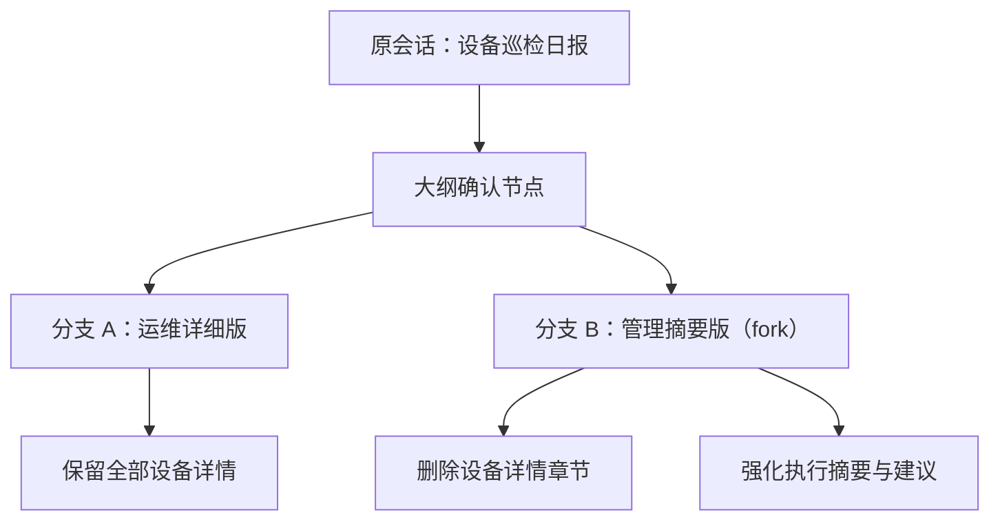
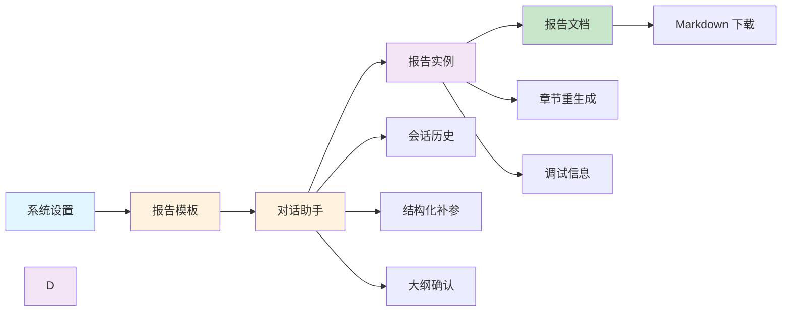

# 陆Sir 的智能报告系统用户故事

> 陆Sir 是省公司网络运维与分析团队的负责人。以前，他每天要在模板整理、参数确认、数据核对、报告撰写、文档导出之间来回切换。系统不断演进后，他终于把这些动作串成了一条清晰、可追踪、可复用的工作流：**系统设置 -> 报告模板 -> 对话生成 -> 报告实例 -> Markdown 文档**。

---

## 场景一：第一次启用系统

周一早上，陆Sir 打开系统，先没有急着生成报告，而是进入了 **系统设置**。

他知道，如果 Completion 和 Embedding 没配置好，后面的模板匹配、对话回复、章节生成都会被阻断。于是他在页面里完成了三件事：

1. 配置 OpenAI 兼容接口的 Completion 模型
2. 配置 Embedding 模型，并测试连通性
3. 点击“重建模板索引”，让系统重新建立模板的语义匹配索引

系统在按钮下方给出轻量反馈：

> 已保存系统设置  
> 连接测试成功：Completion、Embedding 均可用  
> 模板索引已重建

陆Sir 点点头：

> “这样对话助手才是真的能用，而不是只会演示。”

---

## 场景二：在报告模板工作台里搭模板

下午，他准备新增一个“设备巡检日报”模板。

这一次，他没有再面对大段 JSON，而是进入了新的 **报告模板工作台**。页面被分成几个明确区域：

- 基础信息
- 参数定义
- 章节结构
- 结构预览 / 模板 JSON

### 2.1 配参数

他先在“参数定义”里新增了三个参数：

- 巡检日期：日期选择，必填
- 设备列表：动态选项，多值，必填
- 关注指标：固定选项，可多选

每个参数都能看到清晰的输入方式，不需要去记忆底层字段名。对于预览场景，他还顺手填了示例值，用来看后面的章节展开效果。

### 2.2 配章节

接着，他到“章节结构”里搭大纲树：

- 执行摘要
- 设备概览
- 单设备巡检详情
- 异常与建议

其中“单设备巡检详情”开启了 `foreach`，绑定到“设备列表”。

于是预览区里立刻出现了展开效果：

- 单设备巡检详情 · Router-001
- 单设备巡检详情 · Router-002
- 单设备巡检详情 · Switch-001

### 2.3 配数据和展示

对每个内容章节，他继续配置：

- 数据准备：`sql / nl2sql / ai_synthesis`
- 展示方式：文本、单值、简单表格、图表占位、复合表格

他最喜欢的一点，是工作台已经把“数据准备”和“展示方式”拆开了。业务人员不需要面对抽象 schema，就能把章节结构配置清楚。

### 2.4 导出模板

模板检查无误后，他还顺手点了 **导出 JSON**。

系统导出了一份单模板 JSON，方便他发给另一个团队复用。

> “模板不只是写出来，还要能带走。”

---

## 场景三：对话生成报告，但不再一把梭

第二天一早，陆Sir 切到 **对话助手**。这一次页面不是直接塞给他一个旧会话，而是保持空态欢迎语。

左侧的会话记录栏也很克制：

- 默认展示历史会话标题
- 可以折叠/展开
- hover 才出现 `...` 菜单
- 删除、重命名等操作收在菜单里

他输入第一句话：

> “制作今天的设备巡检日报”

系统不会预先创建空会话，而是在这条真实用户消息发出后，才创建一条会话记录，并把这句话截断后作为会话标题。

### 3.1 结构化补参

系统匹配到了“设备巡检日报”模板，但没有立刻生成，而是开始结构化补参：

- 日期参数弹出日期控件
- 动态设备参数弹出可选列表
- 多值参数支持多选

陆Sir 一边输入，一边看着自己的消息立即回显到消息流中。输入框在系统处理期间会暂时禁用，消息流中会出现一个轻量的“正在处理中”提示。

### 3.2 参数确认

当所有必填参数收齐后，系统没有直接去跑 LLM，而是先展示参数确认卡：

- 模板名称
- 当前已收集参数
- 编辑某个参数
- 重置参数
- 进入大纲确认

陆Sir 觉得这个改动很对：

> “我终于知道系统到底打算拿什么去生成了。”

---

## 场景四：先确认大纲，再生成报告

在新版流程里，参数确认之后还有一个关键步骤：**大纲确认**。

系统会先把模板里的参数占位符替换掉，再把 `foreach` 展开成实例级章节树，然后展示给陆Sir。

他看到的不是一堆表单，而是一棵所见即所得的内容树：

- 每个节点就是一句话
- 点击可以原地编辑
- 可以折叠/展开
- 涉及 AI 生成的章节前面有 `AI` 标识

例如：

- 执行摘要：总结今日巡检总体情况 `AI`
- 设备概览：展示巡检设备与关键指标
- 单设备巡检详情：Router-001 `AI`
- 单设备巡检详情：Router-002 `AI`

如果他觉得某个章节标题太生硬，可以直接点进去改；如果想新增一个人工说明章节，也可以在这里加。

### 4.1 确认大纲在这里沉淀为生成基线

当他点击“保存大纲”时，系统不会立刻生成报告，而是先把当前确认状态保留在这次对话上下文里。

真正点击“确认生成”后，系统会把这份确认状态内化成报告实例的**生成基线**。这份基线记录了：

- 基于哪个报告模板
- 当时确认过的参数
- 展开并编辑后的实例级大纲
- 生成时携带的 warnings

陆Sir 在用户界面上不再单独看到“模板实例”模块，但在报告实例详情里，仍然可以通过“查看确认大纲”回看这份生成基线。

---

## 场景五：生成报告实例，并保留证据链

当大纲确认完成后，陆Sir 才点击：

> 确认生成

这时系统开始真正创建 **报告实例**。

后端不是简单拼 Markdown，而是按章节执行更真实的流水线：

1. 生成章节查询意图
2. 通过 `NL2IR2SQL` 生成 Ibis 中间表达
3. 编译成 SQL 到样例电信数据库执行
4. 拿到样本结果和指标证据
5. 再调用 LLM 生成章节正文

如果某一节查询失败，系统会把这一节标成失败，但不阻断整份报告。

### 5.1 在实例详情里追问题

报告实例生成完成后，陆Sir 进入 **报告实例** 页面。

他能看到：

- 实例概览
- 输入参数
- 每一章节的生成状态
- 调试信息折叠面板

点开某一节的调试面板，里面还有：

- 查询意图
- Ibis 代码
- 编译 SQL
- 样本结果
- 错误信息

这让他第一次觉得：“LLM 生成”不是黑盒，而是可排查、可复核的工程链路。

---

## 场景六：下载 Markdown，进入协作闭环

报告没有问题后，他点击下载。

系统会自动生成一份 **Markdown 文档**，并在对话里直接返回下载入口，同时在“报告文档”页面留下记录。

这时，链路已经完整闭环：

- 对话里确认需求
- 参数显式收集
- 大纲先确认
- 确认大纲先固定为生成基线
- 报告实例再生成
- Markdown 文档最终导出

陆Sir 把文档发给同事审阅，同事提出几点修改意见。陆Sir 没有重来一遍，而是回到报告实例页，仅对某个章节执行 **重生成**。

系统只重跑目标章节，不影响其它已确认内容。

---

## 场景七：多会话并行，不再丢上下文

过去最让陆Sir 头疼的一件事，是同一天要同时推进多份报告。

现在他可以：

- 上午在一个会话里做“设备巡检日报”
- 下午切到另一个会话处理“资产统计报告”
- 晚上再回到上午那个会话，继续补参或继续确认大纲

每个会话都保留自己的：

- 历史消息
- 当前匹配模板
- 已收集参数
- 大纲确认状态

他不需要担心切换之后上下文串掉，也不需要重新从头解释一遍。

---

## 场景八：从历史消息或报告实例继续分支

现在，这项能力已经以首版形态落地，但仍保留进一步演进空间。

某天晚上，陆Sir 在“设备巡检日报”的大纲确认阶段，已经把一份面向省公司运维团队的版本改得很顺手了。

这份大纲里包含：

- 已确认的巡检日期
- 已选定的设备列表
- 已展开的 foreach 章节
- 若干人工调整过的章节标题和说明

就在他准备点击“确认生成”时，另一个需求冒出来了：

> “同样的数据，我还需要给管理层出一版更短、更偏总结的汇报稿。”

陆Sir 不想重新再开一个对话，从头补参数、再改一遍大纲。现在他已经可以通过两种入口去 fork：

1. **从对话历史中的某条消息 fork**
2. **从某个报告实例的确认大纲继续更新**

### 8.1 从消息 fork

如果他是从自己的一条用户消息 fork，系统会：

- 新建一个会话分支
- 把那条用户消息保留在新会话里
- 同时把这句话内容回填到输入框，方便他改写后继续发送

如果他是从助手的一条面板消息 fork，例如：

- 输入参数
- 参数确认
- 大纲确认

那么新会话会恢复到该面板当时的结构化状态，陆Sir 可以直接继续补参、继续确认参数，或者继续修改大纲，而不是退回成纯文本。

### 8.2 从报告实例继续更新

如果他是在“报告实例”列表页或详情页看到一份已经生成过的报告，也可以直接点：

> 更新

系统不会立刻创建会话，而是先进入实例详情页的“更新预览”区，先让他看清当前“确认大纲 / 生成基线”。

只有当他点击：

> 继续到对话助手修改

系统才会创建新会话，并打开对话助手，把他送回到 `大纲确认` 阶段：

- 模板已锁定
- 参数已恢复
- 实例级大纲已恢复
- warnings 也一并带回

并且这个更新会话只注入一个可见的 `review_outline` 面板消息，不会把原会话前后消息整段回放到新会话里。

这时他可以继续删减、改写或新增章节，再决定是否生成新的报告实例。

于是，原始分支继续保留为“运维详细版”，而新分支则变成“管理摘要版”。

### 8.3 在 fork 分支里只改差异，不重复劳动

进入新分支后，陆Sir 做的不是从头开始，而只是删减和改写：

- 把“单设备巡检详情”整组章节折叠并删除
- 把“异常与建议”改成“重点风险与行动建议”
- 把“执行摘要”前移，并强调整体健康趋势

原有的参数、设备范围和日期都不需要重填，foreach 展开结果也已经在树里准备好了。

他只是在**原有大纲的基础上做分叉演化**。

这时候，系统如果在界面上展示两条分支关系，会非常直观：

陆Sir 很喜欢这种工作方式，因为它更像写代码时的分支，而不是每次都要重新开一个“全新项目”。

### 8.4 当前已实现与后续演进

当前已实现的能力：

- 从历史消息 fork 新会话
- 从报告实例的确认大纲恢复更新会话
- 从报告实例来源对话里的消息节点继续 fork
- 在新分支中保留来源标识
- 继续原有参数确认/大纲确认/生成链路

陆Sir 仍然期待后续继续补强：

- 会话分支树可视化
- fork 后的会话重命名
- 报告实例链路里显示 fork 来源与差异
- 从更多阶段发起 fork，而不仅是当前生成基线

这样后面回看时，系统不只是知道“生成了什么”，还知道：

- 这份报告从哪份大纲 fork 而来
- 它改掉了哪些章节
- 为什么会分成两条不同的报告分支

对于团队协作来说，这种“从确认大纲节点继续分叉”的能力非常关键，因为它把“一个模板服务多个受众”的场景真正工程化了。

### 8.5 陆Sir 为什么在意这个能力

他对团队说：

> “真正有价值的不是‘再生成一次’，而是‘基于已经确认过的大纲，低成本地长出第二个版本’。这样我们面对运维、管理、客户三种不同视角时，不需要重复劳动，只需要管理差异。” 

在陆Sir 看来，这个未来能力一旦落地，系统的链路会从：

- 模板
- 对话
- 大纲确认
- 生成报告

进一步升级为：

- 模板
- 对话
- 大纲确认
- **分支化衍生**
- 多份实例并行生成

这会让系统更像一个真正的“报告协作工作台”，而不只是一次性的生成器。

---

## 场景九：全链路视角下的系统价值

经过几轮真实使用后，陆Sir 给系统做了一个自己的心智总结：

他对团队说：

> “这个系统最有价值的地方，不是单点生成能力，而是把‘配置、交互、确认、生成、追踪、导出’变成了一条工程上站得住的链路。”

---

**— 故事结束 —**

*本版用户故事已按当前系统实现更新，并补充了“从历史消息或报告实例继续分支”的现态能力与后续演进方向，覆盖系统设置、报告模板、对话助手、报告实例与 Markdown 文档的最新交互链路。*
