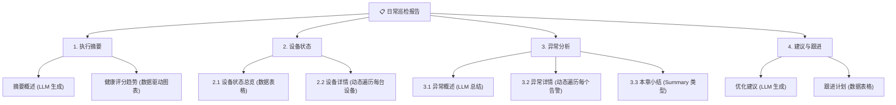
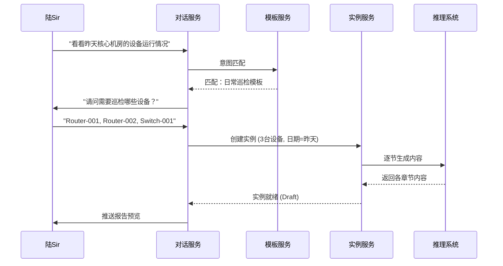
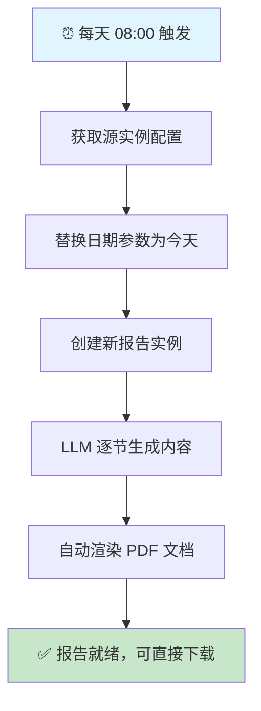
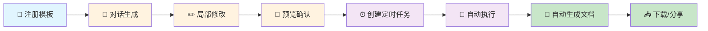

# 陆Sir 的报告系统使用故事

> 陆Sir 是一位身兼数职的天才工程师。他既是数据中心的首席运维，又是安全合规负责人，还兼任团队的技术培训导师。每周他需要处理大量的设备巡检、故障分析和容量评估报告。在接入智能报告系统之前，这些工作占据了他 60% 的时间。

---

## 第一章：模板大师

### 1.1 创建第一个报告模板

周一清晨，陆Sir 决定把重复性最高的「日常巡检报告」自动化。

他打开报告系统的管理界面，创建了一个新的报告模板：

```
模板名称：电信设备日常巡检报告
报告类型：daily
报告场景：设备巡检
```

他为模板定义了**内容参数**：

| 参数名 | 类型 | 是否必填 | 说明 |
|--------|------|----------|------|
| 巡检日期 | date | ✅ 必填 | 需要巡检的日期范围 |
| 设备列表 | multi_select | ✅ 必填 | 从 CMDB 动态查询 |
| 关注指标 | select | 可选 | CPU/内存/流量，默认全部 |

接着，他精心设计了**报告大纲**——每个目录和内容节都配置了相应的 LLM 生成策略：



> 💡 **亮点**：设备详情章节使用了**动态遍历**——系统会根据用户选择的设备数量，自动为每台设备生成独立的分析小节。

---

## 第二章：对话式生成

### 2.1 一句话启动报告

模板注册完毕后，陆Sir 迫不及待地测试了对话式生成功能。

他在对话界面随意输入了一句：

> 🗣️ **陆Sir**：「看看昨天核心机房的设备运行情况」

系统立即响应：

> 🤖 **系统**：「为您匹配到"电信设备日常巡检报告"模板。请问需要巡检哪些设备？（可回复"全部"）」
>
> 🗣️ **陆Sir**：「Router-001、Router-002 和 Switch-001」
>
> 🤖 **系统**：「收到，正在为您生成 2026-03-01 的巡检报告……」



### 2.2 挑剔的陆Sir

报告生成后，陆Sir 仔细审阅了预览。他对大部分内容很满意，但觉得第三章「异常分析」的结论不够深入。

> 🗣️ **陆Sir**：「第三章的根因分析太浅了，结合最近一周的告警趋势再深入分析一下」

系统收到指令后，仅针对第三章重新生成，其他章节保持不变。这次，LLM 在原有上下文的基础上，结合了陆Sir 的补充要求，生成了更加深入的分析。

> 🤖 **系统**：「已更新第三章。经深入分析，Switch-001 的内存增长与 VLAN-100 的异常 MAC 地址激增高度相关，建议排查该网段的接入设备……」

陆Sir 满意地点了点头。他还手动修改了「建议与跟进」章节中的负责人和完成时间，这些内容被标记为 `user_edited: true`——后续重新生成时不会被覆盖。

---

## 第三章：定时任务自动化

### 3.1 告别手动，拥抱自动

每天手动生成巡检报告？陆Sir 不干。

他基于刚才满意的报告实例，创建了一个**周期性定时任务**：

| 配置项 | 值 |
|--------|------|
| 任务名称 | 每日核心设备巡检 |
| 执行模式 | 周期性 (recurring) |
| Cron 表达式 | `0 8 * * *` (每天早上 8 点) |
| 时间参数 | inspection_date → 自动替换为执行日期 |
| 自动生成文档 | ✅ 开启，格式 PDF |



从此以后，每天早上 8 点，一份崭新的巡检报告会自动生成并导出为 PDF——陆Sir 只需要打开系统查看结果即可。

### 3.2 一次性任务：紧急故障报告

某天下午，领导突然要求陆Sir 在下班前出一份「上周五故障事件专项分析报告」。

陆Sir 注册了一个「故障分析」模板，然后创建了一个**一次性定时任务**，设定在 17:30 自动执行并生成文档。他可以先去处理其他工作，报告到点自动就绪。

> 💡 **亮点**：一次性任务执行完成后，状态自动变为 `completed`，不会重复执行。

### 3.3 配额管理

陆Sir 是个高产的人。当他试图创建第 6 个定时任务时，系统提示：

> ⚠️ 「每位用户最多创建 5 个定时任务，请删除或暂停已有任务后再试。」

他看了看自己的任务列表，暂停了一个已经不太需要的周报任务，成功创建了新任务。

而他的同事小王完全看不到陆Sir 的任务——**用户之间的定时任务完全隔离**。

---

## 第四章：文档管理与分享

### 4.1 文档归档

经过一周的自动运行，陆Sir 的文档库里已经积累了 7 份巡检报告 PDF。

他通过文档管理界面：
- 📥 **下载**了本周五的报告发给领导
- 🗑️ **删除**了一份生成失败的残留文档
- 📋 **查看**了所有文档的版本和生成时间

### 4.2 成果展示

月末例会上，陆Sir 向团队展示了这个月的成果：

| 指标 | 接入前 | 接入后 |
|------|--------|--------|
| 日常巡检报告耗时 | 2 小时/份 | **< 30 秒** (自动) |
| 每周报告产出 | 3 份 | **15+ 份** |
| 报告质量投诉 | 偶有遗漏 | **零投诉** (数据可追溯) |

> 🗣️ **陆Sir**：「以前我花 60% 的时间写报告，现在我只需要 5 分钟审阅一下就好。剩下的时间，我可以专注在真正需要人类智慧的工作上。」

---

## 第五章：全景回顾

陆Sir 的完整使用链路，串联了报告系统的所有核心能力：



---

**— 故事结束 —**

*本文档由智能报告系统 v0.9 自动生成框架支撑，陆Sir 的故事纯属虚构，如有雷同，说明你也是天才。*
