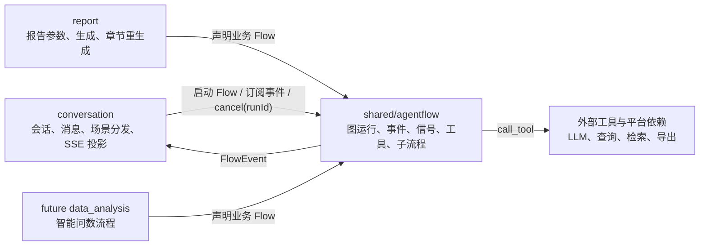
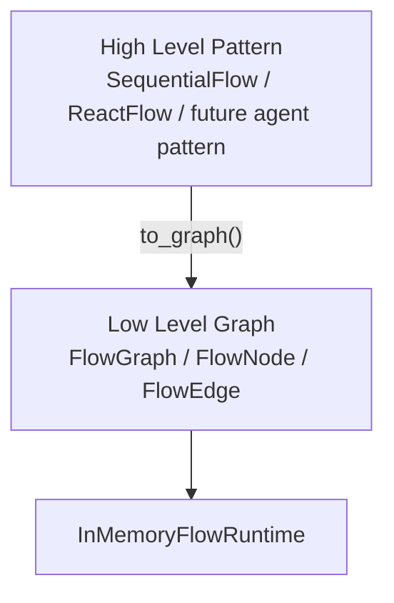
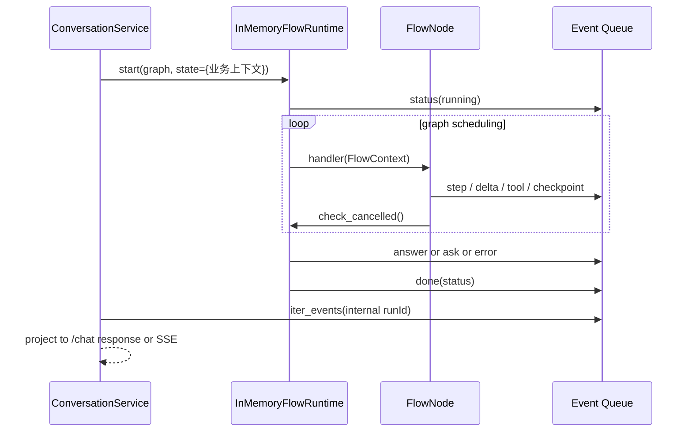
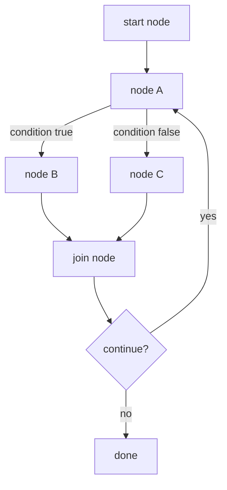
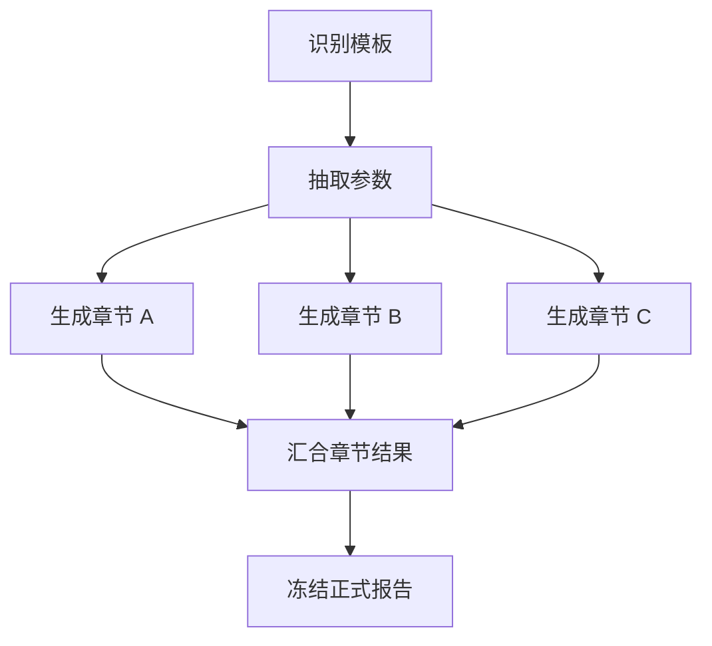
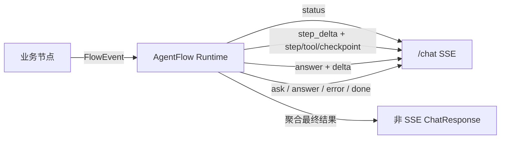
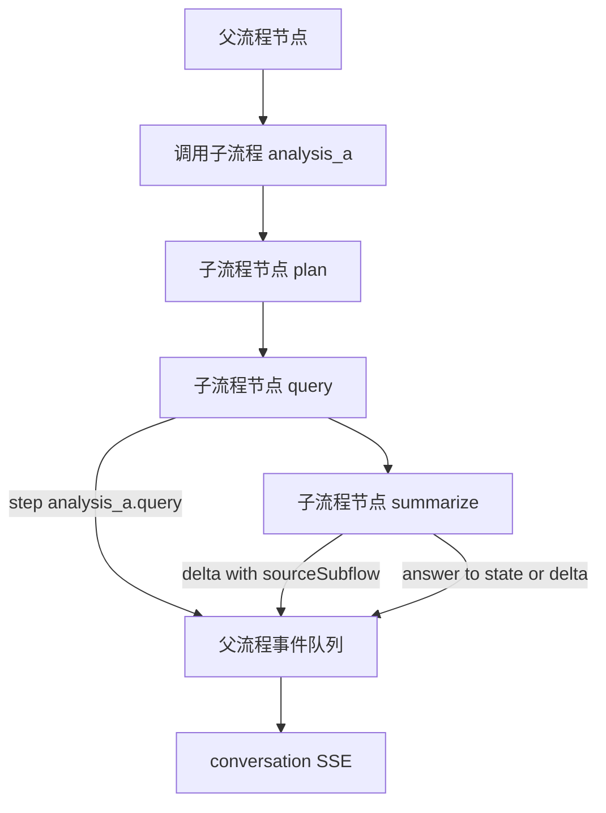
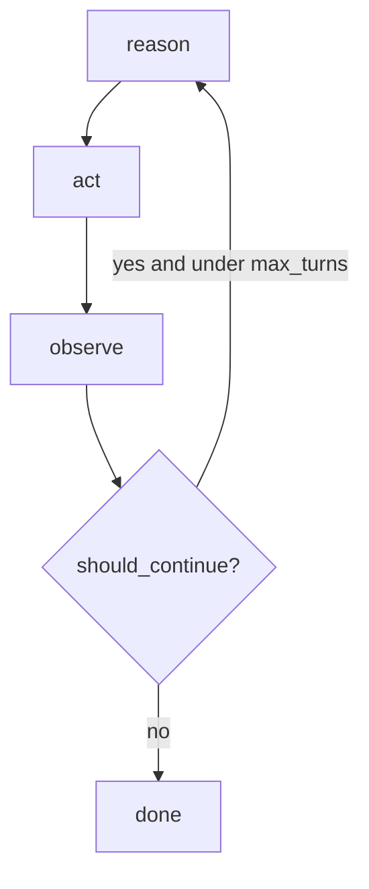

# Agent Flow 公共流程框架

`shared/agentflow` 是 ReportSystem 后端公共基础模块，不属于 `conversation`、`report` 或未来 `data_analysis` 等业务 Context。它解决两类通用问题：

- 业务流程运行时，统一发出 `step`、`delta`、`answer`、`error`、`refusal`、`checkpoint` 等事件。
- 对话通道可以订阅这些事件，转换成 `/chat` JSON 或 SSE 响应；停止、运行中判断等业务索引由对话模块维护，AgentFlow 只接受内部 `runId` 操作。

首版运行态以内存为主：支持单进程实时流、协作式取消、动态改图、工具、提示词、hook、checkpoint 和子流程；不承诺服务重启后的流程恢复。

## 1. 边界



规则：

- `conversation` 不编排报告步骤，只负责场景选择、启动流程和事件投影。
- 业务 Context 不直接处理 SSE 协议，只通过 `FlowContext` 发事件。
- `runId` 是 `agentflow` 内部运行标识，不出现在 `/chat` 公开契约、前端类型或 checkpoint 公开字段中。
- 对外停止使用当前轮 `chatId`：`POST /chat/stop?chatId={chatId}`；`chatId -> runId` 映射归 `conversation` 拥有，不进入 AgentFlow。

## 2. 分层模型

### Low Level Graph

核心对象：

- `FlowGraph`：流程图，包含 `start`、节点表和边表。
- `FlowNode`：节点，包含 `id`、`title`、`handler`、metadata、checkpoint 策略和局部 hook。
- `FlowEdge`：有向边，可带条件函数。
- `FlowContext`：节点运行上下文，提供事件、工具、提示词、checkpoint、取消检查、动态改图和子流程调用能力。

Low level 支持：

- 顺序执行
- 条件边
- 循环
- 并行分支与汇合
- human-in-loop 节点
- 运行中动态添加节点和边

### High Level Pattern

高层模式最终都编译成 `FlowGraph`：

- `SequentialFlow`：固定顺序步骤。
- `ReactFlow`：`reason -> act -> observe -> decide` 循环，支持最大轮次和条件退出。
- 后续复杂 agent 模式也应落到 low level graph，而不是新建旁路运行器。



## 3. 运行生命周期



运行状态保存：

- runtime 内部维护 `runId -> FlowRun`。
- runtime 只按 `runId` 提供查询、事件迭代、取消和输入能力；面向 `/chat/stop?chatId={chatId}` 的业务索引由 `conversation` 维护。
- 业务最终结果仍由业务服务持久化；AgentFlow 不替代业务仓储。

## 4. 调度语义



调度规则：

- 节点完成后，调度器读取当前 graph 的 outgoing edges，因此运行中新增的后续边可以自然生效。
- 条件边在边被考虑时求值。
- 汇合节点只有在无条件前置边完成后才执行。
- 每个节点有执行次数上限，避免错误循环无限运行。
- 动态改图只允许追加未来节点和边，不允许修改已经完成的节点，也不允许指向已完成节点。
- Runtime 使用线程池执行同一批 ready 节点，适合同时生成多个互不依赖的报告章节或并发调用多个外部查询。
- 事件序号由 `InMemoryFlowRuntime.emit()` 在全局锁内分配并入队，因此多线程节点同时发出事件时，消费者仍看到严格递增的 `sequence`。
- `FlowRun.state` 继续兼容直接读写；并行节点推荐使用 `FlowContext.get_state()`、`set_state()`、`update_state()` 和 `mutate_state()` 做线程安全状态更新。
- 并行失败策略为“收集失败”：某个已启动节点失败后，runtime 等待同批已启动节点结束，跳过尚未启动的下游节点，再统一发出失败事件。



## 4.1 流程图可视化

AgentFlow 提供 `FlowGraphRenderer` 输出 Mermaid，支持查看 high level pattern build 前后的图：

```python
artifact = FlowGraphRenderer().build_artifact(flow, title="report-generation")
print(artifact.before_mermaid)
print(artifact.after_mermaid)
```

约定：

- `before_graph` 表示业务方声明的原始图或 high level pattern materialize 后的稳定快照。
- `after_graph` 表示运行器实际执行前可验证、可调试的图。
- 当前 `SequentialFlow`、`ReactFlow` 的 build 前后图通常一致；后续加入自动插入 checkpoint、hook 或标准错误处理节点时，两个图会出现差异。
- Mermaid 输出只用于调试、文档和设计评审，不参与运行逻辑。

## 5. 事件模型与对话投影

节点通过 `FlowContext` 发事件：

- `emit_step()`：进度。
- `emit_delta()`：业务增量，例如报告目录、章节、组件。
- `emit_answer()`：最终结果。
- `emit_ask()`：流程形成持久化追问。
- `emit_error()`：错误。
- `call_tool()`：自动发出 `tool_call/tool_result`。
- `save_checkpoint()`：保存 checkpoint 并发出 checkpoint 事件。
- `refuse()`：拒答并结束。
- `request_terminate()`：系统主动终止。



公开投影规则：

- AgentFlow 内部 `tool_call/tool_result/checkpoint` 对外统一投影为 `step_delta`，并携带 `toolCall/toolResult/checkpoint` 字段。
- AgentFlow 内部 `delta` 对外继续投影为 `answer` 事件上的 `delta` 字段，兼容现有前端 reducer。
- 公开响应不携带 `runId`。
- `checkpoint` 公开字段不携带内部 `runId`。

## 6. Step 与 Delta 层级

`FlowStep` 支持父子层级：

```json
{
  "code": "report.dsl.compile",
  "stepId": "report.dsl.compile",
  "parentStepId": "report.generate",
  "stepPath": ["report", "generate", "compile"],
  "title": "编译报告内容",
  "status": "running"
}
```

规则：

- `code` 与 `stepId` 当前双写，便于兼容旧消费者；新消费者优先读 `stepId`。
- `parentStepId` 用于树状进度。
- `stepPath` 用于日志、审计和跨子流程定位。

业务 delta 支持统一父引用：

```json
{
  "action": "add_section",
  "parent": {
    "type": "catalog",
    "id": "catalog_1",
    "path": [0]
  },
  "parentCatalogId": "catalog_1",
  "parentCatalog": [0],
  "sections": []
}
```

规则：

- `parent.type` 可为 `report | catalog | chapter | slide | section | subflow`。
- flow 继续双写 `parentCatalogId/parentCatalog`。
- paged 继续双写 `chapterId/slideId`。
- 章节级重生成至少按 `sectionId` 提供定位；无法可靠计算父目录时不伪造目录父级。

## 7. Tool、Prompt、Hook、Checkpoint

### Tool

Tool 表示原子函数能力，例如查询、检索、LLM 调用、导出调用。工具先注册到 `ToolRegistry`：

```python
registry = ToolRegistry([
    ToolSpec(name="onequery", handler=lambda args: {"rows": []}),
])
runtime = InMemoryFlowRuntime(tool_registry=registry)
```

节点调用：

```python
rows = context.call_tool("onequery", {"query": "select 1"})
```

### Prompt

Prompt 只负责组装消息，不绑定具体 LLM gateway：

```python
template = PromptTemplate(
    name="summary",
    messages=[
        PromptMessage(role="system", content="你是{role}"),
        PromptMessage(role="user", content="总结{topic}"),
    ],
)
messages = context.render_prompt(template, {"role": "报告助手", "topic": "网络日报"})
```

### Hook

Hook 用于横切能力：

- `before_node / after_node`
- `on_error`
- `before_tool / after_tool`

Hook 可以返回 `continue`、`skip`、`terminate`、`refuse`。业务领域规则优先写在业务 Context 中，hook 只做审计、安全、调试、限流等横切控制。

### Checkpoint

`CheckpointSaver` 是统一接口：

- `save(checkpoint)`
- `list(run_id)`
- `latest(run_id)`

首版实现 `InMemoryCheckpointSaver`。后续持久化恢复只需要替换 saver，不修改节点代码。

### Metrics

AgentFlow 在每次流程结束时都会发布一次资源用量通知，不论流程成功、失败、取消、拒答或系统主动终止。

核心对象：

- `FlowMetricsCollector`：单次运行内的线程安全采集器。
- `FlowMetrics`：流程结束时的指标快照。
- `MetricsCenter`：指标中心，负责把快照发给一个或多个 sink。
- `MetricsSink`：传输无关发布接口。
- `NoopMetricsSink`：默认实现，不向外发送。
- `InMemoryMetricsSink`：测试和本地调试实现。

当前内置指标：

- `durationMs`：流程耗时。
- `llmOutputTokens`：OpenAI-compatible 响应中的输出 token 数。
- `nodeCount`：已启动节点数。
- `failedNodeCount`：失败节点数。
- `custom`：业务节点通过 `context.record_metric()` 主动记录的补充指标。
- `uniqueCounts`：业务节点或基础设施适配器通过 `context.record_unique_metric(name, key)` 或同线程 collector API 主动记录的去重指标集合。

发布规则：

- Runtime 在 `finally` 中发布指标，保证成功和失败都能发送。
- sink 失败不会改变业务流程结果。
- AgentFlow 不绑定 Kafka；后续需要 Kafka、HTTP 或数据库通道时，只新增对应 `MetricsSink` 实现并注入 `MetricsCenter`。
- AgentFlow 不定义业务资源类型。业务或平台适配器可以自行选择 metric name 和 tags，例如记录 `platform.resource.used` 这类自定义去重指标，AgentFlow 只负责收集、去重和发布。
- LLM、查询、检索等基础设施适配器只有在当前线程位于 AgentFlow 上下文中时才记录指标；普通同步调用不受影响。

## 8. 子流程

子流程是多步骤业务流程，可被另一个流程调用一次或多次。它不同于工具：

- Tool：原子函数能力，返回一个结果。
- Subflow：包含多个节点、可能发出 step/delta/answer/error 的完整流程片段。



接口：

- `SubflowSpec`：声明子流程名称、图构造函数、输入输出 schema 和事件策略。
- `SubflowRegistry`：注册和查找子流程。
- `SubflowEventPolicy`：控制 answer 冒泡和错误传播。
- `FlowContext.call_subflow()`：从节点中调用子流程。

事件策略：

- 子流程 step 会加 alias 命名空间，并携带 `sourceSubflow`。
- 子流程 delta 会增加 `source: { type: "subflow", alias, callId }`。
- 子流程 answer 默认不覆盖父流程最终 answer，而是转成 `subflow_result` delta 并写入父流程 state。
- 只有 `bubbleAnswer=true` 时，子流程 answer 才成为父流程 answer。
- 子流程 error 默认传播为父节点失败；`errorPolicy=capture` 时写入父流程 state，由父流程决定后续处理。

## 9. ReactFlow



ReactFlow 适合智能问数、工具试探、分步分析类流程。它不直接规定 LLM 或工具，只规定循环骨架。

## 10. Human In The Loop 与追加输入

Flow 仍保留低层 `wait_for_input()` 能力，供未来内部流程使用。但当前 `/chat` 公开接口不暴露运行中 input。

公开对话规则：

- 普通用户追加输入由前端排队，当前轮完成后通过 `/chat` 创建下一轮消息。
- 已经落成持久化 `ask` 的结构化答复，通过 `/chat reply.sourceChatId` 创建下一轮消息。
- 当前轮停止使用 `/chat/stop?chatId={chatId}`。

## 11. 当前限制与演进

当前限制：

- Runtime 为内存态，不支持服务重启后的流程恢复。
- 取消是协作式取消，节点和外部调用边界需要主动检查信号。
- 子流程首版为同步嵌套执行，不提供独立公共 SSE 通道。
- checkpoint 保存状态快照，不等价于完整执行恢复。

演进方向：

- 数据库版 `CheckpointSaver`。
- 分布式运行器和跨进程事件订阅。
- 服务端持久排队。
- 更多高层 agent pattern。
