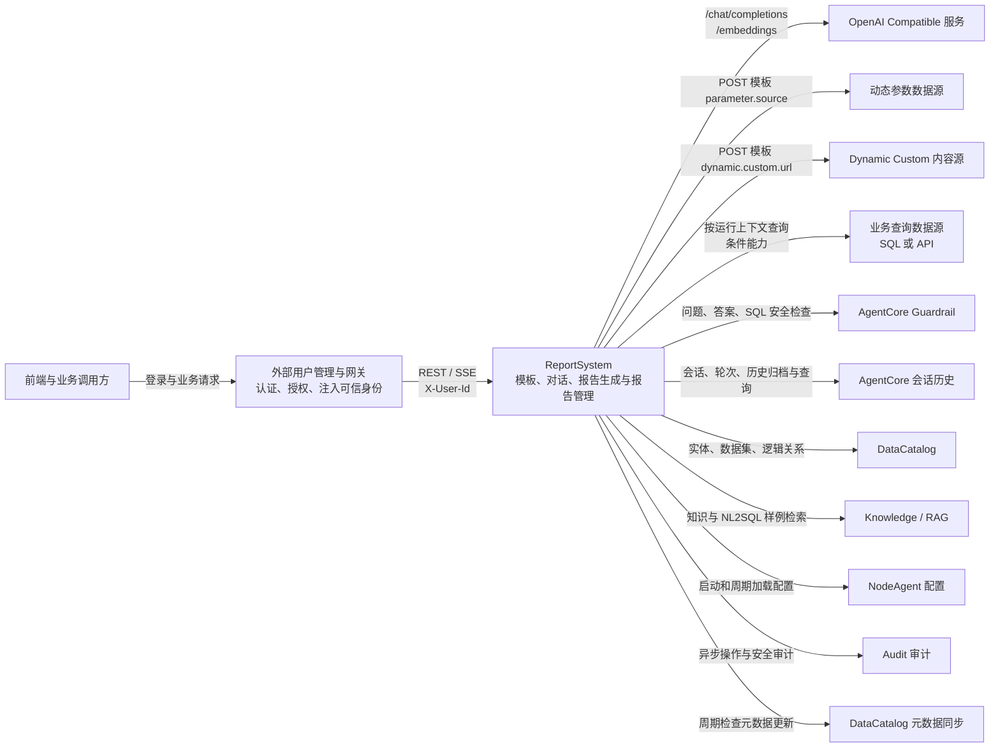

# API 技术契约

## 1. 系统上下文与接口清单

ReportSystem 对前端和业务调用方提供统一业务接口，并在模板解析、参数收集和报告生成过程中调用外部能力。Java Office Exporter 属于文档导出的内部适配器，其边界见 [文档导出实现](../../report/document-export.md)，不进入本业务上下文图。



### 1.1 对外提供的业务接口

公开业务接口统一使用前缀 `/rest/chatbi/v1`。

所有公开业务接口必须携带由上游网关注入的非空身份头：

```http
X-User-Id: <external-user-id>
```

缺失或空白身份返回 `401`。ReportSystem 将该值作为不透明归属键，不提供用户管理接口，也不保存用户资料。部署时网关必须丢弃客户端伪造的同名 Header，并在认证成功后重新写入可信值。模板是平台共享资产，其写权限由上游统一授权。

| 接口分组 | 方法与路径 | 用途 |
|---|---|---|
| 模板管理 | `POST /templates` | 创建正式报告模板 |
| 模板管理 | `GET /templates` | 查询模板列表 |
| 模板管理 | `GET /templates/{id}` | 获取模板详情 |
| 模板管理 | `PUT /templates/{id}` | 更新模板 |
| 模板管理 | `DELETE /templates/{id}` | 删除模板 |
| 模板管理 | `POST /templates/import/preview` | 解析并预览待导入模板，不落库 |
| 模板管理 | `GET /templates/{id}/export` | 导出规范化后的模板定义 |
| 通用对话 | `GET /chat` | 查询会话列表 |
| 通用对话 | `POST /chat` | 发送消息，支持 SSE 流式响应 |
| 通用对话 | `POST /chat/{chatId}/stop` | 请求停止仍在运行中的当前轮对话 |
| 通用对话 | `GET /chat/{conversationId}` | 获取会话详情 |
| 通用对话 | `DELETE /chat/{conversationId}` | 暂未开放，返回 `501 capability_not_available` |
| 通用对话 | `POST /chat/forks` | 暂未开放，返回 `501 capability_not_available` |
| 报告管理 | `GET /reports/{reportId}` | 获取完成态报告详情 |
| 文档导出 | `POST /reports/{reportId}/document-generations` | 为冻结报告创建文档生成任务 |
| 文档导出 | `GET /reports/{reportId}/documents/{documentId}/download` | 下载已生成文档 |

### 1.2 调用外部系统的接口

ReportSystem 调用的外部接口分为两类：

- 模板声明型扩展点：模板作者通过 `parameter.source` 或 `dynamic.custom.url` 声明外部实现，协议见 [第 3 节](#3-模板声明型外部扩展协议)。
- 平台外部依赖：由生产平台定义，ReportSystem 主动适配，详细协议统一见 [外部依赖接口技术契约](external-dependencies.md)。

涉及用户业务数据的外呼统一携带身份头：

```http
X-User-Id: <external-user-id>
```

| 外部能力 | 方法与地址 | 调用时机 | 状态 |
|---|---|---|---|
| OpenAI Compatible 对话 | `POST {baseUrl}/chat/completions` | 模板识别、参数提取、诉求整理和内容生成 | 已实现，地址由系统设置提供 |
| OpenAI Compatible 向量化 | `POST {baseUrl}/embeddings` | 模板语义索引和召回 | 已实现，地址由系统设置提供 |
| Parameter Options 数据源 | `POST {parameter.source}` | 解析动态参数候选项 | 已实现，地址由模板声明 |
| Dynamic Custom 内容源 | `POST {dynamic.custom.url}` | 获取目录、章节或组件 DSL 片段 | 已实现，地址由模板声明 |
| API 查询数据源 | `POST {externalBusinessBaseUrl}{dataset.source}` | 根据模板声明的 `/rest/...` 地址查询报告数据 | 已定义正式协议 |
| OneQuery | `POST /rest/dte/v1/onequery/uql/query` | 执行 SQL/UQL 查询 | 已实现 |
| Guardrail | `POST /rest/naie/guardrail/v1/question/check` | 用户输入进入场景前 | 已实现 |
| Guardrail | `POST /rest/naie/guardrail/v1/answer/check` | 最终答案返回前 | 已实现 |
| Guardrail | `POST /rest/naie/guardrail/v1/application-sec/check` | SQL/Python 执行前 | 已实现 |
| AgentCore | `POST /rest/naie/aiagentcore/v1/conversation` | 创建会话 | 已实现 |
| AgentCore | `POST /rest/naie/aiagentcore/v1/chat/create` | 创建轮次 | 已实现 |
| AgentCore | `POST /rest/naie/aiagent/v1/chat/import` | 归档或 upsert 完整 ChatResp | 已实现 |
| AgentCore | `POST /rest/naie/aiagentcore/v2/chat/history` | 查询会话历史 | 已实现 |
| AgentCore | `GET /rest/naie/aiagentcore/v1/chat/detail/{id}` | 查询单轮详情 | 已实现 |
| AgentCore | `GET /rest/naie/aiagentcore/v1/conversations` | 查询会话列表 | 已实现 |
| DataCatalog | `GET/POST /rest/odae/...`、`/rest/dte/v2/datacatalog/...` | 获取实体、数据集和逻辑关系 | 已实现 |
| Knowledge/RAG | `GET /rest/naie/knwl/v1/knowledge`、`POST /rest/naie/rag/v1/retriever-klg`、`POST /rest/naie/rag/v1/retriever` | 检索知识和 NL2SQL 样例 | 已实现 |
| NodeAgent | `GET /rest/nodeagent/v2/csi/appconf?watch=false` | 加载平台运行配置 | 已实现 |
| Audit | `POST /rest/plat/audit/v1/logs`、`POST /rest/plat/audit/v1/seculogs` | 异步审计 | 已实现 |
| DataCatalog Metadata Sync | `GET /rest/entassistantservice/v1/chatbi/package/register/process` | 检查元数据更新并触发缓存失效 | 已实现 |

### 1.3 路由实现映射

公开业务路由由 FastAPI router 负责协议适配，业务规则下沉到对应 application service。

| 路由分组 | 实现入口 | 应用服务 |
|---|---|---|
| `templates` | `routers/templates.py` | `report` |
| `chat` | `routers/chat.py` | `conversation` |
| `reports` | `routers/reports.py` | `report` |

### 1.4 统一错误响应

`/rest/chatbi/v1/*` 公开业务接口失败时统一返回 ChatBI 错误对象：

```json
{
  "errorCode": "chatbi.base.param.invalid",
  "errorMsg": "输入参数校验失败，请检查请求内容。",
  "category": "param",
  "retryable": false,
  "requestId": "req_001",
  "details": {}
}
```

字段约束：

- `errorCode` 必须使用 `chatbi.` 前缀。
- `chatbi.base.*` 表示系统通用错误；`chatbi.conversation.*` 表示通用对话模块错误；`chatbi.report.*` 表示报告模块错误；`chatbi.data_analysis.*` 表示智能问数模块错误。
- `errorCode` 不允许出现内部技术模块名，例如流程框架名称；也不允许使用外部平台模块名前缀。
- 外部平台返回的错误码必须转换为 ChatBI 错误码。原始上游错误码可以放入 `details.upstreamCode`，用于排查和审计。
- `errorMsg` 面向最终用户或集成方，可直接展示或记录。
- `retryable` 表示同一请求在不修改输入的情况下是否值得稍后重试。
- `requestId` 来自 HTTP `X-Request-Id` 请求头或入口生成的通用追踪信息，不属于 `/chat` 请求体字段。
- 跨用户资源访问与资源不存在统一按 `404` 处理，避免泄漏资源归属。

常用错误码：

| 错误码 | HTTP 状态 | 含义 |
|---|---:|---|
| `chatbi.base.unknown` | 500 | 未预先识别的兜底错误 |
| `chatbi.base.param.invalid` | 400 | 请求参数校验失败 |
| `chatbi.base.auth.required` | 401 | 缺少可信用户身份 |
| `chatbi.base.resource.not_found` | 404 | 资源不存在或无权访问 |
| `chatbi.base.resource.conflict` | 409 | 资源状态冲突 |
| `chatbi.base.overtime` | 504 | 系统处理或外部调用超时 |
| `chatbi.base.upstream.unavailable` | 502 | 上游服务调用失败 |
| `chatbi.conversation.in_progress` | 409 | 当前会话已有对话正在处理中 |
| `chatbi.conversation.quota_exceeded` | 409 | 会话数量达到平台限制 |
| `chatbi.report.template.not_found` | 404 | 报告模板不存在 |
| `chatbi.report.parameter.missing_required` | 400 | 报告生成缺少必填参数 |
| `chatbi.report.generation.dsl_invalid` | 400 | 报告内容结构校验失败 |
| `chatbi.report.document.pdf_not_available` | 400 | PDF 导出暂未开放 |
| `chatbi.data_analysis.query_blocked` | 400 | 智能问数查询被安全规则拦截 |

## 2. 客户端接口

### 2.1 模板接口

#### 2.1.1 模板详情

模板接口直接返回正式模板对象：`ReportTemplate`

```json
{
  "id": "tpl_network_daily",
  "category": "network_operations",
  "name": "网络运行日报",
  "description": "面向网络运维中心的统一日报模板。",
  "schemaVersion": "template.v3",
  "structureType": "flow",
  "parameters": [],
  "catalogs": []
}
```

规则：

- `POST /templates`：以 `ReportTemplate.id` 作为资源主键；若同 id 已存在，返回冲突错误，不做隐式覆盖
- `PUT /templates/{id}`：路径 `id` 与请求体 `ReportTemplate.id` 必须一致；不允许借更新接口改资源主键
- `GET /templates/{id}/export`：返回规范化后的正式 `ReportTemplate`，其结构应与模板详情接口等价
- 模板详情、创建、更新、导出都返回“规范化后”的正式模板对象，不返回原始导入文本
- `POST /templates` 与 `PUT /templates/{id}` 是正式持久化接口；模板提取和导入预览都不能隐式代替落库
- `structureType` 缺省按 `flow`；flow 模板使用 `catalogs`，paged 模板使用 `chapters`，两者不能同时出现在同一个规范化模板对象中
- paged 模板详情的主体结构固定为 `chapters -> slides -> sections`；`ChapterDefinition` 承载章节分组，`SlideDefinition` 承载 PPT 页面，页面内容继续复用 `SectionDefinition`
- flow 模板详情的主体结构继续固定为 `catalogs -> sections`；接口不得为了兼容 paged 把 flow 主体改写为 `chapters`

分页模板示例：

```json
{
  "id": "tpl_network_ppt",
  "category": "network_operations",
  "name": "网络运行 PPT 汇报",
  "description": "面向分页汇报场景的模板。",
  "schemaVersion": "template.v3",
  "structureType": "paged",
  "parameters": [],
  "chapters": [
    {
      "id": "chapter_overview",
      "title": "整体概览",
      "slides": [
        {
          "id": "slide_kpi_overview",
          "title": "核心指标概览",
          "sections": []
        }
      ]
    }
  ]
}
```

#### 2.1.2 导入预览

请求：

```json
{
  "content": "...原始模板内容..."
}
```

规则：

- `content` 可为原始文本或对象；服务端负责规范化为正式 `ReportTemplate`
- 导入预览只做“解析、规范化、校验、告警”，不落库
- 导入预览不分配正式模板 id；若原始内容缺失必要 id，可在 `normalizedTemplate` 中给出建议 id，同时通过 `warnings` 明示
- 导入预览偏向“静态解析/规范化”场景；若要从附件或自然语言中提取模板，应走 `/chat` 的 `extract_report_template`
- 导入预览、模板提取、正式落库必须共享同一套规范化和校验规则；不能出现“预览可过、落库失败但无新增输入”的漂移

响应：

```json
{
  "normalizedTemplate": {},
    "warnings": [
      {
        "code": "TEMPLATE_FIELD_NORMALIZED",
        "message": "已将旧 sections 结构规范化为 catalogs -> (subCatalogs)* -> sections。",
        "path": "$.catalogs[0]"
      }
    ]
}
```

规则：

- `normalizedTemplate` 必须已经满足正式模板 schema
- `warnings` 统一返回结构化对象：`code/message/path`
- `warnings` 只表达可自动规范化或可继续确认的问题；若无法形成合法模板，则应直接返回校验错误，而不是继续返回 `normalizedTemplate`

推荐统一告警码：

- `TEMPLATE_FIELD_NORMALIZED`
- `TEMPLATE_SUGGESTED_ID_GENERATED`
- `TEMPLATE_ORDER_REMOVED`

模板校验问题类型示例（用于静态校验、导入告警或错误分类；公开接口仍使用 `chatbi.*` 错误码承载失败响应）：

- `TEMPLATE_SCHEMA_INVALID`
- `TEMPLATE_DUPLICATE_PARAMETER_ID`
- `TEMPLATE_DUPLICATE_SECTION_ID`
- `TEMPLATE_EMPTY_CATALOG`
- `TEMPLATE_ID_CONFLICT`
- `TEMPLATE_PATH_ID_MISMATCH`

### 2.2 `/chat` 契约

#### 请求

##### ChatRequest

```json
{
  "conversationId": "conv_001",
  "chatId": "chat_001",
  "question": "帮我生成总部网络运行日报",
  "instruction": "generate_report",
  "reply": null,
  "report": null,
  "template": null,
  "attachments": [],
  "histories": []
}
```

关键字段：

- `conversationId`：会话 id
- `chatId`：当前轮 id
- `instruction`：可选；显式传入时精确匹配业务场景。报告场景正式支持 `generate_report`、`extract_report_template`、`generate_report_segment`；智能问数正式支持 `data_analysis`
- `reply`：承接对某条追问的结构化答复；业务字段按 instruction 场景定义
- `report`：仅在外部系统已经识别报告模板并预提取部分根级参数时使用，承载报告场景首次交接载荷（详见 2.2 ChatRequest.report 子结构）
- `attachments`：仅在 `extract_report_template` 且需要上传原始材料时必填
- `histories`：仅在“基于历史对话生成报告”场景下必填
- `template`：仅在 `generate_report_segment` 时必填，承载章节重新生成的定位与大纲信息（详见 2.2 ChatRequest.template 子结构）
- `question` / `reply` / `report` / `template`：普通 `generate_report` 场景下 `question` 或 `reply` 至少出现一个；携带 `report` 的首次交接请求中 `question` 仍必填；`generate_report_segment` 场景下 `template` 必填，`question` 和 `reply` 不使用
- `extract_report_template` 用于"从附件、原始文本或自然语言描述中提取模板草案"；其结果是预览态，不直接落库
- `generate_report_segment` 用于"报告生成完成后，基于编辑后的章节大纲重新生成单个章节"；返回预览结果，不直接更新报告实例
- `data_analysis` 用于智能问数；服务端返回结论、QuerySpec、SQL、明细数据和 BI Engine 可视化建议
- 未传 `instruction` 时，通用对话会结合当前输入和上一轮场景识别业务场景；无法可靠识别时返回 `clarify_scenario`

##### ChatRequest.reply 子结构

`reply` 是 `ChatRequest` 的场景相关答复载荷。所有场景复用 `type/sourceChatId` 外壳；其余字段由对应业务场景严格定义，不使用无约束扩展对象。

报告生成场景在参数回填和确认阶段使用以下结构：

```json
{
  "type": "confirm_params",
  "sourceChatId": "chat_000",
  "parameters": {
    "reportDate": ["2026-04-18"],
    "scope": ["hq-network"]
  },
  "reportContext": {
    "templateInstance": {}
  }
}
```

规则：

- `sourceChatId` 指向本次 `reply` 所回复的原始 assistant 追问消息 `chatId`
- 服务端必须基于 `sourceChatId` 回写对应历史追问消息的 `ask.status`
- `parameters/reportContext` 是 `generate_report` 场景字段，不属于通用对话字段
- `fill_params` 用于报告参数补齐
- `confirm_params` 用于确认报告生成
- 诉求确认时必须携带完整 `templateInstance`，以支持后台做最终骨架判定和生成输入冻结
- `reply.parameters` 是参数值映射，正式形态为 `Record<parameterId, Scalar[]>`
- 所有公开接口中的固定字段名统一使用 lowerCamelCase；`reply.parameters` 这类 map 的动态参数键也必须使用 lowerCamelCase 参数 id
- `fill_params` 允许只提交本轮新增或修改的参数子集
- `confirm_params` 必须提交完整“已生效值”参数集
- 服务端必须基于当前 `templateInstance` 中的参数定义 + `reply.parameters` 的原始值映射，重建新的参数运行态
- `sourceChatId` 对 `fill_params`、`confirm_params` 都是必填；不允许服务端再按“最近一条待回复 ask”做隐式猜测
- `reportContext.templateInstance` 返回的必须是完整实例态对象；其中 `section.content.presentation.blocks[]` 需要保留实例化后的 block 结构，`composite_table` 场景下前端可直接读取 `parts[]` 与各 `part.runtimeContext`
- `reportContext.templateInstance.structureType = flow` 时，实例态主体使用 `catalogs -> sections`
- `reportContext.templateInstance.structureType = paged` 时，实例态主体使用 `chapters -> slides -> sections`；`slide` 必须保留 `layout/dynamicContext/parameters`，`section` 继续保留 `outline/content/presentation`
- `confirm_params`、二次编辑、重新生成等需要回传 `templateInstance` 的交互都必须携带完整 paged 实例态结构；服务端和前端都不得把 paged 实例降级或转换为 flow 结构
- `text` block 在实例态必须通过 `properties` 同时返回原始 `template` 和渲染后的 `content`；其中 `properties.template` 可包含 `{$parameterId}` 与 `{#datasetId.field}` 引用，`properties.content` 是参数与 dataset 字段引用解析后的展示文本
- `PresentationBlock` 与 `TemplateInstancePresentationBlock` 不直接返回 `template/content` 字段
- `CatalogDefinition` 与 `SectionDefinition` 的动态展开统一通过 `dynamic` 返回；旧 `foreach` 字段不再属于公开模板契约
- 模板实例中的展开来源统一通过 `dynamicContext` 返回；`foreach/foreachCase` 字段包含 `type/parameterId/itemValue/caseId`，`custom` 字段包含 `type/url/nodeType`；`nodeType` 取值为 `catalog | section | slide`；旧 `foreachContext` 只作为历史数据读取兼容，不再作为新响应字段
- `dynamic.type = foreachCase` 时，服务端按 `ParameterValue.value` 匹配 `cases[].values`，多选参数按每个选中值生成对应分支内容

##### ChatRequest.report 子结构（`generate_report` 首次交接专用）

当外部系统已经识别出报告模板并提取出部分根级参数时，可在首次 `generate_report` 请求中携带：

```json
{
  "templateName": "网络运行日报",
  "parameters": [
    {
      "id": "reportDate",
      "label": "统计日期",
      "inputType": "date",
      "required": true,
      "multi": false,
      "interactionMode": "form",
      "options": [],
      "defaultValue": [
        {"value": "2026-06-01", "label": "2026-06-01", "query": "dt = '2026-06-01'"}
      ],
      "values": [
        {"value": "2026-06-02", "label": "2026-06-02", "query": "dt = '2026-06-02'"}
      ]
    }
  ]
}
```

规则：

- `report` 仅允许用于 `instruction = generate_report` 的首次请求，并且不能和 `reply` 同时出现。
- `report.templateName` 必填。服务端按名称精确匹配共享模板；不存在返回 `404`，重名返回 `409`。
- `report.parameters` 可省略或只提交一部分参数，但每个 `id` 必须唯一，并且只能引用模板根级 `template.parameters`。
- 目录、章节、分页章节或分页页面中的局部参数不能由外部交接；提交局部参数返回 `400`。
- 每个外部参数必须提供 `id/label/inputType/required/multi/interactionMode`。动态参数还必须携带 `source`。
- 外部定义字段必须与正式模板一致，包括 `label/inputType/required/multi/interactionMode/source`，以及请求实际携带的 `priority/description/placeholder`。
- 外部携带的 `options/defaultValue/values` 覆盖本轮根级参数快照；省略字段时沿用模板值，显式空数组表示清空。
- `enum/dynamic` 参数的 `values/defaultValue` 必须属于最终生效的 `options`；单选参数最多只能携带一个当前值。
- ReportSystem 会继续从 `question` 中补提取外部尚未赋值的参数。局部参数仍完全由 ReportSystem 自身流程处理。
- 同一会话已经存在 `TemplateInstance` 时，不能再次传入 `report` 覆盖运行态，服务端返回 `409`。
- 接续生成仍会返回既有 `fill_params` 或 `confirm_params` 追问，不会绕过最终确认。

##### ChatRequest.template 子结构（`generate_report_segment` 专用）

`template` 是 `ChatRequest` 的子字段，仅在 `instruction = generate_report_segment` 时使用。结构如下：

```json
{
  "reportId": "rpt_001",
  "sectionId": "section_scope_trend",
  "outline": {
    "requirement": "分析{scope}在{timeRange}内的隐患趋势变化",
    "renderedRequirement": "分析总部网络在2026年4月的隐患趋势变化",
    "items": [
      {
        "id": "item_scope",
        "label": "分析对象",
        "kind": "scope",
        "required": true,
        "sourceParameterId": "scope",
        "values": [
          {"label": "总部网络", "value": "hq-network", "query": "scope_id = 'hq-network'"}
        ]
      }
    ]
  }
}
```

`template` 字段定义：

| 字段 | 类型 | 必填 | 说明 |
|---|---|---|---|
| `reportId` | `string` | 是 | 目标报告实例 ID |
| `sectionId` | `string` | 是 | 目标章节 ID（在报告 DSL 中全局唯一） |
| `outline` | `Outline` | 是 | 用户编辑后的章节大纲，复用 `OutlineDefinition` 结构 |

`outline` 结构约束：

- `requirement`：原始诉求模板文本（通常与模板定义一致）
- `renderedRequirement`：实例化后的诉求展示文本（用户可编辑）
- `items[]`：完整 `RequirementItem` 数组，必须携带 `values[]`（`ParameterValue` 三元组）
- 结构必须与 `template-instance.schema.json` 中的 `Outline` 定义一致

请求校验规则：

- `instruction` 必须为 `generate_report_segment`
- `template` 必填，且 `reportId`、`sectionId`、`outline` 均不可缺失
- `conversationId` 必填（复用当前会话）
- `question` 和 `reply` 在此指令下不使用，若传入则忽略
- `sectionId` 必须在目标报告的 DSL 中存在
- `outline.items[].sourceParameterId` 必须引用当前章节可见参数集合中的有效参数 ID

#### 响应

##### ChatResponse（事件包络）

`POST /chat` 支持 SSE 流式响应。每个 SSE 事件都是一个事件包络；非 SSE 调用会把流程事件聚合为最终 `ChatResponse`。

```json
{
  "conversationId": "conv_001",
  "chatId": "chat_003",
  "eventType": "answer",
  "timestamp": 1713427200300,
  "status": "running",
  "step": {
    "code": "report.dsl.compile",
    "stepId": "report.dsl.compile",
    "parentStepId": "report.generate",
    "stepPath": ["report", "generate", "compile"],
    "title": "编译报告内容",
    "status": "running"
  },
  "delta": [],
  "ask": {},
  "answer": null,
  "errors": []
}
```

关键字段：

- `conversationId`：会话 id
- `chatId`：当前轮 id
- `eventType`：事件类型，枚举为 `status | step_delta | ask | answer | error | done`
- `timestamp`：事件时间戳
- `status`：当前链路状态
- `step`：单个流式进度事件（详见 ChatResponse.step / steps 子结构）
- `delta`：报告内容增量变更（详见 ChatResponse.delta 子结构）
- `ask`：追问载荷（详见 ChatResponse.ask 子结构）
- `answer`：最终结果（详见 ChatResponse.answer 子结构）
- `errors`：错误列表
- `toolCall` / `toolResult`：工具调用进展；仅出现在 `step_delta` 事件上
- `checkpoint`：流程 checkpoint 记录；仅表示运行态保存点，不承诺服务重启恢复
- `refusal`：拒答原因；通常与 `answer` 同时出现，状态为 `refused`
- `sourceSubflow`：事件来自子流程时携带来源信息，包含 `alias/callId`

最小字段集约束：

| `eventType` | 最小必需字段 |
|---|---|
| `status` | `status` |
| `step_delta` | `step` |
| `ask` | `ask` |
| `answer` | `answer` |
| `error` | `error` |
| `done` | 无额外业务字段 |

内部 `tool_call/tool_result/checkpoint` 事件对外统一投影为 `step_delta`，并通过 `toolCall/toolResult/checkpoint` 字段区分。内部业务增量事件对外继续通过 `answer` 事件携带 `delta`。

链路约束：

- `generate_report`
  - 至少经历 `status -> (ask?) -> answer -> done`
  - `answer` 事件可承载 `delta`，最终完成时再承载完整 `REPORT`
- `extract_report_template`
  - 至少经历 `status -> answer -> done`
  - `answer` 事件承载 `REPORT_TEMPLATE`
- `generate_report_segment`
  - 至少经历 `status -> answer -> done`
  - `answer` 事件承载 `REPORT_SEGMENT`，过程中可承载 `delta`
- `data_analysis`
  - 至少经历 `status -> answer -> done`
  - `answer` 事件承载 `DATA_ANALYSIS`
- 若中途失败：
  - 先发 `error`
  - 最后仍应发 `done`
- 若系统主动终止或拒答：
  - 主动终止返回 `error -> done`，状态为 `terminated`
  - 拒答返回带 `refusal` 的 `answer -> done`，状态为 `refused`

##### 运行中协作接口

取消运行中流程：

```http
POST /chat/{chatId}/stop
```

成功响应：

```json
{
  "chatId": "chat_003",
  "status": "stop_requested"
}
```

约束：

- `chatId` 必须属于当前用户，并且该轮对话仍处于运行中；找不到、已完成或跨用户访问时返回错误且不泄漏资源归属。
- 取消采用协作式信号，已发出的外部调用不保证被强制中断。
- 运行中不提供“补充输入”接口。普通追加说明由前端排队，当前轮结束后通过 `POST /chat` 创建下一轮 `chat`。
- 已经持久化为 `ask` 的结构化答复仍使用 `/chat reply.sourceChatId` 创建新一轮消息。

##### 会话详情响应

`GET /chat/{conversationId}` 返回结构与 AgentCore `/chat/history?conversationId=...` 的核心定义保持一致。外层使用 `records[]`，每条 `Record` 表示一轮对话：

```json
{
  "conversationId": "conv_001",
  "title": "网络运行日报",
  "status": "active",
  "records": [
    {
      "chatId": "chat_001",
      "question": "帮我生成总部网络运行日报",
      "askTime": 1713427200000,
      "answers": [
        {
          "type": "TEXT",
          "content": "已收到请求，正在分析报告诉求。",
          "answerTime": 1713427200100
        },
        {
          "type": "PIU",
          "content": "{\"piuName\":\"ReportGenerationPIU\",\"answers\":{\"steps\":[{\"stepId\":\"step_root\",\"title\":\"生成总部网络运行日报\",\"type\":\"directory\",\"status\":\"running\"}],\"ask\":null,\"delta\":[],\"answer\":null,\"errors\":[]}}",
          "answerTime": 1713427200300
        }
      ]
    }
  ]
}
```

`Record` 字段：

| 字段 | 类型 | 必填 | 说明 |
|---|---|---|---|
| `chatId` | `string` | 是 | 本轮对话 ID |
| `question` | `string` | 是 | 用户主动发起的提问，确认生成等动作也按新一轮提问记录 |
| `askTime` | `number/string/null` | 是 | 用户提问时间；生产推荐毫秒时间戳 |
| `answers` | `Answer[]` | 是 | 系统回答片段，按时间顺序排列 |

`Answer` 字段：

| 字段 | 类型 | 必填 | 说明 |
|---|---|---|---|
| `type` | `TEXT \| PIU` | 是 | `TEXT` 直接作为文本展示；`PIU` 交给指定前端组件渲染 |
| `content` | `string` | 是 | TEXT 时为文本；PIU 时为 JSON 字符串 |
| `answerTime` | `number/string/null` | 是 | 回答片段产生时间 |

`type = PIU` 时，`content` 反序列化后固定包含：

```json
{
  "piuName": "ReportGenerationPIU",
  "answers": {
    "steps": [],
    "ask": null,
    "delta": [],
    "answer": null,
    "errors": []
  }
}
```

其中每条外层 `answers[]` 记录只承载一种有效内容。比如某条记录只携带 `steps`，另一条记录只携带 `delta`，最终结果记录只携带 `answer`；空数组和 `null` 只用于保持 PIU 内容结构稳定。

##### ChatResponse.step / steps 子结构

流式 SSE 事件使用 `step` 表达单个执行进度；非 SSE 最终响应使用 `steps` 聚合本轮流程中已发出的进度。

```json
{
  "code": "report.dsl.compile",
  "stepId": "report.dsl.compile",
  "parentStepId": "report.generate",
  "stepPath": ["report", "generate", "compile"],
  "title": "编译报告内容",
  "status": "running",
  "detail": "正在校验章节结构"
}
```

规则：

- `code` 与 `stepId` 当前双写同一稳定值；新消费方优先读取 `stepId`。
- `parentStepId` 表示父步骤，用于前端树状进度展示。
- `stepPath` 表示从根步骤到当前步骤的路径，适合日志、审计和跨子流程定位。
- 子流程步骤会带命名空间，并通过 `sourceSubflow` 标识来源。

##### ChatResponse.ask 子结构

`ask` 是 `ChatResponse` 的场景相关追问载荷。所有场景复用 `status/mode/type/title/text` 外壳；其余字段由对应业务场景严格定义。

报告生成场景使用以下结构：

```json
{
  "status": "pending",
  "mode": "form",
  "type": "confirm_params",
  "title": "请确认报告诉求",
  "text": "请确认报告诉求后开始生成。",
  "parameters": [
    {
      "id": "scope",
      "label": "分析对象",
      "inputType": "dynamic",
      "required": true,
      "multi": true,
      "interactionMode": "natural_language",
      "source": "/rest/parameter-options/network/scopes",
      "options": [],
      "values": []
    }
  ],
  "reportContext": {
    "templateInstance": {}
  }
}
```

无法可靠识别业务场景时，conversation 返回通用澄清追问：

```json
{
  "status": "pending",
  "mode": "natural_language",
  "type": "clarify_scenario",
  "title": "请补充你的需求",
  "text": "请再说明希望系统帮助你完成什么任务。"
}
```

规则：

- `status` 正式枚举为 `pending | replied`
- `mode` 正式枚举为 `form | natural_language`
- `parameters/reportContext` 是 `generate_report` 场景字段，不属于通用对话字段
- 模板选择通过报告参数实现，不再单独设计模板选择阶段协议
- 诉求确认通过 `reportContext.templateInstance` 返回完整模板实例
- `Ask.parameters[*]` 直接使用统一参数模型，参数本体即可同时表达定义、候选值和当前取值
- 多值参数的 `values` 继续是三元组数组；界面可按 `label` 渲染，执行层不要直接消费拼接后的展示文本
- `Reply.parameters` 不与 `Ask.parameters` 同构；前者只回原始值数组，后者继续返回完整参数模型
- `pending` 表示当前追问仍可编辑、可提交
- `replied` 表示该追问已经被后续用户回复消费，在当前多轮对话语境下不可继续修改
- `ask.status` 是对话消息级状态，不替代 `TemplateInstance.parameterConfirmation.confirmed`
- `ask.parameters[]` 中的 `priority` 表达参数追问优先级；服务端按 `priority` 从小到大追问，同一优先级一起追问；`priority = 99` 不单独追问，只在最终确认所有参数时展示并补齐

对话历史回显约束：

- `GET /chat/{conversationId}` 中，若某条 `Answer.type = PIU` 的回答片段是追问，则其 `content.answers.ask` 载荷与当前 `ChatResponse.ask` 使用同一结构
- 历史回显中的 `ask.status` 必须反映该追问是否已经被后续回复消费

`ask.status` 交互规则：

- 首次返回追问时，`ask.status = pending`
- 当用户成功提交带 `sourceChatId` 的 `reply` 后，`sourceChatId` 指向的原追问消息回显必须刷新为 `ask.status = replied`
- 若后续产生新的追问消息，新 `ask.status` 重新从 `pending` 开始

##### ChatResponse.answer 子结构

`answer` 是 `ChatResponse` 的子字段，在报告生成完成或模板提取完成时返回。

```json
{
  "answerType": "REPORT",
  "answer": {
    "reportId": "rpt_001",
    "status": "generating",
    "report": {},
    "templateInstance": {},
    "documents": [],
    "generationProgress": {
      "totalSections": 8,
      "completedSections": 2,
      "totalCatalogs": 4,
      "completedCatalogs": 1,
      "currentCatalogPath": [
        "catalog_scope_analysis",
        "catalog_scope_availability"
      ],
      "currentSectionId": "section_scope_trend"
    }
  }
}
```

规则：

- `/chat` 在确认参数后返回的是"生成中的报告"
- `report` 是正式 `Report DSL`
- `templateInstance` 一并返回，支撑后续二次编辑后重新生成
- 即使是生成中或失败态，只要返回 `report`，也必须是满足 `report-dsl.schema.json` 的合法部分报告
- `report.structureType` 缺省或为 `flow` 时，主体使用 `catalogs + layout`
- `report.structureType = paged` 时，最小合法结构为 `structureType = "paged" + basicInfo + content`；主体使用 `content`，不得同时返回 `catalogs`，也不要求返回 flow 专属的 `layout`
- paged `content` 可以整体为 `Slide[]`，也可以整体为 `SlideSection[]`；同一个 `content` 数组内不得混用两种元素形态
- paged 报告可通过顶层 `backCover` 返回 PPT 封底配置，结构为 `{image?, text?}`
- `report.basicInfo` 不再返回全局参数；全局参数完整定义由同响应中的 `templateInstance.parameters` 承载
- `report.reportMeta[sectionId].parameters` 必须返回章节本地参数完整定义
- `report.reportMeta[sectionId].outline` 必须返回章节大纲骨架与实例化结果；schema 定义名为 `GenerateOutline`，结构复用 `OutlineDefinition + RequirementItem`
- `report.reportMeta[sectionId].additionalInfos` 使用 BI Engine TS 模型中的数组字段；条目必须包含 `type/value`，可包含 `name/appendix`；服务端可兼容读取历史/外部输入中的 `additionalInfo/content`
- `report.reportMeta[sectionId].question` 与 `report.reportMeta[sectionId].outline.renderedRequirement` 并存，前端不得假定二者相等
- `reportMeta` 仍按 section id 或生成节点 id 挂载；paged slide 内 section 生成的证据、参数和大纲快照同样进入 `reportMeta`
- `generationProgress` 的正式主指标是 `totalSections/completedSections`
- 多层目录场景下，可额外返回 `totalCatalogs/completedCatalogs/currentCatalogPath/currentSectionId`，帮助前端定位当前生成上下文
- `chart` block 中的 `properties.preferredType` 必须按原结构返回；取值为 `line/bar/pie/scatter/radar/gauge/candlestick`
- 普通 `table` block 中的 `properties.columns/showTitle/defaultDisplayRows/mergeColumns/mergeRows` 必须按原结构返回；`showTitle` 只控制标题展示，`defaultDisplayRows` 只表示默认展示条数，不截断 dataset 结果
- `composite_table.parts[]` 中的 `tableLayout.columns/showTitle/defaultDisplayRows/mergeColumns/mergeRows` 必须按原结构返回；`columns[].key` 使用源数据列 key，`columns[].title` 是展示列名
- Report DSL 表格行合并结果使用 `dataProperties.mergeRows[]`，每项为 `MergeRowInfo`，包含 `startRowIndex/rowSpan/mergedText/column`；不得使用旧字段名 `columnKey`
- Report DSL 图表轴配置使用 `dataProperties.xAxis/yAxis`；服务端可兼容读取历史顶层 `xAxis/yAxis` 输入，但新响应不得再输出顶层轴字段

`report` 在不同资源状态下的约束：

| `ReportAnswer.status` | `report` 要求 |
|---|---|
| `generating` | 必须返回合法部分 DSL；flow 的 `basicInfo/catalogs/layout` 不能缺失，paged 的 `basicInfo/content` 不能缺失 |
| `available` | 返回合法完成态或中止后可阅读 DSL |
| `failed` | 若有可冻结的部分结果，可返回合法部分 DSL；若完全无结果，应返回错误而不是非法 DSL |

paged Report DSL 示例：

```json
{
  "structureType": "paged",
  "basicInfo": {
    "id": "rpt_ppt_001",
    "name": "网络运行 PPT 汇报",
    "reportType": "PPT"
  },
  "content": [
    {
      "id": "slide_kpi_overview",
      "title": "核心指标概览",
      "layout": {
        "type": "grid",
        "autoLayout": true
      },
      "components": []
    }
  ],
  "backCover": {
    "text": "谢谢"
  },
  "reportMeta": {}
}
```

`extract_report_template` 时，`answerType` 应为 `REPORT_TEMPLATE`，其载荷建议为：

```json
{
  "answerType": "REPORT_TEMPLATE",
  "answer": {
    "normalizedTemplate": {},
    "warnings": [
      {
        "code": "TEMPLATE_FIELD_NORMALIZED",
        "message": "已将旧 sections 结构规范化为 catalogs -> (subCatalogs)* -> sections。",
        "path": "$.catalogs[0]"
      }
    ],
    "persisted": false
  }
}
```

规则：

- `REPORT_TEMPLATE` 的 `normalizedTemplate` 与 `/templates/import/preview` 返回的对象形状一致
- `warnings` 的结构也与导入预览一致
- `persisted=false` 表示该模板草案尚未通过 `POST /templates` 正式入库
- `REPORT_TEMPLATE` 的规范化、告警码、错误码必须与 `/templates/import/preview` 保持一致

`generate_report_segment` 时，`answerType` 为 `REPORT_SEGMENT`：

```json
{
  "answerType": "REPORT_SEGMENT",
  "answer": {
    "reportId": "rpt_001",
    "section": {
      "id": "section_scope_trend",
      "title": "分析总部网络在2026年4月的隐患趋势变化",
      "components": [],
      "summary": {
        "id": "summary_section_scope_trend",
        "overview": "..."
      }
    },
    "generateMeta": {
      "status": "Success",
      "question": "分析总部网络在2026年4月的隐患趋势变化",
      "outline": {},
      "parameters": {},
      "additionalInfos": []
    }
  }
}
```

规则：

- `section` 是重新生成的 Report DSL `Section` 片段，结构满足 `report-dsl.schema.json` 的 Section 定义
- `generateMeta` 是章节生成证据，结构与 `reportMeta[sectionId]` 一致
- 该结果不会自动更新 ReportInstance；后续确认更新接口待设计

`data_analysis` 时，`answerType` 为 `DATA_ANALYSIS`：

```json
{
  "answerType": "DATA_ANALYSIS",
  "answer": {
    "summary": "核心设备整体稳定，建议关注评分较低的设备。",
    "querySpec": {
      "intent": "查询核心设备健康评分",
      "sql": "select device_name, health_score from network_health"
    },
    "sql": "select device_name, health_score from network_health",
    "data": {
      "columns": {},
      "results": []
    },
    "visualizations": {
      "components": []
    },
    "warnings": []
  }
}
```

规则：

- 查询执行前必须通过应用安全检查。
- DataCatalog 用于理解实体与字段；Knowledge/RAG 不可用时允许降级为空上下文。
- OneQuery、DataCatalog 或 SQL 安全检查失败时，本次智能问数明确失败，不伪装为正常空结果。
- `visualizations.components` 使用 BI Engine 可消费的组件结构。

##### ChatResponse.delta 子结构

`delta` 是 `ChatResponse` 的子字段，仅在报告生成过程中返回，表达报告内容的增量变更。

```json
[
  {
    "action": "init_report",
    "report": {
      "reportId": "report_001",
      "title": "网络运行 PPT 汇报",
      "structureType": "paged"
    }
  },
  {
    "action": "add_catalog",
    "parent": {
      "type": "report",
      "id": null,
      "path": null
    },
    "parentCatalogId": null,
    "parentCatalog": null,
    "catalogs": [
      {
        "id": "catalog_1",
        "name": "单边隐患情况概览"
      }
    ]
  },
  {
    "action": "add_section",
    "structureType": "flow",
    "parent": {
      "type": "catalog",
      "id": "catalog_1",
      "path": [0]
    },
    "parentCatalogId": "catalog_1",
    "parentCatalog": [0],
    "sections": [
      {
        "id": "section_1",
        "status": "finished",
        "requirement": "分析根因分布情况",
        "components": [
          {
            "id": "component_1",
            "type": "chart"
          }
        ]
      }
    ]
  },
  {
    "action": "add_chapter",
    "chapters": [
      {
        "id": "chapter_overview",
        "title": "整体概览"
      }
    ]
  },
  {
    "action": "add_slide",
    "parent": {
      "type": "chapter",
      "id": "chapter_overview"
    },
    "chapterId": "chapter_overview",
    "slides": [
      {
        "id": "slide_kpi_overview",
        "title": "核心指标概览",
        "layout": {
          "layoutId": "title_content"
        }
      }
    ]
  },
  {
    "action": "add_section",
    "structureType": "paged",
    "parent": {
      "type": "slide",
      "id": "slide_kpi_overview",
      "path": ["chapter_overview", "slide_kpi_overview"]
    },
    "chapterId": "chapter_overview",
    "slideId": "slide_kpi_overview",
    "sections": [
      {
        "id": "section_kpi",
        "status": "finished",
        "requirement": "生成核心指标页的指标说明",
        "components": [
          {
            "id": "component_kpi_chart",
            "type": "chart"
          }
        ]
      }
    ]
  }
]
```

约束：

- `delta` 是 `ChatResponse` 顶层可选字段，可出现在任意事件上；只有发生报告内容变化时才返回
- 不新增 SSE 事件类型；是否处于生成过程，由顶层 `status=running` 判断
- `delta` 只表达目录树和章节内容的 patch，不重复承载完整 `report`、完整 `templateInstance`
- `delta` 不进入 `GET /reports/{reportId}`
- `init_report.report` 必须携带 `structureType`，取值为 `flow | paged`，用于前端在收到后续增量前初始化正确的报告骨架；历史响应缺失时可按 `flow` 兼容读取，但新响应必须显式返回
- `init_report.report.structureType = flow` 时，后续增量使用 `add_catalog/add_section`，报告主体按 `catalogs + layout` 初始化
- `init_report.report.structureType = paged` 时，后续增量可使用 `add_chapter/add_slide/add_section`，报告主体按 `content` 初始化
- flow 继续使用 `add_catalog/add_section` 表达目录和章节增量
- paged 新增 `add_chapter/add_slide` 表达 PPT 章节和页面增量，并复用 `add_section` 表达 slide 内 section 新增或内容更新
- `action` 当前正式枚举为：`init_report | add_catalog | add_chapter | add_slide | add_section`
- `parent` 是统一父引用，可用于新消费者定位增量所属层级；`type` 可为 `report | catalog | chapter | slide | section | subflow`，`id` 可为空表示根节点或无法可靠计算父级。
- flow `add_catalog` 中，`parentCatalogId` 是稳定定位字段，`parentCatalog` 是目录路径辅助字段；`parentCatalogId = null`、`parentCatalog = null` 表示根目录层；`catalogs[*]` 最小字段为：`id`、`name`
- flow `add_section` 中，`structureType` 固定为 `flow`，使用 `parentCatalogId/parentCatalog/sections` 定位所属目录；`sections[*]` 最小字段为：`id`、`status`、`requirement`，如已有组件可附带 `components`
- paged `add_chapter` 使用 `chapters[*].id/title` 定位和展示 PPT 章节
- paged `add_slide` 使用 `chapterId` 定位所属章节，`slides[*].id/title/layout` 定位页面；`layout` 使用模板中的 `SlideLayout` 结构
- paged `add_section` 中，`structureType` 固定为 `paged`，使用 `chapterId/slideId` 定位所属页面，`sections[*]` 最小字段为：`id`、`status`、`requirement`，如已有内容可附带 `components`
- `add_section` 是 flow 与 paged 共用动作名；消费方根据 `structureType` 区分 flow（使用 `parentCatalogId/parentCatalog` 定位）和 paged（使用 `chapterId/slideId` 定位）
- `generate_report_segment` 场景下，`delta` 复用 `add_section` 动作；前端根据 `sections[*].id` 是否已存在于当前报告中区分"新增"与"替换"语义
- `add_section` 在 `generate_report_segment` 中的最小字段与 `generate_report` 一致：`structureType`、`id`、`status`、`requirement`，如已有组件可附带 `components`
- `generate_report_segment` 至少按 `sectionId` 提供 `parent = { "type": "section", "id": "<sectionId>" }`；若父目录无法可靠计算，不强行补写 `parentCatalogId`。

### 2.3 `/reports` 契约


#### 2.3.1 模板列表与模板详情

- 模板列表返回 `TemplateSummary`
- 模板详情返回完整 `ReportTemplate`
- `TemplateSummary` 只保留列表筛选、排序和卡片展示所需字段，不重复承载 `parameters`、`catalogs`、`chapters`
- `TemplateSummary` 必须返回 `structureType`，缺省值按 `flow` 规范化后返回，便于前端在列表页区分瀑布流模板和 PPT/paged 模板
- `TemplateSummary` 不承载 `catalogs` 或 `chapters`；需要读取 flow 的 `catalogs -> sections` 或 paged 的 `chapters -> slides -> sections` 时，必须调用模板详情接口

#### 2.3.2 获取报告详情

```json
{
  "reportId": "rpt_001",
  "status": "available",
  "answerType": "REPORT",
  "answer": {
    "reportId": "rpt_001",
    "status": "available",
    "report": {},
    "templateInstance": {},
    "documents": []
  }
}
```

规则：

- 这是一次性返回的完成态报告
- `answer` 必须与 `/chat` 中 `REPORT.answer.answer` 结构等价
- paged 报告不新增接口包络结构；完成态 `answer.report` 仍直接返回 `structureType = "paged"` 的 Report DSL
- 与流式生成时的差异只在于：这里是完整完成态
- 该接口不返回流式过程中的 `delta`
- 接口层 `status` 使用资源状态：`generating | available | failed`；不要和 `Report DSL.basicInfo.status` 的 `Running | Success | Aborted | Failed` 混用
- 顶层 `reportId/status` 必须与 `answer.reportId/status` 保持一致，不能出现资源包络和报告载荷状态不一致的情况
- 资源层与 DSL 层状态建议遵循固定映射：`generating -> (draft, Running)`、`available -> (published, Success/Aborted)`、`failed -> (*, Failed)`

#### 2.3.3 文档生成

请求：

```json
{
  "formats": ["word", "ppt"],
  "pdfSource": null,
  "theme": "default",
  "strictValidation": true,
  "regenerateIfExists": false
}
```

响应：

```json
{
  "reportId": "rpt_001",
  "jobs": [
    {
      "jobId": "job_word_001",
      "format": "word",
      "status": "queued"
    }
  ],
  "documents": []
}
```

规则：

- 响应同时返回新建或复用后的 `jobs + documents`
- 当 `regenerateIfExists = false` 且已有产物可复用时，`documents` 中直接返回当前可用文档
- `documents` 的对象结构与 `ReportAnswer.documents` 保持一致
- `formats` 中的 `ppt` 主要消费 `structureType = paged` 的 Report DSL；flow 报告导出 PPT 属于后续转换策略，不在本轮接口契约中保证
- `pdfSource` 为后续 PDF 派生转换预留；当前请求 `formats` 包含 `pdf` 时返回 `400`
- `strictValidation = true` 时，服务端必须先按 `report-dsl.schema.json` 校验当前报告对应的 flow 或 paged 分支，再进入导出任务

## 3. 模板声明型外部扩展协议

以下协议由模板作者通过模板字段声明，外部系统按模板约定实现。ReportSystem 在运行时发起调用，前端不直接访问外部 URL。平台预置接口的详细协议统一见 [外部依赖接口技术契约](external-dependencies.md)。

### 3.1 Parameter Options 外部数据源

服务端在参数候选值解析时，向模板 `parameter.source` 定义的外部 URL 发起 `POST` 请求，获取动态参数候选值后，将 `options/defaultValue/values` 组装回普通参数对象并随 `ask.parameters[]` 返回前端。前端不直接调用外部数据源 URL，ReportSystem 也不再对外提供参数候选解析 resolver 接口。

#### 请求体

```json
{
  "parameterId": "scope",
  "source": "/rest/parameter-options/network/scopes",
  "contextValues": {
    "reportDate": [
      {
        "label": "2026-04-18",
        "value": "2026-04-18",
        "query": "2026-04-18"
      }
    ]
  }
}
```

#### 响应体

```json
{
  "options": [],
  "defaultValue": []
}
```

规则：

- 服务端用当前已知参数值组装对外部 `source` 的统一请求体
- 外部接口的正式请求、响应结构由本设计包的 JSON Schema 统一定义

### 3.2 Dynamic Custom 外部内容生成

`dynamic.type = custom` 定义了外部内容生成接口。服务端在 Report DSL 生成阶段向模板 `dynamic.custom.url` 定义的 URL 发起 `POST` 请求，获取目录或章节 DSL 片段。

#### 请求体

v6 正式请求体由 `parameters/templateNode/context` 组成：

```json
{
  "parameters": {
    "scope": [
      {
        "label": "总部网络",
        "value": "hq-network",
        "query": "scope_id = 'hq-network'"
      }
    ]
  },
  "templateNode": {
    "id": "section_external_recommendation",
    "dynamic": {
      "type": "custom",
      "url": "/rest/report-content/section"
    },
    "outline": {
      "requirement": "基于总部网络生成外部分析建议。",
      "items": []
    }
  },
  "context": {
    "structureType": "flow",
    "question": "基于总部网络生成外部分析建议。",
    "locale": "zh-CN",
    "timezone": "Asia/Shanghai"
  }
}
```

#### 响应体

```json
{
  "status": "success",
  "dsl": {
    "id": "section_external_recommendation",
    "title": "外部分析建议",
    "components": []
  },
  "meta": {
    "dslType": "Section"
  }
}
```

#### 按场景约束

- flow `CatalogDefinition.dynamic.custom` 响应必须是 `meta.dslType = "Catalog"`，`dsl` 是完整 Report DSL `Catalog` 片段。
- flow `SectionDefinition.dynamic.custom` 响应必须是 `meta.dslType = "Section"`，`dsl` 是完整 Report DSL `Section` 片段。
- paged `SlideDefinition.dynamic.custom` 响应必须是 `meta.dslType = "Slide"`，`dsl` 是完整 Report DSL `Slide` 片段。
- paged slide 内 `SectionDefinition.dynamic.custom` 推荐响应 `meta.dslType = "Components"`，也允许 `meta.dslType = "Section"` 并由运行时转换为组件集合后并入当前 slide。
- Chapter 级不支持 `dynamic.custom`；模板 schema 仅允许 Chapter 使用 `foreach/foreachCase`。

#### 错误响应

失败响应使用 `status = "error"` 与 `error.code/error.message`。

### 3.3 API Dataset 外部数据源

当模板声明 `dataset.sourceType = api` 时，ReportSystem 向模板 `dataset.source` 定义的外部 URL 发起 `POST` 请求。前端不直接调用该 URL。

#### 请求体

```json
{
  "parameters": {
    "scope": [
      {
        "label": "总部网络",
        "value": "hq-network",
        "query": "scope_id = 'hq-network'"
      }
    ]
  },
  "context": {
    "lineage.tracing.enable": true,
    "templateInstanceId": "ti_001",
    "sectionId": "section_health",
    "datasetId": "dataset_health"
  }
}
```

#### 响应体

```json
{
  "retCode": 0,
  "retInfo": "",
  "data": {
    "columns": {},
    "results": []
  }
}
```

规则：

- `dataset.source` 可以是 `/rest/...` 风格相对地址，也可以是历史兼容绝对 URL。
- `retCode = 0` 时必须返回 `data.columns/data.results`。
- `retCode != 0` 时报告生成降级为空数据组件并记录告警。
- HTTP 错误、超时和非法报文仍明确失败。
- 正式结构见 [api-dataset.schema.json](../schemas/api-dataset.schema.json)。

### 3.4 平台外部依赖

OpenAI Compatible、OneQuery、AgentCore、Guardrail、DataCatalog、Knowledge/RAG、NodeAgent 与 Audit 都属于 ReportSystem 主动适配的平台外部依赖。DataCatalog 还包含 Metadata Sync 辅助刷新特性。完整请求、响应、身份头和失败语义见 [外部依赖接口技术契约](external-dependencies.md)。

## 4. 开发辅助接口

开发辅助接口不属于公开业务资源，也不进入业务上下文图。统一使用前缀 `/rest/dev`。

| 接口分组 | 方法与路径 | 用途 |
|---|---|---|
| 文档浏览 | `GET /docs` | 递归查询文档资产 |
| 文档浏览 | `GET /docs/download.zip` | 下载完整文档包 |
| 文档浏览 | `GET /docs/{filename}` | 读取 Markdown、Schema 或示例 JSON |
| 反馈 | `GET /feedback/` | 查询开发反馈 |
| 反馈 | `POST /feedback/` | 新增开发反馈 |
| 反馈 | `GET /feedback/export.zip` | 导出开发反馈 |
| 反馈 | `DELETE /feedback/{feedbackId}` | 删除开发反馈 |
| 系统设置 | `GET /system-settings` | 获取开发环境系统设置 |
| 系统设置 | `PUT /system-settings` | 更新开发环境系统设置 |
| 系统设置 | `POST /system-settings/reindex` | 重建模板语义索引 |
| 系统设置 | `POST /system-settings/test` | 测试系统设置和外部依赖 |

### 4.1 开发辅助文档接口

文档浏览属于开发辅助能力，不属于公开业务资源。统一前缀为 `/rest/dev/docs`：

```text
GET /rest/dev/docs
GET /rest/dev/docs/download.zip
GET /rest/dev/docs/{filename}
```

- 列表递归返回 `docs/` 下的 Markdown、Schema 和示例 JSON。
- 单文件读取支持嵌套相对路径；Markdown 可省略 `.md` 后缀。
- ZIP 下载保持目录结构。
- 服务端必须拒绝目录逃逸路径。
