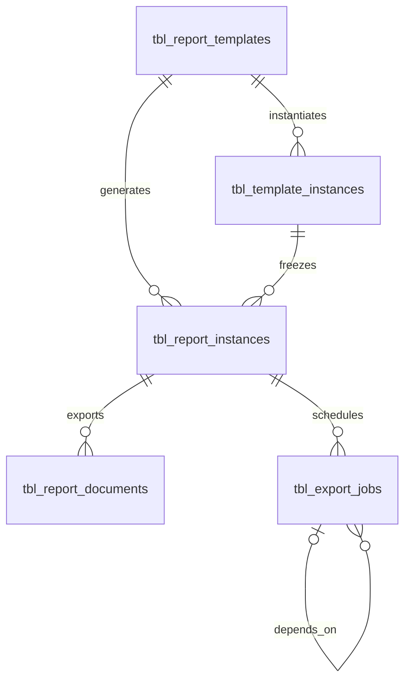
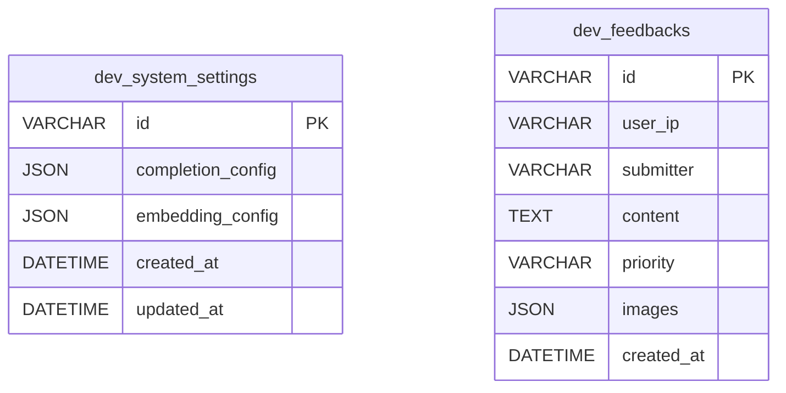

# 数据库契约

本文件记录当前最新数据库结构。可执行 SQL 位于 `modules/backend/src/infrastructure/persistence/upgrades/`；本文件中的 DDL 用于结构评审和集成阅读。`V003__delegate_conversation_history_to_agentcore.sql` 将会话事实源迁移到 AgentCore，`V004__remove_local_user_mirror.sql` 将用户管理边界收口到外部平台。

## 1. 数据库分类

| 数据库 | 默认文件 | 职责 | 升级 SQL |
|---|---|---|---|
| 正式业务库 | `.runtime/report_system.db` | 保存模板、报告和文档任务 | `upgrades/*.sql` |
| 开发辅助库 | `.runtime/dev_support.db` | 保存 `/rest/dev/*` 使用的设置和反馈 | `upgrades/dev/*.sql` |
| 查询演示库 | `.runtime/telecom_demo.db` | 保存本地电信网络演示数据 | 由 demo 初始化器维护 |

命名约定：

- `tbl_*`：正式业务表。
- `dev_*`：开发辅助表。
- `__*`：数据库自身的技术元数据表。

## 2. 业务库

### 2.1 ER 图



### 2.2 字段定义

#### `tbl_report_templates`

| 字段 | 类型 | 必填 | 默认值 | 键或索引 | 说明 |
|---|---|---|---|---|---|
| `id` | `VARCHAR` | 是 | - | PK | 模板 ID |
| `category` | `VARCHAR` | 是 | - | - | 模板分类 |
| `name` | `VARCHAR` | 是 | - | - | 模板名称 |
| `description` | `TEXT` | 是 | `""` | - | 模板说明 |
| `schema_version` | `VARCHAR` | 是 | - | - | 模板结构版本 |
| `content` | `JSON` | 是 | `{}` | - | 完整 `ReportTemplate` |
| `created_at` | `DATETIME` | 是 | 当前时间 | - | 创建时间 |
| `updated_at` | `DATETIME` | 是 | 当前时间 | - | 更新时间 |

#### `tbl_template_instances`

| 字段 | 类型 | 必填 | 默认值 | 键或索引 | 说明 |
|---|---|---|---|---|---|
| `id` | `VARCHAR` | 是 | UUID | PK | 模板实例 ID |
| `template_id` | `VARCHAR` | 是 | - | FK `tbl_report_templates.id`，INDEX | 来源模板 |
| `conversation_id` | `VARCHAR` | 是 | - | INDEX | AgentCore 来源会话 |
| `chat_id` | `VARCHAR` | 否 | `NULL` | INDEX | AgentCore 最近关联轮次 |
| `user_id` | `VARCHAR` | 是 | - | INDEX | 外部用户身份归属键 |
| `status` | `VARCHAR` | 是 | - | - | 实例状态 |
| `capture_stage` | `VARCHAR` | 是 | - | - | 捕获阶段 |
| `revision` | `INTEGER` | 是 | `1` | - | 修订号 |
| `schema_version` | `VARCHAR` | 是 | - | - | 实例结构版本 |
| `content` | `JSON` | 是 | `{}` | - | 完整 `TemplateInstance` |
| `created_at` | `DATETIME` | 是 | 当前时间 | - | 创建时间 |
| `updated_at` | `DATETIME` | 是 | 当前时间 | - | 更新时间 |

#### `tbl_report_instances`

| 字段 | 类型 | 必填 | 默认值 | 键或索引 | 说明 |
|---|---|---|---|---|---|
| `id` | `VARCHAR` | 是 | UUID | PK | 报告 ID |
| `template_id` | `VARCHAR` | 是 | - | FK `tbl_report_templates.id`，INDEX | 来源模板 |
| `template_instance_id` | `VARCHAR` | 是 | - | FK `tbl_template_instances.id`，INDEX | 冻结实例 |
| `user_id` | `VARCHAR` | 是 | - | INDEX | 外部用户身份归属键 |
| `source_conversation_id` | `VARCHAR` | 否 | `NULL` | INDEX | AgentCore 来源会话 |
| `source_chat_id` | `VARCHAR` | 否 | `NULL` | INDEX | AgentCore 来源轮次 |
| `status` | `VARCHAR` | 是 | - | - | 报告状态 |
| `schema_version` | `VARCHAR` | 是 | - | - | DSL 版本 |
| `content` | `JSON` | 是 | `{}` | - | 完整 Report DSL |
| `created_at` | `DATETIME` | 是 | 当前时间 | - | 创建时间 |
| `updated_at` | `DATETIME` | 是 | 当前时间 | - | 更新时间 |

#### `tbl_report_documents`

| 字段 | 类型 | 必填 | 默认值 | 键或索引 | 说明 |
|---|---|---|---|---|---|
| `id` | `VARCHAR` | 是 | UUID | PK | 文档 ID |
| `report_instance_id` | `VARCHAR` | 是 | - | FK `tbl_report_instances.id`，INDEX | 所属报告 |
| `artifact_kind` | `VARCHAR` | 是 | - | - | 文档格式 |
| `source_format` | `VARCHAR` | 否 | `NULL` | - | 派生来源格式 |
| `generation_mode` | `VARCHAR` | 是 | `sync` | - | 生成方式 |
| `mime_type` | `VARCHAR` | 是 | - | - | MIME 类型 |
| `storage_key` | `VARCHAR` | 是 | - | - | 文件存储键 |
| `status` | `VARCHAR` | 是 | - | - | 产物状态 |
| `error_message` | `TEXT` | 否 | `NULL` | - | 失败原因 |
| `created_at` | `DATETIME` | 是 | 当前时间 | - | 创建时间 |
| `updated_at` | `DATETIME` | 是 | 当前时间 | - | 更新时间 |

#### `tbl_export_jobs`

| 字段 | 类型 | 必填 | 默认值 | 键或索引 | 说明 |
|---|---|---|---|---|---|
| `id` | `VARCHAR` | 是 | UUID | PK | 任务 ID |
| `report_instance_id` | `VARCHAR` | 是 | - | FK `tbl_report_instances.id`，INDEX | 所属报告 |
| `user_id` | `VARCHAR` | 是 | - | INDEX | 外部用户身份归属键 |
| `current_format` | `VARCHAR` | 是 | - | - | 当前格式 |
| `status` | `VARCHAR` | 是 | - | - | 任务状态 |
| `dependency_job_id` | `VARCHAR` | 否 | `NULL` | FK `tbl_export_jobs.id` | 前置任务 |
| `exporter_backend` | `VARCHAR` | 是 | `local` | - | 导出后端 |
| `request_payload_hash` | `VARCHAR` | 是 | `""` | - | 请求摘要 |
| `started_at` | `DATETIME` | 否 | `NULL` | - | 开始时间 |
| `finished_at` | `DATETIME` | 否 | `NULL` | - | 完成时间 |
| `error_code` | `VARCHAR` | 否 | `NULL` | - | 错误码 |
| `error_message` | `TEXT` | 否 | `NULL` | - | 错误信息 |

### 2.3 业务库完整 DDL

可执行文件见 [`V001__initialize_business_tables.sql`](../../../../modules/backend/src/infrastructure/persistence/upgrades/V001__initialize_business_tables.sql)。

```sql
CREATE TABLE tbl_report_templates (
    id VARCHAR NOT NULL PRIMARY KEY,
    category VARCHAR NOT NULL,
    name VARCHAR NOT NULL,
    description TEXT NOT NULL,
    schema_version VARCHAR NOT NULL,
    content JSON NOT NULL,
    created_at DATETIME DEFAULT CURRENT_TIMESTAMP NOT NULL,
    updated_at DATETIME DEFAULT CURRENT_TIMESTAMP NOT NULL
);

CREATE TABLE tbl_template_instances (
    id VARCHAR NOT NULL PRIMARY KEY,
    template_id VARCHAR NOT NULL REFERENCES tbl_report_templates (id),
    conversation_id VARCHAR NOT NULL,
    chat_id VARCHAR,
    user_id VARCHAR NOT NULL,
    status VARCHAR NOT NULL,
    capture_stage VARCHAR NOT NULL,
    revision INTEGER NOT NULL,
    schema_version VARCHAR NOT NULL,
    content JSON NOT NULL,
    created_at DATETIME DEFAULT CURRENT_TIMESTAMP NOT NULL,
    updated_at DATETIME DEFAULT CURRENT_TIMESTAMP NOT NULL
);
CREATE INDEX ix_tbl_template_instances_chat_id ON tbl_template_instances (chat_id);
CREATE INDEX ix_tbl_template_instances_conversation_id ON tbl_template_instances (conversation_id);
CREATE INDEX ix_tbl_template_instances_template_id ON tbl_template_instances (template_id);
CREATE INDEX ix_tbl_template_instances_user_id ON tbl_template_instances (user_id);

CREATE TABLE tbl_report_instances (
    id VARCHAR NOT NULL PRIMARY KEY,
    template_id VARCHAR NOT NULL REFERENCES tbl_report_templates (id),
    template_instance_id VARCHAR NOT NULL REFERENCES tbl_template_instances (id),
    user_id VARCHAR NOT NULL,
    source_conversation_id VARCHAR,
    source_chat_id VARCHAR,
    status VARCHAR NOT NULL,
    schema_version VARCHAR NOT NULL,
    content JSON NOT NULL,
    created_at DATETIME DEFAULT CURRENT_TIMESTAMP NOT NULL,
    updated_at DATETIME DEFAULT CURRENT_TIMESTAMP NOT NULL
);
CREATE INDEX ix_tbl_report_instances_source_chat_id ON tbl_report_instances (source_chat_id);
CREATE INDEX ix_tbl_report_instances_source_conversation_id ON tbl_report_instances (source_conversation_id);
CREATE INDEX ix_tbl_report_instances_template_id ON tbl_report_instances (template_id);
CREATE INDEX ix_tbl_report_instances_template_instance_id ON tbl_report_instances (template_instance_id);
CREATE INDEX ix_tbl_report_instances_user_id ON tbl_report_instances (user_id);

CREATE TABLE tbl_export_jobs (
    id VARCHAR NOT NULL PRIMARY KEY,
    report_instance_id VARCHAR NOT NULL REFERENCES tbl_report_instances (id),
    user_id VARCHAR NOT NULL,
    current_format VARCHAR NOT NULL,
    status VARCHAR NOT NULL,
    dependency_job_id VARCHAR REFERENCES tbl_export_jobs (id),
    exporter_backend VARCHAR NOT NULL,
    request_payload_hash VARCHAR NOT NULL,
    started_at DATETIME,
    finished_at DATETIME,
    error_code VARCHAR,
    error_message TEXT
);
CREATE INDEX ix_tbl_export_jobs_report_instance_id ON tbl_export_jobs (report_instance_id);
CREATE INDEX ix_tbl_export_jobs_user_id ON tbl_export_jobs (user_id);

CREATE TABLE tbl_report_documents (
    id VARCHAR NOT NULL PRIMARY KEY,
    report_instance_id VARCHAR NOT NULL REFERENCES tbl_report_instances (id),
    artifact_kind VARCHAR NOT NULL,
    source_format VARCHAR,
    generation_mode VARCHAR NOT NULL,
    mime_type VARCHAR NOT NULL,
    storage_key VARCHAR NOT NULL,
    status VARCHAR NOT NULL,
    error_message TEXT,
    created_at DATETIME DEFAULT CURRENT_TIMESTAMP NOT NULL,
    updated_at DATETIME DEFAULT CURRENT_TIMESTAMP NOT NULL
);
CREATE INDEX ix_tbl_report_documents_report_instance_id ON tbl_report_documents (report_instance_id);
```

## 3. 开发辅助库

### 3.1 ER 图



### 3.2 字段定义

#### `dev_system_settings`

| 字段 | 类型 | 必填 | 默认值 | 键或索引 | 说明 |
|---|---|---|---|---|---|
| `id` | `VARCHAR` | 是 | `global` | PK | 全局设置记录 |
| `completion_config` | `JSON` | 是 | `{}` | - | Completion 配置 |
| `embedding_config` | `JSON` | 是 | `{}` | - | Embedding 配置 |
| `created_at` | `DATETIME` | 是 | 当前时间 | - | 创建时间 |
| `updated_at` | `DATETIME` | 是 | 当前时间 | - | 更新时间 |

#### `dev_feedbacks`

| 字段 | 类型 | 必填 | 默认值 | 键或索引 | 说明 |
|---|---|---|---|---|---|
| `id` | `VARCHAR` | 是 | UUID | PK | 反馈 ID |
| `user_ip` | `VARCHAR` | 否 | `NULL` | - | 提交来源 IP |
| `submitter` | `VARCHAR` | 否 | `NULL` | - | 提交人 |
| `content` | `TEXT` | 是 | - | - | 反馈内容 |
| `priority` | `VARCHAR` | 是 | `medium` | - | 优先级 |
| `images` | `JSON` | 是 | `[]` | - | 截图列表 |
| `created_at` | `DATETIME` | 是 | 当前时间 | - | 创建时间 |

### 3.3 开发辅助库完整 DDL

可执行文件见 [`V001__initialize_development_tables.sql`](../../../../modules/backend/src/infrastructure/persistence/upgrades/dev/V001__initialize_development_tables.sql)。

```sql
CREATE TABLE dev_system_settings (
    id VARCHAR NOT NULL PRIMARY KEY,
    completion_config JSON NOT NULL,
    embedding_config JSON NOT NULL,
    created_at DATETIME DEFAULT CURRENT_TIMESTAMP NOT NULL,
    updated_at DATETIME DEFAULT CURRENT_TIMESTAMP NOT NULL
);

CREATE TABLE dev_feedbacks (
    id VARCHAR NOT NULL PRIMARY KEY,
    user_ip VARCHAR,
    submitter VARCHAR,
    content TEXT NOT NULL,
    priority VARCHAR NOT NULL,
    images JSON NOT NULL,
    created_at DATETIME DEFAULT CURRENT_TIMESTAMP NOT NULL
);
```

## 4. 数据库版本与升级

两个应用数据库各自维护同名元数据表：

| 字段 | 类型 | 必填 | 默认值 | 键或索引 | 说明 |
|---|---|---|---|---|---|
| `id` | `INTEGER` | 是 | `1` | PK | 固定单行 |
| `current_version` | `INTEGER` | 是 | `0` | - | 当前结构版本 |
| `updated_at` | `DATETIME` | 是 | 当前时间 | - | 最近升级时间 |

可执行文件见业务库和 dev 库目录中的 `V000__initialize_database_version.sql`。

```sql
CREATE TABLE __db_schema_version (
    id INTEGER PRIMARY KEY,
    current_version INTEGER NOT NULL,
    updated_at DATETIME NOT NULL DEFAULT CURRENT_TIMESTAMP
);

INSERT INTO __db_schema_version (id, current_version)
VALUES (1, 0);
```

启动时升级规则：

1. 幂等执行 `V000`，确保 `__db_schema_version` 存在。
2. 读取 `current_version`，按顺序执行尚未应用的 SQL。
3. 每个版本执行成功后更新当前版本。
4. 版本号必须连续且唯一；数据库版本高于代码支持版本时拒绝启动。
5. 升级后校验 ORM 需要的表和字段；检测到结构漂移时提示删除 `.runtime/` 后重建。

## 5. JSON 与隔离规则

- `tbl_report_templates.content` 保存完整 `ReportTemplate`。
- `tbl_template_instances.content` 保存完整 `TemplateInstance`。
- `tbl_report_instances.content` 保存完整 Report DSL。
- `tbl_template_instances`、`tbl_report_instances`、`tbl_export_jobs` 直接按 `user_id` 隔离；会话历史由 AgentCore 按用户隔离。
- `tbl_report_documents` 通过 `report_instance_id -> tbl_report_instances.user_id` 间接隔离。
- dev 数据库不承载业务资源，不参与用户报告数据查询。

## 6. 非正式表

仓库当前只保留已接入且确实需要本地持久化的表结构。智能问数已经形成独立 context，但首版不新增本地业务表；会话历史仍由 AgentCore 托管，查询结果随对话答案归档。
