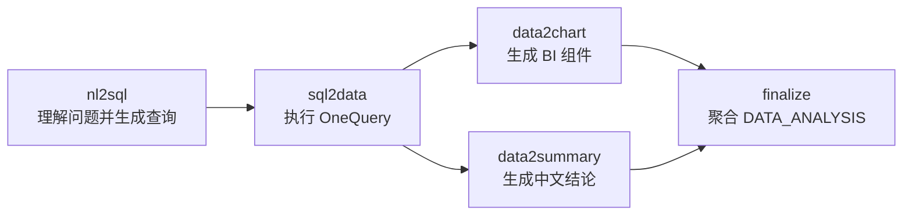

# 智能问数实现

## 1. Context 定位

`contexts/data_analysis` 是数据分析 bounded context。它既承载 `/chat` 下的 `data_analysis` 场景，也为报告生成提供查询执行能力。

## 2. 分层职责

- domain：`QuerySpec`、数据列、查询结果、知识上下文、可视化建议和 `DATA_ANALYSIS` 答案。
- application：编排 DataCatalog、Knowledge、LLM、SQL 安全检查、OneQuery、可视化建议和 AgentFlow；定义外部能力 ports。
- infrastructure：屏蔽外部接口路径、报文和错误码差异。
- 场景接入：`infrastructure/scenario_registration.py` 只实现 conversation 拥有的场景注册协议，不承载会话或聊天业务语义。

## 3. 智能问数 Flow

公开 `/chat instruction=data_analysis` 是自然语言入口，对应内部 `analysis_from_nl` Flow：



内部步骤使用强类型 DTO 和固定 JSON 边界。Flow state 保存 DTO；只有 Subflow 边界与最终答案投影时序列化为 JSON。

| 步骤 | 输入 | 输出 | 职责 |
|---|---|---|---|
| `nl2sql` | `{"question": string}` | `{"sql": string, "intent_function": string}` | 加载 DataCatalog 和 Knowledge/RAG 上下文，调用 LLM 生成 SQL 与预留意图函数，执行 SQL Guardrail |
| `sql2data` | `{"question": string, "sql": string}` | 完整 OneQuery 成功响应 | 调用 OneQuery 执行查询并保留原始成功包络 |
| `nl2data` | `{"question": string}` | `sql + intent_function + query_result` | 固定组合 `nl2sql -> sql2data` |
| `data2chart` | `question + query_result` | `title + content + summaries + type + series + query_result` | 选择 BI Engine 图表或表格展示，并原样保留查询结果 |
| `data2summary` | `question + sql + query_result` | `title + sql_explanation + summaries` | 基于问题、SQL 和数据生成标题、查询口径说明和分析结论 |
| `finalize` | 上述步骤结果 | `DATA_ANALYSIS` answer | 适配为当前 `/chat` 最终答案结构 |

### 3.1 子流程契约

`nl2sql` 输出的 `intent_function` 是模型生成的完整、单一 Python 函数定义源码。系统只使用 AST 验证其语法和顶层结构，不执行、不导入，也不参与当前流程判断。

`sql2data` 的 `query_result` 始终是完整 OneQuery 成功响应：

```json
{
  "retCode": 0,
  "retInfo": "",
  "data": {
    "columns": {},
    "results": []
  }
}
```

`data2chart` 输出：

```json
{
  "summaries": [],
  "type": "bar",
  "series": [],
  "query_result": {}
}
```

`series` 是 BI Engine series 对象数组。无法形成合适图表时 `type = "table"`。最终 `visualizations.components` 由该 DTO 适配生成，以保持现有 `/chat` 答案兼容。

`data2chart` 与 `data2summary` 使用 `modules/backend/prompts/figure_generate_template.yaml`。主流程调用 `any` 与 `summary_system`；指定图表、列排序和列重命名模板在启动时一并校验，留作后续流程节点。模型输出必须通过 YAML 解析、图表类型和字段引用校验。

`data2summary.summaries` 是有序结论数组；最终 `DATA_ANALYSIS.answer.summary` 暂以换行拼接，并新增可选 `title/sqlExplanation`。LLM 调用或输出非法时直接返回 `chatbi.data_analysis.*` 错误，不使用固定柱状图或固定摘要兜底。

`nl2data` 是组合能力：`nl2sql -> sql2data`。它不是公开 `/chat` 指令，而是供其他流程或未来集成复用的内部子流程。

SQL 起点能力是预留给第三方系统的内部 Flow：`sql2data -> data2chart/data2summary -> finalize`。当前不新增公开 HTTP API，也不把 SQL 起点注册成 `/chat instruction`。

data-analysis 向 AgentFlow 注册以下内部子流程，供其他业务流程用 `call_subflow(...)` 复用：

| 子流程名 | 说明 |
|---|---|
| `data_analysis.nl2sql` | 自然语言到查询定义 |
| `data_analysis.sql2data` | SQL 到数据集 |
| `data_analysis.nl2data` | 自然语言到数据集组合流程 |
| `data_analysis.data2chart` | 数据到可视化组件 |
| `data_analysis.data2summary` | 数据到中文结论 |
| `data_analysis.analysis_from_nl` | 自然语言入口完整分析流程 |
| `data_analysis.analysis_from_sql` | SQL 起点完整分析流程 |

Knowledge 不可用时降级为空上下文；DataCatalog、SQL 安全检查或 OneQuery 失败时停止本次智能问数。

Knowledge/RAG 的索引名称、topN、评分阈值和混合检索开关，以及查询策略，统一从 [ChatBI ConfigCenter](../configuration/README.md) 获取。data-analysis 不直接读取 INI、NodeAgent appconf、配置数据库或业务环境变量，也不在 adapter 中硬编码索引名称。

OneQuery consumer 必须保留原始 `retCode`，不得先转换为整数而丢失前导零。以下业务错误不可恢复且不可重试：

| OneQuery `retCode` | ChatBI 错误码 | 处理 |
|---|---|---|
| `"04003"` | `chatbi.data_analysis.query.unsupported_syntax` | 提示当前数据源不支持 `CONNECT BY`，停止后续节点 |
| `"04023"` | `chatbi.data_analysis.query.field_not_found` | 提示查询字段不存在，停止后续节点 |

错误详情保留 `upstreamCode/retInfo/sql`。其他未知非零错误仍映射为数据源查询失败。

DataCatalog 和 Knowledge/RAG 的缓存键必须包含 `userId`。平台配置缓存可以全局共享，但任何可能受用户数据权限影响的元数据或检索结果不得跨用户复用。

DataCatalog 逻辑实体使用量属于业务/平台指标，由 data-analysis 的 DataCatalog 适配器在 AgentFlow 上下文中记录自定义去重指标：

```text
datacatalog.logical_entity.used
```

指标 key 使用逻辑实体名称或平台返回的稳定标识。AgentFlow 不理解 DataCatalog 或逻辑实体含义，只在终态 metrics 的 `uniqueCounts` 中透传该 metric name 的去重数量。

## 4. 报告复用

报告的 `sql/api` 数据集通过 `DataQueryService` 使用同一份查询执行和字段元数据映射。报告场景对 OneQuery 业务失败保留既有空数据降级；独立 `data_analysis` 场景返回明确错误。

模板中的 `llm/compose` 数据集暂不启用，等待模板侧正式定义查询生成和组合规则。
