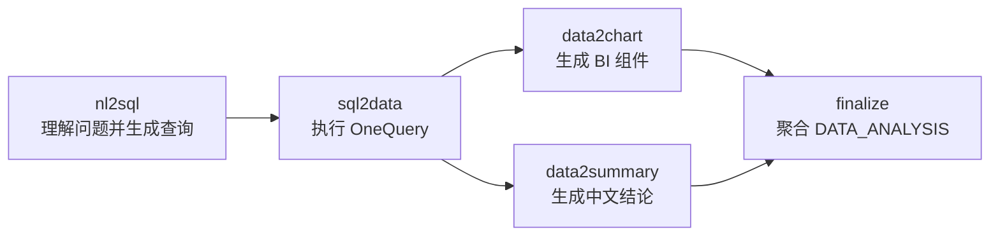

# 智能问数实现

## 1. Context 定位

`contexts/data_analysis` 是数据分析 bounded context。它既承载 `/chat` 下的 `data_analysis` 场景，也为报告生成提供查询执行能力。

## 2. 分层职责

- domain：`QuerySpec`、数据列、查询结果、知识上下文、可视化建议和 `DATA_ANALYSIS` 答案。
- application：编排 DataCatalog、Knowledge、LLM、SQL 安全检查、OneQuery、可视化建议和 AgentFlow；定义外部能力 ports。
- infrastructure：屏蔽外部接口路径、报文和错误码差异。
- 场景接入：`infrastructure/scenario_registration.py` 只实现 conversation 拥有的场景注册协议，不承载会话或聊天业务语义。

## 3. 智能问数 Flow

公开 `/chat instruction=data_analysis` 是自然语言入口，对应内部 `analysis_from_nl` Flow：



内部步骤职责：

| 步骤 | 职责 | 主要输出 |
|---|---|---|
| `nl2sql` | 加载 DataCatalog 和 Knowledge/RAG 上下文，调用 LLM 生成 `QuerySpec`，执行 SQL Guardrail | `QuerySpec` |
| `sql2data` | 调用 OneQuery 执行查询，得到统一数据集 | `DatasetResult` |
| `data2chart` | 将数据集转换为 BI Engine chart/table components | `components` |
| `data2summary` | 基于问题、SQL 和数据生成中文结论 | `summary` |
| `finalize` | 聚合结论、QuerySpec、SQL、数据和可视化建议 | `DATA_ANALYSIS` answer |

`nl2data` 是组合能力：`nl2sql -> sql2data`。它不是公开 `/chat` 指令，而是供其他流程或未来集成复用的内部子流程。

SQL 起点能力是预留给第三方系统的内部 Flow：`sql2data -> data2chart/data2summary -> finalize`。当前不新增公开 HTTP API，也不把 SQL 起点注册成 `/chat instruction`。

data-analysis 向 AgentFlow 注册以下内部子流程，供其他业务流程用 `call_subflow(...)` 复用：

| 子流程名 | 说明 |
|---|---|
| `data_analysis.nl2sql` | 自然语言到查询定义 |
| `data_analysis.sql2data` | SQL 到数据集 |
| `data_analysis.nl2data` | 自然语言到数据集组合流程 |
| `data_analysis.data2chart` | 数据到可视化组件 |
| `data_analysis.data2summary` | 数据到中文结论 |
| `data_analysis.analysis_from_nl` | 自然语言入口完整分析流程 |
| `data_analysis.analysis_from_sql` | SQL 起点完整分析流程 |

Knowledge 不可用时降级为空上下文；DataCatalog、SQL 安全检查或 OneQuery 失败时停止本次智能问数。

DataCatalog 和 Knowledge/RAG 的缓存键必须包含 `userId`。平台配置缓存可以全局共享，但任何可能受用户数据权限影响的元数据或检索结果不得跨用户复用。

DataCatalog 逻辑实体使用量属于业务/平台指标，由 data-analysis 的 DataCatalog 适配器在 AgentFlow 上下文中记录自定义去重指标：

```text
datacatalog.logical_entity.used
```

指标 key 使用逻辑实体名称或平台返回的稳定标识。AgentFlow 不理解 DataCatalog 或逻辑实体含义，只在终态 metrics 的 `uniqueCounts` 中透传该 metric name 的去重数量。

## 4. 报告复用

报告的 `sql/api` 数据集通过 `DataQueryService` 使用同一份查询执行和字段元数据映射。报告场景对 OneQuery 业务失败保留既有空数据降级；独立 `data_analysis` 场景返回明确错误。

模板中的 `llm/compose` 数据集暂不启用，等待模板侧正式定义查询生成和组合规则。
