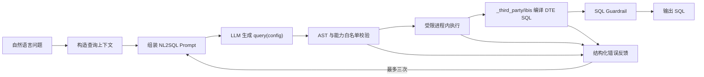

# NL2SQL 实现方案

## 1. 目标与边界

`nl2sql` 将自然语言问题转换为可交给 OneQuery 执行的 DTE SQL。它是
`data_analysis.nl2data` 的首个子流程，也可以被其他业务流程单独复用。

NL2SQL 的正式输入输出保持精简：

```json
{"question": "查询核心设备健康评分"}
```

```json
{"sql": "SELECT ..."}
```

系统内部会让大模型生成 Ibis `query(config)` 函数，再通过项目维护的
`_third_party/ibis` 编译器生成 DTE SQL。Ibis 源码只在单次生成尝试中存在，
不进入 Flow state、Subflow 输出、`DATA_ANALYSIS` answer 或公开接口。

NL2SQL 不执行查询。SQL 执行继续由独立的 `sql2data` 步骤负责。

## 2. 处理链路



查询上下文由以下信息组成：

- 用户问题。
- DataCatalog 中与问题相关的逻辑实体详情。
- 所选逻辑实体之间允许使用的逻辑关系。
- Knowledge/RAG 的 `chatbi_sql_few_shot` 检索结果。

逻辑实体上下文严格按两阶段获取：

1. 查询逻辑实体列表，只使用摘要选择候选。
2. 对每个选中候选逐个调用单实体详情接口。
3. 按 `logical-entity.schema.json` 严格校验详情。
4. 仅使用校验通过的详情构造 Prompt 和 Ibis `QueryConfig`。

列表摘要不是字段 Schema 的事实源，不能替代详情请求。详情按
`userId + logicalEntityName` 缓存；未被选中的摘要不参与校验，也不计入实体使用量。
任一选中详情缺失、名称不匹配或结构非法时，本次 NL2SQL 返回
`chatbi.data_analysis.metadata_invalid`。

逻辑关系也采用“列表名称 + 单详情”的方式获取。系统逐个请求列表中的关系详情并
严格校验，任一非法详情都会终止本次 NL2SQL；校验完成后只保留源实体和目标实体
均属于本次已选实体的关系。完整关系进入 Prompt。只有
`Source.field = Target.field` 单字段等值条件，且实体和字段均属于可执行 Ibis 表时，
才会进入 Join 白名单；复合条件、非等值条件和复杂字段关系只供模型理解。

首版不复用历史对话中曾生成的 Ibis 源码。Knowledge/RAG 不可用或
`chatbi_sql_few_shot` 未配置时，允许使用空 Few-shot 上下文继续生成。

## 3. 分层职责

| 层次 | 职责 |
|---|---|
| data-analysis domain | 定义 NL2SQL 输入、输出和不可变查询上下文，不依赖 Ibis |
| data-analysis application | 加载上下文、调用 LLM、控制最多三次生成、执行 SQL Guardrail |
| data-analysis infrastructure | 校验并受限执行生成源码、构建 Ibis 表、调用 `_third_party/ibis` 编译 SQL |
| `_third_party/ibis` | 将 Ibis Expression 编译为 DTE SQL，并提供 Ibis/SQLGlot 语法扩展 |

application 拥有 `Nl2SqlCompiler` 能力接口，infrastructure 提供实现。
application/domain 不允许直接导入 Ibis、SQLGlot、Pydantic、`_third_party`
或 infrastructure。

## 4. Prompt 与生成协议

NL2SQL Prompt 位于 `modules/backend/prompts/data_analysis/generate_sql.yaml`，
以 `data_analysis.generate_sql.*` 命名空间在启动时加载为只读资产，包含：

- Ibis API 和项目辅助函数使用规则。
- 逻辑实体表定义和允许的关系。
- SQL Few-shot 示例。
- 当前用户问题。
- 上一次生成失败时的结构化错误。

模型必须只输出一个完整的同步函数：

```python
def query(config: QueryConfig) -> Expr:
    return config.Device.select("name", "health_score")
```

不得输出 import、Markdown、SQL 或额外顶层语句。每次失败反馈包含失败阶段和
脱敏后的错误信息，不包含运行时敏感配置。

## 5. 受限执行

生成源码在进程内受限执行，执行前必须通过 AST 白名单：

- 只允许一个名为 `query` 的同步函数。
- 禁止 import、异步、类、循环、异常处理、上下文管理器和动态代码执行。
- 禁止访问私有属性、魔术属性、文件、网络、进程、反射和任意 builtins。
- 只能访问注入的 `QueryConfig`、Ibis 安全命名空间和批准的辅助函数。
- 关系白名单、当前表配置、`create_recursive_query`、
  `create_device2kpi_wide_table` 和 `get_tables_columns` 由 infrastructure
  在单次执行上下文内注入，执行完成后清理。
- `config` 只暴露已选择的逻辑实体；未选择实体无法被生成函数访问。
- `QueryConfig` 只从实体详情的 `schema.fields[]` 构建。基础字段类型映射为 Ibis
  类型；`array/record/object` 仍保留在 Prompt 的完整实体元数据中，但不会加入
  可执行 Ibis 表，生成代码引用这些字段时明确失败。
- 函数返回值必须是 Ibis Expression。

进程内执行不能强制终止已经进入第三方库内部的 Python 调用，因此白名单禁止循环
和动态调用，并限制源码规模。需要强隔离时应升级为独立进程执行器。

## 6. 编译、重试与错误

受限执行得到 Ibis Expression 后，统一调用：

```python
from src._third_party.ibis.ibis_ext import to_sql
```

编译完成后再执行 SQL Guardrail。生成、AST 校验、执行或编译失败均可进入下一次
修复尝试，最多三次；SQL Guardrail 拒绝不重试。

三次生成失败统一返回 `chatbi.data_analysis.query_generation_failed`，错误详情记录
最终失败阶段和尝试次数，但不返回 Ibis 源码。OneQuery 业务错误继续由 `sql2data`
按照既有规则处理。

## 7. 旧查询能力收口

`infrastructure/query` 中实验性查询引擎与章节证据生成不再各自维护 AST 校验和
执行逻辑。它们复用同一受限 Ibis 执行器；正式 data-analysis 流程只使用
data-analysis infrastructure 提供的 `Nl2SqlCompiler`。

## 8. 验证要求

- 合法 `query(config)` 可生成 DTE SQL。
- 未选实体、非法关系、import、私有属性、文件或网络访问必须被拒绝。
- 投影、过滤、聚合、Join、窗口和递归查询具有代表性编译测试。
- `_third_party.ibis.to_sql` 可稳定直接导入，不存在循环依赖。
- 最多三次修复尝试，最终输出中不出现 Ibis 源码或旧 `intent_function`。
- application/domain 通过架构测试证明不依赖 Ibis 与 infrastructure。
