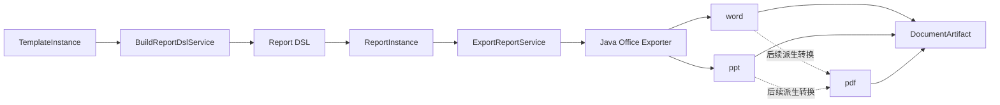

# 文档导出

## 1. 正式闭环



## 2. 职责边界

### 2.1 应用层

- `BuildReportDslService`
- `FreezeReportInstanceService`
- `ExportReportService`

职责：

- 生成正式 `Report DSL`
- 冻结报告实例
- 发起文档生成
- 记录产物与任务状态

### 2.2 基础设施层

- `JavaOfficeExporterGateway`
- `PdfConverterGateway`
- 文档存储适配器

职责：

- 接收 `Report DSL` 并生成 `word/ppt`
- 后续将 `word/ppt` 派生转换为 `pdf`；当前尚未开放
- 上传产物并回传存储键

## 3. 生成顺序

1. `TemplateInstance` 确认完成
2. 应用层构建 `Report DSL`
3. `Report DSL` 校验通过后写入 `ReportInstance`
4. 发起文档生成任务
5. Java 导出器生成 `word/ppt`
6. 后续根据 `pdfSource` 派生生成 `pdf`；当前请求会返回明确校验错误
7. 产物登记到 `tbl_report_documents`

对外返回：

- 文档生成接口统一返回 `jobs + documents`
- `jobs` 表示本次请求触发或复用的任务
- `documents` 表示当前报告已经可用的文档产物快照

## 4. 统一原则

- 所有文档格式都从同一份 `Report DSL` 出发
- 不再允许从旧 `outline_content` 或其他中间结构直接拼文档
- `pdf` 是后续派生产物，不参与当前主报告生成状态机
- 文档导出样式配置使用独立 `Document Configuration`，不写入 `Report DSL`，生成文档时可选传入。
- Java 导出器归一化 Report DSL 时优先使用 `basicInfo.reportType` 判定 Word/PPT；其次才使用 `structureType` 和结构字段兜底，避免 paged/PPT DSL 因兼容字段被误路由为 Word。
- Word/PPT 默认页脚文本为 `ChatBI`；当 `basicInfo.footer` 明确提供时按输入覆盖默认值。
- PPT 页码默认固定在右下角独立显示，不与页脚文本拼接。
- PPT 每页左上角 master title 只显示当前页标题，不拼接报告名称或 header 前缀；封面页不显示左上角 master title。
- Word 目录层级只来自 flow DSL 的 `catalogs -> subCatalogs`；`sections` 是正式内容承载单元，不作为目录项输出。
- Word 正文中的 catalog/subCatalog 标题必须使用 Word 原生 Heading 样式和 outline level，而不是只通过字体样式模拟标题。
- Word 正文中的 catalog/subCatalog 标题需要保留适度行前距；一级标题默认不少于 360twips，二级及以下默认不少于 240twips。
- Word 表格必须约束在页面可用宽度内；列数较多时按列宽比例压缩并允许单元格内容换行，不横向溢出页面。
- PPT 表格默认使用紧凑字号、紧凑行高和较小单元格内边距；表格锚点必须被限制在幻灯片安全区域内，避免多表布局时超出页面。
- PPT 表格实际高度计算后仍需要二次收敛到安全区域；若底部越界，优先整体上移，仍放不下时再压缩到最小行高。
- Word 封面按整页布局输出；`cover.image` 作为首页铺满背景图，标题、副标题、补充说明、报告人和时间叠加在背景之上；报告人和时间分两行固定放在右下角；封面后分页使用 `pageBreakBefore`，避免独立分页 run 造成空白页。
- `compositeTable` 按多个子表纵向无缝拼接导出；每个子表保留自身列结构，Word/PPT 中共享组合表格总宽度，Word 可用单个物理表格和 `gridSpan` 表达不同子表列数。

## 5. Document Configuration

`Document Configuration` 是独立于 `Report DSL` 的文档生成配置，用于描述导出器排版、样式和兼容性开关。它不参与报告内容表达，不进入 Report DSL schema，也不改变 `ReportInstance` 中冻结的正式报告内容。

配置整体可选，每个字段也可选；缺省时由导出器使用内置默认值。配置按两层组织：

- `global`：不区分文档类型的通用参数。
- `word`、`ppt`、`pdf`：按文档类型划分的格式特有参数。

推荐结构：

```json
{
  "global": {
    "themeOverride": null,
    "strictValidation": false
  },
  "word": {
    "cover": {
      "metaPosition": "bottomRight",
      "keepMetaOnFirstPage": true
    },
    "toc": {
      "enabled": true,
      "topOffsetRatio": 0.05,
      "linkEnabled": true
    },
    "table": {
      "fitToPage": true,
      "repeatHeaderOnPageBreak": false,
      "emptyText": "无数据",
      "headerBackground": "theme.primarySoft"
    }
  },
  "ppt": {
    "master": {
      "showAccentLines": false
    },
    "textBox": {
      "showBorder": false
    },
    "table": {
      "fitToSlide": true,
      "safeMarginPx": 24,
      "preferredRowHeightPx": 18,
      "minRowHeightPx": 14,
      "maxRowHeightPx": 20,
      "headerFontSize": 7.5,
      "bodyFontSize": 6.5,
      "cellInsetPt": 1.5
    }
  },
  "pdf": {}
}
```

当前 Java Office Exporter 先在内部提供上述默认配置，不修改导出边界 API；后续当文档生成接口支持可选传入 `Document Configuration` 时，由导出网关或适配层将外部配置映射到导出器内部配置对象。

## 6. Java 导出器协议

请求：

```json
{
  "requestId": "req_export_001",
  "reportId": "rpt_001",
  "dslSchemaVersion": "1.0.0",
  "reportDsl": {},
  "options": {
    "theme": "default",
    "strictValidation": true
  }
}
```

响应：

```json
{
  "status": "success",
  "artifact": {
    "fileName": "network-daily.docx",
    "storageKey": "artifacts/2026/04/18/network-daily.docx",
    "contentType": "application/vnd.openxmlformats-officedocument.wordprocessingml.document"
  },
  "warnings": []
}
```
