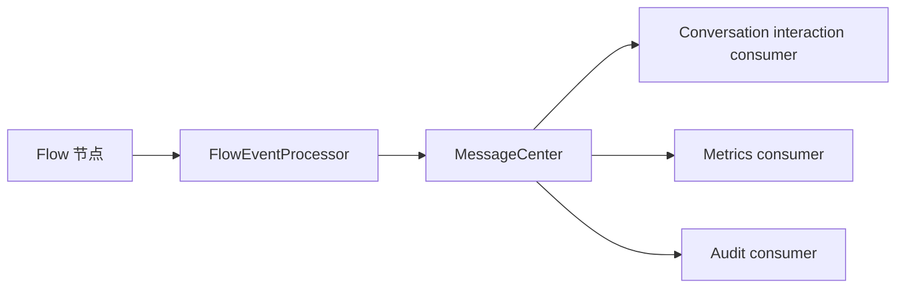

# 统一消息中心

`shared/messaging` 是 ReportSystem 后端唯一的进程内消息管道。它让 AgentFlow、业务 Context 和基础设施通过同一中心发布消息，并让 conversation、审计、指标及未来消费者只订阅自己关注的主题。

## 1. Event 与 Command

- Event 表示已经发生的事实，允许多个消费者订阅，例如 `interaction.step`、`domain.report.generated`、`observability.audit.requested`。
- Command 表示希望唯一目标执行的动作，例如 `control.agentflow.cancel`。Command 使用同一管道，但只能注册一个目标处理者。
- 首版 command 发送只确认消息已经进入目标队列；实际处理结果通过后续 event 表达。
- 目标 handler 不存在时，MessageCenter 发布 `observability.command.unhandled`，而不是把“queued”误当作执行成功。

## 2. 统一包络

每条消息包含：

```text
messageId / kind / channel / topic / source / occurredAt
partitionKey / correlationId / causationId / sequence / sourceSequence / payload
```

MessageCenter 按 `partitionKey` 分配最终 `sequence`。生产方自己的顺序写入 `sourceSequence`。进程内 `payload` 使用强类型对象，仅在外部传输边界序列化。

interaction 频道统一使用 `InteractionEvent/InteractionStep`，不使用 `FlowEvent` 作为中心契约。AgentFlow 会把运行内事件投影成该模型；普通业务模块也可直接发布同一模型。

## 3. 投递语义

- interaction：实时投递，同一 partition 严格有序。
- domain、observability：消费者隔离，失败不改变原业务结果。
- control：定向投递给唯一 handler。
- 首版为进程内、至多一次投递，不保存历史、不支持迟到消费者回放。
- “不保存历史”不影响运行中的临时订阅队列；订阅必须在生产方开始发布前建立。
- 分区序号分配与消费者入队在同一临界区完成，保证并发生产者不会让较大序号先进入消费者队列。

## 4. AgentFlow 边界

AgentFlow 负责理解 Flow 节点、子流程、工具、checkpoint 和运行内原始顺序。`FlowEventProcessor` 对原始事件做筛选与规范化，然后发布到 MessageCenter：



AgentFlow 不理解 conversation、chat、审计平台或指标传输。Conversation 通过当前 `chatId` 维护到内部 `runId` 的映射，再发布定向 control command。

## 5. 生命周期

`ChatBIServer.initialize()` 启动 MessageCenter 并注册基础设施消费者；`destroy()` 停止接收新消息并清理 worker。已注册消费者可随服务生命周期重新启动。业务 Context 只依赖 `MessagePublisher`，不依赖具体传输实现。
