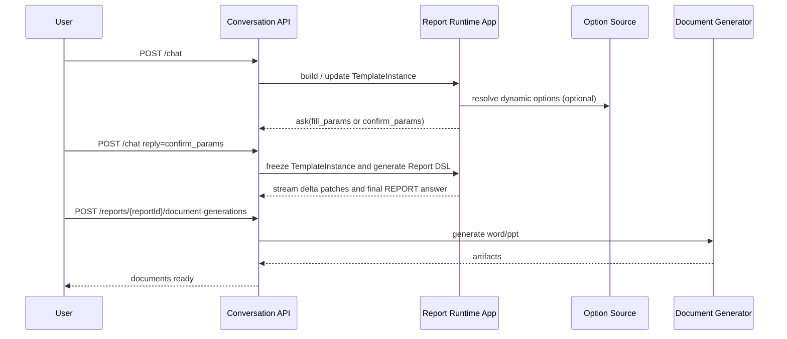

# 报告生成

报告生成是通用对话机制承载的一种业务场景。它从用户报告诉求出发，完成模板识别、参数提取、补参、诉求确认、模板实例构建、Report DSL 编译、报告冻结和章节重新生成。

模板的静态管理见 [模板管理](../template-management/README.md)，通用会话机制见 [通用对话](../conversation/README.md)，冻结后的报告资源管理见 [报告管理](../report-management/README.md)。

## 核心运行态

`TemplateInstance` 是报告生成流程的内部核心聚合：

- 保存模板快照，保证后续编辑和重新生成可复现。
- 保存参数定义、候选值、实际取值和确认态。
- 保存目录树、章节诉求、章节内容视图和必要运行上下文。
- 不作为独立公开资源；它只通过报告生成和报告详情聚合被使用。

Report DSL 是冻结后的正式报告内容。其字段级说明见 [Report DSL Schema 说明文档](../contracts/manuals/报告DSL定义与使用说明书.md)，正式结构见 [report-dsl.schema.json](../contracts/schemas/report-dsl.schema.json)。

## 1. 总体阶段

统一对话中的报告生成分为四个阶段：

1. 模板识别与参数收集
2. 模板实例构建与诉求确认
3. `TemplateInstance -> Report DSL`
4. 报告冻结与文档生成

### 1.1 章节重新生成阶段

报告生成完成后，支持基于编辑后的章节大纲重新生成单个章节：

1. 加载已有 `ReportInstance` 与关联 `TemplateInstance`
2. 定位目标章节，应用新大纲
3. 重新构建执行绑定与数据查询
4. 重新编译章节组件
5. 返回预览结果（不更新 `ReportInstance`）

## 2. TemplateInstance 的形成过程

### 2.1 参数收集

- 参数统一写入各层级 `TemplateInstance.parameters`
- 参数实际取值统一写入参数对象的 `values`
- 动态参数候选项统一写入参数对象的 `options`
- 参数补齐/确认聚合态统一写入 `TemplateInstance.parameterConfirmation`

### 2.2 诉求实例化

系统使用模板中的：

- `parameters`
- `structureType`
- `catalogs`，当 `structureType` 缺省或为 `flow`
- `chapters`，当 `structureType = paged`
- `catalog.parameters`
- `catalog.subCatalogs`
- `chapter.parameters`
- `slide.parameters`
- `section.outline.requirement`
- `section.outline.items`
- `section.parameters`
- `section.content`

生成运行态 `TemplateInstance`：

- `parameters`
- `structureType`
- `catalogs` 或 `chapters`
- `catalog.subCatalogs`
- `chapter.slides`
- `section.outline`
- `section.content`
- `section.runtimeContext`

补充规则：

- 参数或诉求项若未显式赋值，先回填其 `defaultValue`
- 回填后的“已生效值”统一写入对应对象的 `values`
- 多值场景继续保存三元组数组，不在实例层提前拼装 SQL
- `outline.renderedRequirement` 用 `label` 语义生成，可将多值按 `、` 连接
- 目录标题 `catalog.title` 若声明了参数槽位，在实例构建时先按参数 `label` 值渲染为 `renderedTitle`；章节不再定义标题。
- `section.content` 在实例态必须保留实例化后的内容结构视图；`composite_table` 至少落到 `parts[]`，并在 `part.runtimeContext` 记录最小运行态。
- 模板中的目录、子目录、章节、分页 chapter、slide 顺序由数组位置定义；若运行态需要稳定排序，可在实例化后物化 `order`

参数作用域规则：

- 节点可见参数集合 = 自身定义参数 + 全部父级目录/分页章节/分页页面参数 + 模板根参数
- 参数 `id` 在模板内全局唯一，因此不同层级的 `parameters` 仍可在统一键空间中稳定引用
- 仅服务于某个章节的参数，应定义在该章节；作用于整个目录分支的参数，应定义在目录上

### 2.4 多层目录与 `dynamic`

`dynamic` 可以出现在目录或章节上，当前支持三类：

| type | 语义 |
|---|---|
| `foreach` | 按参数取值重复展开同一目录或章节模板 |
| `foreachCase` | 按参数取值循环展开，但不同取值可命中不同 case 内容 |
| `custom` | 不在模板实例化阶段展开；Report DSL 冻结阶段通过外部 URL 获取目录、章节、分页页面或页面内组件 DSL 片段 |

展开规则：

1. 先按父层级从上到下展开。
2. 若某个目录声明 `dynamic.type = foreach`，则该目录的每个展开实例都会携带自己的 `dynamicContext`，其下全部 `subCatalogs` 和 `sections` 都在该上下文中继续展开。
3. 若某个目录声明 `dynamic.type = foreachCase`，系统按 `parameterId` 对应参数的每个取值匹配 case，并使用命中 case 中定义的 `subCatalogs/sections` 生成目录实例。
4. 若某个章节声明 `dynamic.type = foreachCase`，该章节作为占位节点；命中 case 后使用 case 中的 `sections` 作为章节变体生成实例。
5. 内层节点继续基于当前父上下文中的可见参数展开。

`foreachCase` 匹配规则：

- 使用 `ParameterValue.value` 与 `cases[].values` 比较。
- 多选参数按用户选择值逐个展开；多个值命中同一 case 时，每个值仍生成一次。
- 未命中 case 时使用 `defaultCase`；没有 `defaultCase` 时，该参数值不生成内容。

结果要求：

- 内层目录及其下章节必须跟随父目录实例一并复制展开
- 每个展开后的目录标题，都要在当前上下文中完成参数渲染；章节直接使用诉求进入生成链路。
- 若 `dynamic` 展开导致同一模板节点生成多个实例，实例层可补充物化后的 `order`，但不得反向写回模板定义
- 新实例输出 `dynamicContext`；旧 `foreachContext` 只作为历史数据读取兼容，不再作为新契约字段输出
- `dynamic.type = custom` 的目录、章节或分页页面实例输出 `dynamicContext.type = custom`，并记录 `url/nodeType`；`nodeType` 取值为 `catalog | section | slide`

### 2.3 前台修改与骨架状态

前台可修改完整 `TemplateInstance` 树；模板实例只持久化最新状态，不记录变更轨迹。

后台处理规则：

- 只改槽位值：对应 `section.skeletonStatus` 保持 `reusable`
- 改坏结构化诉求骨架：对应 section 降级到 `conditionally_reusable` 或 `broken`
- UI 如需展示整体状态，应由服务端基于所有 section 聚合，不单独持久化顶层状态

## 3. TemplateInstance -> Report DSL

### 3.1 应用层职责

`TemplateInstance -> Report DSL` 是应用层正式能力，不是基础设施适配工作。

应用层需要完成：

1. 读取模板实例树状主体
2. 解释 `runtimeContext.bindings` 与数据集定义
3. 为每个 section 生成内容组件
4. 组装正式 `Report DSL`

`dynamic.custom` 的正式 v6 冻结规则：

- 服务端向 `dynamic.url` 发起 `POST`，请求体由 `parameters/templateNode/context` 组成；旧 `nodeType/nodeId/prompt` 不再作为正式协议。
- `parameters` 是当前节点可见参数，按 `parameterId` 分组，值保持 `ParameterValue` 结构。
- `templateNode` 是当前模板节点定义，供外部服务读取 `dynamic.url`、`outline`、`layout`、`sections` 等上下文。
- `context` 至少包含 `structureType`，并可包含用户问题、locale、timezone 等运行上下文。
- 响应体包含 `status/dsl/meta.dslType`；失败时返回 `status = "error"` 与 `error.code/error.message`。
- flow catalog custom 返回 `dslType=Catalog`，替换或填充当前 Catalog 输出。
- flow section custom 返回 `dslType=Section`，替换或填充当前 Section 输出。
- paged slide custom 返回 `dslType=Slide`，替换或填充当前 Slide 输出。
- paged slide 内 section custom 推荐返回 `dslType=Components` 并入当前 Slide 的组件集合；也允许返回 `dslType=Section` 后转换为组件集合并入当前 Slide。
- custom 响应结构校验失败或 HTTP 请求失败时，本次报告生成失败并返回可定位错误；外部响应不再经过本地 presentation 编译。
5. 用 `report-dsl.schema.json` 校验结果
6. 将校验通过的 DSL 冻结到 `ReportInstance`

### 3.2 模板各组成部分的应用方式

| 模板组成 | 运行时作用 | 在 Report DSL 中的落点 |
|---|---|---|
| `parameters` | 以统一参数模型收集报告全局参数输入、候选项、实际取值和确认态 | 保留在 `TemplateInstance.parameters`；Report DSL `basicInfo` 不再承载全局参数 |
| `catalog.parameters`、`section.parameters` | 以统一参数模型收集章节可见输入与章节本地输入 | 章节本地参数以完整 `Parameter` 结构进入 `reportMeta[sectionId].parameters`；父级参数通过 `outline.items[].sourceParameterId` 关联 |
| `structureType` | 决定读取 flow 树还是 paged 树 | flow 仍输出到现有 `catalogs` DSL；paged 到 DSL/PPT 的编译规则后续实现 |
| `catalogs`、`catalog.subCatalogs` | 决定 flow 正式目录层级 | `catalogs`、`subCatalogs` |
| `chapters`、`chapter.slides` | 决定 paged 模板结构 | 本轮仅建立模板与实例态契约，不接入 DSL 编译 |
| `section.outline.requirement + section.outline.items` | 以统一诉求模型承载章节诉求骨架与实例化结果 | `reportMeta[sectionId].outline`，schema 定义名为 `GenerateOutline`；`question` 继续独立保留 |
| `section.content.datasets` | 决定数据获取与加工 | 组件数据、`reportMeta[sectionId].additionalInfos` |
| `section.content.presentation` | 决定文本、表格、图表和兼容复合表等组件布局 | `section.components` |
| `section.content.presentation.blocks[].parts[].runtimeContext` | 保存复合表各子表的最小运行态 | 用于编译 `CompositeTable.tables[]` 与补充执行证据 |

多值落位规则：

- `parameters[*].values`：保存参数三元组数组
- `outline.items[*].values`：保存章节诉求项三元组数组
- `runtimeContext.bindings[].multiValueQueryMode`：声明多值如何组合，默认按 `in`
- `runtimeContext.bindings[].resolvedQuery`：保存最终对执行层可用的查询表达式

### 3.3 字段映射边界

`TemplateInstance -> Report DSL` 必须是“冻结输出”，不能把运行态字段原样搬进 DSL。

| TemplateInstance 字段 | 进入 Report DSL 的方式 | 备注 |
|---|---|---|
| `catalogs[].id/title/renderedTitle/subCatalogs/sections[].id` | flow 结构映射到 `catalogs -> (subCatalogs)* -> sections` | 保留正式目录树与目录展示标题，章节只保留标识和诉求 |
| `chapters[].slides[].sections[].id` | paged 结构的 Report DSL/PPT 映射后续实现 | 当前只作为模板实例编辑上下文保存 |
| `parameters` | 不写入 `basicInfo` | 全局参数继续保留在 `TemplateInstance.parameters`，冻结 DSL 中只在节点级 `reportMeta[*].parameters` 或 `outline.items[].sourceParameterId` 表达生成证据关系 |
| `sections[].parameters` | 写入 `reportMeta[sectionId].parameters` | 只保留章节本地参数，结构与模板参数 `Parameter` 保持一致 |
| `sections[].outline.requirement` | 写入 `reportMeta[sectionId].outline.requirement` | 保留原始诉求模板文本 |
| `sections[].outline.renderedRequirement` | 写入 `reportMeta[sectionId].outline.renderedRequirement` | 保留实例化后的章节诉求文本 |
| `sections[].outline.renderedRequirement` / 章节生成口径 | 写入 `reportMeta[sectionId].question` | `question` 与 `outline.renderedRequirement` 并存且允许不同值 |
| `章节生成结果状态` | 写入 `reportMeta[sectionId].status` | 必须使用 `report-dsl.schema.json` 中的 `Running/Success/Aborted/Failed` |
| `sections[].outline.items` | 写入 `reportMeta[sectionId].outline.items[]` | 保留完整 `RequirementItem` 结构，取值继续使用 `values[]` 三通道 |
| `sections[].runtimeContext.bindings[].resolvedQuery` | 写入 `reportMeta[sectionId].additionalInfos` 中的 `SQL` 类信息 | 仅保留冻结后的执行证据，正文使用 `value` |

| `warnings` | 仅在需要时进入 `reportMeta` 或实例资源元数据 | 不直接变成章节组件 |

硬规则：

- `Report DSL` 中不得出现实例态 `parameters`、实例态 `outline`、section 运行时上下文这类运行态对象
- 进入 `Report DSL` 的参数与大纲配置，必须是冻结后的结构化编辑视图，而不是模板实例对象的原样透传

多层目录下的 `reportMeta` 规则：

- `reportMeta` 仍按 `sectionId` 挂载，不按目录路径拼接 key
- 为避免多层目录下 key 冲突，`section.id` 在单份模板内必须全局唯一
- 章节位于哪条目录路径，由 `catalogs -> subCatalogs -> sections` 的正式树结构表达，不再在 `reportMeta` key 中重复编码
- 若运行态或流式进度需要显示当前目录位置，应额外返回 `catalogPath` 之类的上下文信息，而不是改写 DSL key 规则

### 3.4 `presentation.blocks -> components` 映射

模板呈现块不是最终 DSL 组件本身，应用层需要把它们编译成 `report-dsl.schema.json` 允许的正式组件对象。

| `presentation.blocks[].type` | 目标组件类型 | 说明 |
|---|---|---|
| `text` | `text` | 模板态 `properties.template` 在实例化阶段渲染参数引用与 dataset 字段引用为实例态 `properties.content`，编译时进入 `dataProperties.content` |
| `table` | `table` | 直接映射 |
| `chart` | `chart` | 直接映射 |
| `composite_table` | `compositeTable` | 兼容保留能力，由多个顺序 `part` 编译为一个复合表组件 |

补充规则：

- `paragraph`、`bullet`、`kpi`、`markdown` 不再作为模板/实例态 `presentation.blocks[].type` 支持
- `datasetId` 决定组件的数据来源，但最终 DSL 组件只保存该组件实际需要的 `dataProperties`
- `presentation.blocks` 中的标题、说明、布局意图，需要在编译时映射到组件标题、布局和附加属性，不能把模板块对象原样塞进 DSL
- `text` block 编译为 DSL `TextComponent`，其中实例态 `properties.content -> dataProperties.content`
- `properties.template` 中 `{$parameterId}` 引用参数，`{#datasetId.field}` 引用同一 section 内 dataset 执行结果第一行的字段值；一个 text block 可以引用多个 dataset 字段
- 当前版本不定义 dataset 字段引用的聚合、列表展开或条件选择语法；多行结果默认取第一行
- 普通 `table` block 编译为 DSL `TableComponent`，其中 `datasetId -> dataProperties.sourceId`；展示属性由 `properties` 承载，当前定义包含 `columns/showTitle/defaultDisplayRows/mergeColumns/mergeRows`
- `chart` block 编译为 DSL `ChartComponent`，其中 `datasetId -> dataProperties.sourceId`；`properties.preferredType` 表示图表首选展示类型，取值跟随 DSL 图表族 `line/bar/pie/scatter/radar/gauge/candlestick`
- 图表轴配置输出到 `ChartComponent.dataProperties.xAxis/yAxis`；模型层可兼容读取历史顶层 `ChartComponent.xAxis/yAxis`，但新输出不再使用顶层轴字段
- `PresentationProperty.columns[]` 使用统一 `TableColumn` 定义，`key` 使用源数据列 key，`title` 使用展示名；`width/align` 为兼容保留字段，v1 暂不承诺渲染支持
- `mergeRows` 只在 `TableComponent.dataProperties.data` 已存在时计算；运行时按 `data` 行顺序扫描 `column` 对应字段，连续相同值且跨度大于 1 时生成 DSL `MergeRowInfo {startRowIndex,rowSpan,mergedText,column}`
- `showTitle` 只控制是否显示标题，不改变 `title` 字段；`defaultDisplayRows` 只表示默认展示条数，不截断 dataset 结果
- `composite_table` block 继续挂在 `section.content.presentation.blocks[]`，不新增 section 专属内容类型
- 一个 `composite_table` block 最终编译为一个 DSL `CompositeTable`
- `CompositeTable.tables[]` 的顺序必须与模板 `parts[]` 的顺序一致
- `TemplateInstance.section.content.presentation.blocks[]` 必须保留实例化后的 `composite_table` 结构；二次编辑与重新生成都从这里读取 `parts[]`

参数追问顺序规则：

- 对话生成报告时，缺失必填参数按 `Parameter.priority` 从小到大追问；同一优先级的一批参数一起追问
- `priority` 取值范围为 `0-99`，缺省按 `99` 处理
- `priority = 99` 的参数不单独生成 `fill_params` 追问，只在最终 `confirm_params` 环节展示和补齐
- `priority` 不改变 `required` 语义；最终确认通过前，所有 `required = true` 参数仍必须有值

`composite_table -> CompositeTable` 规则：

- block 级字段：
  - `block.id -> CompositeTable.id`
  - `block.title -> CompositeTable.dataProperties.title`
- `query part`
  - 与普通表格一致，基于 `datasetId` 生成一个 `TableComponent`
  - 基础信息也按 `query part` 处理，只是结果通常是一行普通表格数据
  - `tableLayout` 仅作为该子表的布局约束，不改变其“普通表格”语义；其中 `columns/showTitle/defaultDisplayRows/mergeColumns/mergeRows` 与普通表格同名展示属性语义一致
  - 实例态通过 `part.runtimeContext.status/resolvedDatasetId/resolvedQuery/warnings` 保留最小运行态
- `summary part`
  - 输入来自 `summarySpec.partIds` 所引用的前序 `query part`
  - `summarySpec.rows` 定义固定总结行
  - 运行时生成一张无表头二维表：
    - 左列固定为 `rows[].title`
    - 右列为模型填写的结论内容
  - 模型不得增删行，也不得新增列
  - 实例态通过 `part.runtimeContext.status/resolvedPartIds/prompt/warnings` 保留最小运行态
- 一个 `part` 对应 `CompositeTable.tables[]` 中的一张子表
- 不允许在 `part` 内再嵌套 group；需要多个检查分区时，直接拆成多个顺序 `part`

### 3.5 `reportMeta.additionalInfos` 类型约定

`reportMeta[sectionId].additionalInfos[*].type` 必须使用 DSL 既有枚举，不得自造新值。每一项必须包含 `type/value`，可按证据形态补充 `name/appendix`；实现层兼容读取旧 `additionalInfo` 与 `content`，但新输出只使用 `additionalInfos` 与 `value`。首版映射建议固定如下：

| 来源 | `additionalInfos[*].type` |
|---|---|
| `runtimeContext.bindings[].resolvedQuery` | `SQL` |
| 外部 API 请求证据 | `API` |
| 章节生成提示词或关键提示摘要 | `Prompt` |
| 章节/报告摘要补充材料 | `Summary` |
| 检索到的知识片段、规则片段 | `Knowledge` |

### 3.6 `basicInfo / summary / layout` 来源约定

`Report DSL` 的这些顶层字段不能靠导出器猜，必须在应用层冻结时给出。

`basicInfo` 建议来源：

| 字段 | 来源 |
|---|---|
| `basicInfo.id` | 报告实例 id 或其等价冻结报告 id |
| `basicInfo.schemaVersion` | BI Engine 资产结构版本，当前固定为 `1.0.0` |
| `basicInfo.mode` | 报告资产模式，取 `draft/published` |
| `basicInfo.version` | 固定取 `report-dsl.schema.json` 约定版本 |
| `basicInfo.status` | 取 DSL 状态枚举：`Running / Success / Aborted / Failed` |
| `basicInfo.name` | 模板名称与关键参数组合生成的正式报告名 |
| `basicInfo.reportType` | 报告类型，取 `PPT | Word | Dashboard` |
| `basicInfo.templateId/templateName` | 来源模板标识与名称 |
| `basicInfo.description` | 模板描述或实例化后的报告描述 |
| `basicInfo.header/footer/category` | 可选资产展示与分类字段 |
| `basicInfo.createDate/modifyDate` | BI Engine 资产时间字段 |

资源状态与 DSL 状态映射建议固定为：

| 资源层状态 | `basicInfo.status` |
|---|---|
| `generating` | `Running` |
| `available` | `Success` 或 `Aborted` |
| `failed` | `Failed` |

补充规则：

- 若报告已经冻结出可阅读结果，即使是“中止后保留部分内容”，资源层仍可为 `available`，此时 DSL 状态应为 `Aborted`
- 只有当报告资源不可用或冻结失败时，资源层才应为 `failed`

`summary` 建议来源：

- `section.summary`：来自各章节生成结果，保持旧 flow 契约 `{id, overview}`
- 顶层 `summary`：基于章节总结再聚合生成，保持旧 flow 契约 `{id, overview}`
- 若尚未完成汇总，生成中状态可暂不填顶层 `summary`

`cover` 建议来源：

- 首选：模板约定的封面策略或系统默认封面模板
- `cover` 至少包含 `title`，可选 `subTitle/author/date/layoutTemplate/image/contents`；`layoutTemplate` 严格取 `TITLE_TOP | TITLE_CENTER`
- 若模板未声明封面策略，首版可直接省略 `cover`

`backCover` 建议来源：

- 主要用于 paged/PPT 报告，可由模板导出策略或系统默认 PPT 主题提供
- 公开结构为 `{image?, text?}`，`text` 可取默认封底文案，例如 `Thank You`
- flow 报告通常不生成 `backCover`

`signaturePage` 建议来源：

- 默认不强制生成
- 仅当模板或业务场景明确要求签署页时生成
- `signaturePage` 保持旧 flow 契约，包含 `signers[]`，可选 `title/layoutTemplate`
- 若没有签署场景，不应生成空的 `signaturePage`

`layout` 建议来源：

- 首选：模板或系统默认布局策略
- 次选：按 `presentation.blocks` 编译结果自动生成
- 约束：必须满足 `report-dsl.schema.json` 的正式布局结构，不能把模板 presentation 原样塞入 `layout`

### 3.7 顶层可选对象的状态约束

`Report DSL` 虽然允许 `cover`、`signaturePage`、`summary`、`reportMeta` 等可选对象缺失，但不同生成状态下应遵循统一规则：

| 对象 | `generating` | `available` | `failed` |
|---|---|---|---|
| `basicInfo` | 必须存在 | 必须存在 | 必须存在 |
| `catalogs` | 必须存在，可为部分完成内容 | 必须存在 | 必须存在，可为部分冻结内容 |
| `layout` | 必须存在 | 必须存在 | 必须存在 |
| `summary` | 可缺失 | 建议存在；若尚未成功汇总可缺失 | 可缺失 |
| `cover` | 可缺失 | 可缺失；仅在封面策略启用时存在 | 可缺失 |
| `signaturePage` | 可缺失 | 可缺失；仅在签署场景启用时存在 | 可缺失 |
| `reportMeta` | 建议存在，至少覆盖已开始生成的 section | 建议存在，覆盖全部已生成 section | 建议存在，覆盖失败前已执行 section |

补充规则：

- 无论状态如何，只要返回 `report`，该对象都必须满足 `report-dsl.schema.json`
- `failed` 状态允许返回"部分可读、但冻结失败"的合法 DSL；若完全没有可返回报告，则接口层应返回 `answer = null` 或错误事件，而不是返回非法 DSL

### 3.8 章节重新生成（`generate_report_segment`）

#### 3.8.1 处理流程

```
POST /chat (instruction = generate_report_segment)
  │
  ├─ 1. 加载 ReportInstance (reportId, user_id)
  │     └─ 校验归属、状态必须为 available
  │
  ├─ 2. 加载关联的 TemplateInstance (template_instance_id)
  │     └─ 包含冻结的 ReportTemplate 快照
  │
  ├─ 3. 定位目标章节
  │     ├─ 在 TemplateInstance 的 catalogs 树中找到 TemplateInstanceSection (sectionId)
  │     └─ 在 ReportTemplate 的 catalogs 树中找到 SectionDefinition (sectionId)
  │
  ├─ 4. 应用新大纲
  │     ├─ 将请求中的 outline 替换到 TemplateInstanceSection.outline
  │     ├─ 标记 section.user_edited = true
  │     └─ 评估 section.skeleton_status（仅改槽位值 → reusable；改骨架 → conditionally_reusable）
  │
  ├─ 5. 重新构建执行绑定
  │     ├─ 基于新 outline.items + section.content.datasets
  │     ├─ 调用 build_execution_bindings() 重新生成 bindings
  │     └─ 更新 section.runtime_context.bindings
  │
  ├─ 6. 重新编译章节组件
  │     ├─ 调用 _build_section_components(section) 生成新 components
  │     ├─ 生成新 summary
  │     └─ 收集新 additional_infos（SQL 证据等）
  │
  ├─ 7. 构建预览响应（不持久化）
  │     ├─ section: Report DSL Section 片段
  │     └─ generateMeta: ReportGenerateMeta
  │
  └─ 8. 持久化对话消息，返回 ChatResponse
```

#### 3.8.2 章节定位规则

- `sectionId` 在 `TemplateInstance.catalogs` 树中递归查找
- 同时需要在 `ReportTemplate.catalogs` 树中定位对应的 `SectionDefinition`，用于获取章节模板定义（datasets、presentation blocks 等）
- 若 `sectionId` 在 TemplateInstance 中不存在，返回 `SECTION_NOT_FOUND` 错误

#### 3.8.3 大纲应用与骨架状态评估

- 将请求中的 `outline` 整体替换到 `TemplateInstanceSection.outline`
- `skeleton_status` 评估规则与 2.3 节一致：
  - 仅修改 `items[].values`（槽位值）：保持 `reusable`
  - 修改 `requirement` 或 `items[]` 结构：降级为 `conditionally_reusable` 或 `broken`

#### 3.8.4 执行绑定重建

- 基于新 `outline.items` 和 `section.content.datasets` 重新调用 `build_execution_bindings()`
- 参数可见集合 = 模板根参数 + 父目录参数 + 章节本地参数（从 TemplateInstance 中读取）
- `outline.items[].sourceParameterId` 用于关联参数定义

#### 3.8.5 不持久化原则

- `generate_report_segment` 返回的是预览结果
- 不更新 `ReportInstance`
- 不更新 `TemplateInstance`
- 不使已有文档产物失效
- 确认更新接口待后续设计

## 4. LLM 交互点

### 4.1 模板匹配

输入：用户问题、会话上下文、模板摘要

输出：候选模板或无模板结论

提示词骨架：

```text
你是报告模板匹配器。
任务：根据用户问题，从候选模板中选择最合适的一份。
要求：只根据模板用途、参数要求、目录结构进行判断；若都不适合，返回 none。
输出：模板 id、置信度、理由。
```

### 4.2 诉求补全与确认文案

输入：模板定义、已收集参数、用户补充表达

输出：`TemplateInstance.outline`

提示词骨架：

```text
你是报告诉求整理器。
任务：把用户输入和模板槽位合并成结构化诉求实例。
要求：保留目录层级，不新增模板不存在的章节；槽位值要转换成 `label/value/query` 三元组语义；未显式赋值时要先使用默认值。
输出：catalog -> section -> outline。
```

### 4.3 报告内容生成

输入：章节诉求、数据结果、模板呈现约束

输出：章节组件内容

提示词骨架：

```text
你是报告内容生成器。
任务：基于章节诉求与数据结果生成正式报告组件内容。
要求：只输出目标 section 对应的组件；需要摘要时同时给出 section summary；禁止改动目录结构。
输出：components、summary、reportMeta 补充信息。

进度统计规则：

- 正式进度主指标仍按 section 统计，因为真正的生成任务最小执行单元是 section
- 多层目录场景下，可额外返回目录级辅助进度：`totalCatalogs/completedCatalogs/currentCatalogPath`
- `currentCatalogPath` 使用目录 id 数组表达当前目录上下文，不直接拼接成人类文案
```

## 5. 状态机

### 5.1 对话轮状态

- `waiting_user`
- `running`
- `finished`
- `failed`

### 5.2 模板实例状态

- `draft`
- `collecting_parameters`
- `ready_for_confirmation`
- `confirmed`
- `generating`
- `completed`
- `failed`

### 5.3 报告状态

- `generating`
- `available`
- `failed`

### 5.4 文档生成状态

- `queued`
- `running`
- `ready`
- `failed`

## 6. 时序总览



## 7. 流式增量规则

`/chat` 生成报告时，流式响应分成三层语义：

- `steps`：执行进度
- `delta`：报告内容 patch
- `answer`：最终完整 `REPORT`

`delta` 的正式行为：

1. `delta` 只出现在流式 `ChatStreamEvent` 顶层，不进入 `ChatResponse` 完成态，也不进入 `GET /reports/{reportId}`。
2. 不新增 SSE 事件类型；是否处于生成中由事件顶层 `status=running` 判断。
3. `delta` 可附着在任意事件上，但只有内容变化时才返回。
4. 当前正式支持三类动作：
   - `init_report`
   - `add_catalog`
   - `add_section`
5. `parentCatalogId` 是稳定父目录标识；`parentCatalog` 是目录索引路径辅助信息。
6. `delta` 不做持久化，也不要求在 `TemplateInstance`、`ReportInstance` 中回放保存。
