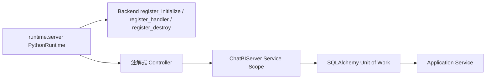

# Runtime Server 与 Controller 适配

## 定位

ReportSystem Backend 不创建 Tornado Application、HTTPServer 或 IOLoop。生产环境由平台 `runtime.server` SDK 承载，本仓库的 `modules/mock-sdk` 提供相同公开接口的开发态实现。



## Controller 契约

- Controller 不继承 RequestHandler 或公共 Controller 基类。
- Controller 方法通过 `@router.GET/POST/PUT/DELETE` 声明路径、身份处理和 body 解析。
- `tornado.web.RequestHandler` 是 Backend 唯一允许直接使用的 Tornado 类型，用于读取请求、输出 SSE 和下载文件。
- URL 查询参数由 Runtime 汇总为 `**query`。ReportSystem 自有正式业务接口不使用资源 Path 参数，资源标识统一使用必填 Query 参数；Runtime 仍可为其他系统保留通用 Path 参数能力。
- 正式接口同时声明 `@authenticated(origin_url, privilege)`；当前统一权限为 `dte.bi.chat.edit`。
- Controller 不导入数据库 session、ORM 或 `get_db`，只调用 `ChatBIServer` 提供的 infrastructure service scope。

## 生命周期

Backend 包向 Runtime 暴露：

- `register_initialize()`：初始化数据库、平台后台任务、线程池和外部适配器。
- `register_handler()`：返回 `ChatController`、`TemplateController`、`ReportController`、`HealthCheckController`。
- `register_destroy()`：停止平台后台任务并释放线程池。

健康检查 `GET /rest/chatbi/healthcheck` 不要求身份和权限，固定返回 `{"retCode": 0, "retInfo": "chatbi works well"}`。

## 启动与验证

```bash
cd modules/backend
uv run python -m runtime.server --module src --host 0.0.0.0 --port 8300
```

API 测试通过开发态 Runtime 创建真实 HTTP Server，覆盖注解路由、错误转换、SSE、文件下载和生命周期。架构测试禁止 Backend 自行组装 Tornado Server，并禁止 Controller 继承 RequestHandler。

架构测试还会禁止 Backend Controller 路由声明 `{resourceId}` 或访问 `req.path_params`。必填 Query 参数缺失、空白或重复时统一返回 `chatbi.base.param.invalid`。
