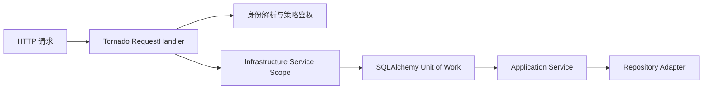

# Tornado Web 适配与事务边界

## 定位

后端 Web 入口使用 Tornado。每个 HTTP 请求由一个 `RequestHandler` 实例承载，Handler 只负责协议适配，不把 `RequestHandler`、数据库 session 或 ORM 对象传入 application/domain。



## Handler 约束

- 正式业务 Handler 在 `prepare()` 中完成身份解析和 `@policy_auth` 校验。
- JSON 请求继续使用 Pydantic 边界模型校验；校验失败转换为 `chatbi.base.param.invalid`。
- 同步数据库、外部 HTTP 和文档生成调用放入受控线程池，避免阻塞 Tornado IOLoop。
- SSE 后台生产者只产生事件；Handler 在 IOLoop 中按顺序逐条 `write/flush`。

## Unit of Work

Handler 不导入 `get_db/get_dev_db/Session/sqlalchemy`，只通过 application-lifetime container 获取 infrastructure-owned service scope。

`SqlAlchemyUnitOfWork` 负责 session 创建、显式提交、异常回滚和最终关闭。SQLAlchemy repository 只执行读写与 `flush()`，不自行提交事务。开发辅助数据使用独立 `DevSqlAlchemyUnitOfWork`。

## 启动与验证

```bash
cd modules/backend
uv run python -m src.main --host 0.0.0.0 --port 8300
```

API 测试启动真实 Tornado HTTP server，覆盖 Handler、错误转换、SSE、文件下载、SPA fallback 和 OpenAPI。架构测试禁止 backend 源码残留 FastAPI/uvicorn，并禁止 Handler 依赖数据库 session。
